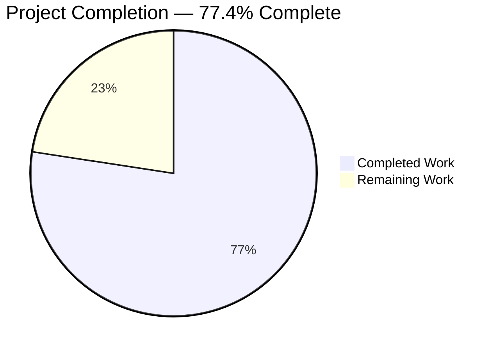
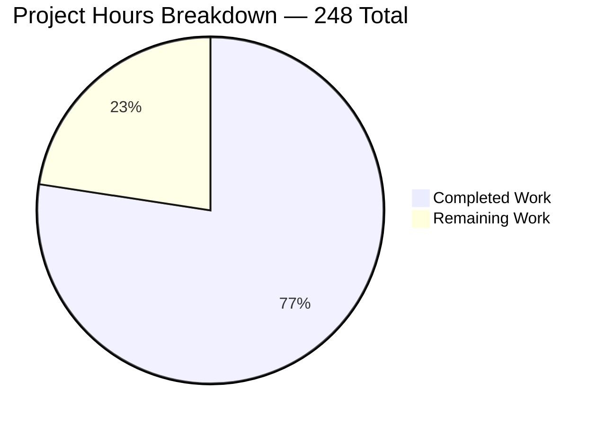
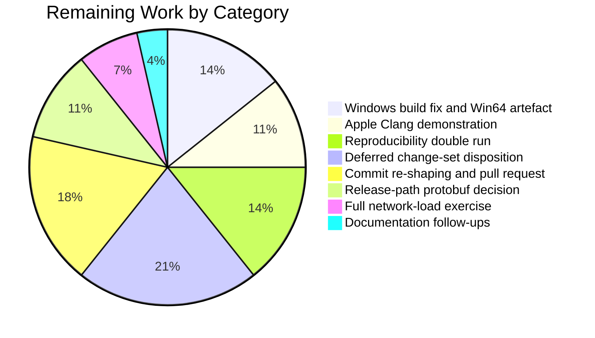
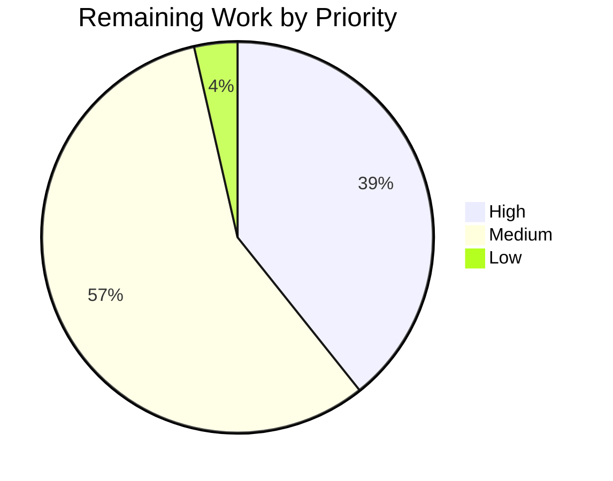

# 1. Executive Summary

## 1.1 Project Overview

Monero's first-party build — `src/`, `contrib/epee/` and `tests/` — has been moved from the C++17 language standard to C++23. The dialect is pinned at its three authoritative sites, the build-system and compiler floors are raised and enforced at configure time, every construct the newer standard deprecates or removes is replaced at source, and the toolchain change is carried through the CI images, the deterministic cross-build and the published documentation. The audience is the maintainers and packagers who build and release the daemon, the wallets and the RPC servers. Runtime behaviour is unchanged by design: consensus validation, cryptography, serialization, the wire protocol and the database layout are byte-for-byte identical to the pre-migration tree, and that identity is demonstrated rather than asserted.

## 1.2 Completion Status



Colour key: Completed = Dark Blue `#5B39F3` · Remaining = White `#FFFFFF`.

| Metric | Value |
|---|---|
| Total Hours | 248 |
| Completed Hours (AI + Manual) | 192 |
| Remaining Hours | 56 |
| Percent Complete | 77.4% |

Calculation: 192 / (192 + 56) = **77.4%**.

## 1.3 Key Accomplishments

- ✅ Every first-party translation unit compiles as C++23 — 321 of 321, vendored C++11 and C11 units untouched
- ✅ 124 of 124 targets build with zero errors and **zero first-party warning origins**
- ✅ Configure-time guard refuses under-floor GCC, Clang and Apple Clang, `clang-cl`, and unknown compilers
- ✅ Consensus unchanged: all 165 blockchain scenarios pass; transaction and block bytes identical
- ✅ Wire and storage unchanged: RPC, wallet-RPC and ZMQ versions and the database schema verified frozen
- ✅ Full non-consensus tier green — 23 of 23 suites, including 19 live RPC scenarios
- ✅ TLS fingerprint pinning now covered: unsorted-list lookup succeeds, absent fingerprint rejected
- ✅ CI images, the ten-host cross-build and the toolchain documentation state the new floors

## 1.4 Critical Unresolved Issues

Eight items remain open, spanning 5 of the 15 requirements the plan defines; the other ten are closed.

| Issue | Impact | Owner | ETA |
|---|---|---|---|
| Windows builds do not compile at C++23: a wide volume path reaches a narrow log stream at `src/daemon/main.cpp:117`, an overload C++20 deletes | `monerod.exe` cannot be produced; the MSYS2 UCRT64 job and the Win64 release artefact fail | Platform maintainer | 1 day |
| Apple Clang 15 floor is enforced and published but never demonstrated | macOS users on Xcode 15 face an unverified pairing | macOS maintainer | 1 day |
| Reproducibility and capacity-bound gates not executed (2 items: reproducible-build double run; full network-load exercise) | Reproducible release builds and sustained-load behaviour unproven at the new dialect | Release engineer | 2 days |
| Third-party C++23 deprecation diagnostics on the cross hosts, from the pinned protobuf recipe | Noisier release logs; a future `-Werror` tightening would fail | Build maintainer | 1 day |
| Hardening and RPC-contract improvements identified during delivery remain at upstream behaviour (2 items: hardening set; daemon ZMQ JSON contract set) | Pre-existing exposure and contract gaps persist unchanged | Security reviewer | 3 days |
| Branch carries 17 commits where the plan fixes eight by mechanical change type | Traceability only — the delivered tree is identical either way | Repository owner | 1 day |

## 1.5 Access Issues

| System/Resource | Type of Access | Issue Description | Resolution Status | Owner |
|---|---|---|---|---|
| macOS / Xcode 15 host | Build and test environment | No Apple toolchain is reachable, so the Apple Clang floor cannot be demonstrated | Open — needs a macOS runner or developer machine | macOS maintainer |
| Windows / MSYS2 UCRT64 host | Build and test environment | No Windows toolchain is reachable, so the MinGW-w64 floor is enforced by CI alone | Open — needs a Windows runner | Platform maintainer |
| Reproducible-build environment | Release build environment | The reproducible release path needs a pinned build environment that is not provisioned | Open — needs the release build host | Release engineer |
| GitHub Actions | Workflow execution | Workflow definitions can be parsed and inventoried but only GitHub can run them | Open — resolves on the first push | Repository owner |

No credentials, secrets or network services are required to build, test or run this project.

## 1.6 Recommended Next Steps

1. **[High]** Convert the wide volume path before it reaches the narrow log stream in `src/daemon/main.cpp`, then rebuild the Win64 artefact.
2. **[High]** Demonstrate the Apple Clang floor on a pinned Xcode 15, or raise it in the guard, `README.md` and the matrix together.
3. **[High]** Run the reproducible build twice and diff the hash summaries before tagging a release.
4. **[Medium]** Settle the cross hosts' third-party protobuf diagnostics — recipe bump or per-recipe dialect exception — and re-run them.
5. **[Medium]** Re-shape the branch into the eight prescribed commits and open the upstream pull request.

# 2. Project Hours Breakdown

## 2.1 Completed Work Detail

| Component | Hours | Description |
|---|---|---|
| Dialect pins and build-system floors | 9 | `CMAKE_CXX_STANDARD 23` (`CMakeLists.txt:136`), `CXX_STANDARD ?= c++23` (`contrib/depends/Makefile:12`), the Darwin branch value (`contrib/depends/toolchain.cmake.in:104`), `cmake_minimum_required(VERSION 3.25)` at both sites, and the policy consequence: `LANGUAGE ASM` for `CryptonightR_template.S` (`src/crypto/CMakeLists.txt:104`) |
| Compiler-floor guard and documented floors | 8 | Four-branch configure-time guard (`CMakeLists.txt:150-173`) rejecting under-floor GCC, `clang-cl`, under-floor Clang, under-floor Apple Clang and any other compiler, each naming the version found and the documentation section |
| CI image and workflow migration | 8 | `debian:13` and `ubuntu:24.04` build containers, real `libunwind-dev` package name, `ubuntu:24.04` cross-build default, `noble` LLVM repository, dialect-salted cross-build cache key with the four input patterns |
| Documentation and installer realignment | 12 | New "Toolchain requirements" section with a 13-row compatibility matrix (`docs/COMPILING_DEBUGGING_TESTING.md:18`), `README.md` dependency table and Rust prerequisite across every platform install line, `contrib/brew/Brewfile` Rust entry, Trezor README C++23 and UCRT64 alignment |
| Compile-correctness substitutions | 12 | 225 UTF-8 literal prefixes removed across four files with the 11 valid array initialisations kept, and `rct::identity()` qualified where opening two namespaces made the call ambiguous |
| New-warning elimination at source | 22 | POD trait replaced by its normative definition in five headers, `expect<T>` storage rewritten as `alignas(T) unsigned char[sizeof(T)]` with a size assertion, five lambdas given the explicit `this` capture, the volatile counter rewritten as compound assignment, the `tx_extra` variant predicate rewritten, and one explicit lexicographic comparator shared by the fingerprint sort and search |
| Deprecated-construct removal | 4 | Four dynamic exception specifications converted to `noexcept`, a dead trait comment deleted, and the deprecated CMake flag-probe module replaced by `check_cxx_compiler_flag` |
| Boost-to-std evaluation and recorded deferral | 8 | `boost::optional` (99 files, 524 uses) and `boost::string_ref` (53 files, 205 uses) evaluated against their real call sites and deferred with reasons; `boost::filesystem` and `epee::span` retained |
| TLS fingerprint regression test | 6 | New `test_epee_connection.ssl_handshake_fingerprint_lookup` driving a real handshake over loopback, proving both the success and the rejection path of fingerprint lookup |
| Invariance preservation and its proofs | 14 | Literal-equality proof for every edited string table with a negative control, serialization and wire round-trips against committed golden blobs, database round-trip and export comparison, and confirmation that the RPC, wallet-RPC, ZMQ and LMDB version constants and every frozen directory are untouched |
| Acceptance builds across compiler rows and option-gated targets | 22 | Full 124-target builds on GCC 14, GCC 13, Clang 18 and Clang 16, the CMake 3.25 floor configure, the guard rejection path, the Trezor probe at the new dialect, the option-gated debug utilities and the libFuzzer targets |
| Warning-origin census | 10 | Per-origin diagnostic comparison over the identical target graph in each configuration, establishing zero first-party origins and the predicted drop in variant-comparison diagnostics |
| Residual-construct checks | 3 | Repository-wide checks that no deprecated trait, dynamic exception specification, deprecated CMake module or incompatible literal prefix remains, and that the five explicit captures are in place |
| Test-tier execution | 28 | Full non-consensus tier including the Python RPC scenarios, the unit estate, the consensus regression suite, targeted serialization and behavioural filters, the fuzz corpora and the benchmark warm-up path |
| Release-path exercises delivered | 24 | Ten cross-build hosts including the three that compile against pre-C++23 standard-library headers, release artefact inspection and hashing, and the container image built and its shipped binary run |
| Commit sequencing and traceability | 2 | Behaviour-preservation justifications recorded for every edit touching serialization, wire, storage, protocol, networking or consensus-adjacent code |
| **Total** | **192** | |

## 2.2 Remaining Work Detail

| Category | Hours | Priority |
|---|---|---|
| Windows narrow-stream conversion in `src/daemon/main.cpp` and Win64 artefact re-verification | 8 | High |
| Apple Clang 15 / Xcode 15 demonstration, or a documented floor revision | 6 | High |
| Guix reproducible-build double run and hash-summary comparison | 8 | High |
| Disposition of the deferred hardening and daemon ZMQ contract change sets | 12 | Medium |
| Branch re-shaping into the eight prescribed commits and upstream pull-request preparation | 10 | Medium |
| Release-path protobuf diagnostics decision and re-run of the affected cross hosts | 6 | Medium |
| Full network-load exercise on a host with descriptor and memory headroom | 4 | Medium |
| Documentation follow-ups inside already-authorized files | 2 | Low |
| **Total** | **56** | |

## 2.3 Hours Methodology

Scope is the migration plan and the path to production for it, and nothing else. Each completed row is an authorized deliverable or an acceptance activity the plan defines, sized from the work its evidence demonstrates rather than from lines changed — the change set is 33 files and +1136/−272, while the effort sits in the four compiler-row builds, the ten cross-build hosts, the per-origin diagnostic census and the test tiers. Each remaining row is a plan requirement not yet satisfied or a gate that needs an environment this work could not reach. Partially satisfied requirements are split: compile-correctness is 90% complete because a third, Windows-only error class remains; the build matrix 90% because the Apple row was never run; the warning census 80%; the test tier 95%; the release paths 65%. Confidence is high on the completed rows, which rest on observed results, and medium on the platform-gated remaining rows, whose cost depends on how the first run behaves on hardware nobody has exercised yet.

# 3. Test Results

Every figure below was produced by running the suite on this tree with GCC 14.3 / libstdc++ 14 / Boost 1.88 in the acceptance configuration (`ARCH=default`, `BUILD_TESTS=ON`, `BUILD_GUI_DEPS=ON`, `ENABLE_FUZZ_TEST=ON`, `Release`, mandatory Trezor), serially, with `DNS_PUBLIC=tcp` exported.

| Area / Category | Framework | Tests | Passed | Failed | Coverage | What This Proves |
|---|---|---|---|---|---|---|
| Full non-consensus tier (`ctest -E core_tests`) | CTest | 23 | 23 | 0 | Every registered suite except consensus | The whole test estate is green on the migrated tree, in 1406 s |
| Consensus regression | gtest / `core_tests` | 165 | 165 | 0 | All registered synthetic-blockchain scenarios | Block and transaction validation behave exactly as before the dialect change |
| Unit estate under the CI filter | gtest / `unit_tests` | 1293 run of 1310 registered | 1291 | 0 | 159 suites; 2 environment probes skipped | Library, epee, wallet, RPC and crypto behaviour is intact across the whole unit surface |
| Serialization, wire and RPC round-trips | gtest filter | 122 | 122 | 0 | 17 suites over binary and JSON portable storage, Levin framing, wallet cache, peer list, ZMQ shapes | Produced bytes still match the committed golden blobs — no format moved |
| Edited data paths (auth, TLS, storage, scrubbing) | gtest filter | 66 | 66 | 0 | 10 suites over HTTP digest, the HTTP server, fingerprint lookup, `expect<T>`, secret scrubbing | The substituted literals, comparator, storage and traits behave identically at the new dialect |
| Python RPC scenarios | `functional_tests_rpc` | 19 | 19 | 0 | Live `monerod` + `monero-wallet-rpc` on a deterministic chain | The daemon and wallet RPC surfaces answer correctly end to end, in 999 s |
| Parser robustness | 18 libFuzzer-style harnesses | 31 seeds | 31 | 0 | Every committed corpus, all present and non-empty | No parser crashes on any seed for base58, block, RingCT, Levin, JSON, URL, transaction, `tx_extra` or UTF-8 inputs |
| Benchmark warm-up path | `performance_tests` | 7 | 7 | 0 | The edited volatile counter loop | The rewritten warm-up executes on every benchmark instantiation without behaviour change |

Alongside the suites, the build itself was measured: 124 of 124 targets with zero errors; 16 diagnostics from 5 origins, all in system headers or the pre-existing C source at `src/crypto/tree-hash.c:89`, giving **zero first-party C++ warning origins** and zero first-party trace locations; a compile database of 453 entries split 321 `-std=c++23`, 24 `-std=c++11` (vendored logging, QR and proof-of-work code), 79 `-std=c11` and 29 assembler entries with no dialect flag. Configure emits no warning and no policy line at CMake 3.31.6 and again at the 3.25 floor, and an under-floor compiler is refused with `GCC 12.5.0 is too old; GCC 13 or newer is required for C++23` (`CMakeLists.txt:153`).

**Not Covered** — delivered behaviour that no test exercises, and what to test before release:

- **Windows / MinGW-w64 builds.** No suite runs on a Windows toolchain. Test first: the `#ifdef WIN32` startup diagnostic in `src/daemon/main.cpp` does not compile at C++23 (see Section 5.2), so build `monerod.exe` before anything else.
- **Apple Clang / macOS.** The published Apple floor has no build or test behind it. Run the macOS job on a pinned Xcode 15.
- **Reproducibility of release builds.** The reproducible path was never run twice for a hash comparison at the new dialect.
- **Sustained network load.** Both load-harness binaries build in every configuration, but the 100,000-connection exercise on the two fixed ports was never run; the edited asynchronous handlers are therefore covered functionally but not under load.
- **The four sanitizer-instrumented fuzz targets.** They compile at the new dialect; their diagnostic comparison against the previous dialect in the same session has not been made.
- **Workflow definitions.** `.github/workflows/build.yml` and `depends.yml` are checked by parsing, job and matrix inventory, and line-level diff; only the CI service can execute them.
- **Clang with libc++.** Documented as an unverified pairing; no build or test stands behind it.

# 4. Runtime Validation & UI Verification

This project ships 13 command-line executables — daemons, wallets, RPC servers and blockchain utilities — and has no user interface, so there is no UI to verify. Runtime validation was performed by driving the binaries themselves on testnet in offline mode with throwaway data directories; no step contacted a public network.

- ✅ **Daemon start-up** — `monerod --testnet --offline` reaches "core RPC server started ok" in about 12 seconds and shuts down cleanly through its own `stop_daemon` endpoint.
- ✅ **Daemon HTTP JSON-RPC** — `get_info` returns `status OK`, height 1, `nettype testnet`, `offline true`, `synchronized true`, version `0.18.1.0-aff728179`.
- ✅ **Daemon ZMQ JSON-RPC** — a plain JSON-RPC object on the ZMQ endpoint answers `get_height` with `rpc_version 131072`, confirming the frozen ZMQ RPC version 2.0 on the wire; the method-name and topic tables whose literals were edited dispatch unchanged.
- ✅ **Wallet RPC server** — `monero-wallet-rpc --testnet` starts against the local daemon in about a second and answers `get_version`, confirming the frozen wallet RPC version.
- ✅ **Python RPC journeys** — 19 scenarios drive real daemon and wallet processes on a deterministic chain: transfers, mining, multisig, cold signing, integrated addresses, proofs and blockchain manipulation.
- ✅ **Storage round-trip** — the migrated binaries open a database created by the pre-migration build with no migration step and report the same height and block hashes; export output compares byte for byte.
- ✅ **TLS handshake and fingerprint pinning** — a real handshake over loopback accepts a fingerprint supplied in an unsorted list and rejects one that is absent.
- ✅ **Executable smoke** — all 13 binaries are produced and run; the daemon, both wallets and the two key-generation tools report their version. The eight blockchain utilities decline `--version` and exit non-zero on `--help`, which is upstream behaviour this work leaves untouched.
- ⚠ **Container image** — the release image builds from the digest-pinned builder and the shipped binary reports its version; the image has not been re-built since the last documentation-only change to the cross-build workflow.
- ❌ **Windows and macOS runtime** — never exercised. No Windows or Apple environment was reachable, and Windows binaries cannot currently be produced at this dialect (Section 5.2). Reproducible release builds and the sustained-load exercise were likewise never run.

# 5. Compliance & Quality Review

## 5.1 Compliance Matrix

| Deliverable | Benchmark | Status | Evidence |
|---|---|---|---|
| Dialect pinned at all three authoritative sites | Every first-party unit compiles as C++23; nothing left at 17 or 20 | ✅ Pass | 321 of 321 first-party entries carry the C++23 flag; the three sites read `3.25` / `23` / `c++23` / `23` |
| Build-system floor and its policy consequence | Configures cleanly at the 3.25 floor; the assembler source still assembles | ✅ Pass | Floor configure exits 0 with no policy line; `LANGUAGE ASM` at `src/crypto/CMakeLists.txt:104`; vendored assembler objects checksum-identical |
| Compiler-floor enforcement | Under-floor and unsupported compilers refused at configure time | ✅ Pass | Four branches at `CMakeLists.txt:150-173`; under-floor GCC refused at `:153`; the Apple and `clang-cl` branches are unexercisable on Linux and verified by reading |
| Whole-tree build integrity | All targets build with no errors | ✅ Pass | 124 of 124 targets, zero errors, on each of the four supported Linux compiler rows |
| Warning cleanliness | No first-party diagnostic introduced by the dialect | ✅ Pass | 16 diagnostics from 5 origins, all system or pre-existing C; zero first-party origins and zero first-party trace locations |
| Consensus and cryptography untouched | No logic change; all consensus scenarios pass | ✅ Pass | 165 of 165 scenarios; zero files changed under the consensus, RingCT, hard-fork or proof-of-work trees |
| Serialization and wire invariance | Produced bytes unchanged; version constants frozen | ✅ Pass | 122 round-trip tests against golden blobs; RPC 3.18, wallet RPC 1.33, ZMQ RPC 2.0, database schema 5 all unchanged |
| Storage layout invariance | Databases interchange with the pre-migration build | ✅ Pass | Cross-version open with no migration, identical height and hashes, byte-identical export |
| Literal-table equality | Edited string tables differ from base only by the prefix | ✅ Pass | Four exact source comparisons empty, with a non-empty negative control |
| Deprecated-construct removal | Nothing removed or deprecated by the newer standard remains | ✅ Pass | Repository-wide checks find no deprecated trait, dynamic exception specification or deprecated CMake module |
| Toolchain, CI and documentation alignment | Images, cross-build and docs state and exercise the new floors | ⚠ Partial | Containers, cache identity, README and the 13-row matrix in place; the Windows and Apple rows are not demonstrated |
| Release-path readiness | Cross hosts, container and reproducibility proven at the new dialect | ⚠ Partial | Ten cross hosts and the container verified; the Windows host fails to compile and reproducibility was never demonstrated |

## 5.2 AAP & Rule Divergences and Gaps

No user-specified rules were provided for this project, so every divergence below is a departure from the migration plan rather than from a rule.

| What the AAP/Rule Required | What Was Delivered Instead | Why It Diverged | Impact | Remediation |
|---|---|---|---|---|
| Exactly two source-level error classes exist under the new standard, both fixed | Two are fixed and proven; a third, Windows-only, remains at `src/daemon/main.cpp:117` | The error census was taken on Linux, where the `#ifdef WIN32` branch never compiles; the file is not in the authorized 33-file set | Release-blocking on Windows | Convert the wide path with `utf16_to_utf8`; rebuild the Win64 artefact |
| One pinned Xcode 15 build and test before the Apple floor is published | Floor enforced and published, documented as not demonstrated | No Apple toolchain was reachable in any environment used | Unverified pairing published to macOS users | Run the macOS job on a pinned Xcode 15, then confirm or raise the floor |
| Reproducible release builds twice with identical hashes; the full network-load exercise | Neither was run | No Guix build environment was provisioned; the load run needs 100,000 connections on two fixed ports | Reproducibility and load behaviour unproven at the new dialect | Run the reproducible workflow twice and diff summaries; run the load exercise on a capacity host |
| No new warning origin in any acceptance configuration | Native rows are clean; cross hosts gain about 105 third-party diagnostics each from the pinned protobuf | Recipe versions are frozen reproducible-build inputs, so the recipe could not be bumped here | Noisier release logs; a future `-Werror` tightening would fail | Bump the recipe or apply the per-recipe dialect exception the plan pre-authorizes |
| Warning acceptance measured against a same-session C++17 build of the pristine tree | Measured against recorded per-environment baselines | The plan itself places the five explicit-`this` captures in the dialect commit, so a C++17 build of this tree is no longer valid | Future regressions need per-environment re-measurement | Record the current origin sets as the reference baseline |
| Eight commits by mechanical change type, in a fixed order | Seventeen commits, tree-identical outcome | The change set was restored to the authorized files after work beyond that scope had landed, and reshaping published history needs an owner | Traceability only | Re-shape the branch before opening the pull request |
| Consensus, wire, storage and error contracts frozen; exactly 33 files, all modifications | Exactly that — so hardening and contract improvements identified during delivery are absent | Every one of them changes a frozen surface or a file outside the authorized set | Pre-existing exposure and contract gaps persist unchanged | Take each as its own authorized change set with its compatibility decision |
| Only the per-file edits the plan enumerates, and exact source equality for the edited literal tables | Three further edits inside authorized files; one correction deliberately not made | Two were dead-link and fail-closed fixes worth more than strict enumeration; the third records a release-path condition. The stale comment cannot be touched without breaking the equality gate | Documentation accuracy only | Land the follow-ups in one authorized documentation change |

**Windows compile failure.** `src/daemon/main.cpp:117` streams a `const wchar_t*` volume path into the narrow string stream that the logging macro builds, inside the `#ifdef WIN32` FAT32 start-up diagnostic. C++20 deleted that inserter, so the translation unit is a hard error on every Windows build at this dialect — reproduced directly: the same expression compiles at `-std=c++17` and fails with "use of deleted function" at `-std=c++23`. The file is byte-identical to the pre-migration tree because it is not one of the 33 files the plan authorizes. Consequence: neither the MSYS2 UCRT64 job nor the Win64 cross artefact can be produced. The fix is one expression using `epee::string_tools::utf16_to_utf8`, declared for Windows in `contrib/epee/include/string_tools.h`. Decide whether to widen the change set or land it separately, but land it before any release.

**Apple Clang floor.** The guard refuses Apple Clang below 15 at `CMakeLists.txt:167-170`, and `README.md` and the toolchain matrix publish that floor. The plan requires one pinned Xcode 15 configure, build and test *before* publication, and that run never happened because no Apple environment was reachable. The documentation is honest about it — the matrix labels the row declared and guard-enforced rather than verified — so nobody is misled, but macOS users on Xcode 15 are relying on an untested pairing, and the macOS CI job only ever exercises whatever compiler the current image ships. Run the job once on a pinned Xcode 15.4 or the oldest 15.x available; if it fails, raise the guard, the README sentence and the matrix row together.

**Reproducibility and load gates.** Two acceptance gates were never executed. The reproducible release path must build every triple twice and produce identical hash summaries; nothing in this work demonstrates that at C++23, and it is the one gate that speaks to whether released binaries can still be independently reproduced. The network-load exercise opens 100,000 connections against fixed ports 36230 and 36231; both harness binaries build in every configuration and their edited handlers changed only capture spelling, so the risk is low, but sustained-load behaviour is unproven. Neither gate needs code work — only a Guix build host and a machine with descriptor and memory headroom. Run both before tagging.

**Third-party diagnostics on the cross hosts.** Under this dialect the pinned protobuf recipe is compiled as C++23 for the first time, and its own generated table header combines two enumeration types with `|` — something C++20 deprecated. That yields roughly 105 diagnostics per cross host from 35 lines of one upstream header, where C++17 emitted none. A syntax-only compile of the pinned sources reproduces exactly that split. The diagnostics are third-party by origin, so they add no first-party origin and the native acceptance rows are unaffected; nothing was suppressed, and no dialect-silencing flag or pragma exists anywhere in the change set. The condition is recorded in `docs/COMPILING_DEBUGGING_TESTING.md`. Choose between bumping the recipe and the per-recipe, per-host dialect exception the plan pre-authorizes.

**Comparison baseline.** Acceptance was defined as a same-compiler, same-session diagnostic comparison against a pristine C++17 build of this tree. That comparison is no longer reproducible here, because the plan itself places the five explicit-`this` captures in the dialect-switch commit: a C++17 configure of the delivered tree emits extension warnings and is not a valid baseline. The census was therefore made against recorded per-environment origin sets, and the substantive result stands — zero first-party origins in every native configuration, with the predicted drop in variant-comparison diagnostics confirmed. What a maintainer loses is the ability to re-derive that baseline on demand, so treat the origin sets in Section 3 as the reference and re-measure per environment.

**Commit shape.** The plan fixes an eight-commit sequence with prescribed row counts, so that each mechanical change type is reviewable on its own and every intermediate state builds. The branch carries seventeen commits, because the change set was restored to the authorized file set after work beyond that scope had landed. The delivered tree is identical either way, and the behaviour-preservation justification for every serialization-, wire-, storage- and consensus-adjacent edit is recorded in the history, so nothing is lost but reviewability. Re-shape the branch into the eight commits before opening the upstream pull request, or accept the current shape and say so in the request.

**Hardening and contract work outside the authorized scope.** Improvements identified during delivery are absent from the tree: header-log escaping, binding digest credentials to the request target, portable-storage trailing-byte and 32-bit varint handling, wallet RPC error-text redaction, frame-length-only ZMQ logging, ten daemon ZMQ JSON contract defects, command-line path validation, blockchain-utility `--version`/`--help` and regtest export, and a builder-bundle refresh. Each changes a surface the plan freezes — response shapes, digest acceptance, parser acceptance, error text, recipe versions — or a file outside the authorized 33. All are pre-existing upstream behaviour that this work leaves exactly as it found it; none is introduced here. Each needs its own authorization, its own compatibility decision and its own review.

**Edits beyond the enumerated set.** Three changes sit inside authorized files that the per-file plan does not list: the Homebrew manifest's documentation link now points at the official page because the previous one returns 404; the cross-build workflow fetches the LLVM signing key with retries and fail-closed output handling, so one transport reset no longer fails the job and no partial key lands in the trusted keyring; and the toolchain document records the release-path protobuf condition above. None is compiled. Conversely, the edited HTTP-auth source keeps a header sentence describing a literal convention the file no longer uses, because the plan's equality gate demands exact source equality modulo the prefix. Land all four as one documentation change.

# 6. Risk Assessment

These are forward-looking exposures for whoever takes this branch to production. Nothing the migration itself changed appears here: consensus, serialization, wire and storage behaviour were exercised and proven byte-invariant, so they carry no residual risk.

| Risk | Category | Severity | Probability | Mitigation | Status |
|---|---|---|---|---|---|
| Windows binaries cannot be built at this dialect until the narrow-stream conversion lands (`src/daemon/main.cpp:117`) | Technical | High | Certain | One-expression `utf16_to_utf8` conversion, then re-run the Win64 cross build and the UCRT64 job | Open |
| The Apple Clang floor is enforced and published without a build behind it, so macOS users may meet an unverified pairing | Technical | Medium | Medium | One pinned Xcode 15 configure, build and test; confirm the floor or raise guard, README and matrix together | Open |
| Reproducible release builds are unproven at the new dialect — the reproducible path was never run twice for a hash comparison | Integration | Medium | Medium | Run the reproducible workflow twice, or once on two machines, and diff the SHA-256 summaries before tagging | Open |
| The pinned protobuf recipe emits about 105 third-party deprecation diagnostics per cross host, so release logs are noisy and a future `-Werror` tightening would fail | Integration | Medium | High | Bump the recipe or apply the per-recipe, per-host dialect exception the plan pre-authorizes | Documented |
| The Darwin and FreeBSD cross hosts compile against standard-library headers that predate every C++23 library addition, so a later use of `std::expected`, `std::format`, ranges or `std::byteswap` would break them | Integration | Medium | Medium | Standing policy: include `<version>` and gate on the feature-test macro with the existing implementation as fallback; enforce in review | Mitigated by policy |
| Sustained-load behaviour of the edited asynchronous handlers is unproven — the 100,000-connection exercise was never run | Operational | Low | Medium | Run the load harness on a host with descriptor and memory headroom and the two fixed ports free | Open |
| Hardening opportunities identified during delivery remain at upstream behaviour: header logging that includes credentials, digest credentials not bound to the request target, parser acceptance on 32-bit targets, wallet error text, and advisory-affected build-stage components in the pinned builder bundle | Security | Medium | Medium | Take each as its own authorized change set with the compatibility decision its frozen surface needs | Deferred by scope |
| Future warning regressions are harder to judge because a same-session pristine C++17 baseline is no longer producible from this tree | Technical | Low | Medium | Treat the recorded per-environment origin sets as the reference baseline and re-measure per environment | Accepted |

# 7. Visual Project Status

Progress against the migration scope and its path to production. Completed = Dark Blue `#5B39F3`; Remaining = White `#FFFFFF`.



Remaining work by category, in hours (sums to 56):



Remaining work by priority, in hours:



| View | Completed | Remaining | Total |
|---|---|---|---|
| Hours | 192 | 56 | 248 |
| Share | 77.4% | 22.6% | 100% |

# 8. Summary & Recommendations

The migration itself is done and demonstrated. Thirty-three files changed — every one a modification, nothing created, deleted, moved or renamed — for a net of +1136/−272 lines, and out of that the whole first-party tree now compiles as C++23: 321 of 321 first-party translation units at the new dialect, 124 of 124 targets building with zero errors, and zero first-party warning origins under the project's unchanged warning set. The dialect is pinned at its three authoritative sites, the build-system floor moves to CMake 3.25 with its one policy consequence handled, and a configure-time guard now refuses under-floor GCC, Clang and Apple Clang, the `clang-cl` frontend and any unrecognised compiler with a message that names the version found and points at the toolchain documentation. Against the plan's scope and the path to production for it, the project is **77.4% complete** — 192 of 248 hours.

What matters most for a consensus-bearing codebase is that nothing moved, and that was proven rather than assumed. All 165 synthetic-blockchain scenarios pass. The 122 serialization, wire and RPC round-trip tests still match their committed golden blobs. The RPC, wallet-RPC and ZMQ protocol versions and the database schema version are unchanged, and a database written by the pre-migration build opens with no migration step and reports the same height and hashes, with a byte-identical export. Each edited literal table differs from its predecessor by nothing but the removed prefix, checked by exact source comparison with a negative control. The one consensus-adjacent edit — the variant predicate that orders transaction-extra fields — carries a permanent comment explaining why the predicate is the same, and is covered both by its unit suites and by the full consensus run.

Three gaps stand between this branch and a release, and none of them is in the migrated code. Windows is the blocker: a start-up diagnostic that only Windows compiles streams a wide volume path into a narrow log stream, an overload the newer standard deletes, so `monerod.exe` cannot be produced at all. It is a one-expression fix, it sits in a file the plan's file list does not include, and it must land before anything ships. The Apple Clang floor is enforced and published but has never been demonstrated on a pinned Xcode 15. Reproducible release builds have never been run twice at this dialect for a hash comparison. Add the cross hosts' third-party protobuf deprecation noise and the still-unrun load exercise, and the remaining 56 hours are almost entirely environment-gated verification rather than development.

One decision is waiting for a human that is not about the migration at all. Hardening and RPC-contract improvements were identified while this work was under way — log escaping, binding digest credentials to the request target, parser acceptance on 32-bit targets, wallet error-text handling, and a set of daemon ZMQ JSON contract defects — and every one of them changes a surface the plan freezes or a file outside the authorized set. They are absent from this tree, which therefore behaves exactly as the pre-migration tree did on each of those surfaces. Nothing was introduced and nothing regressed; each item needs its own authorization, its own compatibility judgement, and its own review, and each is worth having.

**Production readiness: not yet, and for a short, specific list.** Land the Windows conversion and rebuild the Win64 artefact; demonstrate the Apple floor or revise it; run the reproducible build twice and compare hashes. Those three close the release-blocking set. Then settle the protobuf diagnostics on the cross hosts, run the load exercise, re-shape the branch into the eight prescribed commits, and open the pull request. Success metrics to hold to: all 13 binaries produced on every supported platform including Windows; 165 of 165 consensus scenarios and 23 of 23 suites green; zero first-party warning origins on every acceptance compiler; identical hashes from two reproducible builds; and the protocol, wallet-RPC, ZMQ and schema versions still exactly where they are today.

# 9. Development Guide

Every command below was run against this tree from the repository root. No credentials, secrets, environment variables, VPN, database or message broker are needed to build, test or run anything here — if something appears to need one, that is a wrong turn.

### System prerequisites

C++23 raises the floors. The build refuses anything below them at configure time.

| Tool | Floor | Verified here |
|---|---|---|
| GCC | 13 | 14.3.0 and 13.4.0 |
| Clang | 16 | 18.1.8 and 16.0.4 |
| Apple Clang | 15 (Xcode 15) | not demonstrated |
| MinGW-w64 GCC (MSYS2 UCRT64) | 13 | not demonstrated |
| CMake | 3.25 | 3.31.6 and 3.25.3 |
| Boost | 1.69 declared | 1.88.0 |
| OpenSSL | 1.1.1 declared | 3.5.3 |
| Rust / cargo | any stable that builds the FCMP++ crate | 1.93.1 |
| Python 3 | 3.x with `requests`, `pyzmq`, `deepdiff` | 3.13.7 |

Budget roughly 2 GB of RAM per parallel compile job and about 10 GB of disk. A cold full build takes 30–90 minutes; with a warm compiler cache it is minutes.

### Environment setup

```bash
# Debian/Ubuntu dependencies
sudo apt update && sudo apt install -y build-essential cmake pkg-config \
  libssl-dev libzmq3-dev libunbound-dev libsodium-dev libunwind-dev \
  libreadline-dev libhidapi-dev libusb-1.0-0-dev libprotobuf-dev \
  protobuf-compiler libboost-all-dev python3 python3-pip ccache doxygen graphviz git curl

# Rust is mandatory on this branch: src/fcmp_pp/fcmp_pp_rust is built unconditionally
curl --proto '=https' --tlsv1.2 -sSf https://sh.rustup.rs | sh -s -- -y
. "$HOME/.cargo/env"

# Python modules the functional tests need. Without them CMake only warns and
# silently drops two tests, so `ctest -N` reports 22 instead of 24.
pip install --break-system-packages requests pyzmq deepdiff

# Submodules are mandatory, not optional
git submodule update --init --force
git submodule status   # gtest 52eb8108, randomx 12f2c2ff, rapidjson 24b5e7a8, supercop e887b2fb
```

### Configure and build

```bash
# Primary (acceptance) configuration
CC=gcc-14 CXX=g++-14 cmake -S . -B build \
  -D ARCH=default -D BUILD_TESTS=ON -D BUILD_GUI_DEPS=ON -D ENABLE_FUZZ_TEST=ON \
  -D CMAKE_BUILD_TYPE=Release -D USE_DEVICE_TREZOR=ON -D USE_DEVICE_TREZOR_MANDATORY=ON \
  -D CMAKE_EXPORT_COMPILE_COMMANDS=ON

# Cap the job count at min(CPU count, RAM_GiB * 4 / 9) or the OOM killer will
# stop the build partway through with a misleading error.
make -C build -j10 -k

# Iterating? Build only what you need.
make -C build unit_tests -j8
```

Expect: `-- CMake version 3.31.6`, three submodules up to date, `Found Boost Version: 1.88.0`, `Trezor: support enabled`, `Using Rust target x86_64-unknown-linux-gnu`, `AES support enabled`, and **no** `CMake Error`, `CMake Warning` or `CMP####` line. `Could NOT find Protobuf (missing: Protobuf_DIR)` immediately followed by `Found Protobuf` is the config-then-module fallback, not a warning. The build ends with 124 `Built target` lines, 13 binaries in `build/bin` and 18 fuzz harnesses in `build/tests/fuzz`.

The compilation database matters more here than in most projects, because much of the code is macro-generated or lives in `.inl` files included from headers:

```bash
python3 -c "
import json, collections
e = json.load(open('build/compile_commands.json'))
print(len(e), collections.Counter(next((a for a in x['command'].split() if a.startswith('-std=')), 'none') for x in e))"
# 453 Counter({'-std=c++23': 321, '-std=c11': 79, 'none': 29, '-std=c++11': 24})
```

### Other compiler rows

```bash
# GCC 13 / libstdc++ 13. The link path is required: a GCC-15-built distribution
# Boost needs a symbol libstdc++-13-dev's own shared object does not define.
CC=gcc-13 CXX=g++-13 cmake -S . -B build-gcc13 <same -D options> \
  -D CMAKE_EXE_LINKER_FLAGS=-L/opt/gcc13-link -D CMAKE_SHARED_LINKER_FLAGS=-L/opt/gcc13-link

# Clang 18
CC=clang-18 CXX=clang++-18 cmake -S . -B build-clang18 <same -D options>

# Clang 16 must be pinned to the libstdc++ 13 headers; with 14 it fails in <utility>
CC=/opt/llvm-16/bin/clang CXX=/opt/llvm-16/bin/clang++ cmake -S . -B build-clang16 <same -D options> \
  -D CMAKE_C_FLAGS=--gcc-install-dir=/usr/lib/gcc/x86_64-linux-gnu/13 \
  -D CMAKE_CXX_FLAGS=--gcc-install-dir=/usr/lib/gcc/x86_64-linux-gnu/13 \
  -D CMAKE_EXE_LINKER_FLAGS=-L/opt/gcc13-link -D CMAKE_SHARED_LINKER_FLAGS=-L/opt/gcc13-link

# The build-system floor, and the guard refusing an under-floor compiler
/opt/cmake-3.25.3/bin/cmake -S . -B /tmp/cm325 <same -D options>          # rc 0, no policy lines
CC=gcc-12 CXX=g++-12 cmake -S . -B /tmp/guard -D ARCH=default             # rc 1, "GCC 12.5.0 is too old"
```

Clang 16 receives `-std=c++2b` and GCC and Clang 18 receive `-std=c++23`; both spell C++23. Each row needs its own build directory, and `.gitignore` covers only `/build`, so delete any extra directory before committing.

### Running the tests

```bash
export DNS_PUBLIC=tcp        # required by suites that resolve names
ctest --test-dir build -N    # 24 registered tests

# Reduced tier, as the macOS and Windows jobs run it — about 200 s
cd build && GTEST_FILTER="-DNSResolver.*:AddressFromURL.*:select_outputs.*" \
  ctest --output-on-failure -E "functional_tests_rpc|core_tests|cnv4-jit|hash-variant2-int-sqrt|wide_difficulty"

# Full non-consensus tier — 23/23 in about 1400 s here
ctest --test-dir build --output-on-failure -E core_tests

# Unit tests directly. ALWAYS --data-dir build/tests/data: the source path makes
# the wallet suites write stray files into the tracked tests/data directory.
build/tests/unit_tests/unit_tests --data-dir build/tests/data --gtest_filter='Expect.*'

# Benchmarks (warm-up path) and fuzz corpora
build/tests/performance_tests/performance_tests --filter='test_check_hash*'
for f in build/tests/fuzz/*_fuzz_tests; do n=$(basename "$f" _fuzz_tests); \
  for s in tests/data/fuzz/$n/*; do timeout 60 "$f" "$s" || echo "crash $n $s"; done; done

# Consensus regression, in its own build directory with reduced hash iterations
CFLAGS=-DMONERO_CRYPTO_SLOW_HASH_ITER=20 CC=gcc-14 CXX=g++-14 \
  cmake -S . -B build-core -D ARCH=default -D BUILD_TESTS=ON -D CMAKE_BUILD_TYPE=Release
cmake --build build-core --target core_tests -j4
build-core/tests/core_tests/core_tests --list_tests | wc -l        # 165
ctest --test-dir build-core --output-on-failure -R core_tests      # about 430 s
```

Never pass `-j` to ctest. `unit_tests`, `functional_tests_rpc`, the load harness and `libwallet_api_tests` bind fixed loopback ports or fixed temporary names, so exactly one of them may run on a host at a time; run two concurrently and you get spurious socket failures.

### Running the software

Never point a node at mainnet — that is hundreds of gigabytes and days of sync, and no verification task needs it.

```bash
build/bin/monerod --testnet --offline --no-igd --non-interactive \
  --data-dir /tmp/monero-testnet --p2p-bind-port 22000 --rpc-bind-port 22001 \
  --zmq-rpc-bind-port 22002 --log-level 0 --log-file /tmp/monerod.log
# "core RPC server started ok" in about 12 s

curl -s -X POST http://127.0.0.1:22001/json_rpc \
  -d '{"jsonrpc":"2.0","id":"0","method":"get_info"}'
# status OK, height 1, nettype testnet, offline true

python3 -c "
import zmq, json
s = zmq.Context().socket(zmq.REQ); s.connect('tcp://127.0.0.1:22002')
s.send_string(json.dumps({'jsonrpc':'2.0','id':0,'method':'get_height','params':{}}))
print(s.recv_string())"
# {"jsonrpc":"2.0","id":0,"result":{"rpc_version":131072,"height":1}}

build/bin/monero-wallet-rpc --testnet --wallet-dir /tmp/monero-wallets \
  --rpc-bind-port 22004 --disable-rpc-login --daemon-address 127.0.0.1:22001 \
  --log-level 0 --log-file /tmp/wallet-rpc.log

curl -s -X POST http://127.0.0.1:22001/stop_daemon    # plain endpoint, not json_rpc
```

### Troubleshooting

- **`GCC 12.5.0 is too old`** at configure time — the floor guard fired. Use GCC 13+, Clang 16+ or Apple Clang 15+, or read `docs/COMPILING_DEBUGGING_TESTING.md`, "Toolchain requirements".
- **Confusing mid-build failures** — check `git submodule status` first; missing submodules look like code errors. The build fails outright without rapidjson, randomx or supercop.
- **`cargo` or `rustc` not found** — Rust is mandatory on this branch. Install it and re-configure.
- **`ctest -N` reports 22, not 24** — `requests`, `pyzmq` or `deepdiff` is missing, so the two Python-driven tests were silently dropped at configure time.
- **Build killed partway through** — the job count exceeded the memory budget. Rebuild with a lower `-j`, or configure with `USE_SINGLE_BUILDDIR=1` if disk is tight.
- **`undefined reference to __cxa_call_terminate`** with GCC 13 — add `-L/opt/gcc13-link` to the executable and shared linker flags, as shown above.
- **Clang 16 failing inside `<utility>`** — it is being fed libstdc++ 14 headers. Pin it with `--gcc-install-dir=.../13`; Clang 16 with libstdc++ 14 is a documented unsupported pairing.
- **Spurious socket or `node_server` failures** — two port-binding suites ran at once. Run them serially.
- **A stray `monero-wallet-rpc.log` beside the binaries** — the wallet server logs next to itself unless `--log-file` is passed.
- **`monerod: unrecognised option '--disable-rpc-login'`** — that is a wallet-RPC flag. For an unauthenticated daemon simply omit `--rpc-login`.
- **Windows builds fail to compile** — expected on this branch; see Section 5.2.
- **API documentation** — `HAVE_DOT=YES doxygen Doxyfile` (drop the variable if graphviz is unavailable) is the fastest way to trace call graphs through the template-heavy P2P and protocol code.

# 10. Appendices

## A. Command Reference

| Purpose | Command |
|---|---|
| Configure (acceptance) | `CC=gcc-14 CXX=g++-14 cmake -S . -B build -D ARCH=default -D BUILD_TESTS=ON -D BUILD_GUI_DEPS=ON -D ENABLE_FUZZ_TEST=ON -D CMAKE_BUILD_TYPE=Release -D USE_DEVICE_TREZOR=ON -D USE_DEVICE_TREZOR_MANDATORY=ON -D CMAKE_EXPORT_COMPILE_COMMANDS=ON` |
| Build everything | `make -C build -j10 -k` |
| Build one target | `make -C build unit_tests -j8` |
| List registered tests | `ctest --test-dir build -N` |
| Full non-consensus tier | `DNS_PUBLIC=tcp ctest --test-dir build --output-on-failure -E core_tests` |
| Reduced tier | `GTEST_FILTER="-DNSResolver.*:AddressFromURL.*:select_outputs.*" ctest --test-dir build --output-on-failure -E "functional_tests_rpc\|core_tests\|cnv4-jit\|hash-variant2-int-sqrt\|wide_difficulty"` |
| Unit tests, filtered | `build/tests/unit_tests/unit_tests --data-dir build/tests/data --gtest_filter='<suite>.*'` |
| Consensus scenarios | `ctest --test-dir build-core --output-on-failure -R core_tests` |
| Benchmark warm-up | `build/tests/performance_tests/performance_tests --filter='test_check_hash*'` |
| Compile-database census | `python3 -c "import json,collections;e=json.load(open('build/compile_commands.json'));print(len(e),collections.Counter(next((a for a in x['command'].split() if a.startswith('-std=')),'none') for x in e))"` |
| Deprecated-construct check | `git grep -nE 'std::is_pod\|std::aligned_storage\|std::result_of\|\bthrow\(\)' -- src contrib/epee tests` |
| Cross-build one host | `make -C contrib/depends target=x86_64-w64-mingw32` |
| Container image | `docker build -t monero .` then `docker run --rm monero --version` |
| API documentation | `HAVE_DOT=YES doxygen Doxyfile` |

## B. Port Reference

| Port | Service | Notes |
|---|---|---|
| 18080 / 18081 / 18082 | Mainnet P2P / RPC / ZMQ | Defaults; never used for verification |
| 28080–28082 | Testnet defaults | Displaced by the explicit flags in Section 9 |
| 38080–38082 | Stagenet defaults | Unused here |
| 18090–18484 | Python RPC scenarios | Fixed; the suite must run alone on a host |
| 18080, 18081, 19080–19083 | Port-binding unit suites | Fixed; `unit_tests` must run alone |
| 36230 / 36231 | Network-load harness | Fixed; the harness must run alone |
| 22000–22004 | Suggested local verification block | P2P, RPC, ZMQ-RPC, ZMQ-pub, wallet RPC |

## C. Key File Locations

| Path | Role |
|---|---|
| `CMakeLists.txt:136` | `CMAKE_CXX_STANDARD 23`, with `STANDARD_REQUIRED ON` and extensions off |
| `CMakeLists.txt:31`, `:279` | `cmake_minimum_required(VERSION 3.25)` — the root build and its embedded probe project |
| `CMakeLists.txt:150-173` | Compiler-floor guard: GCC, `clang-cl`, Clang, Apple Clang, terminal rejection |
| `contrib/depends/Makefile:12` | `CXX_STANDARD ?= c++23` for every cross host |
| `contrib/depends/toolchain.cmake.in:104` | Dialect for the Darwin cross builds |
| `src/crypto/CMakeLists.txt:104` | `LANGUAGE ASM` for the assembler template — the build-policy consequence |
| `src/common/expect.h:145` | `alignas(T) unsigned char storage_[sizeof(T)]` plus its size assertion |
| `contrib/epee/src/net_ssl.cpp:103` | Explicit lexicographic fingerprint comparator, shared by the sort at `:210` and the search at `:393` |
| `src/cryptonote_basic/cryptonote_format_utils.cpp:589` | The `tx_extra` variant predicate and its permanent justification comment |
| `docs/COMPILING_DEBUGGING_TESTING.md:18` | "Toolchain requirements" — the authoritative compatibility matrix |
| `.github/workflows/build.yml:153-159` | `debian:13` and `ubuntu:24.04` build containers |
| `.github/workflows/depends.yml:119` | Dialect-salted cross-build cache key |
| `src/daemon/main.cpp:117` | The Windows-only narrow-stream diagnostic that still needs conversion |

## D. Technology Versions

| Component | Version verified here | Notes |
|---|---|---|
| GCC | 14.3.0, 13.4.0 | Floor 13; 12.5.0 is refused by the guard |
| Clang | 18.1.8, 16.0.4 | Floor 16; Clang 16 must be pinned to libstdc++ 13 headers |
| CMake | 3.31.6, 3.25.3 | Floor 3.25 |
| Boost | 1.88.0 | Floor 1.69 declared; ≥ 1.84 avoids a third-party deprecation with Clang ≥ 18 |
| OpenSSL | 3.5.3 | Floor 1.1.1 declared; a C API, unaffected by the dialect |
| libzmq / libsodium / libunbound | 4.3.5 / 1.0.18 / 1.22.0 | |
| protobuf / protoc | 3.21.12 | Trezor support; the pinned cross recipe is the source of the release-path diagnostics |
| Rust / cargo | 1.93.1 | Mandatory; the FCMP++ crate declares no minimum |
| Python | 3.13.7 with requests 2.33.1, pyzmq 27.2.0, deepdiff 9.1.0 | Gates two registered tests |
| ccache / doxygen / graphviz | 4.11.2 / 1.9.8 / 2.42.4 | |
| Vendored, pinned to C++11 | logging, QR code, proof-of-work | Unchanged by the migration |

## E. Environment Variable Reference

| Variable | Purpose |
|---|---|
| `CC` / `CXX` | Select the compiler row; always set them explicitly rather than relying on the system default |
| `CFLAGS` | `-DMONERO_CRYPTO_SLOW_HASH_ITER=20` for the consensus build directory only |
| `DNS_PUBLIC=tcp` | Required for test runs that resolve names |
| `GTEST_FILTER` | Applies the reduced-tier exclusions through CTest |
| `USE_SINGLE_BUILDDIR=1` | Makefile wrapper: one build directory instead of per-configuration directories |
| `USE_DEVICE_TREZOR=OFF` | Skip hardware-wallet support and its dependencies |
| `CARGO_HOME` / `RUSTUP_HOME` | Standard Rust locations; needed only if Rust is installed outside the default paths |

No secret, token or credential is used anywhere in the build, the tests or local operation.

## F. Developer Tools Guide

- **Compilation database** — `build/compile_commands.json` is the reliable way to see what the macro-generated serialization code and the `.inl` template bodies actually expand to, and it is how the dialect census in Section 3 is taken.
- **Compiler cache** — keep `ccache` enabled; rebuilds here are expensive without it. The assembler template deliberately bypasses the cache launcher as a consequence of the build-policy change.
- **Doxygen** — `HAVE_DOT=YES doxygen Doxyfile` produces cross-referenced call graphs, which is the fastest way through the template-heavy P2P and protocol code.
- **Cross-build interrogation** — `make -C contrib/depends print-host_CXXFLAGS HOST=x86_64-unknown-linux-gnu` shows the dialect reaching a target host; `print-build_CXXFLAGS` is empty by design, because native code-generator packages keep the build compiler's default dialect.
- **Guard behaviour** — configure with an under-floor compiler to see the exact rejection a user would get; the message names the version, the floor and the documentation section.

## G. Glossary

| Term | Meaning |
|---|---|
| Dialect pin | One of the three sites where the C++ standard is stated: the root build, the cross-build makefile, and the generated Darwin toolchain file |
| Compiler-floor guard | The configure-time check that refuses compilers below the documented floors, plus the `clang-cl` frontend and unknown compilers |
| Warning origin | The (flag, file, line) of a diagnostic. Acceptance is "no new origin and no increased multiplicity", not a total count |
| Trace location | A first-party line named beneath a diagnostic as the instantiation that caused it |
| Depends | The deterministic cross-build system under `contrib/depends`, which builds pinned dependencies from source per host |
| Reduced tier | The CTest subset the macOS and Windows jobs run, excluding the long consensus and Python suites |
| Non-consensus tier | Every registered CTest suite except the consensus regression |
| `tx_extra` | The transaction-extra field list whose canonical ordering the edited variant predicate determines |
| Portable storage | The epee binary and JSON serialization format carrying P2P and RPC payloads |
| Golden blob | A committed literal byte sequence a serialization test asserts against |
| FCMP++ | The Rust library under `src/fcmp_pp/fcmp_pp_rust`, built unconditionally, which makes Rust a mandatory prerequisite |
