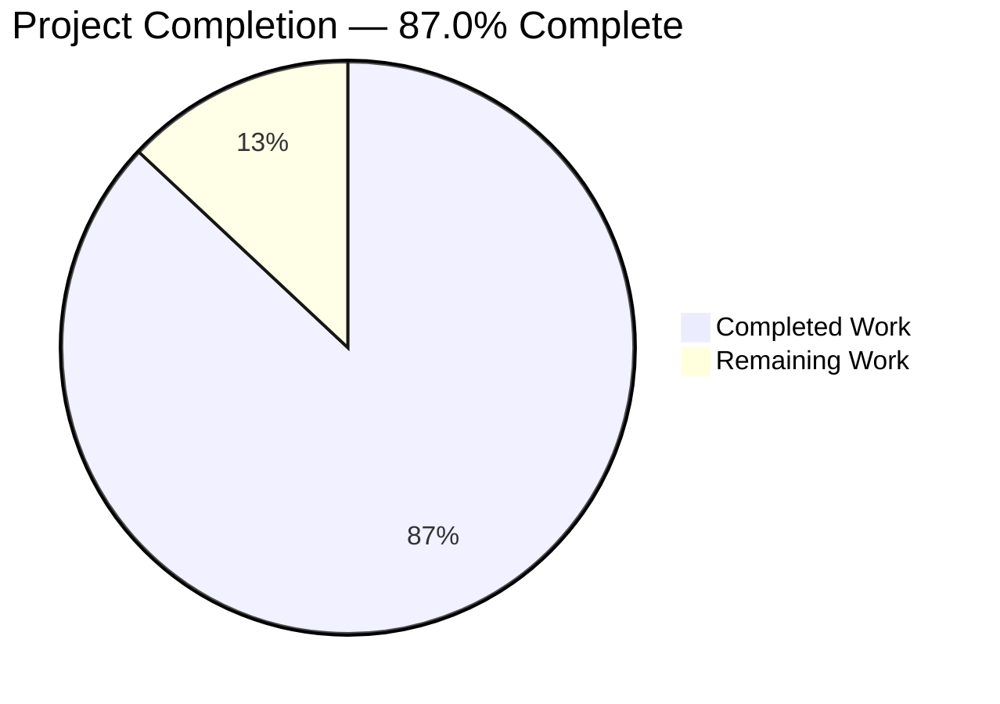
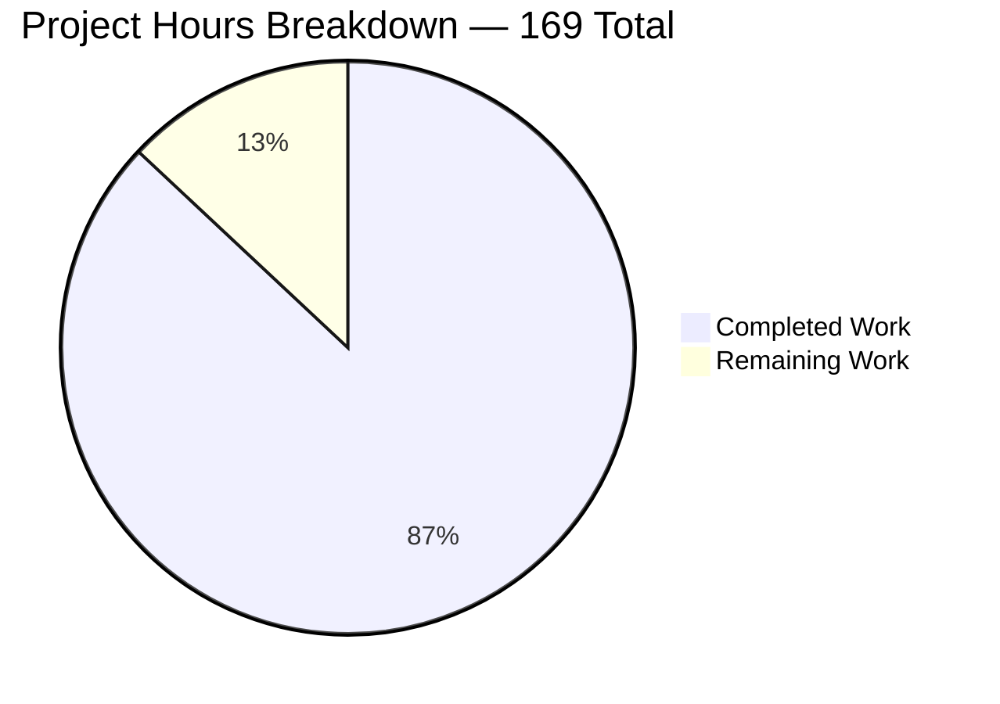
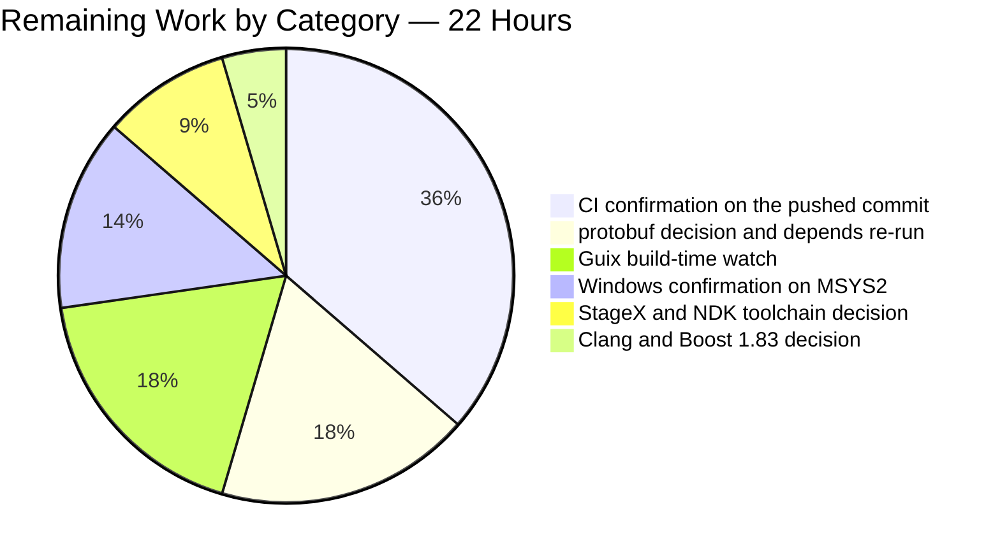
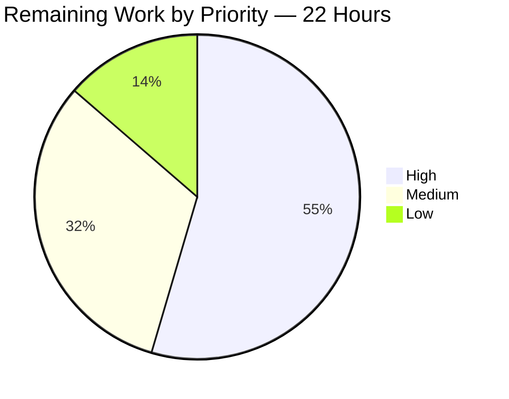

# 1. Executive Summary

## 1.1 Project Overview

Monero's first-party build (`src/`, `contrib/epee/`, `tests/`) moves from C++17 to C++23: `CMAKE_CXX_STANDARD 23` with `CMAKE_CXX_STANDARD_REQUIRED ON` and `CMAKE_CXX_EXTENSIONS OFF`, a CMake 3.20 minimum, GCC 14.2 as the primary and Clang 19 as the secondary compiler. Configure enforces the compiler floors, every construct C++23 rejects or deprecates is fixed at its call site, and the CI images, the `contrib/depends` cross builds and the Guix release toolchain move to GCC 14.2. Consensus, wire, on-disk and RPC behaviour were shown identical against the same commit built as C++17. Section 5.3 is a runbook for confirming the Windows build. The audience is the maintainers and packagers who release the daemon, wallets and RPC servers.

## 1.2 Completion Status


```mermaid
pie title Project Completion — 87.0% Complete
    "Completed Work" : 147
    "Remaining Work" : 22
```

Colour key: Completed = Dark Blue `#5B39F3` · Remaining = White `#FFFFFF`.

| Metric | Value |
|---|---|
| Total Hours | 169 |
| Completed Hours (AI + Manual) | 147 |
| Remaining Hours | 22 |
| Percent Complete | 87.0% |

Calculation: 147 / (147 + 22) = **87.0%**.

## 1.3 Key Accomplishments

- ✅ Every first-party C++ translation unit compiles as C++23: all 272 first-party C++ compile-database entries (132 under `src/`, 112 under `tests/`, 28 under `contrib/epee/`) carry `-std=c++23`; vendored C++11 and C11 units are untouched
- ✅ Configurations A-E build with zero errors on GCC 14.2 and Clang 19, Release and Debug, and each shows **zero new census keys** against its C++17 twin
- ✅ CMake 3.20.6 configures the tree with no policy warning; the link-test project now compiles at the root standard
- ✅ Configure refuses under-floor GCC, Clang and Apple Clang, `clang-cl` and unknown compilers; GCC 12.4.0 is refused, GCC 13.3.0 and Clang 16.0.6 accepted
- ✅ Test parity on both compilers: 22 of 22 CTest entries, 1309 unit-test identifiers, 19 live RPC scenarios and 165 of 165 consensus scenarios behave identically at both standards
- ✅ A database and a wallet written by the C++17 build open unchanged in the C++23 build; `wallet2_api.h` is unchanged
- ✅ depends CI on `debian:13` and Guix on a `gcc-14.2` variant give GCC 14.2.0 as native and target compiler; system Linux CI selects `gcc-14`
- ✅ The `depends.yml` `Win64` job, reproduced in `debian:13` with Debian's MinGW-w64 GCC 14 (posix), builds all 13 Windows executables, including the fixed `isFat32` diagnostic, with zero errors

## 1.4 Critical Unresolved Issues

| Issue | Impact | Owner | ETA |
|---|---|---|---|
| **Open acceptance blocker: protobuf 21.12 in the depends package builds.** Compiled at C++23 by its unmodified recipe, it adds 35 GCC `-Wdeprecated-enum-enum-conversion` keys (105 instances) in `google/protobuf/generated_message_tctable_impl.h`. Every remedy needs an authorization the request does not give (Section 5.2) | Criterion 3 is **not met for the depends package builds** (depends, Guix, Docker). Monero's own builds on those paths add nothing | Repository owner | Owner decision |
| CI has not run on the candidate: no GitHub Actions, Windows, macOS or Guix host is reachable | The `_WIN32`, `__APPLE__`, FreeBSD and Android paths, and the rolling toolchains, are unconfirmed | Repository owner | 1 day after push |
| The Guix jobs must build GCC 14.2.0 from source, because no substitutes exist for the variant | A `build-guix` job may exceed the runner's time limit | Release engineer | First Guix run |
| The Windows-only log line at `src/daemon/main.cpp:119` keeps the C++17 output, a pointer value; the user's earlier UTF-8 version was reverted | Behaviour is unchanged from C++17; logging the path as text needs the owner's decision | Platform maintainer | Owner decision |

No frozen-directory regression was found (Section 5.2).

## 1.5 Access Issues

| System/Resource | Type of Access | Issue Description | Resolution Status | Owner |
|---|---|---|---|---|
| GitHub Actions | Workflow execution | Only GitHub can run `build.yml`, `depends.yml` and `guix.yml` | Open: resolves on the first push | Repository owner |
| Windows / MSYS2 UCRT64 host | Build and test environment | No Windows toolchain is reachable; the Windows build is covered here only by the Debian 13 MinGW-w64 cross build (Section 5.3.9) | Open: needs a Windows runner or machine | Platform maintainer |
| macOS / Xcode host | Build and test environment | No Apple toolchain is reachable, so the Apple Clang floor cannot be demonstrated | Open: needs a macOS runner | macOS maintainer |
| Guix host | Release build environment | No `guix` binary or daemon is available | Open: needs a Guix machine or the CI run | Release engineer |

Building, testing and running need no credentials, secrets or network services.

## 1.6 Recommended Next Steps

1. **[High]** Push the change set and confirm every job of `build.yml`, `depends.yml` and `guix.yml` on that commit (Section 3.6; runbook for Windows: Section 5.3).
2. **[High]** Decide on protobuf 21.12's C++23 warnings in the depends package builds (Section 5.2), then re-run the depends check.
3. **[Medium]** Watch the first Guix run's build time for the `gcc-14.2` variant.
4. **[Medium]** Decide whether the Windows FAT32 log line should print the path as UTF-8, and confirm it on MSYS2.
5. **[Low]** Decide on the StageX GCC 15.2.0 and NDK Clang 18.0.1 toolchains, and on the Clang + Boost 1.83 pairing.

The complete list is in Section 8, "Human-finish items".

# 2. Project Hours Breakdown

## 2.1 Completed Work Detail

| Component | Hours | Description |
|---|---|---|
| Dialect pins and build-system floors (earlier-pass design, re-landed in `1434574c4`) | 9 | `CMAKE_CXX_STANDARD 23`, `REQUIRED ON`, `EXTENSIONS OFF` (`CMakeLists.txt:136-138`), `CXX_STANDARD ?= c++23` (`contrib/depends/Makefile:12`), the Darwin value (`contrib/depends/toolchain.cmake.in:104`), and the policy consequence `LANGUAGE ASM` for `CryptonightR_template.S` (`src/crypto/CMakeLists.txt:99-103`) |
| Compiler-floor guard (earlier-pass design, re-landed) | 8 | Configure-time guard (`CMakeLists.txt:150-171`): under-floor GCC (also MinGW-w64), `clang-cl`, under-floor Clang, under-floor Apple Clang and any other compiler are refused, each naming the version found and `README.md, Dependencies` |
| System CI images (earlier-pass design, re-landed in `03eb50eeb`) | 4 | `build-linux` on `debian:13` and `ubuntu:24.04`, with the real `libunwind-dev` package name |
| Compile-correctness substitutions (earlier-pass design, re-landed) | 12 | 225 `u8` prefixes removed across four files, every literal ASCII, with the 11 valid `u8` array initialisers and the `u8` character literals at `src/net/host.h:16-17` kept; `rct::identity()` qualified where `std::identity` became ambiguous |
| New-warning elimination at source (earlier-pass design, re-landed) | 20 | `std::is_pod` replaced by its definition in five headers; `expect<T>` storage as `alignas(T) unsigned char[sizeof(T)]`; five `[=, this]` captures; the volatile counter as plain assignment; the shared `fingerprint_less` comparator |
| Windows verification runbook (earlier pass, reworked here) | 18 | Section 5.3: MSYS2 UCRT64 set-up matching CI, the landed fix and its rationale, the uniform triage table, native verification with a same-commit C++17 census, the `debian:13` `Win64` cross build, Guix, and pipeline confirmation |
| CMake 3.20 minimum, CMP0119 correction, `CMP0144` | 4 | `CMakeLists.txt:31` and `:279` at 3.20; the "CMP0119 needs 3.25" rationale corrected; `CMP0144` NEW (`:968-973`); configuration F under Kitware CMake 3.20.6 |
| Link-test standard forwarding and probe | 3 | `CMakeLists.txt:299-301`, following `cmake/CheckTrezor.cmake:110`; the `static_assert` probe at both standards and its negative control |
| System CI GCC 14.2 selection | 2 | `g++-14` in `APT_INSTALL_LINUX`; `CC: gcc-14`, `CXX: g++-14` in `build-linux` and `test-ubuntu` |
| depends CI on `debian:13` and a new cache bucket | 4 | Default container `debian:13`; RISCV64 and Win64 overrides removed; apt.llvm.org lines removed with `/usr/lib/llvm-19/bin` kept; `depends-cxx23-debian13-` key |
| Guix `gcc-14.2` variant | 6 | Package variant of the channel's `gcc-14`, its base32 hash derivation and patch dry run; `gcc-toolchain-14.2` for every native toolchain; `base-gcc` for the Linux and MinGW cross toolchains |
| README alignment | 2 | GCC 13, Clang 16 (Apple Clang 15), CMake 3.20 rows; enforced minimums and the GCC 14.2 / Clang 19 reference compilers in prose |
| Acceptance environment | 6 | Pinned apt set, checksummed rustup-init and CMake 3.20.6, pinned Python venv, pinned Boost 1.91.0-1 prefix, depends shim, `tools.txt` and `versions.txt` checks |
| Build matrix A-F with C++17 twins and census | 16 | Ten twin builds (A-E) and four F configures, the census tool and its per-pair diffs, the compile-database comparison |
| depends twins | 8 | Fresh per-standard package builds with salted IDs and dialect verification, the package census, and Monero built through each twin's toolchain |
| Test parity | 10 | The non-consensus tier on A and C twins with retained output, the per-case comparison, and reduced-iteration `core_tests` on GCC and Clang twins |
| Contract checks and build-file checks | 2 | `wallet2_api.h` and LMDB diffs, the contract suites, both build-file searches with positive controls |
| Runtime, on-disk interchange and guard probes | 3 | Daemon, ZMQ and wallet-RPC smoke on both twins; C++17-written database and wallet opened by the C++23 build; GCC 12, GCC 13 and Clang 16 guard probes |
| Win64 cross build in `debian:13` | 3 | The `depends.yml` `Win64` job reproduced on the candidate: posix MinGW-w64 toolchain, Rust target, `make depends target=x86_64-w64-mingw32`, artefact inspection |
| libc++ syntax pass | 1 | Clang 19 against libc++ 19 headers over the candidate's first-party translation units |
| Project Guide rewrite | 6 | This guide, rebuilt on this run's evidence |
| **Total** | **147** | |

**What is not counted.** The earlier pass (`8fe8e4965` to `861efbceb`) was reverted by `f7c9079e7`. Its work whose result is in the final tree or this guide is counted above, in the six rows marked "earlier-pass". The rest, 145 of its 216 hours, is not: work reverted and not re-landed (documentation and Brewfile changes, `throw()` conversions, the `tx_extra` predicate rewrite, the TLS fingerprint test, the Boost-to-std evaluation, commit justification lines) and measurements of a superseded tree (acceptance builds, census, invariance proofs, residual checks, test tiers, release-path exercises). This run's own measurements replace the latter.

## 2.2 Remaining Work Detail

| Category | Hours | Priority |
|---|---|---|
| Push the change set and check every workflow on that commit: all `build.yml` jobs, the ten `depends.yml` hosts, `guix.yml` with its eight targets and `bundle-logs`, and the push-event full-iteration `core_tests` (human-finish item 1) | 8 | High |
| Decide on protobuf 21.12's C++23 warnings in the depends package builds, then re-run the depends twins (item 2) | 4 | High |
| Watch the Guix build time for the `gcc-14.2` variant; reproduce a timed-out job on a self-hosted Guix machine (item 4) | 4 | Medium |
| Confirm the Windows build and the `isFat32` log line on MSYS2 UCRT64, including its error branch, and decide whether it should print the path as text (item 6) | 3 | Medium |
| Decide on StageX GCC 15.2.0 in the `Dockerfile` and Android NDK r27c Clang 18.0.1 (item 7) | 2 | Low |
| Decide on the Clang 19 + system Boost 1.83 pairing (item 8) | 1 | Low |
| **Total** | **22** | |

Every row is a human-finish item from Section 8; items 3, 5 and 9 carry no hours, because no frozen-directory regression was found, the two files item 5 names need no refresh, and every acceptance measurement was run. Confidence is high on the completed rows, all of which have evidence in Sections 3 and 4, and medium on the remaining rows, which depend on CI and on owner decisions.

# 3. Test Results and Acceptance Evidence

Every figure in this section comes from this execution's own acceptance run on the final candidate: commit `ad0dbd181` plus this guide, which changes no build input. Each figure names its log, census or result file under `<run>`, the acceptance work directory on the execution host. `<run>` lies outside the repository and is not committed; every file in it is reproduced by the commands given here and in Appendix A. Results reported by the earlier pass at `8fe8e4965` are superseded and not repeated.

| Area / Category | Framework | Tests | Passed | Failed | Coverage | What This Proves |
|---|---|---|---|---|---|---|
| Non-consensus tier, GCC 14.2 (A) and Clang 19 (C), each twin | CTest (`-E core_tests`) | 22 entries × 4 runs | 22 in every run | 0 | Every registered suite except `core_tests`; `<run>/runs/{cand,base}-{A,C}/ctest.xml` | The C++23 candidate passes everything its C++17 twin passes, on both compilers |
| Unit estate | gtest `unit_tests` | 1309 identifiers in 160 suites, × 4 runs | 1307 in every run | 0 | 2 identical skips (`is_hdd.rotational_drive`, `is_hdd.ssd`); `<run>/runs/*/gtest/unit_tests.xml` | No case changes status between the standards |
| Live RPC scenarios | `functional_tests_rpc` | 19 × 4 runs | 19 in every run | 0 | Real `monerod` and `monero-wallet-rpc` on a deterministic chain; `<run>/runs/*/ctest-full.log` | Daemon and wallet RPC behave identically at both standards |
| RPC method coverage | `check_missing_rpc_methods` | 1 × 4 runs | 4 | 0 | CTest status | Every RPC method is still exercised |
| Consensus regression | `core_tests` (reduced iterations) | 165 × 4 runs | 165 in every run | 0 | Every registered synthetic-blockchain scenario, GCC and Clang twins, `MONERO_CRYPTO_SLOW_HASH_ITER=20`; `<run>/runs/{cand,base}-core-{gcc,clang}/core-full.log` | Block and transaction validation behave identically at both standards |
| Build matrix A-E with C++17 twins | Ninja + census | 6 pairs (A, B, C, D, E on GCC, E on Clang) | 6 | 0 | Zero errors and zero new census keys in every pair (Section 3.3) | Criterion 2, and criterion 3 for Monero's own builds |
| depends package builds | Census | 11 packages × 2 twins | Built | — | 35 new keys, all protobuf 21.12 | Criterion 3 **not met** for the package builds: open blocker (Section 5.2) |

## 3.1 Acceptance environment

One dedicated Ubuntu 24.04 environment, the image `monero-cxx23-acc:noble`, started as a fresh private container for every step, so `ACC_ENV=/opt/monero-cxx23-acc` is recreated per run. `env.sh` exports `ACC_ENV`, `RUSTUP_HOME=$ACC_ENV/rustup`, `CARGO_HOME=$ACC_ENV/cargo`, `PATH=$CARGO_HOME/bin:/usr/sbin:/usr/bin:/sbin:/bin`, `PYTHONNOUSERSITE=1` and `DEBIAN_FRONTEND=noninteractive`. Section 9 gives the bootstrap commands.

| Tool | Version (from `$ACC_ENV/tools.txt` and `$ACC_ENV/versions.txt`) | How it stays selected |
|---|---|---|
| GCC | `gcc-14`/`g++-14` 14.2.0-4ubuntu2~24.04.1 | `CC`/`CXX` on every configure; the depends check alone uses `$ACC_ENV/shim` |
| Clang | `clang-19` 1:19.1.1-1ubuntu1~24.04.2, with libstdc++ 14 | `CC`/`CXX` on every configure |
| CMake | `cmake` 3.28.3-1build7 at `/usr/bin/cmake`; Kitware 3.20.6 at `$ACC_ENV/cmake-3.20.6` (sha256 `458777097903b0f35a0452266b923f0a2f5b62fe331e636e2dcc4b636b768e36`) | Called by full path |
| Ninja | `ninja-build` 1.11.1-2 | `-G Ninja -D CMAKE_MAKE_PROGRAM=/usr/bin/ninja` |
| Rust | 1.93.1 from `rustup-init` 1.29.0 (sha256 `4acc9acc76d5079515b46346a485974457b5a79893cfb01112423c89aeb5aa10`) | `$CARGO_HOME/bin` first on `PATH` |
| Python | 3.12.3-0ubuntu2.1; venv `$ACC_ENV/venv` with exactly `$ACC_ENV/requirements.txt` (`certifi==2026.7.22`, `charset-normalizer==3.5.2`, `deepdiff==6.7.1`, `idna==3.20`, `monotonic==1.6`, `ordered-set==4.1.0`, `psutil==7.2.2`, `pyzmq==25.1.2`, `requests==2.33.1`, `urllib3==2.8.0`) plus `pip==24.0` | `-D Python3_EXECUTABLE=$ACC_ENV/venv/bin/python3` |
| Boost | 1.91.0-1 in `$ACC_ENV/boost-1.91.0-1`, built from the depends recipe's tarball and patch with `g++-14 -std=c++23` | The `BOOST` options (Section 9) |
| Other libraries | Ubuntu 24.04 packages pinned in `versions.txt`: `libboost-all-dev` 1.83.0.1ubuntu2 (present, not used), `libprotobuf-dev`/`protobuf-compiler` 3.21.12-8.2ubuntu0.3, OpenSSL 3.0.13, libzmq 4.3.5, libunbound 1.19.2, libsodium 1.0.18, libunwind 1.6.2, readline 8.2, hidapi 0.14.0, libusb 1.0.27 | Found by CMake from `/usr` |
| depends shim | `$ACC_ENV/shim`: `gcc`/`cc` → `gcc-14`, `g++`/`c++` → `g++-14` | First on `PATH` for the depends check only |

The compiler cache is off in every acceptance build (`-D COMPILER_CACHE=none`), so every diagnostic comes from a real compile. Each step ran in its own container, so the fixed-port test suites never shared a network namespace.

## 3.2 Source copies and twin identity

- `cand` is a `cp -a` copy of the candidate checkout; `base` is a `cp -a` copy of `cand` with only `CMakeLists.txt:136` set to `set(CMAKE_CXX_STANDARD 17)`, never committed. Both keep `.git`.
- `diff -r -q --exclude=.git cand base` lists only `CMakeLists.txt`, and the diff is line 136 alone.
- Both print `git rev-parse --short=9 HEAD` = `ad0dbd181` and the same `git submodule status`.
- In every pair the two generated `version.cpp` files are identical (`DEF_MONERO_VERSION_TAG "ad0dbd181"`, version `0.18.1.0`).
- In A and C the 407 compile-database entries differ only in `-std=` and in the copy and build roots (0 other differences).
- Trezor-enabled builds used their own copies: `candE-gcc`, `baseE-gcc`, `candE-clang`, `baseE-clang`, `candF-gcc`, `candF-clang`, and `depsrc-c23`/`depsrc-c17` for the depends-built Monero.

## 3.3 Build matrix, census and build-file checks

**Census.** Each build log becomes a multiset of keys: `(flag, file:line)` for every located warning, `(LINK/DRIVER, message)` for linker and driver warnings. Before keying, the source-copy root becomes `<src>/`, the build directory `<build>/`, the Boost prefix `<boost>/`, the depends prefix `<depends>/`, and each depends work directory `<pkg:name>/`. Each key carries a provenance class (repository, vendored, submodule, generated, dependency, toolchain, link/driver) for routing only. A key is **new** when its candidate count exceeds its baseline count; criterion 3 passes only with zero new keys of any class.

| Id | Compiler and type | Steps (cand / base) | Errors | Warnings, baseline → candidate (instances / keys) | New keys | Logs and census |
|---|---|---|---|---|---|---|
| A | GCC 14.2, Release | 465/465 / 465/465 | 0 | 23 / 6 → 19 / 5 | 0 | `<run>/logs/build-{cand,base}-A.log`, `<run>/census/diff-A.txt` |
| B | GCC 14.2, Debug | 474/474 / 474/474 | 0 | 3 / 1 → 3 / 1 | 0 | `<run>/logs/build-{cand,base}-B.log`, `<run>/census/diff-B.txt` |
| C | Clang 19, Release | 465/465 / 465/465 | 0 | 525 / 28 → 486 / 23 | 0 | `<run>/logs/build-{cand,base}-C.log`, `<run>/census/diff-C.txt` |
| D | Clang 19, Debug | 474/474 / 474/474 | 0 | 436 / 21 → 396 / 16 | 0 | `<run>/logs/build-{cand,base}-D.log`, `<run>/census/diff-D.txt` |
| E (GCC) | GCC 14.2, Release, CI option set | 541/541 / 541/541 | 0 | 23 / 6 → 19 / 5 | 0 | `<run>/logs/build-{candE,baseE}-gcc-E.log`, `<run>/census/diff-E-gcc.txt` |
| E (Clang) | Clang 19, Release, CI option set | 541/541 / 541/541 | 0 | 647 / 31 → 592 / 26 | 0 | `<run>/logs/build-{candE,baseE}-clang-E.log`, `<run>/census/diff-E-clang.txt` |
| depends Monero | GCC 14.2 through each twin's `toolchain.cmake`, Trezor on | 305/305 / 305/305 | 0 | 23 / 6 → 19 / 5 | 0 | `<run>/logs/build-depmon-{c23,c17}.log`, `<run>/census/diff-depmon.txt` |
| depends packages | 11 packages, native and target GCC 14.2 | `make` rc 0 / rc 0 | 0 | 50 / 34 → 155 / 69 | **35** (protobuf) | `<run>/logs/depends-{c23,c17}.log`, `<run>/census/diff-depends-pkg.txt` |

- **E** enables Trezor ("Trezor: support enabled" in all four configures), builds the 18 fuzz harnesses and `libwallet_api_tests`, and compiles the generated Trezor `*.pb.cc` messages.
- **Baseline-only keys** are exactly the expected ones: in C, D and E on Clang, Clang's `-Wc++20-extensions` for `[=, this]` under C++17 at `abstract_tcp_server2.inl:2059`, `wallet_rpc_server.cpp:224`, `clt.cpp:90, 150` and `srv.cpp:194`; in A, E on GCC and the depends Monero pair, libstdc++'s `typeinfo:205` `-Wstring-compare` (13 → 10) and `stl_vector.h:116` `-Wmaybe-uninitialized` (1 → 0).
- **Remaining candidate keys** are pre-existing at both standards: in A, libstdc++ `stl_vector.h:105-106`, `typeinfo:205`, `bits/stdlib.h:146` and the C source `src/crypto/tree-hash.c:89`; in C, rapidjson and gtest `-Wnan-infinity-disabled`, `src/fcmp_pp/curve_trees.cpp:154` `-Wunneeded-internal-declaration`, and 15 driver `-Wunused-command-line-argument` keys; in B and D, the `ld` executable-stack note for the same three assembler objects.
- **F, the CMake floor.** Kitware CMake 3.20.6, configure only (`<run>/logs/cfg-F-{A,E}-{gcc,clang}.log`): exit 0 for GCC 14.2 and Clang 19 with A's options and with E's options; no `Policy CMP` line and no `CMake Error` in any of the four; `-- CMake version 3.20.6`, `Found Boost Version: 1.91.0`, and `Trezor: support enabled` in both E-option logs. Each prints the one benign "Manually-specified variables were not used" warning (Section 9). The F compile databases hold 407 entries: GCC `-std=c++23` × 275, Clang `-std=c++2b` × 275.
- **Guard probes** (`<run>/logs/cfg-guard-{gcc12,gcc13,clang16}.log`): GCC 12.4.0 is refused with exit 1, "GCC 12.4.0 is too old; GCC 13 or newer is required for C++23 (see README.md, Dependencies)" (`CMakeLists.txt:153`); GCC 13.3.0 and Clang 16.0.6 (with the libstdc++ 13 headers) configure with exit 0.
- **Link-test standard probe** (`<run>/logs/cfg-probe*.log`). In scratch copies, the generated source at `CMakeLists.txt:282` was prefixed with `static_assert(__cplusplus == 202302L);` (`201703L` in the C++17 twin) and configured with A's options:

  | Copy | Compiler and CMake | Result |
  |---|---|---|
  | Candidate, forwarding present | GCC 14.2, CMake 3.28.3 | exit 0 |
  | Candidate, forwarding present | Clang 19, CMake 3.20.6 (`-std=c++2b`) | exit 0 |
  | C++17 twin, `201703L` | GCC 14.2 and Clang 19, CMake 3.28.3 | exit 0 |
  | Candidate with `CMakeLists.txt:299-301` removed | GCC 14.2, CMake 3.28.3 | exit 1: "Undefined symbols test failure: expect(TRUE), success(FALSE)" |

- **Compile database** (configurations A and C, `<run>/b/cand-{A,C}/compile_commands.json`): 407 entries, `-std=c++23` × 275, `-std=c11` × 79, `-std=c++11` × 24, none × 29. Every first-party C++ entry carries `-std=c++23`: 132 under `src/`, 112 under `tests/`, 28 under `contrib/epee/`; the other three C++23 entries are the generated `version.cpp` and the two gtest sources. `-std=c++11` appears only for `external/easylogging++` (1), `external/qrcodegen` (1) and `external/randomx` (22).
- **Build-file checks** (`<run>/logs/greps.log`). Both searches print nothing (exit 1):

  ```bash
  grep -rnE --include=CMakeLists.txt --include='*.cmake' --include='*.cmake.in' \
    -e '-std=(c|gnu)\+\+(17|14|11|1z|1y|0x)' -e 'CXX_STANDARD[ "]+(17|14|11)([^0-9]|$)' \
    CMakeLists.txt CMakeLists_IOS.txt cmake src contrib/epee tests
  grep -rnE -e '-std=(c|gnu)\+\+(17|14|11|1z|1y|0x)' -e 'CXX_STANDARD[ "?:=]+(c\+\+)?(17|14|11)([^0-9]|$)' \
    contrib/depends/Makefile contrib/depends/hosts contrib/depends/builders contrib/depends/packages \
    contrib/depends/toolchain.cmake.in contrib/guix .github/workflows
  ```

  As positive controls, the second command's patterns match `CXX_STANDARD ?= c++17` and `$(package)_cxxflags+=-std=c++17`, and do not match the hosts' `-std=$(CXX_STANDARD)`.
- **depends check.** Two fresh copies of `contrib/depends` (`depends-c23` from `cand`, `depends-c17` from `base`), with no `built/`, `work/`, `sources/` or prefix carried over, built with `$ACC_ENV/shim` first on `PATH` by `make HOST=x86_64-linux-gnu V=1 x86_64_linux_CC="gcc-14 -m64" x86_64_linux_CXX="g++-14 -m64" CXX_STANDARD=c++23 HOST_ID_SALT=std-c++23` (and `c++17`, `std-c++17`), sources from the upstream tarballs:
  - each log shows `Configuring`, `Building` and `Caching` once for all eleven packages (`native_protobuf`, `boost`, `openssl`, `zeromq`, `unbound`, `sodium`, `protobuf`, `libusb`, `hidapi`, `ncurses`, `readline`);
  - the ten target packages' archive IDs differ between the twins (for example `protobuf-21.12-656746ae79a` against `protobuf-21.12-8f13add0df3`); `native_protobuf` has the same ID, `64f1bce9bf6`, in both, because native recipes take no `-std` and no host salt;
  - all 168 protobuf and 236 zeromq compile lines carry the twin's `-std=c++23` or `-std=c++17`, and Boost's `user-config.jam` line reads `<cxxflags>"-pipe -std=c++23` or `-std=c++17`;
  - `command -v g++` is `$ACC_ENV/shim/g++`, its `--version` is 14.2.0, and `make print-build_CXX` prints `g++` (`<run>/logs/depends-{c23,c17}-tools.log`);
  - Monero, configured against each twin's `x86_64-linux-gnu/share/toolchain.cmake` in its own source copy, reports GNU 14.2.0, Boost 1.91.0 and "Trezor: support enabled", and builds 305/305 (table above). Its compile commands carry `-std=c++23` × 170 in the candidate and `-std=c++17` × 170 in the twin.
- **libc++ pass** (`<run>/logs/libcxx-cand-C/`): Clang 19 `-fsyntax-only -stdlib=libc++ -nostdinc++` against the libc++ 19 headers, over configuration C's compile commands: 296 translation units, 0 failures. It stands in for the libc++ toolchains of macOS, FreeBSD and Android, whose own versions only CI exercises.
- **Win64 cross build** (`<run>/logs/win64/`): the `depends.yml` `Win64` job reproduced in `debian:13` on a copy of the candidate: `make depends target=x86_64-w64-mingw32` exit 0, no `error:` line, 13 Windows executables (Section 5.3.9). No C++17 twin was built for this host, so criterion 3 is not evaluated there.

## 3.4 Test parity

Configurations A and C and their twins each ran, one after another per container:

```bash
GTEST_OUTPUT=xml:<run>/gtest/ DNS_PUBLIC=tcp ctest --test-dir <dir> -E core_tests -V \
  --output-log <run>/ctest-full.log --output-junit <run>/ctest.xml
cp <dir>/Testing/Temporary/LastTest.log <run>/LastTest.log
```

`core_tests` was built in its own directory per tree with `CFLAGS=-DMONERO_CRYPTO_SLOW_HASH_ITER=20` and run with its own `HOME`: `HOME=<run>/corehome ctest --test-dir <dir> -R core_tests -V --output-log <run>/core-full.log`.

Each run yields a map from case identifier to status: gtest `classname.name` from the XML (a `failure` child is failed, `result="skipped"` is skipped); CTest entry statuses from `ctest.xml`; `#TEST# Succeeded/Failed <name>` from `core-full.log`; and `[TEST PASSED]/[TEST FAILED] <name>` from `ctest-full.log`, cross-checked against `LastTest.log`. The pass rule: every identifier passing in the C++17 twin appears and passes in the C++23 candidate. Comparison output: `<run>/runs/parity-{A,C}.txt` and `<run>/runs/parity-core-{gcc,clang}.txt`.

| Suite | A: GCC 14.2 (base → cand) | C: Clang 19 (base → cand) | Regressions |
|---|---|---|---|
| CTest entries without `core_tests` | 22/22 → 22/22 (1356.67 s → 1339.16 s) | 22/22 → 22/22 (1383.77 s → 1470.89 s) | 0 |
| unit_tests | 1309 identifiers: 1307 passed, 2 skipped → identical | identical to A | 0 |
| crypto (`cncrypto`, `cnv4-jit`) | passed → passed | passed → passed | 0 |
| hash (`hash-fast`, `hash-slow`, `hash-slow-1`, `hash-slow-2`, `hash-slow-4`, `hash-tree`, `hash-extra-blake`, `hash-extra-groestl`, `hash-extra-jh`, `hash-extra-skein`, `hash-blake2b`, `hash-variant2-int-sqrt`, `hash-target`) | 13/13 → 13/13 | 13/13 → 13/13 | 0 |
| functional_tests_rpc | 19 `[TEST PASSED]` → 19 (same names; `LastTest.log` agrees) | 19 → 19 | 0 |
| check_missing_rpc_methods | passed → passed | passed → passed | 0 |
| core_tests | 165/165 → 165/165 (352.31 s → 356.54 s) | 165/165 → 165/165 (325.28 s → 317.38 s) | 0 |

- The functional scenarios are `address_book`, `bans`, `blockchain`, `cold_signing`, `daemon_info`, `get_output_distribution`, `http_digest_auth`, `integrated_address`, `k_anonymity`, `mining`, `multisig`, `p2p`, `proofs`, `sign_message`, `transfer`, `txpool`, `uri`, `validate_address` and `wallet`.
- Baseline identifiers not passing, which carry no weight: `is_hdd.rotational_drive` and `is_hdd.ssd`, skipped in every run because no loop devices were attached.
- No identifier passes in a candidate where its baseline did not, and no candidate has an identifier its baseline lacks.

## 3.5 Contract checks

- **Public API.** `git diff 454075bc6 -- src/wallet/api/wallet2_api.h` and `git diff 861efbceb -- src/wallet/api/wallet2_api.h` are both empty; the header is unchanged. `libwallet_api_tests`, which includes the header as a consumer, builds in both E pairs.
- **Consensus.** All 165 `core_tests` scenarios pass at both standards on both compilers; `ringct` (136 cases), `bulletproofs` (9), `bulletproof` (3), `bulletproofs_plus` (8), the hard-fork suites and `sort_tx_extra` (8) pass at both standards on both compilers.
- **Wire formats.** `Serialization` (15), `JsonSerialization` (8), `JsonRpcSerialization` (1), `epee_binary` (4), `epee_json` (4), `levin_notify` (33), `zmq` (6), `zmq_pub` (13), `zmq_server` (1), `ZmqFullMessage` (2), and the HTTP digest suites `HTTP` (11), `HTTP_Auth` (1), `HTTP_Client_Auth` (5) and `HTTP_Server_Auth` (7) pass at both standards. The `fingerprint_less` comparator is covered by `test_epee_connection` (3) and `boosted_tcp_server` (4); the earlier pass's `ssl_handshake_fingerprint_lookup` test is not in the tree.
- **On-disk formats.** `BlockchainDBTest/0` (3) and `wallet_storage` (9) pass at both standards; `git diff 454075bc6 -- src/blockchain_db/lmdb` is empty; and a database and wallet written by the C++17 twin open in the C++23 candidate with identical contents (Section 4).
- **RPC output.** `functional_tests_rpc` (19 scenarios, including `http_digest_auth`, `daemon_info`, `txpool` and `transfer`) and `check_missing_rpc_methods` pass at both standards, and the two twins' `version.cpp` files are identical, so version fields in RPC output compare equal.

## 3.6 CI results

No GitHub Actions run exists for the candidate: the execution environment has no GitHub Actions, macOS, Windows, Guix or Docker-build host. Every row is **pending: not runnable in the execution environment** (human-finish item 1).

| Workflow | Jobs to confirm on the pushed candidate | Run URL and outcome |
|---|---|---|
| `build.yml` | `build-macos`, `build-windows`, `build-arch`, `build-linux` (Debian 13, Ubuntu 24.04), `test-ubuntu` (including the push-event full-iteration `core_tests`), `build-docker`, `source-archive` | Pending |
| `depends.yml` | The ten `build-cross` hosts: RISCV 64bit, ARM v8, i686 Linux, Win64, x86_64 Linux, Cross-Mac x86_64, Cross-Mac aarch64, x86_64 Freebsd, ARMv7 Android, ARMv8 Android | Pending |
| `guix.yml` | `cache-sources`; the eight `build-guix` targets; `bundle-logs` and its SHA-256 summary. It runs because the change set touches `contrib/guix/**` and `contrib/depends/**` (`guix.yml:3-19`) | Pending |

## 3.7 Not covered

- **Native Windows and macOS** builds, tests and runtime, and every `_WIN32`, `__APPLE__`, FreeBSD and Android code path except those the Win64 cross build compiles: CI only.
- **The Apple Clang 15 floor**: enforced, never demonstrated.
- **Reproducible release builds**: the Guix path has not been run.
- **Sustained network load**: the load harnesses build in every configuration but were not run.
- **Container image** (`Dockerfile`, StageX GCC 15.2.0): not built in this execution.

# 4. Runtime Validation & UI Verification

This project ships command-line executables (daemons, wallets, RPC servers and blockchain utilities) and has no user interface, so there is no UI to verify. Runtime validation drove the configuration A binaries of both twins inside the acceptance container: testnet in offline mode, loopback-only binds, digest credentials and throwaway data directories. Nothing touched mainnet.

- ✅ **Daemon start-up and HTTP JSON-RPC with digest authentication** (`<run>/runtime/smoke-cand-A.log`): `monerod --testnet --offline` with `--rpc-login` answered after 3 s. A request without credentials and one with a wrong password both got 401; digest credentials got 200. `get_info` returned `status OK`, height 1, `nettype testnet`, offline, version `0.18.1.0-ad0dbd181`.
- ✅ **Daemon ZMQ JSON-RPC**: a plain JSON-RPC 2.0 object on the ZMQ endpoint answered `get_height` with `{"jsonrpc":"2.0","id":0,"result":{"rpc_version":131072,"height":1}}`, the unchanged ZMQ RPC version 2.0. The method table whose `u8` literals were edited dispatches unchanged.
- ✅ **Wallet RPC server**: `monero-wallet-rpc --testnet` answered after 5 s against the authenticated daemon, refused calls without or with wrong credentials (401), reported `get_version` 65569 (wallet RPC 1.33, unchanged), created a testnet wallet, returned its address and `get_height` 1, and stopped through `stop_wallet`. `stop_daemon` returned `{"status": "OK"}`; both processes exited.
- ✅ **Twin equality**: the same sequence on the C++17 twin (`<run>/runtime/smoke-base-A.log`) printed identical output apart from the randomly generated wallet address.
- ✅ **On-disk interchange** (`<run>/runtime/xopen/xopen.log`): a testnet LMDB database and a wallet file written by the C++17 twin's `monerod` and `monero-wallet-rpc` were opened by the C++23 candidate's binaries. The candidate reported the same height and top-block hash (`48ca7cd3…cda8430b`), logged no migration, opened the wallet with its password, and returned the same address and view key. All four processes exited 0.
- ✅ **Runbook smoke script** (`<run>/runtime/runbook-smoke.log`): the Section 5.3.8 Step 5.4 script, run unchanged with the candidate's Linux `monerod`, printed `"status": "OK"`, `"height": 1`, `"nettype": "testnet"`, `"offline": true` and `SMOKE PASSED`.
- ✅ **Python RPC journeys**: the 19 `functional_tests_rpc` scenarios (transfers, mining, multisig, cold signing, integrated addresses, proofs, txpool, digest authentication, p2p and others) drive real daemon and wallet processes on a deterministic chain, and pass at both standards on GCC 14.2 and on Clang 19 (Section 3.4).
- ✅ **Windows cross build** (`<run>/logs/win64/artefacts.log`): `monerod.exe` and `monero-wallet-cli.exe`, cross-built in `debian:13`, are PE32+ x86-64 console executables (Section 5.3.9). They were not run.
- ❌ **Windows and macOS runtime**: never exercised natively, because no Windows or Apple environment is reachable (Section 1.5).
- ⚠ **Container image**: `docker build .` (StageX) was not run in this execution.

# 5. Compliance & Quality Review

Where to find each required record: compliance matrix (5.1); divergences and the open acceptance blockers (5.2); Windows verification runbook (5.3); C++23 migration record, with breaking-change categories (5.4.1), files changed per category (5.4.2), vendored patches (5.4.3), build-configuration changes (5.4.4), toolchain pins and CI matrix (5.4.5), Boost (5.4.6), third-party diagnostics (5.4.7) and corrected statements (5.4.8); acceptance results (Section 3); CI results (3.6); human-finish items (Section 8).

## 5.1 Compliance Matrix

| Deliverable | Benchmark | Status | Evidence |
|---|---|---|---|
| G1 Language standard | `CMAKE_CXX_STANDARD 23`, `REQUIRED ON`, `EXTENSIONS OFF` for every first-party target and the configure-time compiles; no `-std=c++17/14/11` in an in-scope build file | ✅ Pass | `CMakeLists.txt:136-138`; link-test forwarding `:299-301` with its probe; both build-file searches print nothing; every first-party compile-database entry carries `-std=c++23` (Section 3.3) |
| G2 CMake minimum | `cmake_minimum_required` at 3.20 | ✅ Pass | `CMakeLists.txt:31`, `:279`; configuration F under CMake 3.20.6: exit 0, no policy line |
| G3 Clean builds | All default targets on GCC 14.2 and Clang 19, Release and Debug, zero errors | ✅ Pass | A-E: 0 `: error:` lines; `ninja` exit 0 in every build (Section 3.3) |
| G4 No new warnings | Zero new census keys of any origin against the C++17 twin | ⚠ Partial | 0 new keys in A, B, C, D, E and the depends-built Monero pair. **Not met** for the depends package builds: 35 protobuf keys, an open blocker (Section 5.2) |
| G5 Test parity | Every case passing at C++17 passes at C++23 | ✅ Pass | unit_tests, core_tests, crypto, hash and functional_tests identifiers on GCC and Clang twins: 0 regressions (Section 3.4) |
| G6 depends and Guix compiler | GCC 14.2 native and target in depends CI and in the Guix release | ✅ Pass (definition); CI run pending | `depends.yml:27-29` `debian:13`; `contrib/guix/manifest.scm:85-93`; the local depends checks used GCC 14.2.0 as native and target compiler: Ubuntu's `g++-14` for x86_64 Linux, Debian 13 for Win64 (Sections 3.3 and 5.3.9) |
| G7 CI | Every existing build job compiles as C++23, with updated compiler versions | ⚠ Pending | Definitions updated (Section 5.4.5); no CI run yet (Section 3.6) |
| G8 README | Minimum GCC, Clang and CMake versions | ✅ Pass | `README.md:142-144`, `:162-170` |
| G9 Project Guide | Categories, files per category, vendored patches, human-finish items | ✅ Pass | Sections 5.4 and 8 |
| Consensus, wire, on-disk and RPC behaviour unchanged | Contract suites, functional scenarios and interchange identical at both standards | ✅ Pass | Sections 3.5 and 4 |
| `src/wallet/api/wallet2_api.h` | No signature change | ✅ Pass | Empty diff since `454075bc6` and since `861efbceb` |
| No suppression, no dual-standard code, no C++23 feature adoption | No `#pragma`, `-Wno-*`, `-fpermissive` or `__cplusplus` guard added | ✅ Pass | `git diff 454075bc6 ad0dbd181` adds none. This guide names them only as prohibitions, and `__cplusplus` also in the scratch probe of Section 3.3, which is never committed |
| Submodules and vendored code | Submodule sources untouched; vendored code patched only on failure | ✅ Pass | No diff under `external/` (Section 5.4.3) |
| Windows verification runbook | A maintainer can confirm the Windows checks from a clean setup | ✅ Pass | Section 5.3 |

## 5.2 AAP & Rule Divergences and Gaps

No user-specified rules were provided for this project, so every divergence below is a departure from the migration plan (AAP) or from its derived instructions, not from a rule.

| What the AAP required | What was delivered instead | Why it diverged | Impact | Remediation |
|---|---|---|---|---|
| Criterion 3: no new warning against the C++17 twin, in every build | Met for Monero's own builds on every measured path. Not met for the depends **package** builds: protobuf 21.12 adds 35 keys | No authorized remedy exists (open acceptance blocker below) | Noisier depends, Guix and Docker package logs; a future `-Werror` on package builds would fail | Owner's decision (human-finish item 2) |
| Edits "already on the branch" carried over unchanged (legacy disposition) | The earlier pass was reverted by `f7c9079e7` before this execution, so nothing was carried over. This execution re-landed every fix that the C++23 build required, in `1434574c4` | The branch state differed from the plan's starting point | The `throw()` conversions, the `tx_extra` predicate rewrite, the comment edits and the `ssl_handshake_fingerprint_lookup` test of the earlier pass are absent; none is needed for criteria 1-4 | None required; Section 5.4.2 records each |
| The user's Windows fix `429a20174` (`utf16_to_utf8`) retained | `static_cast<const void*>(root_path)`, the plan's uniform fix for the category | `429a20174` was reverted with the earlier pass; re-landing a text conversion changes log output, which needs the owner | The log line prints a pointer value, exactly as at C++17 | Owner decides whether to re-land the UTF-8 text (human-finish item 6) |
| Refresh `docs/COMPILING_DEBUGGING_TESTING.md:49-56` and the `src/crypto/CMakeLists.txt:99` comment from 3.25 to 3.20 | Nothing to refresh | After the revert, the docs file is the upstream file with no CMake-floor text, and the comment already says "NEW from policy version 3.20" | None | None |
| Only the AAP's listed edits to `CMakeLists.txt` | Also `CMP0144` NEW (`CMakeLists.txt:968-973`) | With CMP0074 NEW at 3.20, CMake 3.27+ warns about the upper-case `BOOST_ROOT` that the depends toolchain sets | Removes a configure warning on depends builds | None |
| CI runs on the pushed candidate (AAP 0.8.7) | Pending | No GitHub Actions, macOS, Windows or Guix host is reachable from the execution environment | Platform-only code paths (`_WIN32`, `__APPLE__`, FreeBSD, Android) are compiled only by CI | Human-finish item 1 |

### Open acceptance blockers

**1. protobuf 21.12 in the depends package builds.**

- **Affects:** every depends, Guix and Docker build, because each compiles the unmodified `contrib/depends/packages/protobuf.mk` at `-std=$(CXX_STANDARD)` = `c++23`. Measured on the x86_64 Linux depends twins.
- **Criterion not met:** criterion 3, for the depends **package** builds only. Monero's own build on that path adds 0 keys (Section 3.3, `<run>/census/diff-depmon.txt`).
- **Keys:** 35 GCC `-Wdeprecated-enum-enum-conversion` keys, 3 instances each (105 in total), at `google/protobuf/generated_message_tctable_impl.h` lines 186, 188-196, 198-203, 205, 207-215, 217-222 and 225-227. That header is internal; only protobuf's own sources include it.
- **Evidence:** clean per-standard twins (separate `contrib/depends` copies with no `built/`, `work/` or `sources/`, `HOST_ID_SALT=std-c++23` and `std-c++17`), every package configured, built and cached fresh in each, every protobuf compile line carrying its twin's `-std` (Section 3.3). Census: `<run>/census/diff-depends-pkg.txt`.
- **Root cause:** the field-layout constants of protobuf 21.12's table-driven parser combine values of two different enumerations with `|`, for example `kFloat = kFkFixed | kRep32Bits | kFmtFloating` at line 193. GCC reports "bitwise operation between different enumeration types `field_layout::FieldKind` and `field_layout::FieldRep` is deprecated", a C++20 deprecation; at `c++17` the same code compiles silently.
- **Options**, each needing an authorization the migration request does not give:
  1. a recipe-local `-std=c++17` in `contrib/depends/packages/protobuf.mk`, which is a standard exception, a recipe edit and a `-std=c++17` in a build file;
  2. a source patch under `contrib/depends/patches/protobuf/`;
  3. a newer protobuf whose library compiles without new warnings at C++23 (none was measured);
  4. accepting the package-build delta as outside criterion 3.
- **Status:** no option was chosen or applied. Suppression flags and pragmas are not options.

**2. Frozen-directory regressions:** none found in this run. No test identifier that passes in a C++17 twin fails, is skipped or is missing in its C++23 candidate (Section 3.4).

## 5.3 Windows Build Verification Runbook (MSYS2 UCRT64 / MinGW-w64)

This runbook is for the maintainer who confirms the Windows pipeline checks on the pushed candidate. It takes one of two machines from a clean setup to the end state 5.3.1 defines: a Windows machine running MSYS2, or a Linux or WSL machine with the MinGW-w64 cross toolchain. Work through the steps in order. Each step gives the commands to run, the output to expect, and what to do when the output differs. Commands run from the repository root unless a step says otherwise.

The one Windows-only C++23 error, at `src/daemon/main.cpp:117`, is already fixed in the tree (Step 4). This runbook verifies that fix and the rest of the Windows build; it no longer lands a patch.

### 5.3.1 Outcome and audience

The work is done when the pushed candidate commit passes the three Windows checks below, and every other job in the same three workflows stays green on that commit.

| Check (job name in GitHub) | Workflow | Defined at | What it runs on this change set |
|---|---|---|---|
| `Windows (MSYS2)` | `ci/gh-actions/cli` | `.github/workflows/build.yml:74-111` | Native build of target `all` in MSYS2 UCRT64 on `windows-latest` with MSYS2's rolling MinGW-w64 GCC, then the reduced test tier |
| `Win64` | `ci/gh-actions/depends` | `.github/workflows/depends.yml:48-51` (matrix entry), `:77-144` (steps) | `make depends target=x86_64-w64-mingw32` in `debian:13`, with Debian's MinGW-w64 GCC 14 (package 14.2.0-19+27, posix thread model), then upload of `monerod.exe` and `monero-wallet-cli.exe` |
| `x86_64-w64-mingw32` | `ci/gh-actions/guix` | `.github/workflows/guix.yml:3-19` (triggers), `:54` (target), `:109` (build) | Reproducible Guix release build of the Windows triple, with the `gcc-14.2` cross compiler (`contrib/guix/manifest.scm:86-93`) |

- `Windows (MSYS2)` and `Win64` run on every push and pull request that changes anything outside `docs/**` and `**/README.md` (`build.yml:3-11`, `depends.yml:3-11`).
- The Guix check runs on this change set. Its `paths` filter (`guix.yml:3-19`) matches `contrib/guix/**` and `contrib/depends/**`, and the change set modifies `contrib/guix/manifest.scm`, `contrib/depends/Makefile` and `contrib/depends/toolchain.cmake.in`. No workflow here has a `workflow_dispatch` trigger, so never add a dummy change or edit a workflow to force a run.

All three compile the first-party sources at C++23 with a MinGW-w64 GCC. Section 5.3.9 records the one of them reproduced in the execution environment; the GitHub runs themselves are pending (Section 3.6).

### 5.3.2 Verification legend

Every claim below is marked **verified here** or **not verified here**.

- **Verified here** means checked in the execution environment by one of these means:
  - reading the workflow, build and source files cited;
  - running the Linux acceptance builds, tests and smoke runs of Section 3 on the candidate tree;
  - running a command of this runbook, such as the Step 5.4 smoke script with the Linux `monerod`, or the Step 6 cross build in `debian:13`.
- **Not verified here** means the claim needs Windows, MSYS2, a Guix host or GitHub. That covers every native Windows run, MSYS2's current GCC, ctest on Windows, the GitHub `Win64` job and the Guix cross build.

### 5.3.3 Issue inventory

| # | Issue | Location | Cause | Symptom without the fix | Checks affected | Status |
|---|---|---|---|---|---|---|
| W-1 | Wide string written to a narrow log stream | `src/daemon/main.cpp:117-119`, inside `isFat32` (`:111-125`) | C++20 deletes `operator<<(basic_ostream<char>&, const wchar_t*)` (P1423R3). At C++17 the same expression silently chose `operator<<(const void*)` | Hard error "use of deleted function"; `monerod.exe` is not produced | All three | **Landed** in commit `1434574c4`: `static_cast<const void*>(root_path)`, which keeps the C++17 output. Cross-compile evidence: Section 5.3.9. Native MSYS2 confirmation pending |
| W-2 | Further Windows-only C++20/23 errors | Windows conditionals across `src/`, `contrib/epee/` and the MinGW-only daemonizer sources (`src/daemonizer/CMakeLists.txt:29-38`) | — | None known | — | None in the Debian 13 MinGW-w64 cross build: 0 errors (Section 5.3.9). Native MSYS2 GCC 16: pending |
| W-3 | New Windows-only warnings | Same set | — | — | — | **Pending.** Step 5.5 measures them against the C++17 twin |
| W-4 | MinGW-w64 GCC floor of 13 never demonstrated on Windows | Guard at `CMakeLists.txt:150-154` | No native Windows toolchain has built this tree yet | — | `Windows (MSYS2)`, `Win64` | **Pending.** Step 5 records the native result |
| W-5 | Windows runtime never exercised | `monerod.exe`, `monero-wallet-cli.exe`, the reduced tests | As W-4 | — | `Windows (MSYS2)` | **Pending.** Step 5 exercises it |

### 5.3.4 Step 1 — Set up MSYS2 UCRT64 the way CI does

CI prepares Windows with `msys2/setup-msys2@v2` (`build.yml:91-96`):

```yaml
msystem: ucrt64
update: true
cache: false
pacboy: toolchain:p cmake:p ccache:p boost:p openssl:p zeromq:p libsodium:p hidapi:p protobuf:p libusb:p unbound:p rust:p git:p
```

**1.1 Install MSYS2.** Run the installer from https://www.msys2.org on 64-bit Windows 10 (version 1809) or newer, and keep the default location `C:\msys64`. *Not verified here.*

**1.2 Open the UCRT64 shell.** Start **MSYS2 UCRT64** from the Start menu, or run `C:\msys64\ucrt64.exe`. Every Windows command in this runbook runs in that shell.

**1.3 Update the system**, as `update: true` does:

```bash
pacman -Suy
```

If pacman says it must close every MSYS2 process, including this terminal, confirm. Then reopen **MSYS2 UCRT64** and run `pacman -Suy` again. Repeat until it reports nothing to do (https://www.msys2.org/docs/updating/).

**1.4 Install CI's package set.** `pacboy` comes from the `pactoys` package. It expands `name:p` to the shell's `$MINGW_PACKAGE_PREFIX`, which in UCRT64 is `mingw-w64-ucrt-x86_64` (https://www.msys2.org/docs/package-naming/). The second line below is CI's list, verbatim:

```bash
pacman -S --needed pactoys
pacboy -S --needed toolchain:p cmake:p ccache:p boost:p openssl:p zeromq:p libsodium:p hidapi:p protobuf:p libusb:p unbound:p rust:p git:p
pacman -S --needed curl            # not in CI's list; used only by the smoke run in Step 5
pacboy -S --needed python:p        # not in CI's list; used only by the Step 5.5 census
```

`protobuf` and `libusb` are required, not optional: CI makes Trezor support mandatory (`build.yml:30`), and configure fails without them.

**1.5 Check the environment.**

```bash
echo $MSYSTEM $MINGW_PREFIX     # UCRT64 /ucrt64
which gcc cmake cargo ninja     # each under $MINGW_PREFIX/bin
gcc --version | head -1         # 13 or newer; CMakeLists.txt:150-154 refuses older GCC
cmake --version | head -1       # 3.20 or newer (CMakeLists.txt:31)
cargo --version                 # Rust is mandatory: src/CMakeLists.txt:91 always adds src/fcmp_pp
```

MSYS2's CMake uses the Ninja generator by default, and CI passes no `-G` (https://www.msys2.org/docs/cmake/). If `which` finds no `ninja`, run `pacboy -S --needed ninja:p`. You are in the wrong shell (5.3.11) when `$MSYSTEM` is not `UCRT64`, or a tool resolves outside `$MINGW_PREFIX/bin`.

> **MINGW64 alternative — not the environment CI checks.** Open **MSYS2 MINGW64** (`C:\msys64\mingw64.exe`). The `pacboy` lines work unchanged, because `:p` follows the shell. Read `UCRT64`, `/ucrt64` and `mingw-w64-ucrt-x86_64-` in this runbook as `MINGW64`, `/mingw64` and `mingw-w64-x86_64-`. MINGW64 links against `msvcrt` rather than `ucrt`, so never share objects or a `build/` directory between the two environments. A MINGW64 result is not a pipeline result, because `build.yml:93` pins `msystem: ucrt64`.

**No Windows machine?** Step 6 reproduces the `Win64` check in Docker `debian:13`, or WSL, and needs no MSYS2.

### 5.3.5 Step 2 — Get the source

Take two values from the pull request page: the head repository's HTTPS clone URL and the head branch. Replace `OWNER` and `BRANCH` between the quotes:

```bash
REPOSITORY_URL='https://github.com/OWNER/monero.git'
PR_BRANCH='BRANCH'
GIT_TERMINAL_PROMPT=0 git ls-remote --exit-code --heads "$REPOSITORY_URL" "$PR_BRANCH" &&
  mkdir -p /c/src && cd /c/src &&
  git clone --recursive --branch "$PR_BRANCH" "$REPOSITORY_URL" monero &&
  cd monero &&
  git status -sb | head -1 &&
  git submodule update --init --recursive &&
  git submodule status
```

The chain stops at the first failure, so nothing is cloned until both values check out. `git ls-remote` printing nothing with exit status `2` means the branch name is wrong; `fatal: could not read Username` means the URL names no public repository.

`git submodule status` prints one line per submodule; the text in parentheses may differ. These are the pins of the candidate tree (verified here):

```
 52eb8108c5bdec04579160ae17225d66034bd723 external/gtest (…)
 12f2c2ffe2108d6cf54c391fee33c8bc3646cdab external/randomx (v1.2.3)
 24b5e7a8b27f42fa16b96fc70aade9106cf7102f external/rapidjson (…)
 e887b2fb4bfcfcc454b2005472ad1df6f2191f52 external/supercop (…)
```

- A leading `-` means a submodule is not initialised; run `git submodule update --init --recursive`.
- A leading `+` means its checkout differs from the pin. Back up anything you want to keep with `git -C external/NAME stash` or a branch, then run `git submodule update --init --recursive` without `--force`. Use `--force` only for a submodule whose local changes you have decided are disposable.
- Keep the clone root short, such as `C:\src\monero`, because Windows path limits apply to the build tree.

### 5.3.6 Step 3 — Build and collect every error

CI configures and builds with `BUILD_DEFAULT` (`build.yml:17`), shown here verbatim:

```bash
cmake -S . -B build -D ARCH="default" -D BUILD_TESTS=ON -D BUILD_GUI_DEPS=ON -D ENABLE_FUZZ_TEST=ON -D CMAKE_BUILD_TYPE=Release && cmake --build build --target all
```

That command stops at the first failure. Run its configure half unchanged and then a keep-going build, so that one pass lists every error:

```bash
# From now on, a pipeline into tee fails when the command before tee fails.
set -o pipefail
# CI sets this for every job (build.yml:30). cmake/CheckTrezor.cmake reads it from the
# environment, so export it; passing it with -D does not make Trezor mandatory.
export USE_DEVICE_TREZOR_MANDATORY=ON
# CI's job count (.github/actions/set-make-job-count): one job per core and per 2.25 GiB of RAM.
export MAKE_JOB_COUNT=$(expr $(printf '%s\n%s' $(( $(grep MemTotal: /proc/meminfo | cut -d: -f2 | cut -dk -f1) * 4 / (1048576 * 9) )) $(nproc) | sort -n | head -n1) '|' 1)
export CMAKE_BUILD_PARALLEL_LEVEL=$MAKE_JOB_COUNT
ccache --max-size=150M
cmake -S . -B build -D ARCH="default" -D BUILD_TESTS=ON -D BUILD_GUI_DEPS=ON -D ENABLE_FUZZ_TEST=ON -D CMAKE_BUILD_TYPE=Release 2>&1 | tee configure.log
configure_status=$?; echo "configure exit status: $configure_status"    # must be 0
grep -n 'Trezor: support enabled' configure.log
if grep -q '^CMAKE_GENERATOR:INTERNAL=Ninja' build/CMakeCache.txt; then kg=(-k 0); else kg=(-k -Otarget); fi
if [ "$configure_status" -eq 0 ]; then
  cmake --build build --target all -- "${kg[@]}" 2>&1 | tee build.log
  build_status=$?; echo "build exit status: $build_status"    # must be 0
  grep -n "error:" build.log                                   # must print nothing
fi
```

- **Exit status.** Without `set -o pipefail`, a pipeline into `tee` returns `tee`'s own success. With it, the pipeline returns the status of the command that failed.
- **Configure.** Expect `configure exit status: 0` and `Trezor: support enabled` (`src/device_trezor/CMakeLists.txt:70`). If that line is missing, see 5.3.11.
- **Generator.** Ninja gets `-k 0` ("never stop"); a Makefiles generator gets `-k -Otarget`, because GNU make would read `-k 0` as a target named `0`.
- **Build.** The build must succeed: `build exit status: 0`, and `grep` prints nothing. Any `error:` line at a source location is a finding; match it against the triage table in Step 4.3 before you fix it. A non-zero status with no `error:` line is a different failure, such as a killed compiler (5.3.11).

### 5.3.7 Step 4 — What landed at `src/daemon/main.cpp:117`, and triage for anything else

**4.1 The landed fix.** Commit `1434574c4` changed one line inside the `#ifdef WIN32` FAT32 start-up diagnostic, and added a two-line comment. Before (`454075bc6`, `src/daemon/main.cpp:111-123`):

```cpp
#ifdef WIN32
bool isFat32(const wchar_t* root_path)
{
  std::vector<wchar_t> fs(MAX_PATH + 1);
  if (!::GetVolumeInformationW(root_path, nullptr, 0, nullptr, 0, nullptr, &fs[0], MAX_PATH))
  {
    MERROR("Failed to get '" << root_path << "' filesystem name. Error code: " << ::GetLastError());
    return false;
  }

  return wcscmp(L"FAT32", &fs[0]) == 0;
}
#endif
```

After (candidate, `src/daemon/main.cpp:111-125`):

```cpp
#ifdef WIN32
bool isFat32(const wchar_t* root_path)
{
  std::vector<wchar_t> fs(MAX_PATH + 1);
  if (!::GetVolumeInformationW(root_path, nullptr, 0, nullptr, 0, nullptr, &fs[0], MAX_PATH))
  {
    // Inserting a const wchar_t* into a narrow stream is deleted since C++20; C++17
    // resolved it to operator<<(const void*), so the cast keeps the logged text unchanged.
    MERROR("Failed to get '" << static_cast<const void*>(root_path) << "' filesystem name. Error code: " << ::GetLastError());
    return false;
  }

  return wcscmp(L"FAT32", &fs[0]) == 0;
}
#endif
```

**4.2 Why this is the fix in the tree.**

- **What C++17 did.** `<< root_path` resolved to `basic_ostream::operator<<(const void*)`, because no narrow-stream inserter takes a wide string. The log line printed a pointer value, never the path.
- **Why C++23 rejects the line.** C++20's P1423R3 deleted the narrow-stream inserters for `wchar_t`, `char8_t`, `char16_t` and `char32_t` pointers, so that this silent conversion becomes an error.
- **Why the cast.** The migration must not change the daemon's observable behaviour. The explicit `const void*` cast selects the overload C++17 selected, so the log text, the error code, the return value and the caller's FAT32 warning (`src/daemon/main.cpp:262-267`) are what they were. It adds no include, no conversion and no new failure mode. It is the uniform fix for this category (Step 4.3, wide-string row).
- **What was not applied.** The user's earlier commit `429a20174` logged the path as UTF-8 with `epee::string_tools::utf16_to_utf8`, capturing `GetLastError()` first. It was reverted with the rest of the earlier pass by `f7c9079e7` before this execution started, and it is not in the candidate. Logging the path as text changes the log output, and `utf16_to_utf8` can throw `std::runtime_error` (`contrib/epee/src/string_tools.cpp:216-231`). Whether to re-land it is the owner's decision: Section 8, human-finish item 6. No control-byte escaping, `try`/`catch`, extra include or `stderr` fallback exists in the tree.

**4.3 Triage for any other error.** If Step 3 shows another `error:` line, or Step 5.5 a new warning, find its construct below and apply the fix at the call site, then rebuild. These are the migration's uniform fixes. A diagnostic that matches no row is fixed with the smallest call-site change that removes it without changing behaviour, and recorded in Section 5.4 as a new category.

| Construct | Fix at the call site | Precedent in this tree |
|---|---|---|
| `u8"…"` literal used as `const char*` or `std::string` | Drop the `u8` prefix when the literal is ASCII; otherwise write the same UTF-8 bytes as a narrow literal with `\x` escapes. `u8` character-array initialisers and `u8` character literals stay | `contrib/epee/src/http_auth.cpp`; array kept at `tests/unit_tests/http.cpp:830` |
| `std::string` or `std::string_view` built from `nullptr` | Construct the empty value, `std::string{}` | None in the tree |
| Simpler implicit move breaks a `T&` return | `return static_cast<T&>(name);` | None in the tree |
| Ambiguous rewritten `==`/`!=` | Make the existing `operator==` a `const` member, or give both parameters the same cv-qualified type. Never add `operator<=>` | None in the tree |
| `[=]` lambda that uses members | `[=, this]` | `contrib/epee/include/net/abstract_tcp_server2.inl:2059` |
| Compound operation, `++` or `--` on a `volatile` object | `v = v op x`: one volatile read and one volatile write | `tests/performance_tests/performance_tests.h:186` |
| Enum-enum or enum-float arithmetic | `static_cast<std::underlying_type_t<E>>(e)` on the enum operand | None in the tree |
| Comparison of two arrays | Compare the decayed pointers explicitly, `&a[0] == &b[0]` | None in the tree |
| `std::result_of`, `not1`/`not2`, removed `allocator` members | `std::invoke_result_t`, `std::not_fn`, `std::allocator_traits<A>` | None compiled |
| `std::aligned_storage<sizeof(T), alignof(T)>` | `alignas(T) unsigned char buf[sizeof(T)];` plus `static_assert(sizeof(buf) == sizeof(T))` | `src/common/expect.h:145-146` |
| Any other `std::aligned_storage<Len, Align>` | `struct alignas(Align) storage_t { unsigned char data[Len]; };` plus `static_assert(alignof(storage_t) == Align)`. If `Align` was omitted, compile a scratch translation unit at C++17 with the same flags, `static_assert(alignof(std::aligned_storage_t<Len>) == N)`, write `N` explicitly and record it in Section 5.4 | None in the tree |
| `std::aligned_union<Len, Ts...>` | `struct alignas(Ts...) storage_t { unsigned char data[std::max({Len, sizeof(Ts)...})]; };` plus a `static_assert` on `alignof(storage_t)` against the strictest member alignment. Never apply the single-type form | None in the tree |
| `std::is_pod` | `std::is_standard_layout<T>::value && std::is_trivial<T>::value` | `contrib/epee/include/memwipe.h:64` |
| `throw()` | `noexcept` | None applied: neither compiler diagnoses the four remaining sites (Section 5.4.1) |
| Name newly added to `std` collides through a using-directive | Qualify the project symbol at the call site; keep the using-directives | `tests/unit_tests/ringct.cpp:115, 147` |
| Missing standard include exposed by libc++ | Add the standard header to the file that uses the facility | `contrib/epee/include/memwipe.h:36` |
| GCC false positive through the C++20 `vector` three-way comparison | Pass an explicit comparator with identical ordering (`std::lexicographical_compare`) | `contrib/epee/src/net_ssl.cpp:104` (`fingerprint_less`) |
| New `ostream << const wchar_t*` in a narrow-stream insertion | `os << static_cast<const void*>(p)`, which keeps the C++17 output. Converting the text to UTF-8 changes the output and needs the owner's decision | `src/daemon/main.cpp:119` |
| `enumeration value '…' not handled in switch [-Werror=switch]`, or `control reaches end of non-void function [-Werror=return-type]` | Add the missing `case` or `return`; the build makes both hard errors | — |

**4.4 What a fix must never do.** Every error is fixed where it occurs. A change that relies on any of the following has not fixed the issue and must not be landed:

- adding `-fpermissive` or any `-Wno-*` flag, a `#pragma GCC diagnostic` or `#pragma clang diagnostic`, or `[[maybe_unused]]` to silence a diagnostic;
- adding an `#if __cplusplus` guard or any other dual-standard code;
- lowering the dialect, whether by setting `CMAKE_CXX_STANDARD` or `CXX_STANDARD` below 23, passing `-D CMAKE_CXX_STANDARD=17` or `=20`, or turning on GNU extensions;
- adopting a C++23 library or language feature as part of a fix;
- editing the compiler-floor guard (`CMakeLists.txt:150-171`) or lowering any compiler floor;
- disabling, skipping or `if:`-gating a Windows job, marking it `continue-on-error`, or dropping its reduced tests;
- setting `USE_DEVICE_TREZOR=OFF` or unsetting `USE_DEVICE_TREZOR_MANDATORY` to get past configure;
- changing consensus, serialization, wire-protocol or LMDB code beyond the frozen-directory boundary (Appendix G), or any submodule source under `external/`.

### 5.3.8 Step 5 — Verify on Windows

Run these in the same UCRT64 shell, with the variables from Step 3 still exported.

**5.1 Confirm the build and its artefacts.**

```bash
[ "$build_status" -eq 0 ] && ls build/bin/monerod.exe build/bin/monero-wallet-cli.exe
```

Both executables must be listed. `ls` runs only after a passing build, so it cannot list executables left over from an earlier one. If the Step 3 status was not 0, return to Step 4.3.

**5.2 Run CI's reduced test tier.** The `cd build` and `env … ctest` lines are `CTEST_EXCLUDE_SLOW` (`build.yml:27-29`) verbatim. The lines around them count the tests the exclusion selects, so a run that selects nothing cannot pass silently, and keep `ctest`'s status past `cd ..`:

```bash
cd build
selected=$(ctest -N -E "functional_tests_rpc|core_tests|cnv4-jit|hash-variant2-int-sqrt|wide_difficulty" | sed -n 's/^Total Tests: //p')
env GTEST_FILTER="-DNSResolver.*:AddressFromURL.*:select_outputs.*" ctest --output-on-failure -E "functional_tests_rpc|core_tests|cnv4-jit|hash-variant2-int-sqrt|wide_difficulty"
ctest_status=$?
cd ..
echo "tests selected: ${selected:-0}, ctest exit status: $ctest_status"    # more than 0 tests, and status 0
```

- Expect `100% tests passed, 0 tests failed out of <N>`. The Windows test count has not been established, so judge the run by zero failures, not by a count.
- Never add `-j` to `ctest`: several tests bind fixed loopback ports.
- If a test fails, rerun it alone from `build/` with `env GTEST_FILTER="-DNSResolver.*:AddressFromURL.*:select_outputs.*" ctest -R '^unit_tests$' --output-on-failure`, putting the failing entry's name between `^` and `$`. Then fix the cause under the source-edit rule (Appendix G). Never add the test to the exclusion list.

**5.3 Check that the binaries start.**

```bash
build/bin/monerod.exe --version
build/bin/monero-wallet-cli.exe --version
sed -n 's/^VERSIONTAG:STRING=//p' build/CMakeCache.txt    # the tag this build carries
git rev-parse --short=9 HEAD                              # the commit checked out now
```

- Each executable prints one line, `Monero 'Fluorine Fermi' (v0.18.1.0-<tag>)`; the name and version are fixed in `src/version.cpp.in:2-3`. Both `<tag>`s must equal the `VERSIONTAG` value.
- CMake writes the tag when it configures `build/` in Step 3 (`cmake/Version.cmake:29-48`). It is the 9-character hash of the commit checked out then (`cmake/GitVersion.cmake:34`), `release` when a tag points at that commit, or `unknown` when Git fails or is missing.
- *Verified here* on Linux: the candidate's `monerod` reports version `0.18.1.0-ad0dbd181` over RPC (Section 4).
- Run the executables from the UCRT64 shell, which puts the DLLs under `/ucrt64/bin` on `PATH` (*not verified here*).

**5.4 Run a testnet offline smoke test.** Never point the node at mainnet. The script below runs the node on testnet, offline, and fails closed:

- **Data.** It creates a new, empty directory with `mktemp -d`, and deletes only that directory, only after the daemon has shut down cleanly on a passing run.
- **Ports.** It picks a random block of three ports between 40000 and 48992, below Windows' default dynamic range (49152-65535), and uses a block only if all three refuse a connection. After five occupied blocks it stops.
- **Interfaces.** It binds P2P, RPC and ZMQ RPC to `127.0.0.1`. RPC and ZMQ RPC default to loopback (`src/rpc/rpc_args.cpp:92`, `src/daemon/command_line_args.h:112-116`); P2P defaults to `0.0.0.0` (`src/p2p/net_node.cpp:107`), and the flag keeps it on loopback.
- **Ownership.** RPC requires a login generated for this run. The script sends nothing else until a request without the login gets HTTP 401, and sends a stop request only after the node has accepted that login. On any earlier failure it signals only the process it started.

The block writes the script to a new temporary file outside the checkout, runs it with `bash` so a failure cannot close your shell, and then deletes that file. To run the test again, paste the whole block again:

```bash
SMOKE_SH=$(mktemp)    # a new, empty file outside the checkout
cat > "$SMOKE_SH" <<'EOF'
# Testnet offline smoke run of monerod. Usage: bash <this file> <path to monerod>
set -euo pipefail
SMOKE_DIR= PID= CRED= RPC= PASSED=0 OWNED=0
fail() { echo "smoke: $*" >&2; exit 1; }
finish() {
  local rc=$?
  if [ -n "$PID" ] && kill -0 "$PID" 2>/dev/null; then    # a failed run: stop this run's node
    if [ "$OWNED" = 1 ]; then    # the RPC port accepted this run's login, so the request reaches only this node
      curl -s -o /dev/null --max-time 10 --digest -u "$CRED" -X POST "http://127.0.0.1:$RPC/stop_daemon" || true
      for _ in $(seq 30); do kill -0 "$PID" 2>/dev/null || break; sleep 1; done
    fi
    if kill -0 "$PID" 2>/dev/null; then kill "$PID" 2>/dev/null || true; fi    # otherwise signal only this PID
    for _ in $(seq 30); do kill -0 "$PID" 2>/dev/null || break; sleep 1; done
    if kill -0 "$PID" 2>/dev/null; then kill -KILL "$PID" 2>/dev/null || true; fi
    wait "$PID" 2>/dev/null || true
  fi
  if [ "$PASSED" = 1 ]; then rm -rf -- "$SMOKE_DIR"; echo "SMOKE PASSED"
  else echo "SMOKE FAILED (exit $rc)${SMOKE_DIR:+; files kept in $SMOKE_DIR}"; fi
}
trap finish EXIT

MONEROD=${1:-}
[ -f "$MONEROD" ] && [ -x "$MONEROD" ] || fail "'$MONEROD' is not an executable file; usage: bash $0 <path to monerod>"

port_free() {    # curl exit 7: connection refused, so nothing listens on 127.0.0.1:$1
  local rc=0
  curl -s -o /dev/null --max-time 5 "http://127.0.0.1:$1/" || rc=$?
  [ "$rc" -eq 7 ]
}
for _ in 1 2 3 4 5; do
  BASE=$((40000 + RANDOM % 900 * 10))
  if port_free "$BASE" && port_free "$((BASE + 1))" && port_free "$((BASE + 2))"; then
    RPC=$((BASE + 1)); break
  fi
done
[ -n "$RPC" ] || fail "five random port blocks were all in use"

SMOKE_DIR=$(mktemp -d "${TMPDIR:-/tmp}/monero-smoke.XXXXXX")    # new and empty: this run's only data
DIR=$SMOKE_DIR LOG=$SMOKE_DIR/monerod.log
if command -v cygpath >/dev/null; then DIR=$(cygpath -m "$SMOKE_DIR"); fi    # C:/... for monerod.exe
CRED="smoke:$(od -An -N12 -tx1 /dev/urandom | tr -d ' \n')"

"$MONEROD" --testnet --offline --no-igd --non-interactive \
  --p2p-bind-ip 127.0.0.1 --p2p-bind-port "$BASE" \
  --rpc-bind-ip 127.0.0.1 --rpc-bind-port "$RPC" --rpc-login "$CRED" \
  --zmq-rpc-bind-ip 127.0.0.1 --zmq-rpc-bind-port "$((BASE + 2))" \
  --data-dir "$DIR/testnet" --log-file "$DIR/monerod.log" --log-level 0 \
  >"$SMOKE_DIR/console.log" 2>&1 &
PID=$!
echo "monerod pid $PID, ports $BASE-$((BASE + 2)), files in $SMOKE_DIR"

for _ in $(seq 90); do
  kill -0 "$PID" 2>/dev/null || fail "monerod exited during start-up; read console.log and monerod.log in $SMOKE_DIR"
  grep -q 'core RPC server started ok' "$LOG" 2>/dev/null && break
  sleep 1
done
grep -q 'core RPC server started ok' "$LOG" 2>/dev/null || fail "RPC not up after 90 s; read console.log and monerod.log in $SMOKE_DIR"

REQ='{"jsonrpc":"2.0","id":"0","method":"get_info"}'
CODE=$(curl -s -o /dev/null -w '%{http_code}' --max-time 10 -X POST "http://127.0.0.1:$RPC/json_rpc" -d "$REQ") || true
[ "$CODE" = 401 ] || fail "port $RPC answered HTTP $CODE without the login, so it is not this run's node"
INFO=$(curl -s --fail --max-time 10 --digest -u "$CRED" -X POST "http://127.0.0.1:$RPC/json_rpc" -d "$REQ") \
  || fail "get_info with this run's login failed"
OWNED=1    # only this run's node knows the login, so from here a stop request reaches only it
for want in '"status": "OK"' '"height": 1,' '"nettype": "testnet"' '"offline": true'; do
  grep -qF -- "$want" <<<"$INFO" || fail "get_info lacks $want"
  echo "get_info: $want"
done

curl -s --fail --max-time 10 --digest -u "$CRED" -X POST "http://127.0.0.1:$RPC/stop_daemon" >/dev/null \
  || fail "stop_daemon failed"    # a plain endpoint, not json_rpc
for _ in $(seq 60); do kill -0 "$PID" 2>/dev/null || break; sleep 1; done
if kill -0 "$PID" 2>/dev/null; then fail "monerod still running 60 s after stop_daemon"; fi
RC=0; wait "$PID" || RC=$?
PID=
[ "$RC" -eq 0 ] || fail "monerod exited with status $RC; see $LOG"
PASSED=1
EOF
SMOKE_RC=0; bash "$SMOKE_SH" build/bin/monerod.exe || SMOKE_RC=$?
rm -f -- "$SMOKE_SH"; (exit "$SMOKE_RC")    # $? is the script's status: 0 only after SMOKE PASSED
```

- **A pass** prints the node's PID, ports and directory, then four `get_info:` lines (`"status": "OK"`, `"height": 1,`, `"nettype": "testnet"`, `"offline": true`), and ends with `SMOKE PASSED`. The directory is then gone.
- **Any other ending** is a `smoke:` line naming the failed check, then `SMOKE FAILED (exit <n>)`, with the kept directory's path once one exists. Read `console.log` and `monerod.log` there, fix the cause, then delete that directory.
- **After the block**, `$?` is 0 after `SMOKE PASSED` and non-zero otherwise.
- **The `isFat32` error branch.** `isFat32` examines the data directory's drive. On an NTFS drive it returns `false` without entering the branch that Step 4 changed; that branch runs only when `GetVolumeInformationW` fails, which a normal start does not cause. The compile in Step 3 is the evidence for that line, and Section 8, human-finish item 6, covers the decision about its text.

*Verified here:* the whole block, run unchanged with the candidate's Linux `monerod` in place of `monerod.exe` (`<run>/runtime/runbook-smoke.log`). It printed the four `get_info:` lines above and `SMOKE PASSED`. *Not verified here:* the Windows run, `cygpath`, MSYS2's `/tmp` location, and how Windows reports a free or occupied loopback port to `curl`.

**5.5 Check for new warnings against the C++17 twin.** This is success criterion 3, applied to the Windows build. The baseline is the same commit built as C++17, never an older commit (Section 3.2).

**Make the twin.** From the parent of the checkout, copy it whole, `.git` included, and change only the standard:

```bash
cd /c/src && cp -a monero monero-cxx17 &&
  sed -i '136s/set(CMAKE_CXX_STANDARD 23)/set(CMAKE_CXX_STANDARD 17)/' monero-cxx17/CMakeLists.txt &&
  diff -r -q --exclude=.git --exclude=build monero monero-cxx17    # only CMakeLists.txt differs
git -C monero-cxx17 diff --stat                                     # 1 file changed, 1 insertion(+), 1 deletion(-); never commit it
```

**Build both from clean, without the compiler cache**, so that every warning is printed by a real compile (ccache replays cached warnings). Run in each of `monero` and `monero-cxx17` (both generated by MSYS2's default Ninja generator), with the Step 3 exports, then return to `/c/src`:

```bash
rm -rf build-census &&
  cmake -S . -B build-census -D ARCH="default" -D BUILD_TESTS=ON -D BUILD_GUI_DEPS=ON -D ENABLE_FUZZ_TEST=ON -D CMAKE_BUILD_TYPE=Release -D COMPILER_CACHE=none &&
  cmake --build build-census --target all -- -k 0 2>&1 | tee census-build.log
echo "build exit status: $?"    # must be 0 in both trees
```

Both `build-census/version.cpp` files must be identical: the twin keeps `.git`, so both carry the same version tag.

**Compare.** Save the comparison script outside both checkouts, then run it with each tree's root as the compiler prints it:

```bash
cat > /tmp/twin-census.py <<'EOF'
import collections, re, sys
# Key every warning line: (flag, file:line) when it has a location, (LINK/DRIVER, message) otherwise.
LOC = re.compile(r"^(?P<file>(?:[A-Za-z]:)?[^\s:][^:]*):(?P<line>\d+)(?::\d+)?: warning: (?P<msg>.*?)(?: \[(?P<flag>-W[^\]]+)\])?\s*$")
ANSI = re.compile(r"\x1b\[[0-9;]*[A-Za-z]")
def census(log, roots):
    counts = collections.Counter()
    for raw in open(log, errors="replace"):
        line = ANSI.sub("", raw.rstrip("\r\n"))
        if "warning:" not in line:
            continue
        for root in sorted(roots, key=len, reverse=True):
            line = line.replace(root.rstrip("/") + "/", "<src>/")
        m = LOC.match(line)
        if m:
            flag = m.group("flag") or "(no flag): " + m.group("msg")
            counts[(flag, "%s:%s" % (m.group("file"), m.group("line")))] += 1
        else:
            msg = re.sub(r"\S*\.(?:o|obj|a|so|dll)\b", "<obj>", line.split("warning:", 1)[1].strip())
            counts[("LINK/DRIVER", msg)] += 1
    return counts
base = census(sys.argv[1], sys.argv[2].split(","))
cand = census(sys.argv[3], sys.argv[4].split(","))
new = sorted((k, base[k], n) for k, n in cand.items() if n > base[k])
print("baseline %d instances / %d keys; candidate %d instances / %d keys"
      % (sum(base.values()), len(base), sum(cand.values()), len(cand)))
for (flag, where), b, n in new:
    print("NEW\t%s\t%s\t%d -> %d" % (flag, where, b, n))
print("new keys: %d" % len(new))
sys.exit(1 if new else 0)
EOF
python3 /tmp/twin-census.py monero-cxx17/census-build.log "$(cygpath -m "$PWD/monero-cxx17"),$PWD/monero-cxx17" \
                            monero/census-build.log       "$(cygpath -m "$PWD/monero"),$PWD/monero"
echo "census exit status: $?"    # 0: no new key
```

- **Keys.** Every warning with a location is keyed `(flag, file:line)`; every other warning, from the linker or compiler driver, is keyed `(LINK/DRIVER, message)`. Each tree's root becomes `<src>/`, so baseline and candidate paths compare equal.
- **Pass rule.** A key is new when the candidate prints it more often than the baseline. The candidate passes only with `new keys: 0`, whatever the key's origin; nothing is waived.
- **Expected baseline-only or reduced keys.** On Linux GCC 14.2, only lower counts of libstdc++ keys such as `typeinfo:205`; on Clang, also the five `-Wc++20-extensions` keys for `[=, this]`, which C++17 reports and C++23 does not. They never fail the check.
- **A new key** is resolved where it arises: in repository code with the Step 4.3 row for its construct; in a dependency it is reported as an open acceptance blocker (Section 5.2), never suppressed.

*Verified here:* the comparison script, on the Linux A and C twin logs. It gives the same totals and the same zero new keys as the acceptance census (Section 3.3), and reports the five Clang `-Wc++20-extensions` keys as new when the two logs are swapped. *Not verified here:* any Windows log, and `cygpath -m` output.

### 5.3.9 Step 6 — Cross-build on Linux or WSL (the `Win64` check)

This step mirrors the `Win64` entry of `depends.yml`, and it is also the route for anyone without a Windows machine. It needs an x86_64 Linux host with Docker, or WSL running Debian 13. A cold run first builds every depends package from source.

**6.1 Start the job's container.** The job runs in `debian:13` as root (`depends.yml:27-31`):

```bash
docker run -it --name monero-win64 debian:13 bash
```

In WSL Debian 13 as an ordinary user, skip Docker and prefix the `apt` and `update-alternatives` lines below with `sudo env DEBIAN_FRONTEND=noninteractive`, because `sudo` drops exported variables. `docker start -ai monero-win64` re-enters a container you left; `docker rm monero-win64` on the host removes it.

**6.2 Install the job's toolchain.** These are the workflow's install steps (`depends.yml:79-93`), with the `Win64` matrix values from `:48-51` substituted:

```bash
export DEBIAN_FRONTEND=noninteractive
apt update --error-on=any && apt -y install ca-certificates curl
apt update --error-on=any && apt -y install build-essential cmake pkg-config git ccache g++-mingw-w64-x86-64
cd /root &&
  curl --fail -O https://static.rust-lang.org/rustup/archive/1.29.0/x86_64-unknown-linux-gnu/rustup-init &&
  echo "4acc9acc76d5079515b46346a485974457b5a79893cfb01112423c89aeb5aa10 rustup-init" | sha256sum -c &&
  chmod +x rustup-init &&
  ./rustup-init -y --default-toolchain 1.93 --target x86_64-pc-windows-gnu
export PATH="$HOME/.cargo/bin:$PATH"
```

- `apt update --error-on=any &&` stops on a failed index download, which plain `apt update` only warns about.
- `rustup-init` runs only after `sha256sum -c` printed `rustup-init: OK`. On a mismatch, delete the file and download it again; never skip or edit the check.
- Debian 13's `g++-mingw-w64-x86-64` pulls in the posix thread-model compiler, `g++-mingw-w64-x86-64-posix`, with `binutils-mingw-w64-x86-64` 2.44.
- The job also runs `git config --global --add safe.directory '*'` (`depends.yml:94-95`) for the runner's mounted workspace. Do not copy it: a fresh clone needs no exception, and for a mounted host directory trust only that path.

**6.3 Get the source and select the posix compilers.** Set `REPOSITORY_URL` and `PR_BRANCH` as in Step 2. The two `update-alternatives --set` lines are the workflow's "prepare w64-mingw32" step (`depends.yml:116-120`):

```bash
GIT_TERMINAL_PROMPT=0 git ls-remote --exit-code --heads "$REPOSITORY_URL" "$PR_BRANCH" &&
  git clone --recursive --branch "$PR_BRANCH" "$REPOSITORY_URL" /monero &&
  cd /monero && git submodule update --init --recursive
update-alternatives --set x86_64-w64-mingw32-g++ $(which x86_64-w64-mingw32-g++-posix)
update-alternatives --set x86_64-w64-mingw32-gcc $(which x86_64-w64-mingw32-gcc-posix)
update-alternatives --display x86_64-w64-mingw32-g++ | head -3    # "manual mode", link points to …-g++-posix
x86_64-w64-mingw32-g++ --version | head -1                       # x86_64-w64-mingw32-g++ (GCC) 14-posix
```

**6.4 Build.** The build command is `depends.yml:122-125`, with the job count from the Linux branch of the job-count action (`.github/actions/set-make-job-count/action.yml:21`):

```bash
set -o pipefail
# nproc ignores a container's CPU quota: on a quota-limited host, set MAKE_JOB_COUNT by hand.
export MAKE_JOB_COUNT=$(expr $(printf '%s\n%s' $(( $(grep MemTotal: /proc/meminfo | cut -d: -f2 | cut -dk -f1) * 4 / (1048576 * 9) )) $(nproc) | sort -n | head -n1) '|' 1)
ccache --max-size=150M
make depends target=x86_64-w64-mingw32 -j$MAKE_JOB_COUNT 2>&1 | tee win64.log
echo "make depends exit status: $?"    # must be 0
grep -n "error:" win64.log              # must print nothing
apt -y install file
file build/x86_64-w64-mingw32/release/bin/monerod.exe build/x86_64-w64-mingw32/release/bin/monero-wallet-cli.exe
```

- The root `Makefile:47-49` builds the depends packages, configures `build/x86_64-w64-mingw32/release` against the generated toolchain file with `USE_DEVICE_TREZOR_MANDATORY=1`, and runs `make` there.
- `file` must report a `PE32+ executable … x86-64 … MS Windows` for both artefacts, the files the job uploads (`depends.yml:138-144`).
- To copy them out, run `docker cp monero-win64:/monero/build/x86_64-w64-mingw32/release/bin ./win64-bin` on the host.

*Verified here* (`<run>/logs/win64/`): Steps 6.2-6.4, run in `debian:13` (Debian 13.7) on a copy of the candidate, with the upstream source tarballs pre-seeded and checked by each recipe's sha256.

- **Toolchain** (`tools.log`, `mingw-version.log`): native `gcc` 14.2.0-19; `g++-mingw-w64-x86-64` 14.2.0-17+27, `g++-mingw-w64-x86-64-posix` and `gcc-mingw-w64-base` 14.2.0-19+27+b1, `binutils-mingw-w64-x86-64` 2.44-3+12+b1; CMake 3.31.6; cargo and rustc 1.93.1 with the `x86_64-pc-windows-gnu` target. Debian's MinGW-w64 compiler reports its version as `14-posix` (`__GNUC__` 14, `__GNUC_MINOR__` 0), so CMake identifies it as GNU 14.0.0, above the floor of 13.
- **Thread model.** Before the two `--set` lines, `update-alternatives --display` reports `link best version is /usr/bin/x86_64-w64-mingw32-g++-win32`; after them, `manual mode` and `link currently points to /usr/bin/x86_64-w64-mingw32-g++-posix`. The step is required on Debian 13 too.
- **Build** (`make-depends.log`): `make depends target=x86_64-w64-mingw32 -j3` exit 0 with no `error:` line. Configure reports `Found Boost Version: 1.91.0`, `Using Rust target x86_64-pc-windows-gnu` and `Trezor: support enabled`; the compile database carries `-std=c++23` × 169, `-std=c11` × 74 and `-std=c++11` × 24. `src/daemon/main.cpp`, including the `#ifdef WIN32` `isFat32` branch of Step 4, compiled with no diagnostic at its own lines.
- **Artefacts** (`artefacts.log`): 13 executables. `file` reports `PE32+ executable for MS Windows 5.02 (console), x86-64` for `monerod.exe` and `monero-wallet-cli.exe`.
- **Not evaluated:** criterion 3 for this host, because no C++17 twin of the Win64 build was made (Monero's part of the log carries 19 warnings); running the executables, because no Windows or Wine runtime was used; WSL; and GitHub's runner itself.

**6.5 Build the Guix triple (optional).** The `x86_64-w64-mingw32` Guix check builds the same triple reproducibly with the `gcc-14.2` cross compiler. It runs in CI on this change set (5.3.1), so a local build is optional evidence, labelled "local Guix build — not a CI check".

- **Host.** An x86_64 Linux machine with Guix installed per `contrib/guix/INSTALL.md` and a running `guix-daemon`; `getent services http https ftp` must succeed (install `netbase` on Debian); 16 GB free for `/gnu/store` and 8 GB per triple (`contrib/guix/README.md:16-17`).
- **Source.** A fresh, disposable clone checked out at the pushed candidate commit, with no tracked change: `guix-build` refuses a dirty worktree (`contrib/guix/guix-build:69-82`) and archives tracked files only.
- **Build** with channel authentication on, from the top of the clone:

  ```bash
  set -o pipefail
  env HOSTS='x86_64-w64-mingw32' ./contrib/guix/guix-build 2>&1 | tee "../guix-x86_64-w64-mingw32.log"
  echo "guix-build exit status: $?"    # must be 0
  ```

  With `GUIX_REPO` unset, Guix comes from `https://codeberg.org/guix/guix.git` (`contrib/guix/libexec/prelude.bash:60`) at the pinned commit `0c2eff26bdf0cb9b3300c7b4883a2e471757940d` (`:61`), authenticated by `guix time-machine`. CI's invocation (`guix.yml:109`) fetches Monero's GitHub mirror with authentication off, a choice for a throwaway runner.
- **Cost.** No substitute server has binaries for the `gcc-14.2` variant, so the first build also compiles GCC 14.2.0 natively and as the MinGW-w64 cross compiler.
- **Output.** `guix/guix-build-VERSION/output/x86_64-w64-mingw32/monero-x86_64-w64-mingw32-VERSION.zip` and `guix/guix-build-VERSION/logs/x86_64-w64-mingw32/SHA256SUMS.part`, where `VERSION` is the commit's exact tag or its 12-character short ID.
- **Never run `guix-clean` outside the disposable clone.** It runs `git clean -xdff` over the whole repository, sparing only the directories `guix-build` recorded.

*Not verified here:* any Guix build. No Guix host is reachable from the execution environment.

### 5.3.10 Step 7 — Push and confirm the pipeline

The fix is already committed (Step 4), so there is nothing to decide or commit. The earlier runbook's Steps 7.1 and 7.2, which chose a change set and committed a `utf16_to_utf8` patch, are obsolete.

**7.1 Push.** Push the candidate branch to the pull request's head repository, or open its pull request. A first-time contributor's pull-request runs wait for a maintainer's approval. Record the head commit in full; every check below must name that one revision.

**7.2 Watch.** Open the pull request's **Checks** tab. With the GitHub CLI and `PR_NUMBER` set: `gh pr checks "$PR_NUMBER" --repo monero-project/monero --watch`, and `gh run list --repo monero-project/monero --commit "$HEAD_COMMIT" --json workflowName,event,conclusion,url`.

| Check | Runs on this change? | Green looks like |
|---|---|---|
| `Windows (MSYS2)` (`build.yml`) | Yes; only `docs/**` and `**/README.md` are ignored (`build.yml:3-11`) | Steps `build` and `reduced tests` pass; the test log ends `100% tests passed, 0 tests failed` |
| `Win64` (`depends.yml`) | Yes; same ignore list (`depends.yml:3-11`) | Step `build` passes, and the run carries the `Win64` artifact with `monerod.exe` and `monero-wallet-cli.exe` |
| `x86_64-w64-mingw32` (`guix.yml`) | Yes: this change set modifies `contrib/guix/manifest.scm`, `contrib/depends/Makefile` and `contrib/depends/toolchain.cmake.in`, which match `guix.yml:3-19` | The target's `build` step passes, its artefacts upload, and `bundle-logs` prints the SHA-256 summary (`guix.yml:117-132`) |
| Every other job in the three workflows | Yes | Stays green (Section 3.6 lists them) |

**7.3 Record.** When every check has finished, post a pull request comment with: the head commit; for each Windows check its run URL and conclusion; the `100% tests passed … out of N` line of `Windows (MSYS2)`; the `Win64` artifact name; the Guix `bundle-logs` hash summary; and a statement that every other job passed on the same commit.

**7.4 Update this guide.** Once the 5.3.1 criterion is met, replace "pending" with the run links in Sections 1.4 and 1.5 (Windows rows), 3.6 (CI results), 5.3.3 (W-1 to W-5, with the MSYS2 `gcc --version`, the reduced-tier count and the Step 5.5 census), 6 (Windows risk), 8 (human-finish item 1) and Appendix C (`src/daemon/main.cpp`). Then move the "Push and check all workflows" hours from remaining to completed, and recompute Section 1.2, Section 2, the three Section 7 pies and the Section 8 figures together.

### 5.3.11 Troubleshooting

| Symptom | Cause | Fix |
|---|---|---|
| `echo $MSYSTEM` is not `UCRT64` (or `MINGW64` on the alternative), or `which gcc` does not resolve under `$MINGW_PREFIX/bin` | Wrong shell | Open **MSYS2 UCRT64** (`C:\msys64\ucrt64.exe`). Delete `build/` and configure again, because the CMake cache keeps the compiler it first found |
| Link errors or crashes after switching between MINGW64 and UCRT64 | `msvcrt` and `ucrt` objects mixed in one build | Use one environment for compiler, libraries and build directory; install packages with `pacboy -S --needed NAME:p`; delete `build/` when switching |
| The terminal closes during `pacman -Suy` | A core-package update | Reopen **MSYS2 UCRT64** and run `pacman -Suy` again until nothing is left |
| `Trezor: protobuf library not found` or another `Trezor: …` configure error (`cmake/CheckTrezor.cmake:63, 87, 115, 143`) | protobuf missing or broken; fatal because Trezor is mandatory | Install `mingw-w64-ucrt-x86_64-protobuf`, delete `build/`, configure again. Never switch Trezor off |
| `Trezor: LibUSB not found or test failed, please install libusb-1.0.26` (`cmake/CheckTrezor.cmake:213`) | libusb missing | Install `mingw-w64-ucrt-x86_64-libusb` and configure again |
| `[WARNING] Trezor support cannot be compiled!` and no `Trezor: support enabled` | `USE_DEVICE_TREZOR_MANDATORY` was not exported | `export USE_DEVICE_TREZOR_MANDATORY=ON`, delete `build/`, configure again, then fix the Trezor error it reports |
| `GCC <version> is too old; GCC 13 or newer is required for C++23 (see README.md, Dependencies)` (`CMakeLists.txt:153`) | Outdated toolchain | `pacman -Suy`. Never edit the guard |
| `CMake 3.20 or higher is required` | Outdated CMake | `pacboy -S --needed cmake:p` after `pacman -Suy` |
| Configure, or the `fcmp_pp` Rust build, cannot find `cargo` | Rust missing | Install `mingw-w64-ucrt-x86_64-rust`; `which cargo` must resolve under `/ucrt64/bin` |
| Configure finds no Ninja build program | `ninja` missing; MSYS2's CMake defaults to Ninja | `pacboy -S --needed ninja:p` |
| `make: *** No rule to make target '0'.` | `-k 0` passed to a Makefiles generator | Use the `kg` line of Step 3, which selects `-k -Otarget` for Makefiles |
| Compiler processes are killed, or the machine stalls | More parallel jobs than memory allows | Use `MAKE_JOB_COUNT` from Step 3 (2.25 GiB per job, `action.yml:6-7`). A killed compiler shows `fatal error: Killed signal terminated program cc1plus` but no source-located `error:` |
| File-not-found errors for deep paths under `build/` | A path longer than Windows allows | Clone into a short root such as `C:\src\monero` |
| Cross build: `update-alternatives --display x86_64-w64-mingw32-g++` shows `-win32` | The win32 thread model is selected | Run the two `update-alternatives --set … -posix` lines of Step 6.3 |
| `sha256sum` reports `rustup-init: FAILED` | A corrupt or substituted download | `rm -f rustup-init` and download again. Never skip or edit the check |
| `fatal: detected dubious ownership in repository at '…'` | The checkout belongs to another user, such as a mounted host directory | `git config --global --add safe.directory "<that path>"`. Never add `'*'` |
| `ERR: The current git worktree is dirty, which may lead to broken builds.` | A tracked file differs from `HEAD` (`contrib/guix/guix-build:69-82`) | Use a fresh clone of the pushed commit. Do not set `FORCE_DIRTY_WORKTREE` |
| The Guix check times out | GCC 14.2 has no substitutes and is built from source | Reproduce on a self-hosted Guix machine with `contrib/guix/guix-build` (Section 8, human-finish item 4) |

## 5.4 C++23 Migration Record

This section is the migration's record of what changed and why. It describes the candidate tree, commit `ad0dbd181` plus this guide. Acceptance numbers live in Section 3; this section cites them.

**History.** An earlier pass (merge `861efbceb`: 35 files, +3074/−273 against upstream `454075bc6`, including this guide at `8fe8e4965` and the user's commit `429a20174`) was reverted in full by `f7c9079e7`, which leaves the tree byte-identical to `454075bc6`. This execution then landed the migration in four commits: `f74ce84bc` (Guix GCC 14.2.0), `1434574c4` (C++23, CMake 3.20, floors, source fixes, depends CI on `debian:13`), `03eb50eeb` (system CI on GCC 14.2) and `ad0dbd181` (README). `git diff 454075bc6 ad0dbd181 --stat` shows 26 files, +353/−263; this guide is the 27th. Every source edit below therefore comes from `1434574c4`, made because the C++23 build failed or warned there (source-edit rule, Appendix G); none is a carried-over legacy edit.

### 5.4.1 Breaking-change categories encountered

Built as C++23 with only `CMakeLists.txt:136` changed, upstream fails on GCC 14.2 and on Clang 19 in six objects (`http_auth.cpp`, `zmq_pub.cpp` in two objects, `daemon_handler.cpp`, `tests/unit_tests/http.cpp`, `tests/unit_tests/ringct.cpp`) and adds the GCC warnings of the table (*planning measurement (AAP), not acceptance evidence*; the candidate's own results are in Section 3). Each category was fixed at the call site with the uniform fix of Section 5.3.7, Step 4.3.

| Category | Occurrences in the candidate | Fix |
|---|---|---|
| `u8` literals are `char8_t` (C++20): compile errors | `contrib/epee/src/http_auth.cpp`: 52 lines in 26 hunks, including the Boost.Spirit grammar literals; `src/rpc/daemon_handler.cpp:94-120`: 27 lines (the ZMQ JSON-RPC handler table); `src/rpc/zmq_pub.cpp:293-294, 299, 304-305`; `tests/unit_tests/http.cpp`: 105 lines in 42 hunks | `u8` prefix dropped. Every removed literal is ASCII: the removed lines contain 0 non-ASCII bytes, and each changed line differs from its original only by the prefix, so the bytes are identical. Valid uses stay: arrays at `tests/unit_tests/http.cpp:830`, `src/net/i2p_address.h:54-55`, `src/net/i2p_address.cpp:45`, `src/net/tor_address.cpp:57, 65`, `src/simplewallet/simplewallet.cpp:754`, `contrib/epee/src/hex.cpp:45`, `contrib/epee/src/wipeable_string.cpp:36`, `tests/unit_tests/epee_utils.cpp:1308, 1327`; character literals at `src/net/host.h:16-17` |
| Implicit `this` via `[=]` (C++20): GCC `-Wdeprecated` | `contrib/epee/include/net/abstract_tcp_server2.inl:2059`, `src/wallet/wallet_rpc_server.cpp:224`, `tests/net_load_tests/clt.cpp:90, 150`, `tests/net_load_tests/srv.cpp:194` | `[=, this]`. The `[=]` lambdas that use no member stay: `abstract_tcp_server2.inl:2050`, `contrib/epee/include/console_handler.h:442`, `clt.cpp:462, 608`, `srv.cpp:152` |
| Compound operation on `volatile` (C++20): GCC `-Wvolatile` | `tests/performance_tests/performance_tests.h:186` | `m_warm_up = m_warm_up + 1` |
| `std::aligned_storage` (C++23): `-Wdeprecated-declarations` | `src/common/expect.h:145-146` | `alignas(T) unsigned char storage_[sizeof(T)];` plus a `static_assert` on its size. Same size and alignment as `aligned_storage<sizeof(T), alignof(T)>::type`, so the layout of `expect<T>` is unchanged; `expect<T>` is never serialized |
| `std::is_pod` (C++20): `-Wdeprecated-declarations` | `contrib/epee/include/memwipe.h:64`, `contrib/epee/include/wipeable_string.h:89`, `contrib/epee/include/serialization/wire/write.h:242`, `contrib/epee/include/storages/portable_storage_from_bin.h:156, 165`, `src/serialization/json_object.h:119`; `<type_traits>` added at `memwipe.h:36`, `wipeable_string.h:35`, `portable_storage_from_bin.h:31`, `json_object.h:35` | `std::is_standard_layout<T>::value && std::is_trivial<T>::value`, the definition of POD, so every serialization-path selection is unchanged. The prose mention in `contrib/epee/include/serialization/wire/traits.h:74, 77` is a comment and stays |
| Name newly added to `std` collides through using-directives (C++20 `std::identity`): compile error | `tests/unit_tests/ringct.cpp:115, 147` | `rct::identity()`; the using-directives stay |
| Missing standard include under libc++ in C++23 mode | `contrib/epee/include/memwipe.h:36` | `#include <type_traits>` |
| GCC `-Wstringop-overread` through the C++20 `vector` three-way comparison | `contrib/epee/src/net_ssl.cpp`: the `ssl_options_t` fingerprint sort and search | One comparator, `fingerprint_less` (`net_ssl.cpp:96-107`, function at `:104`), using `std::lexicographical_compare`, which is exactly the ordering of `vector::operator<`. Used at `:211` (`std::sort`) and `:394` (`std::binary_search`); `<algorithm>` at `:30` |
| Deleted `ostream << const wchar_t*` (C++20, Windows only) | `src/daemon/main.cpp:117-119`, inside `#ifdef WIN32` | `static_cast<const void*>(root_path)`, which keeps the pointer value C++17 logged (Section 5.3.7). The user's earlier `utf16_to_utf8` version (`429a20174`) was reverted with the earlier pass and is not in the tree; re-landing it is human-finish item 6 |

**Categories audited with zero occurrences**, and the step that established each. "Candidate logs" means this run's C++23 builds A and C (`<run>/logs/build-cand-A.log`, `<run>/logs/build-cand-C.log`). They contain 0 matches for every diagnostic named below, and 0 `: error:` lines.

| Category | Evidence |
|---|---|
| `std::string`/`string_view` from `nullptr` (C++23) | No deleted-constructor error (`nullptr_t`) in the candidate logs |
| Simpler implicit move breaking a `T&` return (C++23) | No "cannot bind non-const lvalue reference" error in the candidate logs. *Planning measurement (AAP), not acceptance evidence:* a probe translation unit shows both compilers diagnose the pattern |
| Rewritten `==`/`!=` ambiguity (C++20) | No "C++20 says that these are ambiguous" warning and no `-Wambiguous-reversed-operator` in the candidate logs |
| Enum-enum and enum-float arithmetic (C++20) | No `-Wdeprecated-enum-enum-conversion` or `-Wdeprecated-enum-float-conversion` in the candidate logs, nor in the logs that compile the Trezor objects: both E candidates (`<run>/logs/build-candE-{gcc,clang}-E.log`) and the depends-built Monero (`<run>/logs/build-depmon-c23.log`). protobuf's own depends build does report it: that is the open blocker in Section 5.2 |
| Comparison of two arrays (C++20) | No `-Warray-compare` or `-Wdeprecated-array-compare` in the candidate logs |
| `std::result_of`, `not1`/`not2`, removed `allocator` members (C++20) | `git grep -nE 'result_of|std::not1|std::not2|allocator<[^>]*>::(pointer|construct|destroy)' -- src contrib/epee tests` finds only the commented-out line at `contrib/epee/include/serialization/keyvalue_serialization.h:71`, which is not compiled and stays. `boost::fusion::result_of` at `contrib/epee/src/http_auth.cpp:636` is Boost's and unaffected |
| `std::wstring_convert` / `codecvt_utf8` (C++17) | Only `external/easylogging++/easylogging++.h:379` (`#include <codecvt>`) and `external/easylogging++/easylogging++.cc:839`, both inside `#if defined(ELPP_UNICODE)`. No build defines `ELPP_UNICODE` (0 matches in the A compile database), so the code is never compiled, produces no diagnostic and gets no patch |
| `throw()` (removed in C++20) | Four sites remain: `src/blockchain_db/blockchain_db.h:221`, `src/device_trezor/trezor/exceptions.hpp:49, 68`, `src/serialization/json_object.h:78`. Neither GCC 14.2 nor Clang 19 diagnoses them, so the source-edit rule has no trigger and they are not edited. `throw()` has meant `noexcept(true)` since C++17, so behaviour is the same either way |

### 5.4.2 Files changed per category

**Edits by this execution** (`git diff 454075bc6 ad0dbd181`, 26 files, plus this guide):

| Group | Files |
|---|---|
| Build configuration | `CMakeLists.txt` (3.20 minimum at `:31` and `:279`, C++23 at `:136-138`, guard `:150-171`, link-test forwarding `:299-301`, `CMP0144` NEW `:968-973`); `src/crypto/CMakeLists.txt` (`CryptonightR_template.S` declared `LANGUAGE ASM` at `:103`, comment `:99-102`); `contrib/depends/Makefile:12` (`CXX_STANDARD ?= c++23`); `contrib/depends/toolchain.cmake.in:104` (Darwin `CMAKE_CXX_STANDARD 23`) |
| Toolchain and CI | `contrib/guix/manifest.scm`; `.github/workflows/build.yml`; `.github/workflows/depends.yml` |
| Documentation | `README.md`; this guide (new file) |
| `u8` literals | `contrib/epee/src/http_auth.cpp`, `src/rpc/daemon_handler.cpp`, `src/rpc/zmq_pub.cpp`, `tests/unit_tests/http.cpp` |
| `[=, this]` | `contrib/epee/include/net/abstract_tcp_server2.inl`, `src/wallet/wallet_rpc_server.cpp`, `tests/net_load_tests/clt.cpp`, `tests/net_load_tests/srv.cpp` |
| `volatile` | `tests/performance_tests/performance_tests.h` |
| `aligned_storage` | `src/common/expect.h` |
| `is_pod` (and `<type_traits>`) | `contrib/epee/include/memwipe.h`, `contrib/epee/include/wipeable_string.h`, `contrib/epee/include/serialization/wire/write.h`, `contrib/epee/include/storages/portable_storage_from_bin.h`, `src/serialization/json_object.h` |
| `std::identity` | `tests/unit_tests/ringct.cpp` |
| libc++ include | `contrib/epee/include/memwipe.h` |
| GCC three-way comparison | `contrib/epee/src/net_ssl.cpp` |
| Wide-string insertion | `src/daemon/main.cpp` |

**Conditional source fixes forced by the acceptance run:** none. The candidate needed no edit beyond `1434574c4` to compile and to show zero new keys in every measured pair (Section 3.3).

**Not in the tree.** The earlier pass also rewrote the `tx_extra` predicate in `src/cryptonote_basic/cryptonote_format_utils.cpp`, converted the four `throw()` sites, edited comments in `keyvalue_serialization.h` and `wire/traits.h`, added a `ssl_handshake_fingerprint_lookup` test to `tests/unit_tests/epee_boosted_tcp_server.cpp`, and changed `docs/COMPILING_DEBUGGING_TESTING.md`, `contrib/brew/Brewfile` and `src/device_trezor/README.md`. The revert removed all of them, and this execution re-applied none: none is needed to compile, and none removes a new diagnostic against the C++17 twin. `cryptonote_format_utils.cpp` is upstream; libstdc++'s `typeinfo:205` `-Wstring-compare`, which its `type() == typeid(T)` comparisons instantiate, is present at both standards (13 at C++17, 10 at C++23 in configuration A). `tests/unit_tests/epee_boosted_tcp_server.cpp` is the upstream file and no test was removed.

**Frozen directories.** Of `src/cryptonote_core`, `src/cryptonote_basic`, `src/crypto`, `src/ringct` and `src/blockchain_db`, only `src/crypto/CMakeLists.txt` changed, a build file. `CryptonightR_template.S` was declared `LANGUAGE C` upstream; policy CMP0119, NEW at the 3.20 minimum, makes CMake pass an explicit `-x <language>` for such sources, so the file would be compiled as C and fail. It is therefore declared `LANGUAGE ASM` (`src/crypto/CMakeLists.txt:99-103`).

### 5.4.3 Vendored patches

**None.** `external/easylogging++`, `external/qrcodegen` and the vendored Boost headers `external/boost/archive/portable_binary_*` compile without a diagnostic, so the `// C++23 migration:` marker appears nowhere. `easylogging++` and `qrcodegen` keep their own `-std=c++11` (one compile-database entry each); the Boost headers compile inside first-party C++23 translation units.

The four submodules are untouched: `external/gtest` (`52eb8108`), `external/randomx` (`12f2c2ff`, v1.2.3), `external/rapidjson` (`24b5e7a8`) and `external/supercop` (`e887b2fb`). `randomx` keeps its target-scoped C++11 (`external/randomx/CMakeLists.txt:221-222`; 22 compile-database entries). No target-scoped override was added.

### 5.4.4 Build-configuration changes

- **CMake minimum 3.10 → 3.20** at `CMakeLists.txt:31` and in the generated link-test project at `:279`. The earlier pass had set 3.25, arguing that CMP0119 needs it; that is wrong. CMP0119 was introduced in CMake 3.20 (https://cmake.org/cmake/help/v3.20/policy/CMP0119.html), and because it is NEW at 3.20, `CryptonightR_template.S` is declared `LANGUAGE ASM` (`src/crypto/CMakeLists.txt:103`). Evidence is configuration F (Section 3.3): Kitware CMake 3.20.6 configures with exit 0 and no `Policy CMP` line on both compilers with A's options and with E's, and prints "Trezor: support enabled" with E's.
- **Dialect spelling.** Under CMake 3.20-3.26 Clang receives `-std=c++2b`, the same C++23 dialect: the F Clang compile database shows `-std=c++2b` on all 275 entries that GCC compiles as `-std=c++23` (272 first-party, the generated `version.cpp` and the two gtest sources), and the link-test probe confirms `__cplusplus == 202302L` on Clang 19 under 3.20.6. GCC receives `-std=c++23`. Under CMake 3.28.3 both receive `-std=c++23`.
- **`CMP0144` NEW** (`CMakeLists.txt:968-973`). With CMP0074 NEW at 3.20, `Boost_ROOT` is honoured; CMP0144 also honours the upper-case `BOOST_ROOT` that `contrib/depends/toolchain.cmake` sets, so CMake 3.27 and newer do not warn.
- **Runner features.** `cmake --fresh` (`build.yml`) and `cmake --toolchain` (`Dockerfile:18`) are features of the runner's CMake (3.28 or newer), not of the project minimum.
- **Standard forwarded into the link-test `try_compile`** (`CMakeLists.txt:294-302`; forwarding `:299-301`; comment `:292-293`), using the pattern of `cmake/CheckTrezor.cmake:110`. That whole-project `try_compile` does not inherit the parent's standard, so without the forwarding its C++ libraries compile at the compiler's default dialect (`201703L` on GCC 14.2). The probe (Section 3.3) prefixes the generated source at `:282` with `static_assert(__cplusplus == 202302L);`, or `201703L` in the C++17 twin. With the forwarding, configure succeeds at both standards; with the three lines removed, configure stops with "Undefined symbols test failure: expect(TRUE), success(FALSE)". The probe's two expected outcomes hold at both standards, so configure makes the same linker-flag decision.
- **Compiler floors** (`CMakeLists.txt:150-171`): GCC 13, also for MinGW-w64; Clang 16; Apple Clang 15 (Xcode 15). clang-cl and any other compiler ID are rejected, each message naming the version found and `README.md, Dependencies`. The floors are not the pinned compilers: raising Clang to 19 would reject the Android NDK r27c compiler (Clang 18.0.1), and raising GCC to 14 would reject Ubuntu 24.04's GCC 13.3 with no C++23 reason. This run's guard probes (Section 3.3) show GCC 12.4.0 rejected and GCC 13.3.0 and Clang 16.0.6 accepted at configure. *Planning measurement (AAP), not acceptance evidence:* a GCC 13.3.0 full Release build and a Clang 16.0.6 + libstdc++ 13 parse of all translation units. Clang 16 with libstdc++ 14 is unsupported (README).
- **depends dialect.** `CXX_STANDARD ?= c++23` (`contrib/depends/Makefile:12`) reaches every target C++ recipe through `-std=$(CXX_STANDARD)` in the host flags, and `contrib/depends/toolchain.cmake.in:104` sets `CMAKE_CXX_STANDARD 23` for Darwin. No package recipe changed.
- **README** (`README.md:142-144`, `:162-170`): GCC 13; a new Clang row `16 (Apple Clang 15)`; CMake 3.20; prose naming the enforced minimums (GCC 13, Clang 16, Apple Clang 15/Xcode 15, MinGW-w64 GCC 13 on MSYS2 UCRT64, CMake 3.20), GCC 14.2 (primary) and Clang 19 (secondary) as the CI and acceptance compilers, and the pairing "Clang 18 or 19 with libstdc++ 14 (Boost 1.84 or newer for a warning-clean build)".

### 5.4.5 Toolchain pins and CI compiler matrix

**depends on `debian:13`** (`depends.yml:27-29`). Debian 13 supplies GCC 14.2.0 as both native and target compiler on every GCC host:

- RISCV64 `g++-riscv64-linux-gnu`, ARM v8 `g++-aarch64-linux-gnu` and i686 `g++-multilib`, all Debian 4:14.2.0-1; x86_64 Linux `build-essential`; Win64 `g++-mingw-w64-x86-64`, which pulls in the posix variant (`g++-mingw-w64-x86-64-posix` 14.2.0-19+27+b1 in this run's Win64 build, Section 5.3.9), plus the existing posix `update-alternatives` step (`:116-120`). The RISCV64 `ubuntu:26.04` and Win64 `ubuntu:24.04` overrides are gone.
- Cross-Mac uses Debian's `clang-19 lld-19` 1:19.1.7-3 through the kept `/usr/lib/llvm-19/bin` `PATH` line (`:84`); the apt.llvm.org source lines and key download are removed. FreeBSD uses `clang`, which is Clang 19 on Debian 13. Android stays on NDK r27c Clang 18.0.1.
- The native `gcc`/`g++` names stay **unsuffixed**: the Boost recipe passes `$(build_CC)` to `bootstrap.sh --with-toolset` and into `user-config.jam` (`contrib/depends/packages/boost.mk:21, 32, 36`), and a suffixed `gcc-14` fails there with `rule "gcc-14.init" unknown`. This run's depends check confirms the mechanism: with `$ACC_ENV/shim` first on `PATH`, `make print-build_CXX` prints `g++`, which resolves to GCC 14.2.0.
- **Cache.** Correctness comes from depends' build IDs, which fold every compiler's `--version` into each package ID (`contrib/depends/Makefile:100-116`). The outer key hashes the recipe files only, and the save step runs only on a primary-key miss. The new prefix `depends-cxx23-debian13-` (`depends.yml:114-115`) therefore opens a fresh bucket, so the GCC 14.2 artefacts get saved.
- No file under `contrib/depends/hosts`, `builders` or `packages` changed.

**Guix `gcc-14.2` variant** (`contrib/guix/manifest.scm:85-93`). The pinned channel `0c2eff26` packages `gcc-14` as 14.3.0 and `gcc-15` as 15.2.0, so 14.2.0 exists only through this variant:

```scheme
(define gcc-14.2
  (package (inherit gcc-14) (version "14.2.0")
    (source (origin (inherit (package-source gcc-14))
              (uri "mirror://gnu/gcc/gcc-14.2.0/gcc-14.2.0.tar.xz")
              (sha256 (base32 "1j9wdznsp772q15w1kl5ip0gf0bh8wkanq2sdj12b7mzkk39pcx7"))))))
```

- `gcc-toolchain-14.2` is built with the channel's own `make-gcc-toolchain`, reached as `(@@ (gnu packages commencement) make-gcc-toolchain)` because the channel does not export it (`:91-92`). `(define base-gcc gcc-14.2)` (`:93`) feeds `linux-base-gcc` and `mingw-w64-base-gcc`, and `gcc-toolchain-14.2` replaces every `gcc-toolchain-15` (`:315, 319-320, 327-328, 334-335, 338`). `clang-toolchain-22` (`:329, 339`) and `lld-22` (`:340-341`) stay.
- **Hash derivation.** The tarball's sha256 `a7b39bc69cbf9e25826c5a60ab26477001f7c08d85cec04bc0e29cabed6f3cc9` encodes to the Guix base32 above; its sha512 matches https://gcc.gnu.org/pub/gcc/releases/gcc-14.2.0/sha512.sum, and the same encoder reproduces the channel's `gcc-15` hash `0knj4ph6y7r7yhnp1v4339af7mki5nkh7ni9b948433bhabdk3s3`.
- **Patch dry run.** `gcc-14`'s two inherited patches and `contrib/guix/patches/gcc-remap-guix-store.patch` apply to the 14.2.0 sources; `gcc-5.0-libvtv-runpath.patch` needs fuzz 1, which GNU patch accepts by default.
- The hash and the dry run were established when the manifest change was made (commit `f74ce84bc`); no Guix build was run (Section 3.6). `contrib/guix/libexec/build.sh:86-104` parses the native version from the `gcc-toolchain-<version>` store name, so it needs no change.
- **Cost.** No substitutes exist for the variant, so every `build-guix` job also builds GCC 14.2.0 (human-finish item 4).

**CI compiler matrix after the change**, one row per job, depends host and Guix target. "Native" builds tools and `native_*` recipes; "target" builds Monero.

| Workflow job / host | Compiler after the change | Before |
|---|---|---|
| `build.yml` `build-macos` (`macOS-latest`) | Apple Clang 21.0.0 (Xcode 26.4.1) | unchanged |
| `build.yml` `build-windows` (MSYS2 UCRT64) | MinGW-w64 GCC 16.2.0 (rolling) | unchanged |
| `build.yml` `build-arch` | GCC 16.2.1 (rolling) | unchanged |
| `build.yml` `build-linux` Debian 13 | GCC 14.2.0-19, selected by `CC: gcc-14`, `CXX: g++-14` (`build.yml:165-166`) | Debian 11 job |
| `build.yml` `build-linux` Ubuntu 24.04 | GCC 14.2.0-4ubuntu2~24.04.1 (`g++-14` in `APT_INSTALL_LINUX`, `build.yml:18`) | Ubuntu 22.04 job |
| `build.yml` `test-ubuntu` (`ubuntu:24.04`) | GCC 14.2.0 (`build.yml:217-218`), including the pull-request `core_tests` `--fresh` reconfigure | GCC 13.3.0 |
| `build.yml` `build-docker` | StageX GCC 15.2.0 (`Dockerfile:1`, digest-pinned) | unchanged |
| `build.yml` `source-archive` | none (compiles nothing) | — |
| `depends.yml` RISCV64, ARM v8, i686 Linux, Win64, x86_64 Linux | Native and target GCC 14.2.0 (`debian:13`) | Native 11.4.0 (`ubuntu:22.04`), 13.3.0 (Win64) or 15.2 (RISCV64); targets of those images |
| `depends.yml` Cross-Mac x86_64, Cross-Mac aarch64 | Native GCC 14.2.0; target Clang 19.1.7 | Target Clang 19 from apt.llvm.org |
| `depends.yml` x86_64 FreeBSD | Native GCC 14.2.0; target Clang 19.1.7 | The image's default `clang` |
| `depends.yml` ARMv7 Android, ARMv8 Android | Native GCC 14.2.0; target NDK r27c Clang 18.0.1 | Target unchanged |
| `guix.yml` `cache-sources`, `bundle-logs` | none | — |
| `guix.yml` `build-guix` x86_64, aarch64 and riscv64 `linux-gnu`, `x86_64-w64-mingw32` | Native and cross GCC 14.2.0 | GCC 15.2.0 |
| `guix.yml` `build-guix` `x86_64-unknown-freebsd`, `x86_64-apple-darwin`, `arm64-apple-darwin` | Native GCC 14.2.0; target Clang 22 (`clang-toolchain-22`, `lld-22`) | Native GCC 15.2.0 |
| `guix.yml` `build-guix` `aarch64-linux-android` | Native GCC 14.2.0; target NDK r27c Clang 18.0.1 | Native GCC 15.2.0 |

Some jobs cannot use GCC 14.2 or Clang 19: Xcode bundles its compiler; MSYS2 and Arch are rolling; the `Dockerfile` is outside the migration's scope and digest-pinned; Guix Clang 22 and the NDK version were not asked to change. Each still compiles the C++ tree as C++23, through the root pin (`CMakeLists.txt:136-138`, forwarded into the link-test project), the depends `-std=$(CXX_STANDARD)` = `c++23`, and a compiler above its family's floor.

### 5.4.6 Boost

- **Kept at 1.91.0-1** (`contrib/depends/packages/boost.mk:2-6`), because it compiles as C++23 on both pinned compilers. In this run's depends check, the recipe built Boost with `<cxxflags>"-pipe -std=c++23 …"` and exit 0, and Monero linked against it (Section 3.3). *Planning measurement (AAP), not acceptance evidence:* `b2` with `-std=c++23` exits 0 on GCC 14.2 (two `-Wuninitialized` in Boost's own sources) and on Clang 19 (no warnings).
- **Acceptance Boost.** The same tarball and patch, built with `g++-14 -std=c++23` into `$ACC_ENV/boost-1.91.0-1`, serves both compilers and both standards; configure reports `Found Boost Version: 1.91.0`. The depends package census shows Boost's own `boost/archive/iterators/wchar_from_mb.hpp:103` `-Wuninitialized` at both standards (2 → 2).
- **System Boost per CI job:** Debian 13 and Ubuntu 24.04 (`build-linux`, `test-ubuntu`) 1.83.0; Arch 1.92.0; MSYS2 1.92.0-3; Homebrew 1.92.0; Docker, depends and Guix 1.91.0-1. The declared floor stays 1.69 (`CMakeLists.txt:976`).

### 5.4.7 Third-party diagnostics

Criterion 3 counts every diagnostic, whatever its origin. Provenance decides where a new key is resolved, never whether it counts.

| Source | Diagnostic | C++17 → C++23 | Treatment |
|---|---|---|---|
| Pinned Boost 1.91.0-1 headers in Monero TUs | none | 0 → 0 in A-E (this run) | Acceptance dependency |
| System Boost 1.83 Beast, **Clang 19 only** | 8 × `-Wdeprecated-declarations` at `boost/beast/core/detail/type_traits.hpp:67`, instantiated from `tests/unit_tests/epee_http_server.cpp` | 0 → 8; GCC 14.2 0 → 0. *Planning measurement (AAP), not acceptance evidence* | Outside acceptance and **not claimed under criterion 3**. Remedy: Boost 1.84 or newer (human-finish item 8) |
| protobuf 21.12, depends package build | 35 × GCC `-Wdeprecated-enum-enum-conversion` in `google/protobuf/generated_message_tctable_impl.h` | 0 → 105 instances (this run) | **Open acceptance blocker** (Section 5.2) |
| Other depends packages (Boost `b2`, OpenSSL, ZeroMQ, Unbound, libsodium, hidapi, libusb, ncurses, readline, `native_protobuf`) | Package-build warnings, e.g. Unbound's `-Wdeprecated-declarations` in `sldns/keyraw.c` | 0 new keys (this run) | Nothing new |
| protobuf headers in Monero TUs (Trezor objects, generated `*.pb.cc`) | — | No new key in the depends-built Monero pair, which compiles the Trezor objects (this run); likewise in both E pairs. No protobuf-header warning appears at either standard | — |
| `external/rapidjson` (`reader.h:1533`, `internal/strtod.h:281`, `internal/diyfp.h:143`) and `external/gtest` (`gtest.cc:1687-1707`) | Clang `-Wnan-infinity-disabled` under Release `-ffast-math` | Equal at both standards (configuration C, this run) | Pre-existing |
| libstdc++ 14 inline code (`typeinfo:205` `-Wstring-compare`; `bits/stl_vector.h:105-116` `-Wmaybe-uninitialized`; `bits/stdlib.h:146` `-Wstringop-overflow`) | GCC 14.2 at `-O3` | 23 → 19 instances (configuration A, this run): `typeinfo:205` 13 → 10, `stl_vector.h:116` 1 → 0, the rest equal | Pre-existing |
| `ld` "missing .note.GNU-stack section implies executable stack" in Debug shared links | — | 3 → 3 in B and D (this run), from the same three assembler objects | Pre-existing |
| Clang driver `-Wunused-command-line-argument` | 15 keys × 28 | Equal (configuration C, this run) | Pre-existing |

### 5.4.8 Corrected statements

| Earlier statement | Corrected to | Why |
|---|---|---|
| CMake floor 3.25, "CMP0119 requires 3.25" | 3.20 | The pin; CMP0119 exists since 3.20 |
| Reference GCC 14.3 | GCC 14.2.0 | The pin; 14.3.0 is only the channel's `gcc-14` |
| Boost 1.88 | 1.91.0-1 (depends and acceptance) | The recipe's pin |
| Guix `gcc-15` / `gcc-toolchain-15` | `gcc-14.2` / `gcc-toolchain-14.2` | The pin |
| depends on `ubuntu:24.04` with the `noble` LLVM repository | `debian:13` with Debian's Clang 19.1.7 | GCC 14.2.0 as native and target compiler |
| Depends cache key `depends-cxx23-<host>-…` | `depends-cxx23-debian13-<host>-…` | A fresh bucket for the new compilers |
| Windows: fix unapplied, a `utf16_to_utf8` patch proposed | Fixed in `1434574c4` with `static_cast<const void*>`; native confirmation pending | Keeps the C++17 output (Section 5.3.7) |
| The pristine upstream commit as the warning baseline | The same commit built as C++17 | Success criterion 3 compares against a C++17 build of the same commit |
| protobuf diagnostics settled by a per-recipe dialect exception, described as authorized | Open acceptance blocker; no remedy chosen | No authorization exists for any remedy |
| 33 authorized files; 124 targets; 321 or 453 C++23 entries | 26 changed files plus this guide; 465 build steps in A and C; 275 C++23 compile-database entries of 407, 272 of them first-party | Counts of the candidate tree (Section 3.3) |
| Results at `8fe8e4965`, version `0.18.1.0-8fe8e4965` | Earlier pass, superseded by this run's measurements on `ad0dbd181` | The earlier pass was reverted |

# 6. Risk Assessment

These are forward-looking exposures for whoever takes this branch to production. Consensus, serialization, wire, storage and RPC behaviour were exercised at both standards with identical results (Sections 3 and 4), so they carry no residual risk from the dialect change.

| Risk | Category | Severity | Probability | Mitigation | Status |
|---|---|---|---|---|---|
| CI has not run on the candidate. Platform-only code (`_WIN32`, `__APPLE__`, FreeBSD, Android) is compiled only by CI, with MSYS2 GCC 16.2, Apple Clang 21, Arch GCC 16.2.1, StageX GCC 15.2.0, Guix GCC 14.2.0 and Clang 22, and NDK Clang 18.0.1 | Technical | High | Medium | Push the change set and confirm every job (Section 5.3.10; human-finish item 1) | Open |
| protobuf 21.12 adds 35 deprecation keys (105 instances) to every depends package build at C++23 | Integration | Medium | Certain | The owner chooses among the options in Section 5.2; no remedy is applied meanwhile | Open blocker |
| The Guix jobs build GCC 14.2.0 from source because no substitutes exist for the variant, which may exceed the runner's time limit | Operational | Medium | Medium | Watch the first run; reproduce a timed-out job on a self-hosted Guix machine with `contrib/guix/guix-build` | Open |
| The Windows log line at `src/daemon/main.cpp:119` still prints a pointer value, as at C++17. Logging the path as text would need `utf16_to_utf8`, which can throw (`contrib/epee/src/string_tools.cpp:216-231`) | Technical | Low | Certain | Owner decision (human-finish item 6) | Open decision |
| The Apple Clang 15 and MinGW-w64 GCC 13 floors are enforced and published without a build behind them | Technical | Medium | Medium | Run one pinned Xcode 15 configure and build, and one MSYS2 build with a GCC 13 toolchain where available; raise a floor in the guard and README together if it fails | Open |
| Clang 19 with the system Boost 1.83 of Ubuntu 24.04 and Debian 13 reports 8 `std::aligned_storage` deprecations inside Boost.Beast (*planning measurement (AAP), not acceptance evidence*) | Integration | Low | High for that pairing | Use Boost 1.84 or newer for a warning-clean Clang build (README pairing note); no CI job builds the pairing | Documented |
| The Darwin, FreeBSD and Android depends hosts compile against standard-library headers older than the Linux acceptance toolchain, so a future use of a newer library facility could break only those hosts | Integration | Medium | Low | Keep the CI cross hosts green on every change; the migration adopts no C++23 feature | Monitored by CI |
| Test-environment dependencies: the `address_book` functional scenario resolves `donate@getmonero.org` over public DNSSEC, and the `is_hdd.*` tests skip without loop devices | Operational | Low | Medium | Re-run `address_book` alone before treating a failure as a regression; skips are identical at both standards | Accepted |
| StageX GCC 15.2.0 (`Dockerfile`) and NDK r27c Clang 18.0.1 are outside the GCC 14.2 / Clang 19 pins | Technical | Low | Low | Both compile the tree as C++23 above the floors; the owner decides whether to align them (human-finish item 7) | Open decision |

# 7. Visual Project Status

Progress against the migration scope and its path to production. Completed = Dark Blue `#5B39F3`; Remaining = White `#FFFFFF`.


```mermaid
pie title Project Hours Breakdown — 169 Total
    "Completed Work" : 147
    "Remaining Work" : 22
```

Remaining work by category, in hours (sums to 22):


```mermaid
pie title Remaining Work by Category — 22 Hours
    "CI confirmation on the pushed commit" : 8
    "protobuf decision and depends re-run" : 4
    "Guix build-time watch" : 4
    "Windows confirmation on MSYS2" : 3
    "StageX and NDK toolchain decision" : 2
    "Clang and Boost 1.83 decision" : 1
```

Remaining work by priority, in hours (sums to 22):


```mermaid
pie title Remaining Work by Priority — 22 Hours
    "High" : 12
    "Medium" : 7
    "Low" : 3
```

| View | Completed | Remaining | Total |
|---|---|---|---|
| Hours | 147 | 22 | 169 |
| Share | 87.0% | 13.0% | 100% |

# 8. Summary & Recommendations

The migration is complete in the tree and demonstrated on Linux. Twenty-six files changed against upstream `454075bc6`, +353/−263 lines, and this guide is added. Every first-party C++ translation unit compiles as C++23 on GCC 14.2 and Clang 19, in Release and Debug and with the CI option set, with zero errors. Against the same commit built as C++17, none of those builds shows a new diagnostic key, and neither does Monero built through the depends toolchain. CMake 3.20.6 configures the tree cleanly, the configure-time link-test project now compiles at the root standard, and the compiler floors refuse what they should and accept what they should. The project is at 87.0%: 147 of 169 hours, with 22 hours remaining.

What matters most for a consensus-bearing codebase is that nothing moved, and that was measured rather than assumed:

- all 165 consensus scenarios, every one of the 1309 unit-test identifiers and all 19 live RPC scenarios have the same status at both standards on both compilers;
- the serialization, wire, storage and RPC suites pass at both standards, `wallet2_api.h` and the LMDB code are unchanged, and the generated version file is identical between twins;
- a blockchain database and a wallet written by the C++17 build open in the C++23 build with the same height, top-block hash, address and view key;
- every edited string literal differs from its predecessor only by the removed `u8` prefix, and the one Windows-only fix keeps the exact C++17 log output.

One acceptance criterion is not met, and it is not in Monero's code. protobuf 21.12, compiled by its unmodified depends recipe at C++23, adds 35 deprecation keys to the package builds. Every remedy needs an authorization the request does not give, so the guide reports it and applies none. Everything else that remains is verification only CI can give, and owner decisions. **Production readiness: not yet.** Push the change set and confirm every workflow, decide on the protobuf blocker, and watch the first Guix run. With those three done and green, the branch is ready to merge.

## Human-finish items

1. **Push the change set and check every workflow on that commit** (Section 3.6): every `build.yml` job, the ten `depends.yml` hosts, `guix.yml` `cache-sources`, its eight `build-guix` targets and `bundle-logs` with its hash summary, and the push-event full-iteration `core_tests`. Only CI exercises Apple Clang 21 with the macOS SDK's libc++, MSYS2 GCC 16.2, Arch GCC 16.2.1, StageX GCC 15.2.0, Guix GCC 14.2.0 and Clang 22, NDK Clang 18.0.1, Debian 13's cross compilers other than MinGW-w64, and the `_WIN32`, `__APPLE__`, FreeBSD and Android paths. *8 h, High.*
2. **Decide on protobuf 21.12's C++23 warnings** in the depends package builds (Section 5.2): a recipe-local `-std=c++17`, a source patch, a newer protobuf, or accepting the delta as outside criterion 3. Then re-run the depends twins. *4 h, High.*
3. **Make the scope decision for any frozen-directory regression** the boundary cannot fix. None was found in this run. *0 h.*
4. **Watch the Guix build time.** No substitutes exist for the `gcc-14.2` variant, so each `build-guix` job also builds GCC 14.2.0. If a job hits its limit, reproduce it on a self-hosted machine with `contrib/guix/guix-build` and record the result. *4 h, Medium.*
5. **Refresh `docs/COMPILING_DEBUGGING_TESTING.md:49-56` and the comment at `src/crypto/CMakeLists.txt:99` to 3.20.** Nothing to do: after the revert the docs file is upstream and states no CMake floor, and the comment already reads "NEW from policy version 3.20, the project minimum". *0 h.*
6. **Confirm the Windows-only log line at `src/daemon/main.cpp:117-119`** on MSYS2 UCRT64 (Section 5.3), including its error branch. It prints the pointer value, exactly as at C++17. The user's commit `429a20174`, which logged the path through `utf16_to_utf8`, was reverted with the earlier pass; re-landing it changes the log text, and `utf16_to_utf8` can throw `std::runtime_error` (`contrib/epee/src/string_tools.cpp:216-231`), which the pointer output cannot. Neither version escapes control bytes or catches exceptions. Decide which to keep. *3 h, Medium.*
7. **Decide on the two toolchains outside the pins:** StageX GCC 15.2.0 in the `Dockerfile`, and Android NDK r27c Clang 18.0.1. *2 h, Low.*
8. **Decide on Clang + system Boost 1.83** for Ubuntu and Debian developers who build with Clang: the remedy is Boost 1.84 or newer. *1 h, Low.*
9. **Run every pending acceptance measurement.** None is pending: configurations A-F, the depends twins, test parity and the contract checks were all run in this execution (Section 3). *0 h.*

# 9. Development Guide

Nothing here needs credentials, secrets, environment variables, a VPN, a database or a message broker to build, test or run. If something appears to need one, that is a wrong turn. The Windows build has its own runbook in Section 5.3; the acceptance procedure is in Section 3 and Appendix A.

### System prerequisites

C++23 raises the floors, and configure refuses anything below them (`CMakeLists.txt:150-171`).

| Tool | Floor | Verified in this run |
|---|---|---|
| GCC | 13 | 14.2.0 (acceptance); 13.3.0 configures; 12.4.0 is refused (Section 3.3) |
| Clang | 16 | 19.1.1 (acceptance); 16.0.6 configures with `--gcc-install-dir=/usr/lib/gcc/x86_64-linux-gnu/13` |
| Apple Clang | 15 (Xcode 15) | Not demonstrated |
| MinGW-w64 GCC (MSYS2 UCRT64) | 13 | Not demonstrated natively; the Debian 13 cross compiler 14.2.0 is covered in Section 5.3.9 |
| CMake | 3.20 | 3.28.3 (builds); 3.20.6 (configuration F, configure only) |
| Ninja | — | 1.11.1 |
| Boost | 1.69 declared (`CMakeLists.txt:976`) | 1.91.0-1 (acceptance prefix and depends); system 1.83 present but not used for acceptance |
| OpenSSL | 1.1.1 declared | 3.0.13 (system); 3.5.7 (depends) |
| Rust / cargo | Any stable that builds the FCMP++ crate | 1.93.1 |
| Python 3 | 3.x with `requests`, `pyzmq`, `deepdiff` | 3.12.3, with the pinned set below |

Budget roughly 2 GB of RAM per parallel compile job and about 10 GB of disk per build directory. A cold full build takes 30–90 minutes; on the shared execution host, one configuration of the acceptance matrix took about 10-15 minutes at `-j3`.

### Environment setup

The acceptance environment is a fresh Ubuntu 24.04 machine or `ubuntu:24.04` container, with everything outside apt under one root, recreated for every run:

```bash
# env.sh — sourced at the start of every step
export ACC_ENV=/opt/monero-cxx23-acc RUSTUP_HOME=/opt/monero-cxx23-acc/rustup CARGO_HOME=/opt/monero-cxx23-acc/cargo
export PATH=$CARGO_HOME/bin:/usr/sbin:/usr/bin:/sbin:/bin PYTHONNOUSERSITE=1 DEBIAN_FRONTEND=noninteractive
```

```bash
apt-get update
apt-get install -y --allow-downgrades \
  gcc-14=14.2.0-4ubuntu2~24.04.1 g++-14=14.2.0-4ubuntu2~24.04.1 clang-19=1:19.1.1-1ubuntu1~24.04.2 \
  cmake=3.28.3-1build7 ninja-build=1.11.1-2 build-essential=12.10ubuntu1 pkg-config=1.8.1-2build1 \
  git=1:2.43.0-1ubuntu7.3 curl=8.5.0-2ubuntu10.15 ca-certificates \
  libssl-dev=3.0.13-0ubuntu3.16 libzmq3-dev=4.3.5-1build2 libunbound-dev=1.19.2-1ubuntu3.9 \
  libsodium-dev=1.0.18-1ubuntu0.24.04.1 libunwind-dev=1.6.2-3build1.1 libreadline-dev=8.2-4build1 \
  libhidapi-dev=0.14.0-1build1 libusb-1.0-0-dev=2:1.0.27-1 libprotobuf-dev=3.21.12-8.2ubuntu0.3 \
  protobuf-compiler=3.21.12-8.2ubuntu0.3 libboost-all-dev=1.83.0.1ubuntu2 \
  python3=3.12.3-0ubuntu2.1 python3-venv=3.12.3-0ubuntu2.1
dpkg-query -W -f='${Package}=${Version}\n' <the packages above> > "$ACC_ENV/versions.txt"   # must equal the pins

# Rust: CI's checksummed installer, with its state under $ACC_ENV
curl --fail -o "$ACC_ENV/rustup-init" https://static.rust-lang.org/rustup/archive/1.29.0/x86_64-unknown-linux-gnu/rustup-init &&
  echo "4acc9acc76d5079515b46346a485974457b5a79893cfb01112423c89aeb5aa10 $ACC_ENV/rustup-init" | sha256sum -c &&
  chmod +x "$ACC_ENV/rustup-init" && "$ACC_ENV/rustup-init" -y --no-modify-path --default-toolchain 1.93

# CMake floor: Kitware 3.20.6, checksummed
curl --fail -LO https://github.com/Kitware/CMake/releases/download/v3.20.6/cmake-3.20.6-linux-x86_64.tar.gz &&
  echo "458777097903b0f35a0452266b923f0a2f5b62fe331e636e2dcc4b636b768e36  cmake-3.20.6-linux-x86_64.tar.gz" | sha256sum -c &&
  mkdir -p "$ACC_ENV/cmake-3.20.6" && tar -xzf cmake-3.20.6-linux-x86_64.tar.gz --strip-components=1 -C "$ACC_ENV/cmake-3.20.6"

# Python: a private venv holding exactly the pinned set
cat > "$ACC_ENV/requirements.txt" <<'EOF'
certifi==2026.7.22
charset-normalizer==3.5.2
deepdiff==6.7.1
idna==3.20
monotonic==1.6
ordered-set==4.1.0
psutil==7.2.2
pyzmq==25.1.2
requests==2.33.1
urllib3==2.8.0
EOF
/usr/bin/python3 -m venv "$ACC_ENV/venv" &&
  "$ACC_ENV/venv/bin/pip" install --no-cache-dir --only-binary=:all: --no-deps -r "$ACC_ENV/requirements.txt" &&
  "$ACC_ENV/venv/bin/pip" check      # "No broken requirements found."

# Submodules are mandatory, not optional
git submodule update --init --recursive
git submodule status   # gtest 52eb8108, randomx 12f2c2ff (v1.2.3), rapidjson 24b5e7a8, supercop e887b2fb
```

- **Pinned Boost.** Build the tarball of `contrib/depends/packages/boost.mk:3-5` (sha256 checked) with `contrib/depends/patches/boost/no-embed-absolute.patch`, `./bootstrap.sh --with-toolset=gcc --without-icu --with-libraries=chrono,filesystem,program_options,thread,test,serialization,locale`, a `user-config.jam` of `using gcc : : g++-14 : <cxxflags>"-pipe -std=c++23 -O2 -fPIC" ;`, and `./b2 --prefix=$ACC_ENV/boost-1.91.0-1 --layout=system --user-config=user-config.jam toolset=gcc variant=release threading=multi link=static runtime-link=static threadapi=pthread -sNO_BZIP2=1 -sNO_ZLIB=1 install`.
- **depends shim.** `$ACC_ENV/shim` holds `gcc`/`cc` symlinks to `/usr/bin/gcc-14` and `g++`/`c++` symlinks to `/usr/bin/g++-14`. Only the depends check puts it first on `PATH`.
- **Tool check.** Record `g++-14 --version`, `clang++-19 --version`, both CMake versions, `ninja --version`, `cargo --version`, `rustc --version`, `$ACC_ENV/venv/bin/python3 --version` and `pip freeze --all` in `$ACC_ENV/tools.txt`. This run's file reads: GCC 14.2.0-4ubuntu2~24.04.1; Ubuntu clang 19.1.1 (1ubuntu1~24.04.2); CMake 3.28.3 and 3.20.6; Ninja 1.11.1; cargo 1.93.1; rustc 1.93.1; Python 3.12.3; the pinned set plus `pip==24.0`.
- A leading `+` in `git submodule status` means a submodule's checkout differs from its pin. Recover it as Section 5.3.5 describes; only then consider `--force`.

### Configure and build

Acceptance builds use Ninja, out-of-checkout source copies and the pinned Boost (Section 3.2). `BOOST` stands for `-D Boost_ROOT=$ACC_ENV/boost-1.91.0-1 -D BOOST_ROOT=$ACC_ENV/boost-1.91.0-1 -D Boost_NO_SYSTEM_PATHS=ON -D Boost_USE_STATIC_LIBS=ON -D Boost_USE_STATIC_RUNTIME=ON`.

```bash
# Configuration A (GCC 14.2, Release); run from the source copy's root
CC=gcc-14 CXX=g++-14 /usr/bin/cmake -S . -B <A> -G Ninja -D CMAKE_MAKE_PROGRAM=/usr/bin/ninja \
  -D CMAKE_BUILD_TYPE=Release -D CMAKE_EXPORT_COMPILE_COMMANDS=ON -D ARCH=default -D BUILD_TESTS=ON \
  -D USE_DEVICE_TREZOR=OFF -D EXPECT_FUNCTIONAL_TESTS=ON -D Python3_EXECUTABLE=$ACC_ENV/venv/bin/python3 \
  -D COMPILER_CACHE=none BOOST

# Set -j to min(CPU cores you actually have, RAM GB / 2). In a container, nproc may report the host's cores.
/usr/bin/ninja -C <A> -j<N> -k 0 all 2>&1 | tee build-A.log

# Iterating? Build only what you need.
/usr/bin/ninja -C <A> -j<N> unit_tests
```

Expect `-- CMake version 3.28.3`, `-- The CXX compiler identification is GNU 14.2.0`, `-- Found Boost Version: 1.91.0`, and `[465/465]` with no `: error:` line. With Trezor enabled (configuration E) expect `Trezor: support enabled`. Configure prints one benign `CMake Warning`, "Manually-specified variables were not used by the project", listing `Boost_NO_SYSTEM_PATHS` and `EXPECT_FUNCTIONAL_TESTS` (under CMake 3.20.6 also `BOOST_ROOT`). The Boost config package does not read the hints, and `EXPECT_FUNCTIONAL_TESTS` is read only when a Python module is missing (`tests/functional_tests/CMakeLists.txt:66`).

The compilation database is the reliable way to see what the macro-generated serialization code and the `.inl` bodies expand to:

```bash
python3 -c "
import json, collections
e = json.load(open('<A>/compile_commands.json'))
print(len(e), collections.Counter(next((a for a in x['command'].split() if a.startswith('-std=')), 'none') for x in e))"
# 407 Counter({'-std=c++23': 275, '-std=c11': 79, 'none': 29, '-std=c++11': 24})
```

### Other compiler rows

```bash
# Clang 19 (configurations C, D)
CC=clang-19 CXX=clang++-19 /usr/bin/cmake -S . -B <C> <A's options>

# The CMake floor (configuration F), configure only
CMAKE_320=$ACC_ENV/cmake-3.20.6/bin/cmake
CC=gcc-14 CXX=g++-14 "$CMAKE_320" -S . -B <F> <A's options>      # rc 0, no "Policy CMP" line

# The guard: an under-floor compiler is refused, the floors are accepted
CC=gcc-12 CXX=g++-12 /usr/bin/cmake -S . -B <guard> <A's options>   # rc 1, "GCC 12.4.0 is too old; GCC 13 or newer is required for C++23 (see README.md, Dependencies)"
CC=clang-16 CXX=clang++-16 CXXFLAGS=--gcc-install-dir=/usr/lib/gcc/x86_64-linux-gnu/13 \
  /usr/bin/cmake -S . -B <guard16> <A's options>                    # rc 0
```

- Under CMake 3.20-3.26 Clang receives `-std=c++2b`; GCC and CMake 3.28's Clang receive `-std=c++23`. Both spell C++23.
- Clang 16 must use the libstdc++ 13 headers; with libstdc++ 14 it fails. That pairing is documented as unsupported.
- Build directories belong outside the checkout. `.gitignore` covers only `/build`.

### Running the tests

```bash
export DNS_PUBLIC=tcp        # required by suites that resolve names
ctest --test-dir <A> -N      # 23 registered tests: 22 plus core_tests

# Reduced tier, as the macOS and Windows jobs run it
cd <A> && GTEST_FILTER="-DNSResolver.*:AddressFromURL.*:select_outputs.*" \
  ctest --output-on-failure -E "functional_tests_rpc|core_tests|cnv4-jit|hash-variant2-int-sqrt|wide_difficulty"; cd -

# Full non-consensus tier with complete output retained (acceptance form)
GTEST_OUTPUT=xml:<run>/gtest/ DNS_PUBLIC=tcp ctest --test-dir <A> -E core_tests -V \
  --output-log <run>/ctest-full.log --output-junit <run>/ctest.xml
cp <A>/Testing/Temporary/LastTest.log <run>/LastTest.log

# Unit tests directly. ALWAYS pass the build tree's data directory: the source path
# makes the wallet suites write stray files into the tracked tests/data directory.
<A>/tests/unit_tests/unit_tests --data-dir <A>/tests/data --gtest_filter='Expect.*'

# Consensus regression, in its own build directory with reduced hash iterations and its own HOME
CFLAGS=-DMONERO_CRYPTO_SLOW_HASH_ITER=20 CC=gcc-14 CXX=g++-14 /usr/bin/cmake -S . -B <Acore> <A's options>
/usr/bin/ninja -C <Acore> -j<N> core_tests
HOME=<run>/corehome ctest --test-dir <Acore> -R core_tests -V --output-log <run>/core-full.log
```

- `-V --output-log` keeps the complete output of passing tests, including the functional runner's `[TEST PASSED]` lines; `--output-on-failure` drops it.
- Never pass `-j` to ctest. `unit_tests`, `functional_tests_rpc`, the load harness and `libwallet_api_tests` bind fixed loopback ports or use fixed temporary names, so only one of them may run per network namespace. The acceptance runs used one container per run.
- `functional_tests_rpc` takes about 950 s; the full non-consensus tier about 1340-1470 s on the execution host.

### Running the software

Never point a node at mainnet. This session uses testnet in offline mode, binds only to loopback, requires digest credentials, and keeps its data in a throwaway directory:

```bash
P=22630   # base of a five-port block: P, P+1, P+2 and P+4 must be free
D=$(mktemp -d)
<A>/bin/monerod --testnet --offline --no-igd --non-interactive --data-dir "$D/node" \
  --p2p-bind-ip 127.0.0.1 --p2p-bind-port $P \
  --rpc-bind-ip 127.0.0.1 --rpc-bind-port $((P+1)) \
  --zmq-rpc-bind-ip 127.0.0.1 --zmq-rpc-bind-port $((P+2)) \
  --rpc-login user:pass --log-file "$D/monerod.log" > /dev/null 2>&1 &
MPID=$!
until grep -q "core RPC server started ok" "$D/monerod.log" 2>/dev/null; do sleep 1; done

curl -s -o /dev/null -w '%{http_code}\n' -X POST http://127.0.0.1:$((P+1))/json_rpc \
  -d '{"jsonrpc":"2.0","id":"0","method":"get_info"}'                     # 401 without credentials
curl -s --digest -u user:pass -X POST http://127.0.0.1:$((P+1))/json_rpc \
  -d '{"jsonrpc":"2.0","id":"0","method":"get_info"}'                     # status OK, height 1, testnet, offline

$ACC_ENV/venv/bin/python3 -c "
import zmq, json
s = zmq.Context().socket(zmq.REQ); s.connect('tcp://127.0.0.1:$((P+2))')
s.send_string(json.dumps({'jsonrpc':'2.0','id':0,'method':'get_height','params':{}}))
print(s.recv_string())"
# {"jsonrpc":"2.0","id":0,"result":{"rpc_version":131072,"height":1}}

mkdir -p "$D/wallets"
<A>/bin/monero-wallet-rpc --testnet --wallet-dir "$D/wallets" \
  --rpc-bind-ip 127.0.0.1 --rpc-bind-port $((P+4)) --rpc-login wuser:wpass \
  --daemon-address 127.0.0.1:$((P+1)) --daemon-login user:pass \
  --log-file "$D/wallet-rpc.log" > /dev/null 2>&1 &
WPID=$!
sleep 5
W="curl -s --digest -u wuser:wpass http://127.0.0.1:$((P+4))/json_rpc"
$W -d '{"jsonrpc":"2.0","id":"0","method":"get_version"}'               # result.version 65569
$W -d '{"jsonrpc":"2.0","id":"0","method":"create_wallet","params":{"filename":"smoke","password":"","language":"English"}}'
$W -d '{"jsonrpc":"2.0","id":"0","method":"stop_wallet"}'               # needs an open wallet
curl -s --digest -u user:pass -X POST http://127.0.0.1:$((P+1))/stop_daemon   # plain endpoint, not json_rpc
wait "$WPID" "$MPID"; rm -rf "$D"
```

Section 4 reports an equivalent sequence, run on both twins with the acceptance image's `acc-runtime-smoke` helper on ports of its own, which also checks a wrong password, `get_address` and `get_height`. `monerod` has no `--disable-rpc-login` flag; that flag belongs to the wallet server.

### Troubleshooting

- **`GCC 12.4.0 is too old; GCC 13 or newer is required for C++23 (see README.md, Dependencies)`** at configure time: the floor guard fired. Use GCC 13+, Clang 16+ or Apple Clang 15+.
- **`No suitable build variant has been found` for Boost with `Boost_USE_STATIC_LIBS=ON`**: configure found the system Boost 1.83 rather than the pinned prefix. Pass the `BOOST` options above; on a tree whose minimum is below 3.12, also pass `-D Boost_DIR=$ACC_ENV/boost-1.91.0-1/lib/cmake/Boost-1.91.0`, because `Boost_ROOT` is then ignored.
- **Confusing mid-build failures**: check `git submodule status` first; missing submodules look like code errors.
- **`cargo` or `rustc` not found**: Rust is mandatory (`src/CMakeLists.txt:91` always adds `src/fcmp_pp`). Install it and configure again.
- **`ctest -N` lists two fewer tests, or configure fails on missing Python modules**: `requests`, `zmq` or `deepdiff` is not importable by `Python3_EXECUTABLE`. With `EXPECT_FUNCTIONAL_TESTS=ON` that is fatal (`tests/functional_tests/CMakeLists.txt:66-68`); without it, the two Python-driven tests are dropped.
- **`functional_tests_rpc` fails in `address_book` with `Invalid DNSSEC for donate@getmonero.org`**: the scenario resolves that address over the public DNS. Re-run it alone, `python3 tests/functional_tests/functional_tests_rpc.py python3 tests/functional_tests <A> address_book`, before treating it as a regression.
- **Build killed partway through**: the job count exceeded the memory budget. Rebuild with a lower `-j`.
- **Spurious socket or `node_server` failures**: two port-binding suites ran in one network namespace. Run them serially or in separate containers.
- **`Undefined symbols test failure: expect(TRUE), success(FALSE)`** at configure: the link-test project compiled at a different dialect from the root. Keep the three forwarded settings at `CMakeLists.txt:299-301`.
- **API documentation**: `HAVE_DOT=YES doxygen Doxyfile`; drop the variable if graphviz is unavailable.

# 10. Appendices

## A. Command Reference

| Purpose | Command |
|---|---|
| Configure (acceptance A) | `CC=gcc-14 CXX=g++-14 /usr/bin/cmake -S . -B <A> -G Ninja -D CMAKE_MAKE_PROGRAM=/usr/bin/ninja -D CMAKE_BUILD_TYPE=Release -D CMAKE_EXPORT_COMPILE_COMMANDS=ON -D ARCH=default -D BUILD_TESTS=ON -D USE_DEVICE_TREZOR=OFF -D EXPECT_FUNCTIONAL_TESTS=ON -D Python3_EXECUTABLE=$ACC_ENV/venv/bin/python3 -D COMPILER_CACHE=none BOOST` |
| Configurations B-E | A with `-D CMAKE_BUILD_TYPE=Debug` (B); `CC=clang-19 CXX=clang++-19` (C, and D with Debug); A or C plus `-D BUILD_GUI_DEPS=ON -D ENABLE_FUZZ_TEST=ON -D USE_DEVICE_TREZOR=ON -D USE_DEVICE_TREZOR_MANDATORY=ON`, each in its own source copy (E) |
| Configuration F (CMake floor) | `$ACC_ENV/cmake-3.20.6/bin/cmake` with A's options and with E's, GCC 14.2 and Clang 19, configure only |
| Build everything | `/usr/bin/ninja -C <dir> -j<N> -k 0 all 2>&1 \| tee build.log` (`<N>` = min(cores, RAM GB / 2)) |
| C++17 twin | `cp -a <checkout> cand && cp -a cand base && sed -i '136s/set(CMAKE_CXX_STANDARD 23)/set(CMAKE_CXX_STANDARD 17)/' base/CMakeLists.txt && diff -r -q --exclude=.git cand base` |
| Twin identity | `git -C cand rev-parse --short=9 HEAD; git -C base rev-parse --short=9 HEAD; git -C cand submodule status; git -C base submodule status; cmp <cand build>/version.cpp <base build>/version.cpp` |
| Warning census | Key every `file:line: warning: … [-Wflag]` as `(flag, file:line)` and every other warning as `(LINK/DRIVER, message)`, after normalising each root; a key is new when its candidate count exceeds its baseline count. The comparison script of Section 5.3.8, Step 5.5, implements it |
| Link-test standard probe | In scratch copies, prefix the generated source at `CMakeLists.txt:282` with `static_assert(__cplusplus == 202302L);` (C++17 twin: `201703L`) and configure with A's options: rc 0. Delete `CMakeLists.txt:299-301` as well: configure stops with "Undefined symbols test failure: expect(TRUE), success(FALSE)" |
| Build-file greps | Section 3.3, "Build-file checks" (both must print nothing) |
| depends twin | `make HOST=x86_64-linux-gnu V=1 x86_64_linux_CC="gcc-14 -m64" x86_64_linux_CXX="g++-14 -m64" CXX_STANDARD=c++23 HOST_ID_SALT=std-c++23` in a fresh copy of `contrib/depends`, with `$ACC_ENV/shim` first on `PATH`; the C++17 twin uses its own copy with `c++17` and `std-c++17` |
| Monero on a depends twin | `/usr/bin/cmake -S . -B <dir> -G Ninja -D CMAKE_MAKE_PROGRAM=/usr/bin/ninja -D CMAKE_TOOLCHAIN_FILE=<depends copy>/x86_64-linux-gnu/share/toolchain.cmake -D COMPILER_CACHE=none && /usr/bin/ninja -C <dir> -k 0 all` |
| Full non-consensus tier | `GTEST_OUTPUT=xml:<run>/gtest/ DNS_PUBLIC=tcp ctest --test-dir <dir> -E core_tests -V --output-log <run>/ctest-full.log --output-junit <run>/ctest.xml` |
| Reduced tier | `GTEST_FILTER="-DNSResolver.*:AddressFromURL.*:select_outputs.*" ctest --test-dir <dir> --output-on-failure -E "functional_tests_rpc\|core_tests\|cnv4-jit\|hash-variant2-int-sqrt\|wide_difficulty"` |
| Consensus scenarios | `CFLAGS=-DMONERO_CRYPTO_SLOW_HASH_ITER=20` configure in its own directory, `ninja core_tests`, then `HOME=<run>/corehome ctest --test-dir <dir> -R core_tests -V --output-log <run>/core-full.log` |
| Unit tests, filtered | `<dir>/tests/unit_tests/unit_tests --data-dir <dir>/tests/data --gtest_filter='<suite>.*'` |
| Public-API contract | `git diff 454075bc6 -- src/wallet/api/wallet2_api.h; git diff 861efbceb -- src/wallet/api/wallet2_api.h` (both empty) |
| Cross-build one host | `make depends target=x86_64-w64-mingw32` (Section 5.3.9) |
| Windows verification | Section 5.3, Steps 1-7 |
| Container image | `docker build -t monero .` then `docker run --rm monero --version` |
| API documentation | `HAVE_DOT=YES doxygen Doxyfile` |

## B. Port Reference

| Port | Service | Notes |
|---|---|---|
| 18080 / 18081 / 18082 | Mainnet P2P / RPC / ZMQ | Defaults; never used for verification |
| 28080-28082 | Testnet defaults | Displaced by the explicit flags in Section 9 |
| 18090-18484 | Python RPC scenarios | Fixed; one run per network namespace |
| 8080, 5262, 5263, 5626, 19080-19082 | Port-binding unit suites (`http_server`, `boosted_tcp_server`, `test_epee_connection`, `node_server`) | Fixed; one `unit_tests` run per network namespace |
| 36230 / 36231 | Network-load harness | Fixed |
| 22630-22634 | Example block in Section 9 | P2P, RPC, ZMQ-RPC, spare, wallet RPC |
| 40000-48992 | Section 5.3 smoke test | A random three-port block, used only if all three are free |

## C. Key File Locations

| Path | Role |
|---|---|
| `CMakeLists.txt:31`, `:279` | `cmake_minimum_required(VERSION 3.20)`, in the root build and in the generated link-test project |
| `CMakeLists.txt:136-138` | `CMAKE_CXX_STANDARD 23`, `CMAKE_CXX_STANDARD_REQUIRED ON`, `CMAKE_CXX_EXTENSIONS OFF` |
| `CMakeLists.txt:150-171` | Compiler-floor guard: GCC (and MinGW-w64), `clang-cl`, Clang, Apple Clang, and the rejection of any other compiler |
| `CMakeLists.txt:282`, `:294-302` | Link-test source and its `try_compile`; the standard is forwarded at `:299-301` |
| `CMakeLists.txt:968-973` | `CMP0144` NEW, so `BOOST_ROOT` is honoured without a warning |
| `cmake/CheckTrezor.cmake:110` | Forwards `CMAKE_CXX_STANDARD` into the protobuf probe; the pattern the link-test forwarding follows |
| `contrib/depends/Makefile:12` | `CXX_STANDARD ?= c++23` for every depends host |
| `contrib/depends/toolchain.cmake.in:104` | `CMAKE_CXX_STANDARD 23` for the Darwin cross builds |
| `src/crypto/CMakeLists.txt:99-103` | `LANGUAGE ASM` for `CryptonightR_template.S`, the CMP0119 consequence |
| `src/common/expect.h:145-146` | `alignas(T) unsigned char storage_[sizeof(T)]` plus its size assertion |
| `contrib/epee/src/net_ssl.cpp:96-107` | `fingerprint_less`, shared by the sort at `:211` and the search at `:394` |
| `src/daemon/main.cpp:117-119` | The Windows-only diagnostic, now `static_cast<const void*>(root_path)`: landed, native confirmation pending |
| `.github/workflows/build.yml:18`, `:165-166`, `:217-218` | `g++-14` in `APT_INSTALL_LINUX`; `CC: gcc-14` and `CXX: g++-14` in `build-linux` and `test-ubuntu` |
| `.github/workflows/depends.yml:27-29`, `:114-115` | `debian:13` default container; `depends-cxx23-debian13-` cache key and restore key |
| `contrib/guix/manifest.scm:85-93` | The `gcc-14.2` variant, `gcc-toolchain-14.2` and `(define base-gcc gcc-14.2)` |
| `README.md:142-144`, `:162-170` | Dependency rows (GCC 13, Clang 16 / Apple Clang 15, CMake 3.20) and the build-requirements prose |
| `src/wallet/api/wallet2_api.h` | Public wallet API; unchanged since `454075bc6` and since `861efbceb` |
| `blitzy/documentation/Project Guide.md` | This guide |

## D. Technology Versions

| Component | Version | Notes |
|---|---|---|
| GCC (acceptance, primary) | 14.2.0-4ubuntu2~24.04.1 | From `$ACC_ENV/tools.txt`; floor 13; 12.4.0 refused |
| Clang (acceptance, secondary) | 19.1.1 (1ubuntu1~24.04.2), with libstdc++ 14 | Floor 16; 16.0.6 configures with libstdc++ 13 |
| GCC (CI system jobs, depends, Guix) | 14.2.0 (Ubuntu 24.04 `g++-14`; Debian 13; Guix `gcc-14.2` variant) | Section 5.4.5 |
| MinGW-w64 GCC (Debian 13 cross) | 14.2.0 posix (`g++-mingw-w64-x86-64-posix` 14.2.0-19+27+b1), binutils 2.44 | Section 5.3.9 |
| CMake | 3.28.3 (builds), 3.20.6 (floor configure) | Floor 3.20 |
| Ninja | 1.11.1 | |
| Boost | 1.91.0-1 (acceptance prefix, depends, Guix, Docker); 1.83.0 (Ubuntu and Debian system) | Floor 1.69 declared; 1.84 or newer for a warning-clean Clang build against system Boost |
| OpenSSL | 3.0.13 (system); 3.5.7 (depends) | Floor 1.1.1 declared |
| libzmq / libsodium / libunbound | 4.3.5 / 1.0.18 / 1.19.2 (system); depends 4.3.5 / 1.0.18 / 1.25.2 | |
| protobuf / protoc | 3.21.12 (system); 21.12 (depends) | The depends library is the open blocker (Section 5.2) |
| Rust / cargo | 1.93.1 (rustup-init 1.29.0) | Mandatory |
| Python | 3.12.3 with the pinned set of Section 9 | Gates two registered tests |
| Vendored, pinned to C++11 | easylogging++, qrcodegen, RandomX | Unchanged by the migration |

## E. Environment Variable Reference

| Variable | Purpose |
|---|---|
| `ACC_ENV` | Root of the acceptance environment (`/opt/monero-cxx23-acc`), recreated per run |
| `RUSTUP_HOME` / `CARGO_HOME` | Rust state under `$ACC_ENV` (`$ACC_ENV/rustup`, `$ACC_ENV/cargo`); `~/.cargo` and `~/.rustup` are never read |
| `PATH` | `$CARGO_HOME/bin:/usr/sbin:/usr/bin:/sbin:/bin`; the depends check prepends `$ACC_ENV/shim` |
| `PYTHONNOUSERSITE=1` | Keeps user site-packages out of the pinned venv |
| `DEBIAN_FRONTEND=noninteractive` | Unattended apt |
| `CC` / `CXX` | Select the compiler. Always set them explicitly |
| `CFLAGS` | `-DMONERO_CRYPTO_SLOW_HASH_ITER=20`, for the consensus build directory only |
| `HOME` | A per-run directory for `core_tests`, whose default data directory is `$HOME/.bitmonero` |
| `DNS_PUBLIC=tcp` | Required for test runs that resolve names |
| `GTEST_OUTPUT` | `xml:<run>/gtest/`, the per-case gtest results the parity comparison reads |
| `GTEST_FILTER` | Applies the reduced-tier exclusions through CTest |
| `CXX_STANDARD` | depends twin standard: `c++23` (default, `contrib/depends/Makefile:12`) or `c++17` for the baseline twin |
| `HOST_ID_SALT` | `std-c++23` / `std-c++17`, so the two depends twins get different build IDs and can never share packages |
| `USE_DEVICE_TREZOR_MANDATORY=ON` | Makes a Trezor configure failure fatal; `cmake/CheckTrezor.cmake` reads it from the environment |
| `MAKE_JOB_COUNT` / `CMAKE_BUILD_PARALLEL_LEVEL` | Job count for the Section 5.3 builds |
| `TMPDIR` | Where `mktemp` creates throwaway data directories |

No secret, token or credential is used anywhere in the build or the tests. The only logins are throwaway RPC credentials that local runs choose for themselves.

## F. Developer Tools Guide

- **Compilation database.** `<dir>/compile_commands.json` shows what the macro-generated serialization code and the `.inl` template bodies expand to, and which `-std=` each translation unit receives.
- **Compiler cache.** Keep `ccache` enabled for development. Disable it with `-D COMPILER_CACHE=none` for any warning census, because cached compiles replay their stored diagnostics.
- **Doxygen.** `HAVE_DOT=YES doxygen Doxyfile` produces cross-referenced call graphs for the template-heavy P2P and protocol code.
- **depends interrogation.** `make -C contrib/depends print-host_CXXFLAGS HOST=x86_64-linux-gnu` shows the dialect reaching a target host; `make -s print-build_CXX HOST=x86_64-linux-gnu` shows the native compiler name, which must stay `g++`.
- **Guard behaviour.** Configure with an under-floor compiler to see the exact rejection a user gets.
- **Twin census.** The comparison script of Section 5.3.8, Step 5.5, works on Linux and MSYS2 logs alike.

## G. Glossary

| Term | Meaning |
|---|---|
| Dialect pin | A site that states the C++ standard: `CMakeLists.txt:136-138`, `contrib/depends/Makefile:12`, `contrib/depends/toolchain.cmake.in:104` |
| Compiler-floor guard | The configure-time check that refuses compilers below the floors, plus `clang-cl` and unknown compilers |
| Twin | The same commit built twice, as the C++23 candidate and as its C++17 baseline (only `CMakeLists.txt:136` differs), with identical compilers, options and dependencies |
| Census key | `(flag, file:line)` for a located warning, `(LINK/DRIVER, message)` otherwise, after root normalisation. A key is new when the candidate's count exceeds the baseline's |
| Provenance class | Repository, vendored, submodule, generated, dependency, toolchain or link/driver. It routes a new key to its remedy and never exempts it |
| Source-edit rule | A file under `src/`, `contrib/epee/`, `tests/` or vendored `external/` code is edited only for a compile error, a new census key located in it, or a demonstrated C++23 runtime regression, with the smallest call-site change |
| Frozen-directory boundary | In `src/cryptonote_core`, `src/cryptonote_basic`, `src/crypto`, `src/ringct` and `src/blockchain_db`, only a compile or diagnostic fix whose expressions evaluate as at C++17, or a fix that restores a construct's C++17 meaning, is allowed |
| Open acceptance blocker | A failed criterion that no in-scope remedy can fix; it is reported for the owner's decision, never suppressed |
| Depends | The deterministic cross-build system under `contrib/depends`, which builds pinned dependencies from source per host |
| UCRT64 | The MSYS2 environment CI's Windows job uses, whose packages carry the `mingw-w64-ucrt-x86_64-` prefix |
| Reduced tier | The CTest subset the macOS and Windows jobs run, excluding the long consensus and Python suites |
| Non-consensus tier | Every registered CTest suite except `core_tests` |
| `<run>` | This execution's acceptance work directory on the execution host, outside the repository and not committed; it holds the logs, census files and test results Section 3 names |
| FCMP++ | The Rust library under `src/fcmp_pp/fcmp_pp_rust`, built unconditionally, which makes Rust mandatory |

