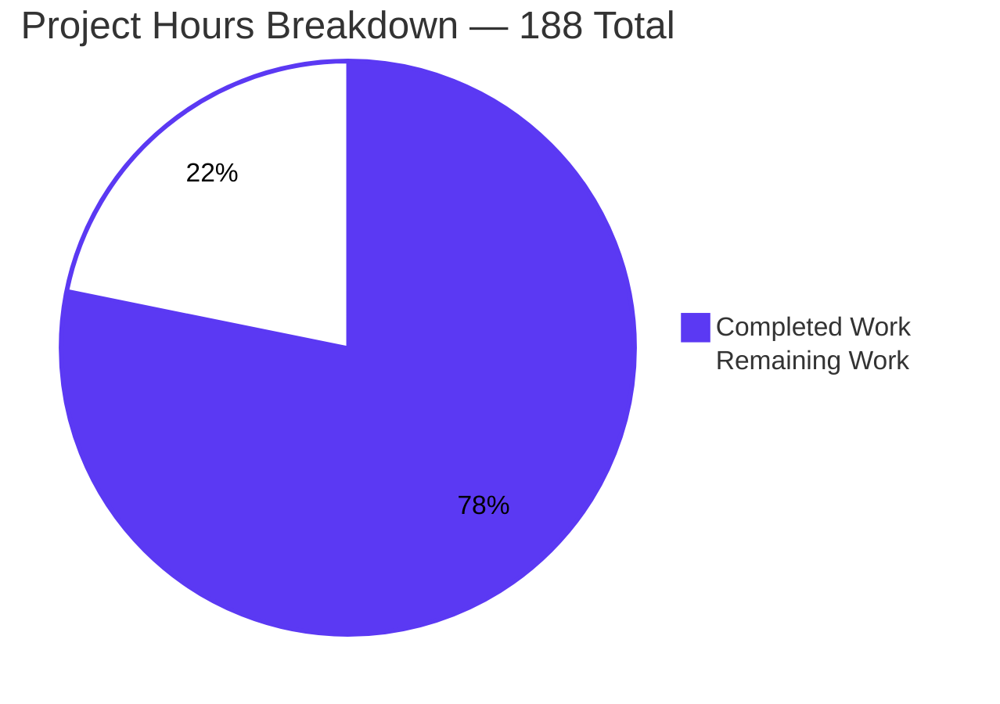
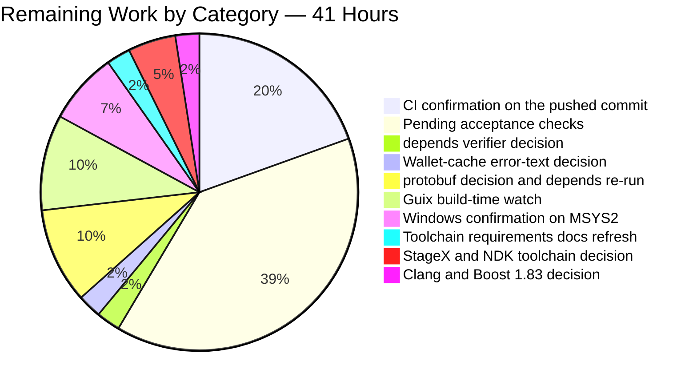
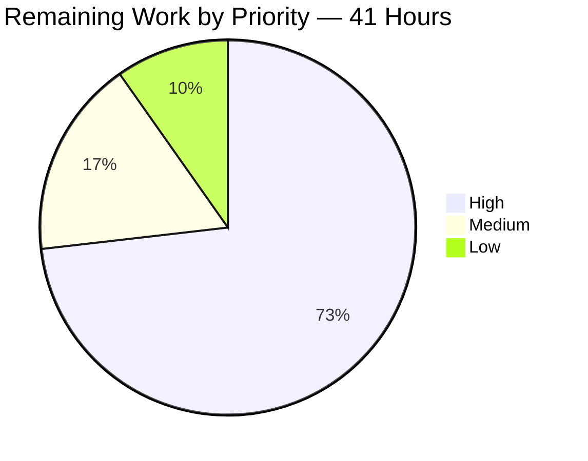

# 1. Executive Summary

## 1.1 Project Overview

Monero's first-party build (`src/`, `contrib/epee/`, `tests/`) moves from C++17 to C++23: `CMAKE_CXX_STANDARD 23` with `CMAKE_CXX_STANDARD_REQUIRED ON` and `CMAKE_CXX_EXTENSIONS OFF`, a CMake 3.20 minimum, GCC 14.2 as the primary and Clang 19 as the secondary compiler. Configure enforces the compiler floors, every construct C++23 rejects or deprecates is fixed at its call site, and the CI images, the `contrib/depends` cross builds and the Guix release toolchain move to GCC 14.2. Measured on `ad0dbd181`, consensus, wire, on-disk and RPC behaviour were shown identical against the same commit built as C++17; QA testing of `9648c8300` found one error path that differs, the `open_wallet` error text for a corrupted wallet cache (Section 5.2, open acceptance blocker 4); the certificate-pin lookup's earlier-pass test, restored at review remediation, passed in both twins of A and C at the review-remediation check; its acceptance is pending (Section 3.5; human-finish item 9 (a) and (g)); acceptance of the final revision is pending (Section 3). Section 5.3 is a runbook for confirming the Windows build. The audience is the maintainers and packagers who release the daemon, wallets and RPC servers.

## 1.2 Completion Status


```mermaid
%%{init: {"theme": "base", "themeVariables": {"pie1": "#5B39F3", "pie2": "#FFFFFF", "pieOpacity": "1", "pieStrokeColor": "#5B39F3", "pieOuterStrokeColor": "#5B39F3", "pieSectionTextColor": "#000000"}}}%%
pie title Project Completion — 78.2% Complete
    "Completed Work" : 147
    "Remaining Work" : 41
```

Colour key: Completed = Dark Blue `#5B39F3` · Remaining = White `#FFFFFF`.

| Metric | Value |
|---|---|
| Total Hours | 188 |
| Completed Hours (AI + Manual) | 147 |
| Remaining Hours | 41 |
| Percent Complete | 78.2% |

Calculation: 147 / (147 + 41) = **78.2%**.

## 1.3 Key Accomplishments

- ✅ Every first-party C++ translation unit compiles as C++23: all 272 first-party C++ compile-database entries (132 under `src/`, 112 under `tests/`, 28 under `contrib/epee/`) carry `-std=c++23`; vendored C++11 and C11 units are untouched
- ✅ Configurations A-E build with zero errors on GCC 14.2 and Clang 19, Release and Debug; A and E (GCC) show **zero new census keys** against their C++17 twins, while the zero-new-key results of B, C, D and E (Clang) are unverified until their census is recomputed with the corrected script (Section 3.3). A is accepted for `ad0dbd181`; C awaits that recomputation, E (GCC) its twin compile-database confirmation (Section 3.2), and B, D and E (Clang) both
- ✅ CMake 3.20.6 configures the tree with no policy warning; the link-test project now compiles at the root standard
- ✅ Configure refuses under-floor GCC, Clang and Apple Clang, `clang-cl` and unknown compilers; GCC 12.4.0 is refused, GCC 13.3.0 and Clang 16.0.6 accepted
- ✅ Test parity on both compilers: 22 of 22 CTest entries, 1309 unit-test identifiers, 19 live RPC scenarios and 165 of 165 consensus scenarios behave identically at both standards; the `REPORT:` and `Done,` log cross-checks are pending (Section 3.4)
- ✅ A database and a wallet written by the C++17 build open unchanged in the C++23 build; `wallet2_api.h` is unchanged
- ✅ depends CI on `debian:13` and Guix on a `gcc-14.2` variant give GCC 14.2.0 as native and target compiler; system Linux CI selects `gcc-14`
- ✅ The `depends.yml` `Win64` job, reproduced in `debian:13` with Debian's MinGW-w64 GCC 14 (posix), builds all 13 Windows executables with zero errors on `ad0dbd181`; the restored `isFat32` diagnostic (the user's `429a20174`) compiles with no diagnostic and `monerod.exe` links (review remediation, Section 5.3.9)

Every result above was measured on `ad0dbd181`, except the review-remediation Win64 check in the last item; acceptance for the final revision, which adds two build-script fixes, the CI workflow supply-chain hardening, two CMake comment corrections, the README build-requirements corrections and the earlier-pass edits restored at review remediation (Sections 5.4.2 and 5.4.4), is pending (Section 3; human-finish item 9 (g)).

## 1.4 Critical Unresolved Issues

| Issue | Impact | Owner | ETA |
|---|---|---|---|
| **Open acceptance blocker: protobuf 21.12 in the depends package builds.** Compiled at C++23 by its unmodified recipe, it adds 35 GCC `-Wdeprecated-enum-enum-conversion` keys (105 instances) in `google/protobuf/generated_message_tctable_impl.h`. Every remedy needs an authorization the request does not give (Section 5.2) | Criterion 3 is **not met for the depends package builds** (depends, Guix, Docker). Monero's own builds on those paths add nothing | Repository owner | Owner decision |
| **Six acceptance checks are pending** (human-finish item 9): every result was measured on `ad0dbd181`, and the acceptance run has not been repeated on the final revision; the certificate-pin lookup check the plan names, `ssl_handshake_fingerprint_lookup`, passed in both twins of A and C only at the review-remediation check, which kept no output in `<run>`; the B, D and E twins lack their compile-database confirmation; the depends twins share `native_protobuf`'s archive ID and must be rebuilt with distinct `BUILD_ID_SALT` values; the libc++ pass skipped three C++ entries; the `REPORT:` and `Done,` parity cross-checks were not run. The census of B, C, D, E (Clang) and the depends package builds must also be recomputed with the corrected census script (Section 3.3) | The affected results stand as measured but are not accepted, and final-candidate acceptance is pending | QA / repository owner | Before merge |
| **Open acceptance blocker: the depends verifier's C-recipe item.** The plan requires every C recipe's compile lines to carry `-std=c11`, but with the recipes unchanged `openssl`, `hidapi` and ncurses' two helpers cannot (Section 5.2, blocker 3) | No rebuild clears it, so the depends twins cannot be accepted; Monero's own builds are unaffected | Repository owner | Owner decision |
| **Open acceptance blocker: the C++23 build's error text for a corrupted wallet cache.** `open_wallet` returns "Failed to open wallet : std::bad_alloc" where the C++17 twin returns "Failed to open wallet : basic_string::_M_replace_aux", because libstdc++ 14's `std::string::max_size()` is 2^63 − 1 at C++23 and 2^62 − 1 at C++17. No source-edit trigger applies (Section 5.2, blocker 4) | The directive of no observable change to the daemon, wallet or RPC is **not met for this error path**. Only corrupted or hostile lengths reach it, in about one corrupted cache in four; the same change applies to every `std::string` growth to a length in [2^62, 2^63) in the tree. Successful opens and every format are identical | Repository owner | Owner decision (human-finish item 11) |
| CI has not run on the candidate: no GitHub Actions, Windows, macOS or Guix host is reachable | Native Windows (MSYS2) builds, tests and runtime, the `__APPLE__`, FreeBSD and Android paths, and the rolling toolchains are unconfirmed. Locally, only the Debian 13 MinGW-w64 cross build compiled the `_WIN32` code of the 13 Windows executables; it built no tests and ran nothing (Section 5.3.9) | Repository owner | 1 day after push |
| The Guix jobs must build GCC 14.2.0 from source, because no substitutes exist for the variant | A `build-guix` job may exceed the runner's time limit | Release engineer | First Guix run |
| The Windows-only log line at `src/daemon/main.cpp:118`, the user's retained `429a20174` edit, prints the path as UTF-8 where C++17 printed a pointer value, and `utf16_to_utf8` can throw `std::runtime_error` | One of the migration's two known observable differences (the other is open acceptance blocker 4), on an error branch a normal start does not reach; not yet confirmed on Windows | Platform maintainer | Owner confirmation (human-finish item 6) |

No frozen-directory regression was found (Section 5.2).

## 1.5 Access Issues

| System/Resource | Type of Access | Issue Description | Resolution Status | Owner |
|---|---|---|---|---|
| GitHub Actions | Workflow execution | Only GitHub can run `build.yml`, `depends.yml` and `guix.yml` | Open: resolves on the first push | Repository owner |
| Windows / MSYS2 UCRT64 host | Build and test environment | No Windows toolchain is reachable; the Windows build is covered here only by the Debian 13 MinGW-w64 cross build (Section 5.3.9) | Open: needs a Windows runner or machine | Platform maintainer |
| macOS / Xcode host | Build and test environment | No Apple toolchain is reachable, so the Apple Clang floor cannot be demonstrated | Open: needs a macOS runner | macOS maintainer |
| Guix host | Release build environment | No `guix` binary or daemon is available | Open: needs a Guix machine or the CI run | Release engineer |

Building, testing and running need no credentials, secrets or network services.

## 1.6 Recommended Next Steps

1. **[High]** Push the change set and confirm every job of `build.yml`, `depends.yml` and `guix.yml` on that commit (Section 3.6; runbook for Windows: Section 5.3).
2. **[High]** Repeat the acceptance run on the final revision and run the five other pending checks there (Section 8, item 9): the certificate-pin lookup in both twins of A and C, the B, D and E compile-database confirmations, the depends twins rebuilt with distinct `BUILD_ID_SALT` values, the libc++ pass over all 299 C++ entries, and the `REPORT:`/`Done,` parity cross-checks; and recompute the census of B, C, D, E (Clang) and the depends package builds with the corrected script (Section 3.3).
3. **[High]** Decide on protobuf 21.12's C++23 warnings in the depends package builds and on the depends verifier's C-recipe item (Section 5.2, blockers 1 and 3), then re-run the depends check; also decide on the C++23 build's error text for a corrupted wallet cache (Section 5.2, blocker 4).
4. **[Medium]** Watch the first Guix run's build time for the `gcc-14.2` variant.
5. **[Medium]** Confirm on MSYS2 the Windows FAT32 log line, which prints the path as UTF-8 through the user's retained `429a20174` edit and can throw `std::runtime_error`.
6. **[Low]** Decide on the StageX GCC 15.2.0 and Android NDK r27c, Clang 18.0.3 (r522817c) toolchains, and on the Clang + Boost 1.83 pairing.

The complete list is in Section 8, "Human-finish items".

# 2. Project Hours Breakdown

## 2.1 Completed Work Detail

| Component | Hours | Description |
|---|---|---|
| Dialect pins and build-system floors (earlier-pass design, re-landed in `1434574c4`) | 9 | `CMAKE_CXX_STANDARD 23`, `REQUIRED ON`, `EXTENSIONS OFF` (`CMakeLists.txt:136-138`), `CXX_STANDARD ?= c++23` (`contrib/depends/Makefile:12`), the Darwin value (`contrib/depends/toolchain.cmake.in:104`), and the policy consequence `LANGUAGE ASM` for `CryptonightR_template.S` (`src/crypto/CMakeLists.txt:99-103`) |
| Compiler-floor guard (earlier-pass design, re-landed) | 8 | Configure-time guard (`CMakeLists.txt:150-171`): under-floor GCC (also MinGW-w64), `clang-cl`, under-floor Clang, under-floor Apple Clang and any other compiler are refused, each naming the version found and `docs/COMPILING_DEBUGGING_TESTING.md`, "Toolchain requirements" |
| System CI images (earlier-pass design, re-landed in `03eb50eeb`) | 4 | `build-linux` on `debian:13` and `ubuntu:24.04`, with the real `libunwind-dev` package name |
| Compile-correctness substitutions (earlier-pass design, re-landed) | 12 | 225 `u8` prefixes removed across four files, every literal ASCII, with the 11 valid `u8` array initialisers and the `u8` character literals at `src/net/host.h:16-17` kept; `rct::identity()` qualified where `std::identity` became ambiguous |
| New-warning elimination at source (earlier-pass design, re-landed) | 20 | `std::is_pod` replaced by its definition in five headers; `expect<T>` storage as `alignas(T) unsigned char[sizeof(T)]`; five `[=, this]` captures; the volatile counter as plain assignment; the shared `fingerprint_less` comparator, whose comment was restored to the earlier pass's wording at review remediation |
| Windows verification runbook (earlier pass, reworked here) | 18 | Section 5.3: MSYS2 UCRT64 set-up matching CI, the landed fix and its rationale, the uniform triage table, native verification with a same-commit C++17 census, the `debian:13` `Win64` cross build, Guix, and pipeline confirmation |
| CMake 3.20 minimum, CMP0119 correction, `CMP0144` | 4 | `CMakeLists.txt:31` and `:279` at 3.20; the "CMP0119 needs 3.25" rationale corrected; `CMP0144` NEW (`:967-972`); configuration F under Kitware CMake 3.20.6 |
| Link-test standard forwarding and probe | 3 | `CMakeLists.txt:299-301`, following `cmake/CheckTrezor.cmake:110`; the `static_assert` probe at both standards and its negative control |
| System CI GCC 14.2 selection | 2 | `g++-14` in `APT_INSTALL_LINUX`; `CC: gcc-14`, `CXX: g++-14` in `build-linux` and `test-ubuntu` |
| depends CI on `debian:13` and a new cache bucket | 4 | Default container `debian:13`; RISCV64 and Win64 overrides removed; apt.llvm.org lines removed with `/usr/lib/llvm-19/bin` kept; `depends-cxx23-debian13-` key |
| Guix `gcc-14.2` variant | 6 | Package variant of the channel's `gcc-14`, its base32 hash derivation and patch dry run; `gcc-toolchain-14.2` for every native toolchain; `base-gcc` for the Linux and MinGW cross toolchains |
| README alignment | 2 | GCC 13, Clang 16 (Apple Clang 15), CMake 3.20 rows; enforced minimums and the GCC 14.2 / Clang 19 reference compilers in prose |
| Acceptance environment | 6 | Pinned apt set, checksummed rustup-init and CMake 3.20.6, pinned Python venv, pinned Boost 1.91.0-1 prefix, depends shim, `tools.txt` and `versions.txt` checks |
| Build matrix A-F with C++17 twins and census | 16 | Twelve twin builds (six pairs, A-E) and four F configures, the census tool and its per-pair diffs, the compile-database comparison for A and C |
| depends twins | 8 | Fresh per-standard package builds with host-salted IDs, the C++ and Boost dialect checks, the package census, and Monero built through each twin's toolchain |
| Test parity | 10 | The non-consensus tier on A and C twins with retained output, the per-case comparison, and reduced-iteration `core_tests` on GCC and Clang twins |
| Contract checks and build-file checks | 2 | `wallet2_api.h` and LMDB diffs, the contract suites, both build-file searches with positive controls |
| Runtime, on-disk interchange and guard probes | 3 | Daemon, ZMQ and wallet-RPC smoke on both twins; C++17-written database and wallet opened by the C++23 build; GCC 12, GCC 13 and Clang 16 guard probes |
| Win64 cross build in `debian:13` | 3 | The `depends.yml` `Win64` job reproduced on the candidate: posix MinGW-w64 toolchain, Rust target, `make depends target=x86_64-w64-mingw32`, artefact inspection |
| libc++ syntax pass | 1 | Clang 19 against libc++ 19 headers over 296 of configuration C's 299 C++ translation units, every first-party one included |
| Project Guide rewrite | 6 | This guide, rebuilt on this run's evidence |
| **Total** | **147** | |

**What is not counted.** The earlier pass (`8fe8e4965` to `861efbceb`) was reverted by `f7c9079e7`. Its work that this execution re-landed, or whose result this guide uses, is counted above, in the six rows marked "earlier-pass". The rest, 145 of its 216 hours, is not: work reverted and not re-landed (the Boost-to-std evaluation, commit justification lines), work restored unchanged from `861efbceb` at review remediation (the documentation and Brewfile changes, Section 5.4.4; the `throw()` conversions, the `tx_extra` predicate rewrite, the TLS fingerprint test, Section 5.4.2), and measurements of a superseded tree (acceptance builds, census, invariance proofs, residual checks, test tiers, release-path exercises). This run's own measurements replace the latter. The restorations' own hours are not re-counted, so the completed hours in Sections 1.2, 2, 7 and 8 stand as estimated before them; the remaining hours include the 1 h refresh of the restored docs section (human-finish item 5).

## 2.2 Remaining Work Detail

| Category | Hours | Priority |
|---|---|---|
| Push the change set and check every workflow on that commit: all `build.yml` jobs, the ten `depends.yml` hosts, `guix.yml` with its eight targets and `bundle-logs`, and the push-event full-iteration `core_tests` (human-finish item 1) | 8 | High |
| Decide on protobuf 21.12's C++23 warnings in the depends package builds, then re-run the depends twins with distinct `BUILD_ID_SALT` values (item 2) | 4 | High |
| Run the six pending acceptance checks: the acceptance run repeated on the final revision (6), the certificate-pin lookup in both twins of A and C, re-run with the final-revision run (3), the B, D and E compile-database confirmations (2), the depends twins rebuilt with distinct `BUILD_ID_SALT` values and re-censused (3), the libc++ pass over all 299 C++ entries (1), and the `REPORT:`/`Done,` parity cross-checks (1); and recompute the census of B, C, D, E (Clang) and the depends package builds from the retained logs (0) (item 9) | 16 | High |
| Decide on the depends verifier's C-recipe item, open acceptance blocker 3 (item 10) | 1 | High |
| Decide on the C++23 build's error text for a corrupted wallet cache, open acceptance blocker 4 (item 11) | 1 | High |
| Watch the Guix build time for the `gcc-14.2` variant; reproduce a timed-out job on a self-hosted Guix machine (item 4) | 4 | Medium |
| Confirm the Windows build and the `isFat32` log line on MSYS2 UCRT64, including its error branch, which prints the path as text through the user's retained `429a20174` edit and can throw `std::runtime_error` (item 6) | 3 | Medium |
| Refresh the stale CMake 3.25 and toolchain statements of the restored "Toolchain requirements" section, `docs/COMPILING_DEBUGGING_TESTING.md:40`, `:49-56`, `:62`, `:78` and `:88` (item 5) | 1 | Low |
| Decide on StageX GCC 15.2.0 in the `Dockerfile` and Android NDK r27c, Clang 18.0.3 (r522817c) (item 7) | 2 | Low |
| Decide on the Clang 19 + system Boost 1.83 pairing (item 8) | 1 | Low |
| **Total** | **41** | |

Every row is a human-finish item from Section 8; item 3 carries no hours, because no frozen-directory regression was found, and of the two files item 5 names only the docs file needs a refresh. Item 9's census recomputation only re-reads the retained `<run>/logs` build logs with the corrected script (no rebuild). Confidence is high on the completed rows, all of which have evidence in Sections 3 and 4, and medium on the remaining rows, which depend on CI, on owner decisions and on the pending acceptance checks.

# 3. Test Results and Acceptance Evidence

Every figure in this section comes from this execution's own acceptance run, which measured commit `ad0dbd181`, except the review-remediation check in the next paragraph. The final tree is `ad0dbd181` plus changes that answer review findings: two fixes of pre-existing build-script defects, in `CMakeLists.txt` and `contrib/guix/manifest.scm`; the CI workflow supply-chain hardening of `.github/workflows/build.yml` and `depends.yml`; two comment corrections, at `CMakeLists.txt:132` and `:845`; the README build-requirements corrections at `README.md:138`, `:142`, `:145`, the GTest Purpose cell `:154` and the pairing-matrix sentence `:176-180`; the earlier pass's build and documentation edits, restored verbatim from `861efbceb` in answer to review finding R3 (legacy retention): in `CMakeLists.txt` the Ninja job-pool condition (`:102`), the ARMv8 `check_cxx_compiler_flag` probe (`:762`) and the guard's `docs/COMPILING_DEBUGGING_TESTING.md` references (`:140-171`), that docs file's "Toolchain requirements" section, and the README, `contrib/brew/Brewfile` and `src/device_trezor/README.md` content (all Section 5.4.4); the earlier-pass source and test edits restored at review remediation (Section 5.4.2); and this guide. `cmake/CheckTrezor.cmake` is the same as at `ad0dbd181` (Section 5.4.4). No acceptance run was made on the final revision, so every acceptance figure here is a measurement of `ad0dbd181`: it stands as measured but is not accepted for the final revision, whose acceptance is **pending** (human-finish item 9 (g)). While this guide was revised, before the review-remediation restorations, the final tree with every other change above and an `ad0dbd181` copy were configured with the options of A and of E, configure only, and compared with the Section 3.2 script, the final tree as `CAND_*` and the copy as `BASE_*`: configuration A 407/407 entries, E 453/453, 0 differences, and both E logs print "Trezor: support enabled"; the generated version tag, which carries the commit ID, differs by construction. That comparison kept no output in `<run>`; rerunning the script reproduces it. It is not acceptance evidence: it covers no build, test or runtime run, and of the configure code the fixes change it reaches only the paths a successful A or E configure takes; the failure branches of `check_submodule()`, and the IOS include, are not reached. The build and documentation restoration came later and was compared on its own, also configure only and likewise not acceptance evidence: with A's options, the final tree and a copy carrying the pre-restoration `CMakeLists.txt` gave identical configure logs apart from the elapsed time, identical `CMakeCache.txt` files and identical compile databases (407/407 entries, 0 differences), and a GCC 12.4.0 configure stops at `CMakeLists.txt:153` with the restored docs reference; that comparison kept no output in `<run>` either. The build-script fixes touch no C or C++ source; the comment corrections change only CMake comment lines; the hardening changes only the two workflow files and the README corrections only `README.md`, none of which is an input of the local acceptance builds (the Section 3.3 build-file search over `.github/workflows` still prints nothing). The build and documentation restoration touches no C or C++ source either: in `CMakeLists.txt` it drops a `CMAKE_VERSION` test that is always true at the 3.20 minimum, swaps the flag-probe module of a branch only ARMv8 builds reach and changes the guard's message text and comment; its other files are documentation and `contrib/brew/Brewfile`, which no build reads. Each figure names its log, census or result file under `<run>`, the acceptance work directory on the execution host. `<run>` lies outside the repository and is not committed; every file in it is reproduced by the commands given here and in Appendix A. Results reported by the earlier pass at `8fe8e4965` are superseded and not repeated. A check this execution did not record is marked **pending** where it is described, and listed in human-finish item 9; the result it qualifies stands as measured but is not accepted until the check passes.

**Review-remediation check of the restored earlier-pass edits.** After the acceptance run, review remediation restored nine source and test files byte-identical to `861efbceb` (`git diff 861efbceb -- <file>` is empty for each; Section 5.4.2), so the acceptance run did not measure them. They were checked on the working tree based on `7754cbc3b`, in candidate builds A and C and their C++17 twins (each twin a `cp -a` copy of that tree with only `CMakeLists.txt:136` set to 17), configured with the options of A and C. That tree did not yet hold the build and documentation restoration of Section 5.4.4, whose configure comparison above found A's compile database unchanged. It is not the repeated acceptance run (human-finish item 9 (g)) and kept no output in `<run>`:

- **GCC 14.2 Release, `all`:** 465/465 in twin and candidate, 0 errors; 18 warnings in the twin and 15 in the candidate, 0 new keys. The only key whose count differs is libstdc++'s `typeinfo:205` `-Wstring-compare`: 9 in the twin and 6 in the candidate, where the candidate before the restoration had 10 (19 warnings in all), as the plan expects of the restored `tx_extra` predicate (Section 5.4.2).
- **Clang 19 Release, `all`:** 0 errors; 525 warnings in the twin and 486 in the candidate, 0 new keys. The only baseline-only keys are Clang's `-Wc++20-extensions` for `[=, this]`, and the candidate's keys equal those of the tree before the restoration.
- **`unit_tests`** in all four builds (`DNS_PUBLIC=tcp`, `--data-dir <build>/tests/data`): 1310 identifiers in 160 suites, 1308 passed, 2 skipped (`is_hdd.rotational_drive`, `is_hdd.ssd`), 0 failed, and 0 regressions per case from twin to candidate on either compiler. The restored `test_epee_connection.ssl_handshake_fingerprint_lookup` passed in all four (Section 3.5).
- **`tx_extra` and consensus:** `sort_tx_extra`, `parse_tx_extra`, `parse_and_validate_tx_extra` and `remove_field_from_tx_extra` 24/24 on GCC and on Clang; reduced-iteration `core_tests` (`CFLAGS=-DMONERO_CRYPTO_SLOW_HASH_ITER=20`, GCC) 165 `#TEST# Succeeded`, 0 failed.
- **Trezor:** with `USE_DEVICE_TREZOR=ON` and `USE_DEVICE_TREZOR_MANDATORY=ON`, the `device_trezor` target, which compiles the restored `exceptions.hpp`, builds 196/196 with 0 errors on GCC and on Clang; Clang's warnings equal those of a control build with the two `throw()` specifications.
- **Win64:** Section 5.3.9. **Runtime:** the Section 4 smoke sequence (testnet offline `monerod` and `monero-wallet-rpc`, digest authentication 401/401/200, `create_wallet`, `get_address`, `get_height` 1, ZMQ `get_height`) passed on the GCC candidate.

| Area / Category | Framework | Tests | Passed | Failed | Coverage | What This Proves |
|---|---|---|---|---|---|---|
| Non-consensus tier, GCC 14.2 (A) and Clang 19 (C), each twin | CTest (`-E core_tests`) | 22 entries × 4 runs | 22 in every run | 0 | Every registered suite except `core_tests`; `<run>/runs/{cand,base}-{A,C}/ctest.xml` | The C++23 candidate passes everything its C++17 twin passes, on both compilers |
| Unit estate | gtest `unit_tests` | 1309 identifiers in 160 suites, × 4 runs | 1307 in every run | 0 | 2 identical skips (`is_hdd.rotational_drive`, `is_hdd.ssd`); `<run>/runs/*/gtest/unit_tests.xml` | No case changes status between the standards |
| Live RPC scenarios | `functional_tests_rpc` | 19 × 4 runs | 19 in every run | 0 | Real `monerod` and `monero-wallet-rpc` on a deterministic chain; `<run>/runs/*/ctest-full.log`; the `Done,` cross-check and section scoping are pending (Section 3.4) | Daemon and wallet RPC behave identically at both standards |
| RPC method coverage | `check_missing_rpc_methods` | 1 × 4 runs | 4 | 0 | CTest status | Every RPC method is still exercised |
| Consensus regression | `core_tests` (reduced iterations) | 165 × 4 runs | 165 in every run | 0 | Every registered synthetic-blockchain scenario, GCC and Clang twins, `MONERO_CRYPTO_SLOW_HASH_ITER=20`; `<run>/runs/{cand,base}-core-{gcc,clang}/core-full.log`; the `REPORT:` cross-check is pending (Section 3.4) | Block and transaction validation behave identically at both standards |
| Build matrix A-E with C++17 twins | Ninja + census | 6 pairs (A, B, C, D, E on GCC, E on Clang) | 6 | 0 | Zero errors in every pair; zero new census keys in A and E (GCC); the census of B, C, D and E (Clang) is unverified, pending recomputation (Section 3.3); the twin compile-database confirmation is recorded for A and C, and pending for B, D and both E pairs (Section 3.2) | Criterion 2, and criterion 3 for Monero's own builds: accepted for A at `ad0dbd181`, pending for B, C, D and E; final revision pending |
| depends package builds | Census | 11 packages × 2 twins | Built | — | 35 new keys in protobuf 21.12; whether any other package adds one is unverified, pending recomputation (Section 3.3); the twins share `native_protobuf`'s archive ID, so they are not accepted until rebuilt with distinct `BUILD_ID_SALT` values, and the verifier's C-recipe item cannot pass with the recipes unchanged (Section 3.3; Section 5.2, blocker 3) | Criterion 3 **not met** for the package builds: open blocker (Section 5.2) |

## 3.1 Acceptance environment

One dedicated Ubuntu 24.04 environment, the image `monero-cxx23-acc:noble`, started as a fresh private container for every step, so `ACC_ENV=/opt/monero-cxx23-acc` is recreated per run. `env.sh` exports `ACC_ENV`, `RUSTUP_HOME=$ACC_ENV/rustup`, `CARGO_HOME=$ACC_ENV/cargo`, `PATH=$CARGO_HOME/bin:/usr/sbin:/usr/bin:/sbin:/bin`, `PYTHONNOUSERSITE=1` and `DEBIAN_FRONTEND=noninteractive`. Section 9 gives the bootstrap commands.

| Tool | Version (from `$ACC_ENV/tools.txt` and `$ACC_ENV/versions.txt`) | How it stays selected |
|---|---|---|
| GCC | `gcc-14`/`g++-14` 14.2.0-4ubuntu2~24.04.1 | `CC`/`CXX` on every configure; the depends check alone uses `$ACC_ENV/shim` |
| Clang | `clang-19` 1:19.1.1-1ubuntu1~24.04.2, with libstdc++ 14 | `CC`/`CXX` on every configure |
| CMake | `cmake` 3.28.3-1build7 at `/usr/bin/cmake`; Kitware 3.20.6 at `$ACC_ENV/cmake-3.20.6` (sha256 `458777097903b0f35a0452266b923f0a2f5b62fe331e636e2dcc4b636b768e36`) | Called by full path |
| Ninja | `ninja-build` 1.11.1-2 | `-G Ninja -D CMAKE_MAKE_PROGRAM=/usr/bin/ninja` |
| Rust | 1.93.1 from `rustup-init` 1.29.0 (sha256 `4acc9acc76d5079515b46346a485974457b5a79893cfb01112423c89aeb5aa10`) | `$CARGO_HOME/bin` first on `PATH` |
| Python | 3.12.3-0ubuntu2.1; venv `$ACC_ENV/venv` with exactly `$ACC_ENV/requirements.txt` (`certifi==2026.7.22`, `charset-normalizer==3.5.2`, `deepdiff==6.7.1`, `idna==3.20`, `monotonic==1.6`, `ordered-set==4.1.0`, `psutil==7.2.2`, `pyzmq==25.1.2`, `requests==2.33.1`, `urllib3==2.8.0`) plus `pip==24.0` | `-D Python3_EXECUTABLE=$ACC_ENV/venv/bin/python3` |
| Boost | 1.91.0-1 in `$ACC_ENV/boost-1.91.0-1`, built from the depends recipe's tarball and patch with `g++-14 -std=c++23` | The `BOOST` options (Section 9) |
| Other libraries | Ubuntu 24.04 packages pinned in `versions.txt`: `libboost-all-dev` 1.83.0.1ubuntu2 (present, not used), `libprotobuf-dev`/`protobuf-compiler` 3.21.12-8.2ubuntu0.3, OpenSSL 3.0.13, libzmq 4.3.5, libunbound 1.19.2, libsodium 1.0.18, libunwind 1.6.2, readline 8.2, hidapi 0.14.0, libusb 1.0.27 | Found by CMake from `/usr` |
| depends shim | `$ACC_ENV/shim`: `gcc`/`cc` → `gcc-14`, `g++`/`c++` → `g++-14` | First on `PATH` for the depends check only |

The compiler cache is off in every acceptance build (`-D COMPILER_CACHE=none`), so every diagnostic comes from a real compile. Each step ran in its own container, so the fixed-port test suites never shared a network namespace.

- **Clean-state check** (the image's `$ACC_ENV/logs/dpkg-verify-raw.txt` and `$ACC_ENV/logs/dpkg-verify.txt`). `dpkg -V` over the 23 pinned-set packages plus `python3-pip-whl` and `python3-setuptools-whl` reported 798 lines, every one `missing`: 647 under `/usr/share/doc/`, none of them a `copyright` or `changelog.*` file, and 151 under `/usr/share/man/`. All lie inside the minimized-image exclusions, so the filtered `dpkg-verify.txt` is empty and no package was reinstalled. A fresh container re-running `dpkg -V` over the same 25 packages exited 0 and reproduced the raw log byte for byte.
- **Versions** (`$ACC_ENV/versions.txt`). All 22 pinned packages are at their pinned versions, and `ca-certificates`, which is unpinned, is at 20260601~24.04.1. Every pin was still published, so no substitute was needed or recorded.

## 3.2 Source copies and twin identity

- `cand` is a `cp -a` copy of the candidate checkout; `base` is a `cp -a` copy of `cand` with only `CMakeLists.txt:136` set to `set(CMAKE_CXX_STANDARD 17)`, never committed. Both keep `.git`.
- `diff -r -q --exclude=.git cand base` lists only `CMakeLists.txt`, and the diff is line 136 alone.
- Both print `git rev-parse --short=9 HEAD` = `ad0dbd181` and the same `git submodule status`.
- In every pair the two generated `version.cpp` files are identical (`DEF_MONERO_VERSION_TAG "ad0dbd181"`, version `0.18.1.0`).
- In A and C the 407 compile-database entries differ only in `-std=` and in the copy and build roots (0 other differences). For B, D, E (GCC) and E (Clang) this execution recorded no comparison output, so their confirmation is **pending** (human-finish item 9): those four pairs' census results (Section 3.3) stand as measured but are not accepted until it passes. The comparison after this list replays it for one pair; the E pairs use their own Trezor copies (`candE-gcc`/`baseE-gcc`, `candE-clang`/`baseE-clang`), whose in-tree generated Trezor messages normalise under `<src>/`.
- Trezor-enabled builds used their own copies: `candE-gcc`, `baseE-gcc`, `candE-clang`, `baseE-clang`, `candF-gcc`, `candF-clang`, and `depsrc-c23`/`depsrc-c17` for the depends-built Monero.

**Compile-database comparison.** Set `CAND_SRC`, `CAND_BUILD`, `BASE_SRC` and `BASE_BUILD` to one pair's two source copies and two build directories, then run the script below. It maps each build and source root, as given and as resolved, longest first, to `<build>` or `<src>` in `directory`, `file`, `output` and `command`. A root matches only before `/`, a separator or the end, so `cand` never matches inside `candE-gcc`. It replaces every `-std=` token with `-std=<std>` and keys the entries by normalised file and output. It prints both entry counts and the number of other differences, which must be 0; otherwise it lists each differing entry and exits 1.

```bash
python3 - "${CAND_SRC:?}" "${CAND_BUILD:?}" "${BASE_SRC:?}" "${BASE_BUILD:?}" <<'EOF'
import json, os, re, sys
def load(src, build):
    roots = sorted({(r, tag) for root, tag in ((build, '<build>'), (src, '<src>'))
                    for r in (os.path.abspath(root), os.path.realpath(root))},
                   key=lambda t: (-len(t[0]), t[1]))
    subs = [(re.compile(re.escape(r) + r'(?=[/\s"\'=:;,]|$)'), tag) for r, tag in roots]
    def norm(s):
        for rx, tag in subs:
            s = rx.sub(tag, s)
        return s
    entries = json.load(open(os.path.join(build, 'compile_commands.json')))
    db = {}
    for e in entries:
        cmd = re.sub(r'(?<!\S)-std=\S+', '-std=<std>', norm(e.get('command') or ' '.join(e['arguments'])))
        key = (norm(os.path.join(e['directory'], e['file'])), norm(e.get('output', '')))
        db.setdefault(key, []).append((norm(e['directory']), cmd))
    return len(entries), db
(nc, cand), (nb, base) = load(sys.argv[1], sys.argv[2]), load(sys.argv[3], sys.argv[4])
diff = sorted(k for k in cand.keys() | base.keys() if sorted(cand.get(k, [])) != sorted(base.get(k, [])))
print(f'entries: cand {nc}, base {nb}; other differences: {len(diff)}')
for k in diff:
    print('DIFF', k, '\n  cand:', cand.get(k), '\n  base:', base.get(k))
sys.exit(1 if diff else 0)
EOF
```

## 3.3 Build matrix, census and build-file checks

**Census.** Each build log becomes a multiset of keys: `(flag, file:line)` for every located warning, `(LINK/DRIVER, message)` for linker and driver warnings. Before keying, the source-copy root becomes `<src>/`, the build directory `<build>/`, the Boost prefix `<boost>/`, the depends prefix `<depends>/`, and each depends work directory `<pkg:name>/`. Each key carries a provenance class (repository, vendored, submodule, generated, dependency, toolchain, link/driver) for routing only. A key is **new** when its candidate count exceeds its baseline count; criterion 3 passes only with zero new keys of any class. The census files under `<run>/census/` predate the corrected comparison script of Section 5.3.8, Step 5.5. The script this guide printed before collapsed object and library names inside linker and driver messages, and did not attribute relative names in package logs to their package; B's row shows the collapse. The rows that depend on such keys are marked below as pending recomputation.

| Id | Compiler and type | Steps (cand / base) | Errors | Warnings, baseline → candidate (instances / keys) | New keys | Logs and census |
|---|---|---|---|---|---|---|
| A | GCC 14.2, Release | 465/465 / 465/465 | 0 | 23 / 6 → 19 / 5 | 0 | `<run>/logs/build-{cand,base}-A.log`, `<run>/census/diff-A.txt` |
| B | GCC 14.2, Debug | 474/474 / 474/474 | 0 | 3 / 1 → 3 / 1 | 0 | `<run>/logs/build-{cand,base}-B.log`, `<run>/census/diff-B.txt` |
| C | Clang 19, Release | 465/465 / 465/465 | 0 | 525 / 28 → 486 / 23 | 0 | `<run>/logs/build-{cand,base}-C.log`, `<run>/census/diff-C.txt` |
| D | Clang 19, Debug | 474/474 / 474/474 | 0 | 436 / 21 → 396 / 16 | 0 | `<run>/logs/build-{cand,base}-D.log`, `<run>/census/diff-D.txt` |
| E (GCC) | GCC 14.2, Release, CI option set | 541/541 / 541/541 | 0 | 23 / 6 → 19 / 5 | 0 | `<run>/logs/build-{candE,baseE}-gcc-E.log`, `<run>/census/diff-E-gcc.txt` |
| E (Clang) | Clang 19, Release, CI option set | 541/541 / 541/541 | 0 | 647 / 31 → 592 / 26 | 0 | `<run>/logs/build-{candE,baseE}-clang-E.log`, `<run>/census/diff-E-clang.txt` |
| depends Monero | GCC 14.2 through each twin's `toolchain.cmake`, Trezor on | 305/305 / 305/305 | 0 | 23 / 6 → 19 / 5 | 0 | `<run>/logs/build-depmon-{c23,c17}.log`, `<run>/census/diff-depmon.txt` |
| depends packages | 11 packages, native and target GCC 14.2 | `make` rc 0 / rc 0 | 0 | 50 / 34 → 155 / 69 | **35** (protobuf) | `<run>/logs/depends-{c23,c17}.log`, `<run>/census/diff-depends-pkg.txt` |

- **Pending recomputation (unverified).** For B, C, D and E (Clang), the instance and key counts, the zero in "New keys" and their baseline-only and remaining keys below are unverified: their `ld` notes and Clang driver `-Wunused-command-line-argument` warnings were keyed with object and library names collapsed, which can merge distinct keys and hide a new one (B's "3 / 1" is three `ld` notes naming three different objects). For the depends packages, the 35 protobuf new keys stand, because merging keys can hide a new key but never create one; "no new key in any other package" is unverified, because a census without package attribution merges equal relative names and `libtool` and `make` diagnostics from different packages. A, E (GCC) and the depends Monero pair are unaffected: every key they hold is located (`typeinfo:205`, `stl_vector.h:105`, `:106` and `:116`, `bits/stdlib.h:146`, `tree-hash.c:89`). Recomputation re-reads the retained `<run>/logs` build logs with the corrected script; no rebuild is needed (Section 8, human-finish item 9).
- **E** enables Trezor ("Trezor: support enabled" in all four configures), builds the 18 fuzz harnesses and `libwallet_api_tests`, and compiles the generated Trezor `*.pb.cc` messages.
- **Baseline-only keys** are exactly the expected ones: in C, D and E on Clang, Clang's `-Wc++20-extensions` for `[=, this]` under C++17 at `abstract_tcp_server2.inl:2059`, `wallet_rpc_server.cpp:224`, `clt.cpp:90, 150` and `srv.cpp:194`; in A, E on GCC and the depends Monero pair, libstdc++'s `typeinfo:205` `-Wstring-compare` (13 → 10) and `stl_vector.h:116` `-Wmaybe-uninitialized` (1 → 0).
- **Remaining candidate keys** are pre-existing at both standards: in A, libstdc++ `stl_vector.h:105-106` and `typeinfo:205`, glibc `bits/stdlib.h:146` (reached from `external/easylogging++`) and the C source `src/crypto/tree-hash.c:89`; in C, rapidjson and gtest `-Wnan-infinity-disabled`, `src/fcmp_pp/curve_trees.cpp:154` `-Wunneeded-internal-declaration`, and 15 driver `-Wunused-command-line-argument` keys; in B and D, three `ld` executable-stack notes, one per assembler object (randomx's `jit_compiler_x86_static.S.o`, `obj_cncrypto`'s `CryptonightR_template.S.o` and supercop's `fe25519_sub.s.o`), which the `<run>` census merged into one key.
- **Acceptance of B, D and the two E pairs** waits on their compile-database confirmation (Section 3.2); their census rows above are measured results, not yet accepted.
- **F, the CMake floor.** Kitware CMake 3.20.6, configure only (`<run>/logs/cfg-F-{A,E}-{gcc,clang}.log`): exit 0 for GCC 14.2 and Clang 19 with A's options and with E's options; no `Policy CMP` line and no `CMake Error` in any of the four; `-- CMake version 3.20.6`, `Found Boost Version: 1.91.0`, and `Trezor: support enabled` in both E-option logs. Each prints the one benign "Manually-specified variables were not used" warning (Section 9). The F compile databases hold 407 entries: GCC `-std=c++23` × 275, Clang `-std=c++2b` × 275.
- **Guard probes** (`<run>/logs/cfg-guard-{gcc12,gcc13,clang16}.log`): GCC 12.4.0 is refused with exit 1, "GCC 12.4.0 is too old; GCC 13 or newer is required for C++23" (`CMakeLists.txt:153`), whose reference at `ad0dbd181` named the README's Dependencies section; the final tree's guard, restored after review, names `docs/COMPILING_DEBUGGING_TESTING.md`, "Toolchain requirements" instead (Section 5.4.4); GCC 13.3.0 and Clang 16.0.6 (with the libstdc++ 13 headers) configure with exit 0.
- **Link-test standard probe** (`<run>/logs/cfg-probe*.log`). In scratch copies, the generated source at `CMakeLists.txt:282` was prefixed with `static_assert(__cplusplus == 202302L);` (`201703L` in the C++17 twin) and configured with A's options:

  | Copy | Compiler and CMake | Result |
  |---|---|---|
  | Candidate, forwarding present | GCC 14.2, CMake 3.28.3 | exit 0 |
  | Candidate, forwarding present | Clang 19, CMake 3.20.6 (`-std=c++2b`) | exit 0 |
  | C++17 twin, `201703L` | GCC 14.2 and Clang 19, CMake 3.28.3 | exit 0 |
  | Candidate with `CMakeLists.txt:299-301` removed | GCC 14.2, CMake 3.28.3 | exit 1: "Undefined symbols test failure: expect(TRUE), success(FALSE)" |

- **Compile database** (configurations A and C, `<run>/b/cand-{A,C}/compile_commands.json`): 407 entries, `-std=c++23` × 275, `-std=c11` × 79, `-std=c++11` × 24, none × 29. Every first-party C++ entry carries `-std=c++23`: 132 under `src/`, 112 under `tests/`, 28 under `contrib/epee/`; the other three C++23 entries are the generated `version.cpp` and the two gtest sources. `-std=c++11` appears only for `external/easylogging++` (1), `external/qrcodegen` (1) and `external/randomx` (22).
- **Build-file checks** (`<run>/logs/greps.log`). Both searches print nothing (exit 1):

  ```bash
  grep -rnE --include=CMakeLists.txt --include='*.cmake' --include='*.cmake.in' \
    -e '-std=(c|gnu)\+\+(17|14|11|1z|1y|0x)' -e 'CXX_STANDARD[ "]+(17|14|11)([^0-9]|$)' \
    CMakeLists.txt CMakeLists_IOS.txt cmake src contrib/epee tests
  grep -rnE -e '-std=(c|gnu)\+\+(17|14|11|1z|1y|0x)' -e 'CXX_STANDARD[ "?:=]+(c\+\+)?(17|14|11)([^0-9]|$)' \
    contrib/depends/Makefile contrib/depends/hosts contrib/depends/builders contrib/depends/packages \
    contrib/depends/toolchain.cmake.in contrib/guix .github/workflows
  ```

  As positive controls, the second command's patterns match `CXX_STANDARD ?= c++17` and `$(package)_cxxflags+=-std=c++17`, and do not match the hosts' `-std=$(CXX_STANDARD)`.
- **depends check.** Each standard needs its own clean copy of `contrib/depends`, because nothing in depends separates the two: a package's build ID holds only a salt and the compilers' `--version` output (`contrib/depends/Makefile:24-25, 100-116`), its recipe hash covers only the recipe, meta and patch files (`contrib/depends/funcs.mk:45-49`), and neither includes `CXX_STANDARD`. Its archive `built/<host>/<pkg>/<pkg>-<version>-<id>.tar.gz` (`funcs.mk:51-72`) therefore has the same name at both standards, and make reuses an existing archive without compiling (`funcs.mk:248-258`). This run used two fresh copies (`depends-c23` from `cand`, `depends-c17` from `base`) holding no `built/`, `work/`, `sources/` or `x86_64-linux-gnu/` prefix before the first `make` (a non-empty copy is deleted and copied again), with sources from the upstream tarballs, each checked against its recipe's sha256 (`funcs.mk:88-89`). Each was built with `$ACC_ENV/shim` first on `PATH` by `make HOST=x86_64-linux-gnu V=1 x86_64_linux_CC="gcc-14 -m64" x86_64_linux_CXX="g++-14 -m64" CXX_STANDARD=c++23 HOST_ID_SALT=std-c++23` (and `c++17`, `std-c++17`). The fresh-build and dialect verifier, item by item:
  - **Met:** each log shows `Configuring`, `Building` and `Caching` once for all eleven packages (`native_protobuf`, `boost`, `openssl`, `zeromq`, `unbound`, `sodium`, `protobuf`, `libusb`, `hidapi`, `ncurses`, `readline`).
  - **Not met:** every cached archive name under `built/x86_64-linux-gnu/` differs between the twins. The ten target packages' IDs differ (for example `protobuf-21.12-656746ae79a` against `protobuf-21.12-8f13add0df3`), but `native_protobuf` has the same ID, `64f1bce9bf6`, in both. Native packages have type `build` (`funcs.mk:278`), so their ID takes `BUILD_ID_SALT` and the native tools' versions (`Makefile:101-106`), never `HOST_ID_SALT` (`Makefile:108-113`), and both twins ran with `BUILD_ID_SALT` at its default `salt` (`Makefile:25`). Each log built `native_protobuf` fresh, so no archive was actually reused; a shared or restored cache would have handed one twin the other's.
  - **Met:** all 168 protobuf and 236 zeromq compile lines carry the twin's `-std=c++23` or `-std=c++17`, and Boost's `user-config.jam` line reads `<cxxflags>"-pipe -std=c++23` or `-std=c++17`.
  - **Not met**, with the recipes unchanged (`verify` item (iv), in the block below): the C recipes' dialect as the plan words it, "The C recipes carry `-std=c11`", that is, every C compile line of the seven C recipes (`openssl`, `unbound`, `sodium`, `libusb`, `hidapi`, `ncurses`, `readline`) carries `-std=c11`. Three recipes rule that out. The openssl recipe hands `Configure` only `AR`, `RANLIB` and `CC` (`contrib/depends/packages/openssl.mk:9`), so openssl's compile lines carry no `-std`. ncurses builds its `make_hash` and `make_keys` helpers with the unflagged build compiler (`--with-build-cc`, `packages/ncurses.mk:13`). hidapi's CMake build, run by a plain `$(MAKE)` (`packages/hidapi.mk:31`), echoes no compile line, only its `cmake` call's `CFLAGS` (`packages/hidapi.mk:27`, `funcs.mk:190-191`), and a recipe with no C compile line fails the item. No rebuild can clear it while the recipes stay unchanged: it is open acceptance blocker 3 (Section 5.2), which blocks acceptance of the depends twins until the owner decides. **Supplementary** (`verify` item (iv-s)): a recipe-aware check, which is evidence beside item (iv) and no substitute for it. The twin's C++ standard reaches the C++ recipes (items (ii) and (iii)), while the C recipes, which no twin varies, compile at C11 wherever they take the host `CFLAGS` (`-pipe -std=$(C_STANDARD)`, `contrib/depends/hosts/linux.mk:1`; `C_STANDARD ?= c11`, `Makefile:11`). Item (iv-s) checks exactly that: every C compile line of `unbound`, `sodium`, `libusb`, `readline` and `ncurses` ends its `-std` flags with `-std=c11`, except ncurses' `make_hash` and `make_keys` helpers, which carry no `-std`; every `openssl` compile line carries no `-std`, because its `Configure` receives no `CFLAGS`; and `hidapi` is checked on its `cmake` call's `CFLAGS`, which must carry `-std=c11`. Both items take the last `-std` of a line or of those `CFLAGS`, the one GCC applies; libusb's lines, for example, carry `-std=gnu11` before `-std=c11`. `C_STANDARD` is the same in both twins, so a passing item (iv-s) shows that the C lines compile identically at both standards. This run recorded neither item for its twins: both are pending, and `verify` on the retained logs (next item) reads them. A validation build of the C++23 twin, made while revising this guide and not acceptance evidence, failed item (iv) on exactly these three recipes, and `verify` as the block below writes it printed `OK` for item (iv-s) and every other item on its log.
  - **Pending** for this run's twins (`verify` item (v)): `native_protobuf`'s compile lines carry no `-std` (`contrib/depends/builders/default.mk:16-20`). Without rebuilding, and before the rerun deletes the copies, `verify <run>/logs/depends-c23.log 23 <run>/depends-c23` and `verify <run>/logs/depends-c17.log 17 <run>/depends-c17`, with `verify` defined and `$ACC_ENV/shim` first on `PATH` as in the block below, read items (i) to (vi), (iv-s) included, from the retained `V=1` logs.
  - **Met:** `command -v g++` is `$ACC_ENV/shim/g++`, its `--version` is 14.2.0, and `make print-build_CXX` prints `g++` (`<run>/logs/depends-{c23,c17}-tools.log`).
  - Monero, configured against each twin's `x86_64-linux-gnu/share/toolchain.cmake` in its own source copy, reports GNU 14.2.0, Boost 1.91.0 and "Trezor: support enabled", and builds 305/305 (table above). Its compile commands carry `-std=c++23` × 170 in the candidate and `-std=c++17` × 170 in the twin.

  **Rejection rule.** A twin that fails any item is not accepted, and a package's `config.log` is no evidence, because staging deletes its work directory (`funcs.mk:238-242`). In the rerun, `verify` (defined in the block) checks every item but the archive names, which the `comm` line checks: it takes one twin's `V=1` log, its standard and its depends copy, prints one `OK` or `FAIL` line per item with its counts, and exits non-zero on any `FAIL`. With the recipes unchanged it always reports `FAIL` on item (iv) and so always exits non-zero. It runs on both rerun logs before the Monero builds and censuses. A `FAIL` on any other item, (iv-s) included, deletes that twin for a rebuild from a new copy. The `FAIL` on item (iv) is open acceptance blocker 3 (Section 5.2), and no rebuild clears it, so the twins' censuses stand as measured and are not accepted until the owner decides. Under this rule these twins are **not accepted**. The package census (35 protobuf keys) and the depends-built Monero census (0 new keys) stand as measured; their acceptance waits on a rerun (human-finish item 9) in two new copies, recipes unchanged, with distinct `BUILD_ID_SALT` values as well as the host salts, since the prescribed command alone repeats the same native ID. The rerun runs from `<run>`, which holds `cand` and `base`; the Monero builds and both censuses are then repeated on the new twins:

  ```bash
  rm -rf depends-c23 depends-c17
  cp -a cand/contrib/depends depends-c23 && cp -a base/contrib/depends depends-c17
  ls -d depends-c{23,17}/{built,work,sources,x86_64-linux-gnu} 2>/dev/null   # must print nothing
  export PATH=$ACC_ENV/shim:$PATH
  for s in 23 17; do   # no-build ID check: the two IDs must differ
    make -s -C depends-c$s HOST=x86_64-linux-gnu x86_64_linux_CC="gcc-14 -m64" x86_64_linux_CXX="g++-14 -m64" \
      CXX_STANDARD=c++$s HOST_ID_SALT=std-c++$s BUILD_ID_SALT=std-c++$s print-native_protobuf_build_id
  done
  for s in 23 17; do   # package builds, complete V=1 output kept
    make -C depends-c$s HOST=x86_64-linux-gnu V=1 x86_64_linux_CC="gcc-14 -m64" x86_64_linux_CXX="g++-14 -m64" \
      CXX_STANDARD=c++$s HOST_ID_SALT=std-c++$s BUILD_ID_SALT=std-c++$s > logs/rerun-depends-c$s.log 2>&1
  done
  verify() {   # fresh-build and dialect verifier: $1 = one twin's V=1 log, $2 = 23 or 17, $3 = that twin's depends copy
    python3 - "$@" <<'PY'
  import os, re, shutil, subprocess, sys
  log, s, copy = (sys.argv[1:] + ["", "", ""])[:3]
  if s not in ("23", "17") or not os.path.isdir(copy): sys.exit("usage: verify <V=1 log> 23|17 <depends copy>")
  P = "native_protobuf boost openssl zeromq unbound sodium protobuf libusb hidapi ncurses readline".split()
  C7 = "openssl unbound sodium libusb hidapi ncurses readline".split()    # the seven C recipes
  C11 = "unbound sodium libusb readline".split()    # C recipes whose every C compile line takes the host CFLAGS
  mark = re.compile(r"(Extracting|Preprocessing|Configuring|Building|Staging|Postprocessing|Caching) (%s)\.\.\." % "|".join(P))
  cc = re.compile(r"\s*(?:libtool: compile: +|.*--mode=compile +)?(?:\S*/)?(gcc|g\+\+|cc|c\+\+)(?:-[0-9.]+)?\s")
  src = re.compile(r"\s(?:-c|\S+\.(?:c|cc|cpp|cxx))(?:\s|$)")    # -c, or a source operand: compile, not link
  mk = re.compile(r"\s(?:-o\s*(?:\S*/)?make_(?:hash|keys)|(?:\S*/)?make_(?:hash|keys)\.c)(?:\s|$)")    # ncurses' build-compiler helpers
  cmk = re.compile(r'\benv CC="[^"]*"\s+CFLAGS="([^"]*)".*\scmake\s')    # a cmake call and its CFLAGS (funcs.mk:190-195)
  def eff(flags): return (re.findall(r"(?:^|\s)-std=(\S+)", flags) or [None])[-1]    # effective = last -std= value, or None
  try: lines = open(log, errors="replace").read().splitlines()
  except OSError as e: sys.exit(f"FAIL log: {e}")
  seq, comp, jam, cfl, pkg = [], {p: [] for p in P}, [], [], None    # a line belongs to the package of the last marker
  for line in lines:
      m = mark.fullmatch(line)
      if m: seq.append(m.groups()); pkg = m[2]; continue
      m = cc.match(line)
      if pkg and m and src.search(line):    # (language, effective -std= value, ncurses helper)
          comp[pkg].append(("C++" if "+" in m[1] else "C", eff(line), bool(mk.search(line))))
      if pkg == "boost" and "user-config.jam" in line and "<cxxflags>" in line: jam.append(line)
      m = cmk.search(line)
      if m and pkg == "hidapi" and seq[-1][0] == "Configuring": cfl.append(eff(m[1]))    # hidapi's cmake call
  res = []
  def item(ok, text): res.append(bool(ok)); print("OK  " if ok else "FAIL", text)
  def stds(p, lang=None, helper=None):    # effective values of p's compile lines: one language or all; helpers only, none, or all
      return [w for l, w, h in comp[p] if lang in (None, l) and helper in (None, h)]
  def tally(groups):    # [(label, values, wanted)]: "<label> <good>/<total>"; ok only if every group has lines and all are good
      r = [(n, sum(w == want for w in v), len(v)) for n, v, want in groups]
      return all(t and g == t for n, g, t in r), ", ".join(f"{n} {g}/{t}" for n, g, t in r)
  def out(*cmd):
      try: return subprocess.run(cmd, capture_output=True, text=True).stdout
      except OSError: return ""
  runs = [p for i, (st, p) in enumerate(seq) if i == 0 or seq[i - 1][1] != p]
  bad = [p for p in P if [st for st, q in seq if q == p and st in ("Configuring", "Building", "Caching")]
         != ["Configuring", "Building", "Caching"]]
  item(not bad and sorted(runs) == sorted(P), f"(i) Configuring, Building, Caching once each, in order: {len(P) - len(bad)}/{len(P)} "
       f"packages, {len(runs)} sections" + (" (bad: %s)" % " ".join(bad) if bad else ""))
  ok, t = tally([(p, stds(p, "C++"), f"c++{s}") for p in ("protobuf", "zeromq")])
  item(ok, f"(ii) effective -std=c++{s} on C++ compile lines: {t}")
  good = [l for l in jam if re.search(r'<cxxflags>\\?"-pipe -std=c\+\+%s[\s\\"]' % s, l)]
  item(jam and len(good) == len(jam), f'(iii) boost user-config.jam <cxxflags>"-pipe -std=c++{s}: {len(good)}/{len(jam)}')
  ok, t = tally([(p, stds(p, "C"), "c11") for p in C7])    # the plan's item as worded; a recipe with no C compile line fails
  item(ok, f"(iv) effective -std=c11 on every C compile line of the seven C recipes: {t}")
  ok, t = tally([(p, stds(p, "C"), "c11") for p in C11] + [("ncurses", stds("ncurses", "C", False), "c11"),
                ("ncurses make_hash/make_keys", stds("ncurses", None, True), None), ("openssl", stds("openssl"), None),
                ("hidapi cmake CFLAGS", cfl, "c11")])    # supplementary and recipe-aware: evidence beside (iv), never in its place
  item(ok, f"(iv-s) supplementary, C recipes' effective -std as the recipes set it (c11; none for ncurses' helpers and openssl; "
       f"c11 in hidapi's cmake CFLAGS): {t}")
  n = stds("native_protobuf"); k = sum(w is None for w in n)
  item(n and k == len(n), f"(v) no -std= on native_protobuf compile lines: {k}/{len(n)}")
  b, w = out("make", "-s", "-C", copy, "print-build_CXX").strip(), shutil.which("g++") or ""
  v = (out("g++", "--version").splitlines() or [""])[0] if w else ""
  item(b == "g++" and w == os.environ.get("ACC_ENV", "") + "/shim/g++" and v.endswith(" 14.2.0"),
       f"(vi) print-build_CXX: {b!r}, command -v g++: {w!r}, g++ --version: {v!r}")
  sys.exit(0 if all(res) else 1)
  PY
  }
  for s in 23 17; do verify logs/rerun-depends-c$s.log $s depends-c$s; done   # (iv) always FAILs: blocker 3, no rebuild clears it; any other FAIL, (iv-s) included, rebuilds that twin
  comm -12 <(cd depends-c23/built/x86_64-linux-gnu && ls */*.tar.gz | sort) \
           <(cd depends-c17/built/x86_64-linux-gnu && ls */*.tar.gz | sort)   # must print nothing
  ```
- **libc++ pass** (`<run>/logs/libcxx-cand-C/`): Clang 19 `-fsyntax-only -stdlib=libc++ -nostdinc++ -isystem $ACC_ENV/libcxx-19/usr/lib/llvm-19/include/c++/v1` over configuration C's compile commands: 296 translation units, 0 failures. That is 296 of the database's 299 C++ entries: this execution's pass selected entries by path and skipped `external/easylogging++/easylogging++.cc`, `external/qrcodegen/QrCode.cpp` and the generated `version.cpp`, so those three have no libc++ check from this execution and are pending (human-finish item 9). It stands in for the libc++ toolchains of macOS, FreeBSD and Android, whose own versions only CI exercises.
  - *Selection.* Every `.cpp`, `.cc` or `.cxx` entry of `<C>/compile_commands.json`, with no path filter: in configuration C all 299 C++ entries, the 275 at `-std=c++23` and the 24 vendored ones of `external/easylogging++`, `external/qrcodegen` and `external/randomx` at `-std=c++11` (*Compile database* above). Each entry runs in its own `directory`, with `clang++-19` as the compiler, with its own flags, `-std=` included, without its `-o <object>`, and with the four flags above appended. This execution's 296 were the entries with a `src/`, `contrib/epee/` or `tests/` path component: the 272 first-party translation units (132 under `src/`, 112 under `tests/`, 28 under `contrib/epee/`), RandomX's 22 under `external/randomx/src/` and gtest's 2 under `external/gtest/googletest/src/`.
  - *When to repeat.* Only when a C or C++ source or header under `src/`, `contrib/epee/`, `tests/` or `external/` differs from the tree the last pass checked. That held for `ad0dbd181`; the final tree restores nine sources and headers at review remediation (Section 5.4.2), so the pass is repeated with the final-revision run (human-finish item 9 (g)). The planning passes checked upstream `454075bc6` built as C++23 and the earlier pass's merge `861efbceb`: against the first, `git diff --stat 454075bc6 ad0dbd181 -- src contrib/epee tests external` lists 19 files, 18 sources and headers plus `src/crypto/CMakeLists.txt`; against the second, 9 sources and headers differ at `ad0dbd181` and none in the final tree. `external/`, submodule pins included, is unchanged against both.
  - *Header root.* `libc++-19-dev` conflicts with `libunwind-dev` on Ubuntu 24.04, so `libc++-19-dev`, `libc++1-19`, `libc++abi-19-dev` and `libc++abi1-19`, at clang-19's version `1:19.1.1-1ubuntu1~24.04.2`, are unpacked with `dpkg-deb -x` into `$ACC_ENV/libcxx-19` and never installed. It is the environment's only libc++ 19 header tree, and `-nostdinc++` drops the compiler's own C++ include directories, so that root alone supplies the standard library. The acceptance image already holds it; the script below creates it only when it is absent.
  - *Replay*, after configuration C has built, so that its generated headers exist, with `C` set to its build directory, `RUN` to the run directory and `N` to the job count. The script prints `TUs <n> failed <m>`, where `n` is the number of C++ entries (299 for configuration C), writes every diagnostic to `libcxx-pass.log` in the log directory, and exits non-zero on any failure:

  ```bash
  LIBCXX_SH=$(mktemp)    # a new, empty file outside the checkout
  cat > "$LIBCXX_SH" <<'SH'
  # libc++ 19 syntax-only pass. Usage: bash <this file> <C build dir> <log dir> <jobs>
  set -euo pipefail
  : "${ACC_ENV:?source env.sh first}"
  [ $# -eq 3 ] && [ -f "$1/compile_commands.json" ] && [ -f "$1/CMakeCache.txt" ] && [[ $3 =~ ^[1-9][0-9]*$ ]] ||
    { echo "usage: bash <this file> <C build dir> <log dir> <jobs>" >&2; exit 2; }
  BUILD=$1 LOG=$2 JOBS=$3
  INC=$ACC_ENV/libcxx-19/usr/lib/llvm-19/include/c++/v1
  if [ ! -d "$INC" ]; then    # unpack, never install: libc++-19-dev conflicts with libunwind-dev
    v=$(dpkg-query -W -f='${Version}' clang-19)    # the headers match the compiler
    d=$(mktemp -d); trap 'rm -rf -- "$d"' EXIT
    apt-get update
    (cd "$d" && apt-get download "libc++-19-dev=$v" "libc++1-19=$v" "libc++abi-19-dev=$v" "libc++abi1-19=$v")
    for deb in "$d"/*.deb; do dpkg-deb -x "$deb" "$d/root"; done
    rm -rf -- "$ACC_ENV/libcxx-19" && mv "$d/root" "$ACC_ENV/libcxx-19" && test -d "$INC"
  fi
  mkdir -p "$LOG"
  /usr/bin/python3 - "$BUILD" "$LOG" "$JOBS" "$INC" <<'PY'
  import json, os, re, shlex, subprocess, sys
  from concurrent.futures import ThreadPoolExecutor
  build, log, jobs, inc = sys.argv[1], sys.argv[2], int(sys.argv[3]), sys.argv[4]
  with open(os.path.join(build, "compile_commands.json")) as f:    # every C++ entry, no path filter
      tus = [e for e in json.load(f) if re.search(r"\.(cpp|cc|cxx)$", e["file"])]
  def check(e):
      a = e["arguments"] if "arguments" in e else shlex.split(e["command"])
      a = ["clang++-19"] + a[1:]
      if "-o" in a:
          i = a.index("-o")
          del a[i:i + 2]
      a += ["-fsyntax-only", "-stdlib=libc++", "-nostdinc++", "-isystem", inc]
      p = subprocess.run(a, cwd=e["directory"], capture_output=True, text=True)
      return e["file"], p.returncode, p.stderr
  with ThreadPoolExecutor(jobs) as ex:
      results = list(ex.map(check, tus))
  with open(os.path.join(log, "libcxx-pass.log"), "w") as f:
      for name, rc, err in results:
          if rc or err:
              f.write("### %s rc=%d\n%s" % (name, rc, err))
  failed = sum(1 for _, rc, _ in results if rc)
  print("TUs %d failed %d" % (len(tus), failed))
  sys.exit(1 if failed or not tus else 0)
  PY
  SH
  LIBCXX_RC=0; bash "$LIBCXX_SH" "$C" "$RUN/logs/libcxx-cand-C" "$N" || LIBCXX_RC=$?
  rm -f -- "$LIBCXX_SH"; (exit "$LIBCXX_RC")    # $? is the script's status: 0 only with every entry clean
  ```

- **Win64 cross build** (`<run>/logs/win64/`): the `depends.yml` `Win64` job reproduced in `debian:13` on a copy of the candidate: `make depends target=x86_64-w64-mingw32` exit 0, no `error:` line, 13 Windows executables (Section 5.3.9). No C++17 twin was built for this host, so criterion 3 is not evaluated there.

## 3.4 Test parity

Configurations A and C and their twins each ran, one after another per container:

```bash
GTEST_OUTPUT=xml:<run>/gtest/ DNS_PUBLIC=tcp ctest --test-dir <dir> -E core_tests -V \
  --output-log <run>/ctest-full.log --output-junit <run>/ctest.xml
cp <dir>/Testing/Temporary/LastTest.log <run>/LastTest.log
```

`core_tests` was built in its own directory per tree with `CFLAGS=-DMONERO_CRYPTO_SLOW_HASH_ITER=20` and run with its own `HOME`: `HOME=<run>/corehome ctest --test-dir <dir> -R core_tests -V --output-log <run>/core-full.log`.

Each run's directory (`<run>/runs/{base,cand}-{A,C}` and `<run>/runs/{base,cand}-core-{gcc,clang}`, holding the files the commands above write) yields a map from case identifier to status:

| Source | Identifier and status |
|---|---|
| gtest XML, `gtest/*.xml` | `classname.name`, prefixed with the XML file's binary name. A `<failure>` child means failed; otherwise `result="skipped"` or a `<skipped>` child means skipped; otherwise passed |
| CTest JUnit, `ctest.xml` | Entry name and status only, because CTest truncates passing output there: a `<failure>` child is failed, a `<skipped>` child skipped, otherwise passed |
| `core-full.log`, section of the `core_tests` entry | `#TEST# Succeeded <name>` and `#TEST# Failed <name>` (`tests/core_tests/chaingen.h:1006-1071`). The `REPORT:` block (`tests/core_tests/chaingen_main.cpp:296-298`) is the cross-check: `Test run` must equal the number of identifiers and `Failures` the number failed |
| `ctest-full.log`, section of the `functional_tests_rpc` entry only | CTest `-V` prefixes each output line with the entry's test number (`N: [TEST PASSED] bans`), so only lines carrying that entry's number count, and a marker printed by any other entry is ignored. `[TEST PASSED] <name>` and `[TEST FAILED] <name>` (`tests/functional_tests/functional_tests_rpc.py:155, 158`), cross-checked against that section's `Done,` line (`:174-176`: `Done, P/T tests passed` or `Done, F/T tests failed: <names>`) and against the same entry's section of `LastTest.log`. `check_missing_rpc_methods` counts by its CTest status |

Colour codes are stripped before any log line is matched. A log missing its `REPORT:` or `Done,` line, or a failed cross-check, makes that map **pending**, not passed. In the bundled gtest 1.17.0 (`external/gtest` at `52eb8108`), a case gets `result="skipped"` exactly when it ran with no failed part and at least one skipped part (`external/gtest/googletest/src/gtest.cc:2465-2475, 4309-4312`), and one `<failure>` or `<skipped>` child is written per failed or skipped part (`:4323-4355`); a `<skipped>` child without `result="skipped"` therefore occurs only beside a `<failure>` child, which the failure rule maps first, so the `unit_tests` comparison below is unaffected by which of the two skipped encodings a mapper reads.

The pass rule: every identifier passing in the C++17 twin appears and passes in the C++23 candidate; a failed, skipped or missing one is a regression. Comparison output: `<run>/runs/parity-{A,C}.txt` and `<run>/runs/parity-core-{gcc,clang}.txt`.

**Pending (human-finish item 9).** This execution's comparison recorded the `LastTest.log` agreement, but not the `REPORT:` and `Done,` cross-checks or the scoping of the functional map to its entry's section of `ctest-full.log`. Those three checks are pending. They need only the retained logs, not a test re-run: set `RUN` to `<run>`, then run the block below, which saves the script as `<run>/parity.py` and runs it on one run and on each pair; its first line rejects an unset or empty `RUN` before the script is written. Missing evidence is pending, never a pass: a missing run directory is pending; a run directory holding `core-full.log` is a core run, and any other is a CTest run that must hold at least one `gtest/*.xml`, `ctest.xml`, `ctest-full.log` and `LastTest.log`, each missing one adding a pending line that names it; a log without its entry's section (`core_tests` in `core-full.log`, `functional_tests_rpc` in `ctest-full.log` or `LastTest.log`) fails that entry's cross-checks. It was checked against gtest 1.17.0 XML and CTest 3.28.3 logs from probe tests (pass, failure, skip, failure with skip, a decoy entry printing markers, both `Done,` forms, wrong counts, a missing run directory, each missing source and a missing entry section), not against the retained acceptance logs.

```bash
RUN=${RUN:?set RUN to the acceptance work directory} && cat > "$RUN/parity.py" <<'EOF'
# parity.py RUN: one run's per-case map and its cross-checks. parity.py BASE CAND: the pass rule.
# Exit 0 only when nothing is pending and, for a pair, no baseline-passing identifier regresses.
import glob, os, re, sys, xml.etree.ElementTree as ET
ANSI, DONE = re.compile(r"\x1b\[[0-9;?]*[A-Za-z]"), re.compile(r"Done, (\d+)/(\d+) tests (passed|failed)(?:: (.*))?")
FUNC, CORE = r"\[TEST (PASSED|FAILED)\] (.+)$", r"#TEST# (Succeeded|Failed) (.+)$"
def junit(path, key):  # a failure child: failed; result="skipped" or a skipped child: skipped; else passed
    for t in ET.parse(path).iter("testcase"):
        yield key(t), ("failed" if t.find("failure") is not None else "skipped"
                       if t.get("result") == "skipped" or t.find("skipped") is not None else "passed")
def section(path, entry):  # one CTest entry's output lines, or None when the log or the entry is absent
    if not os.path.isfile(path): return None
    lines = [ANSI.sub("", l).rstrip() for l in open(path, errors="replace")]
    if path.endswith("LastTest.log"):  # from "K/M Test: <entry>" to "<end of output>"
        s = next((i for i, l in enumerate(lines) if re.fullmatch(r"\d+/\d+ Test: " + re.escape(entry), l)), None)
        return None if s is None else lines[s:next((i for i in range(s, len(lines)) if lines[i] == "<end of output>"), None)]
    n = next((m[1] for l in lines if (m := re.fullmatch(r"\s*Start +(\d+): " + re.escape(entry), l))), None)
    return None if n is None else [l[len(n) + 2:] for l in lines if l.startswith(n + ": ")]  # -V prefixes "N: "
def marks(lines, rx):
    return {m[2].strip(): "passed" if m[1] in ("PASSED", "Succeeded") else "failed"
            for m in (re.search(rx, l) for l in lines or []) if m}
def run_map(d):
    p, cases, pending = lambda f: os.path.join(d, f), {}, []
    if not os.path.isdir(d): return cases, ["run directory missing"]
    core = os.path.isfile(p("core-full.log"))  # a core run; any other is a CTest run, which needs all four sources
    xmls = sorted(glob.glob(os.path.join(glob.escape(d), "gtest", "*.xml")))
    pending += [f"{f} missing" for f, ok in [("gtest/*.xml", xmls)] + [(f, os.path.isfile(p(f)))
                for f in ("ctest.xml", "ctest-full.log", "LastTest.log")] if not (core or ok)]
    for x in xmls:  # identifier <binary>:<classname>.<name>
        cases.update(junit(x, lambda t, b=os.path.basename(x)[:-4]: f"{b}:{t.get('classname')}.{t.get('name')}"))
    if os.path.isfile(p("ctest.xml")): cases.update(junit(p("ctest.xml"), lambda t: "ctest:" + t.get("name")))
    if core:
        sec = section(p("core-full.log"), "core_tests"); c = marks(sec, CORE)
        r = re.search(r"^REPORT:\n.*Test run: (\d+)\n.*Failures: (\d+)$", "\n".join(sec or []), re.M)
        if not (r and int(r[1]) == len(c) and int(r[2]) == list(c.values()).count("failed")):
            pending.append("core_tests: REPORT: missing or disagrees with the #TEST# lines")
        cases.update(("core:" + k, v) for k, v in c.items())
    if os.path.isfile(p("ctest-full.log")):
        sec = section(p("ctest-full.log"), "functional_tests_rpc"); f = marks(sec, FUNC)
        bad, m = sorted(k for k, v in f.items() if v == "failed"), next(filter(None, map(DONE.fullmatch, sec or [])), None)
        if not (m and int(m[2]) == len(f) and (m[3] == "passed" and not bad and int(m[1]) == len(f) or m[3] == "failed"
                                                 and int(m[1]) == len(bad) and sorted((m[4] or "").split(", ")) == bad)):
            pending.append("functional_tests_rpc: Done, line missing or disagrees with the markers")
        if (lt := section(p("LastTest.log"), "functional_tests_rpc")) is None or marks(lt, FUNC) != f:
            pending.append("functional_tests_rpc: LastTest.log section missing or disagrees")
        cases.update(("functional:" + k, v) for k, v in f.items())
    return cases, pending
if not 2 <= len(sys.argv) <= 3: sys.exit("usage: parity.py RUN | parity.py BASE CAND")
runs = [(d, *run_map(d)) for d in sys.argv[1:]]
for d, cases, pending in runs:
    print(f"# {d}: {len(cases)} identifiers"); [print(f"PENDING {d}: {r}") for r in pending]
if len(runs) == 1:
    [print(v, k) for k, v in sorted(runs[0][1].items())]; sys.exit(1 if runs[0][2] else 0)
(_, b, bp), (_, c, cp) = runs
reg = sorted(k for k, v in b.items() if v == "passed" and c.get(k) != "passed")
[print("REGRESSION", k, "passed ->", c.get(k, "missing")) for k in reg]
[print("NO WEIGHT", k, b[k], "->", c.get(k, "missing")) for k in sorted(b) if b[k] != "passed"]
[print("CANDIDATE ONLY", k, c[k]) for k in sorted(set(c) - set(b))]
print(f"{len(reg)} regressions; evidence {'PENDING' if bp or cp else 'complete'}"); sys.exit(1 if reg or bp or cp else 0)
EOF
python3 "$RUN/parity.py" "$RUN/runs/cand-A"         # one run: PENDING lines, then its map
for p in A C core-gcc core-clang; do                # the pass rule; exit 0: no regression and nothing pending
  python3 "$RUN/parity.py" "$RUN/runs/base-$p" "$RUN/runs/cand-$p" > "$RUN/runs/parity-$p.txt"; echo "$p: exit $?"
done
```

| Suite | A: GCC 14.2 (base → cand) | C: Clang 19 (base → cand) | Regressions |
|---|---|---|---|
| CTest entries without `core_tests` | 22/22 → 22/22 (1356.67 s → 1339.16 s) | 22/22 → 22/22 (1383.77 s → 1470.89 s) | 0 |
| unit_tests | 1309 identifiers: 1307 passed, 2 skipped → identical | identical to A | 0 |
| crypto (`cncrypto`, `cnv4-jit`) | passed → passed | passed → passed | 0 |
| hash (`hash-fast`, `hash-slow`, `hash-slow-1`, `hash-slow-2`, `hash-slow-4`, `hash-tree`, `hash-extra-blake`, `hash-extra-groestl`, `hash-extra-jh`, `hash-extra-skein`, `hash-blake2b`, `hash-variant2-int-sqrt`, `hash-target`) | 13/13 → 13/13 | 13/13 → 13/13 | 0 |
| functional_tests_rpc | 19 `[TEST PASSED]` → 19 (same names; `LastTest.log` agrees) | 19 → 19 | 0; `Done,` cross-check and section scoping pending |
| check_missing_rpc_methods | passed → passed | passed → passed | 0 |
| core_tests | 165/165 → 165/165 (352.31 s → 356.54 s) | 165/165 → 165/165 (325.28 s → 317.38 s) | 0; `REPORT:` cross-check pending |

- The functional scenarios are `address_book`, `bans`, `blockchain`, `cold_signing`, `daemon_info`, `get_output_distribution`, `http_digest_auth`, `integrated_address`, `k_anonymity`, `mining`, `multisig`, `p2p`, `proofs`, `sign_message`, `transfer`, `txpool`, `uri`, `validate_address` and `wallet`.
- Baseline identifiers not passing, which carry no weight: `is_hdd.rotational_drive` and `is_hdd.ssd`, skipped in every run because no loop devices were attached.
- No identifier passes in a candidate where its baseline did not, and no candidate has an identifier its baseline lacks.

## 3.5 Contract checks

- **Public API.** `git diff 454075bc6 -- src/wallet/api/wallet2_api.h` and `git diff 861efbceb -- src/wallet/api/wallet2_api.h` are both empty; the header is unchanged. `libwallet_api_tests`, which includes the header as a consumer, builds in both E pairs.
- **Consensus.** All 165 `core_tests` scenarios pass at both standards on both compilers; `ringct` (136 cases), `bulletproofs` (9), `bulletproof` (3), `bulletproofs_plus` (8), the hard-fork suites and `sort_tx_extra` (8) pass at both standards on both compilers.
- **Wire formats.** `Serialization` (15), `JsonSerialization` (8), `JsonRpcSerialization` (1), `epee_binary` (4), `epee_json` (4), `levin_notify` (33), `zmq` (6), `zmq_pub` (13), `zmq_server` (1), `ZmqFullMessage` (2), and the HTTP digest suites `HTTP` (11), `HTTP_Auth` (1), `HTTP_Client_Auth` (5) and `HTTP_Server_Auth` (7) pass at both standards, as do the TCP/SSL transport suites `test_epee_connection` (3) and `boosted_tcp_server` (4). **The certificate-pin lookup** passed at both standards on both compilers at the review-remediation check; its acceptance is **pending** (human-finish item 9 (a) and (g)). The plan names `ssl_handshake_fingerprint_lookup` as the evidence for `fingerprint_less` (`contrib/epee/src/net_ssl.cpp:103`). The earlier pass added that test, the revert removed it, and review remediation restored `tests/unit_tests/epee_boosted_tcp_server.cpp` byte-identical to `861efbceb` (upstream plus 609 lines; the case is at `:857`), so `test_epee_connection` now has 4 cases. The case drives the constructor's `std::sort` (`net_ssl.cpp:210`) and `has_fingerprint`'s `std::binary_search` (`:393`) with data: a handshake is accepted when the server certificate's SHA-256 fingerprint is in a non-empty pin list and refused as a certificate rejection when it is not, both lists asserted unsorted, and the direct `has_fingerprint` lookup agrees with both. It passed in both twins of A and C at the review-remediation check (Section 3 introduction), which kept no output in `<run>`, so that result is not acceptance evidence. The acceptance run on `ad0dbd181` predates the restored test, so its parity table does not include it; the check stays pending until the final-revision run executes it in both twins of A and C, with its logs at `<run>/logs/test-pin-{cand-A,base-A,cand-C,base-C}.log` (Appendix A, "Certificate-pin lookup"; human-finish item 9 (a) and (g)).
- **On-disk formats.** `BlockchainDBTest/0` (3) and `wallet_storage` (9) pass at both standards; `git diff 454075bc6 -- src/blockchain_db/lmdb` is empty; and a database and wallet written by the C++17 twin open in the C++23 candidate with identical contents (Section 4).
- **RPC output.** `functional_tests_rpc` (19 scenarios, including `http_digest_auth`, `daemon_info`, `txpool` and `transfer`) and `check_missing_rpc_methods` pass at both standards, and the two twins' `version.cpp` files are identical, so version fields in RPC output compare equal.

## 3.6 CI results

No GitHub Actions run exists for the candidate: the execution environment has no GitHub Actions, macOS, Windows, Guix or Docker-build host. Every row is **pending: not runnable in the execution environment** (human-finish item 1).

| Workflow | Jobs to confirm on the pushed candidate | Run URL and outcome |
|---|---|---|
| `build.yml` | `build-macos`, `build-windows`, `build-arch`, `build-linux` (Debian 13, Ubuntu 24.04), `test-ubuntu` (including the push-event full-iteration `core_tests`), `build-docker`, `source-archive` | Pending |
| `depends.yml` | The ten `build-cross` hosts: RISCV 64bit, ARM v8, i686 Linux, Win64, x86_64 Linux, Cross-Mac x86_64, Cross-Mac aarch64, x86_64 Freebsd, ARMv7 Android, ARMv8 Android | Pending |
| `guix.yml` | `cache-sources`; the eight `build-guix` targets; `bundle-logs` and its SHA-256 summary. It runs because the change set touches `contrib/guix/**` and `contrib/depends/**` (`guix.yml:3-19`) | Pending |

## 3.7 Not covered

- **Native Windows and macOS** builds, tests and runtime, and every `_WIN32`, `__APPLE__`, FreeBSD and Android code path except those the Win64 cross build compiles: CI only.
- **The Apple Clang 15 floor**: enforced, never demonstrated.
- **Reproducible release builds**: the Guix path has not been run.
- **Sustained network load**: the load harnesses build in every configuration but were not run.
- **Container image** (`Dockerfile`, StageX GCC 15.2.0): not built in this execution.
- **The final revision**: every result in Sections 3 and 4 was measured on `ad0dbd181`, apart from the review-remediation check of the restored earlier-pass source and test edits (Section 3 introduction); the acceptance run has not been repeated on the final revision, which adds two build-script fixes, the CI workflow supply-chain hardening, two CMake comment corrections, the README build-requirements corrections and the earlier pass's restored build, documentation, source and test edits, so its acceptance is pending (human-finish item 9 (g)).

# 4. Runtime Validation & UI Verification

This project ships command-line executables (daemons, wallets, RPC servers and blockchain utilities) and has no user interface, so there is no UI to verify. Runtime validation drove the configuration A binaries of both twins inside the acceptance container: testnet in offline mode, loopback-only binds, digest credentials and throwaway data directories. Nothing touched mainnet. These runs used `ad0dbd181`; their repetition on the final revision is pending (human-finish item 9 (g)).

- ✅ **Daemon start-up and HTTP JSON-RPC with digest authentication** (`<run>/runtime/smoke-cand-A.log`): `monerod --testnet --offline` with `--rpc-login` answered after 3 s. A request without credentials and one with a wrong password both got 401; digest credentials got 200. `get_info` returned `status OK`, height 1, `nettype testnet`, offline, version `0.18.1.0-ad0dbd181`.
- ✅ **Daemon ZMQ JSON-RPC**: a plain JSON-RPC 2.0 object on the ZMQ endpoint answered `get_height` with `{"jsonrpc":"2.0","id":0,"result":{"rpc_version":131072,"height":1}}`, the unchanged ZMQ RPC version 2.0. The method table whose `u8` literals were edited dispatches unchanged.
- ✅ **Wallet RPC server**: `monero-wallet-rpc --testnet` answered after 5 s against the authenticated daemon, refused calls without or with wrong credentials (401), reported `get_version` 65569 (wallet RPC 1.33, unchanged), created a testnet wallet, returned its address and `get_height` 1, and stopped through `stop_wallet`. `stop_daemon` returned `{"status": "OK"}`; both processes exited.
- ✅ **Twin equality**: the same sequence on the C++17 twin (`<run>/runtime/smoke-base-A.log`) printed identical output apart from the randomly generated wallet address.
- ✅ **On-disk interchange** (`<run>/runtime/xopen/xopen.log`): a testnet LMDB database and a wallet file written by the C++17 twin's `monerod` and `monero-wallet-rpc` were opened by the C++23 candidate's binaries. The candidate reported the same height and top-block hash (`48ca7cd3…cda8430b`), logged no migration, opened the wallet with its password, and returned the same address and view key. All four processes exited 0.
- ⚠ **Corrupted wallet cache** (found by QA testing of `9648c8300` and reproduced while revising this guide; not acceptance evidence; no output kept in `<run>`): configuration A's C++17 twin wrote a testnet wallet, and its 410274-byte cache (first eight bytes 0x4ccabe3840a1bcdb as a little-endian integer) was truncated to 1000 bytes. `open_wallet` returned `{"code":-1,"message":"Failed to open wallet : basic_string::_M_replace_aux"}` from the C++17 twin and `{"code":-1,"message":"Failed to open wallet : std::bad_alloc"}` from the C++23 candidate, in 3 of 3 runs each; both logged "Failed to open portable binary, trying unportable" and wrote `<file>.unportable`. The texts differ when the cache's first eight bytes, read as a little-endian length, lie in [2^62, 2^63); below and above that band, and for a 0-byte cache ("input stream error"), both twins give the same text (Section 5.2, open acceptance blocker 4).
- ✅ **Runbook smoke script** (`<run>/runtime/runbook-smoke.log`): the Section 5.3.8 Step 5.4 script, run unchanged with the candidate's Linux `monerod`, printed `"status": "OK"`, `"height": 1`, `"nettype": "testnet"`, `"offline": true` and `SMOKE PASSED`.
- ✅ **Python RPC journeys**: the 19 `functional_tests_rpc` scenarios (transfers, mining, multisig, cold signing, integrated addresses, proofs, txpool, digest authentication, p2p and others) drive real daemon and wallet processes on a deterministic chain, and pass at both standards on GCC 14.2 and on Clang 19 (Section 3.4).
- ✅ **Windows cross build** (`<run>/logs/win64/artefacts.log`): `monerod.exe` and `monero-wallet-cli.exe`, cross-built in `debian:13`, are PE32+ x86-64 console executables (Section 5.3.9). They were not run.
- ❌ **Windows and macOS runtime**: never exercised natively, because no Windows or Apple environment is reachable (Section 1.5).
- ⚠ **Container image**: `docker build .` (StageX) was not run in this execution.

# 5. Compliance & Quality Review

Where to find each required record: compliance matrix (5.1); divergences and the open acceptance blockers (5.2); Windows verification runbook (5.3); C++23 migration record, with breaking-change categories (5.4.1), files changed per category (5.4.2), vendored patches (5.4.3), build-configuration changes (5.4.4), toolchain pins and CI matrix (5.4.5), Boost (5.4.6), third-party diagnostics (5.4.7) and corrected statements (5.4.8); acceptance results (Section 3); CI results (3.6); human-finish items (Section 8).

## 5.1 Compliance Matrix

| Deliverable | Benchmark | Status | Evidence |
|---|---|---|---|
| G1 Language standard | `CMAKE_CXX_STANDARD 23`, `REQUIRED ON`, `EXTENSIONS OFF` for every first-party target and the configure-time compiles; no `-std=c++17/14/11` in an in-scope build file | ✅ Pass (definition); measured on `ad0dbd181`, final revision pending | `CMakeLists.txt:136-138`; link-test forwarding `:299-301` with its probe; both build-file searches print nothing; every first-party compile-database entry carries `-std=c++23` (Section 3.3) |
| G2 CMake minimum | `cmake_minimum_required` at 3.20 | ✅ Pass (definition); measured on `ad0dbd181`, final revision pending | `CMakeLists.txt:31`, `:279`; configuration F under CMake 3.20.6: exit 0, no policy line |
| G3 Clean builds | All default targets on GCC 14.2 and Clang 19, Release and Debug, zero errors | ⚠ Pass on `ad0dbd181`; final revision pending | A-E: 0 `: error:` lines; `ninja` exit 0 in every build (Section 3.3) |
| G4 No new warnings | Zero new census keys of any origin against the C++17 twin | ⚠ Partial | 0 new keys in A and E (GCC). B, C, D and E (Clang) unverified until their census is recomputed with the corrected script (Section 3.3); acceptance of B, D and both E pairs also waits on the twin compile-database confirmation (Section 3.2). 0 new keys measured in the depends-built Monero pair, whose depends twins fail the all-archive check and await a rerun with distinct `BUILD_ID_SALT` values (Section 3.3) and the owner's decision on the verifier's C-recipe item (Section 5.2, blocker 3). **Not met** for the depends package builds: 35 protobuf keys, an open blocker (Section 5.2). Measured on `ad0dbd181`; final revision pending (human-finish item 9 (g)) |
| G5 Test parity | Every case passing at C++17 passes at C++23 | ⚠ Pass, cross-checks pending | unit_tests, core_tests, crypto, hash and functional_tests identifiers on GCC and Clang twins: 0 regressions. The `core_tests` `REPORT:` and functional `Done,` cross-checks and the functional section scoping are pending (Section 3.4). Measured on `ad0dbd181`; final revision pending (human-finish item 9 (g)) |
| G6 depends and Guix compiler | GCC 14.2 native and target in depends CI and in the Guix release | ✅ Pass (definition); CI run pending | `depends.yml:31-34` `debian:13`; `contrib/guix/manifest.scm:85-93`; the local depends checks used GCC 14.2.0 as native and target compiler: Ubuntu's `g++-14` for x86_64 Linux, Debian 13 for Win64 (Sections 3.3 and 5.3.9) |
| G7 CI | Every existing build job compiles as C++23, with updated compiler versions | ⚠ Pending | Definitions updated (Section 5.4.5); no CI run yet (Section 3.6) |
| G8 README | Minimum GCC, Clang and CMake versions | ✅ Pass | `README.md:142-144`, `:168-180` |
| G9 Project Guide | Categories, files per category, vendored patches, human-finish items | ✅ Pass | Sections 5.4 and 8 |
| Consensus, wire, on-disk and RPC behaviour unchanged | Contract suites, functional scenarios and interchange identical at both standards | ⚠ Partial; final revision pending | Consensus, on-disk and RPC suites, the functional scenarios and the interchange are identical at both standards (Sections 3.5 and 4). One wallet error path differs: on a corrupted wallet cache, `open_wallet` returns a different error text in the C++23 build (QA testing of `9648c8300`, not acceptance evidence; Section 5.2, blocker 4). Wire formats: every named suite passes; the certificate-pin check `ssl_handshake_fingerprint_lookup`, restored at review remediation, passed in both twins of A and C at the review-remediation check; acceptance pending (Section 3.5; human-finish item 9 (a) and (g)). Measured on `ad0dbd181`; final revision pending (human-finish item 9 (g)) |
| `src/wallet/api/wallet2_api.h` | No signature change | ✅ Pass | Empty diff since `454075bc6` and since `861efbceb` |
| No suppression, no dual-standard code, no C++23 feature adoption | No `#pragma`, `-Wno-*`, `-fpermissive` or `__cplusplus` guard added | ✅ Pass | `git diff 454075bc6 ad0dbd181` adds none. `git diff ad0dbd181` of the final revision, this guide excluded, which holds the later build-script fixes, CI hardening, comment corrections, README corrections and restored earlier-pass build and documentation edits (Section 5.4.4) and the source and test edits restored at review remediation (Section 5.4.2), adds none outside Markdown; its only two matches are prohibitions in the prose of the restored docs section ("no `-Wno-*` flag", `docs/COMPILING_DEBUGGING_TESTING.md:135` and `:175`). This guide names them only as prohibitions, and `__cplusplus` also in the scratch probe of Section 3.3, which is never committed |
| Submodules and vendored code | Submodule sources untouched; vendored code patched only on failure | ✅ Pass | No diff under `external/` (Section 5.4.3) |
| Windows verification runbook | A maintainer can confirm the Windows checks from a clean setup | ✅ Pass | Section 5.3 |

## 5.2 AAP & Rule Divergences and Gaps

No user-specified rules were provided for this project, so every divergence below is a departure from the migration plan (AAP) or from its derived instructions, not from a rule.

| What the AAP required | What was delivered instead | Why it diverged | Impact | Remediation |
|---|---|---|---|---|
| Criterion 3: no new warning against the C++17 twin, in every build | Met for A and E (GCC); unverified for B, C, D and E (Clang) until their census is recomputed with the corrected script (Section 3.3); 0 new keys measured for the depends-built Monero, accepted only after the depends twins' rerun (Section 3.3). Not met for the depends **package** builds: protobuf 21.12 adds 35 keys; whether another package adds one awaits the same recomputation | No authorized remedy exists (open acceptance blocker below) | Noisier depends, Guix and Docker package logs; a future `-Werror` on package builds would fail | Owner's decision (human-finish item 2); census recomputation (human-finish item 9) |
| Edits "already on the branch" carried over unchanged (legacy disposition) | The earlier pass was reverted by `f7c9079e7` before this execution, which re-landed every fix that the C++23 build required, in `1434574c4`. Review remediation then restored the earlier pass's build and documentation edits verbatim (Section 5.4.4) and its remaining source and test edits byte-identical to `861efbceb`: the `throw()` conversions, the `tx_extra` predicate rewrite, the comment edits in `keyvalue_serialization.h`, `wire/traits.h` and `net_ssl.cpp`, the user's `isFat32` edit `429a20174` and the `ssl_handshake_fingerprint_lookup` test | The branch state differed from the plan's starting point | Those edits are carried over unchanged. The acceptance run on `ad0dbd181` predates them; the review-remediation checks cover them (Section 3 introduction), and the pin-lookup test passed in both twins of A and C at the review-remediation check; acceptance pending (Section 3.5; human-finish item 9 (a) and (g)) | Repeat the acceptance run on the final revision (human-finish item 9 (g)); Sections 5.4.2 and 5.4.4 record each |
| The user's Windows fix `429a20174` (`utf16_to_utf8`) retained | Retained: `1434574c4` had applied the uniform `static_cast<const void*>(root_path)` here, and review remediation restored `429a20174` at `src/daemon/main.cpp:117-118` | `429a20174` was reverted with the earlier pass; the cast is the convention for newly found occurrences only | The log line prints the path as UTF-8 instead of the C++17 pointer value, and `utf16_to_utf8` can throw `std::runtime_error` (`contrib/epee/src/string_tools.cpp:216-231`) | Confirm it on Windows (human-finish item 6) |
| No observable behaviour change of the daemon, wallet or RPC (AAP 0.10.1), with the Windows-only log line as the one difference (AAP 0.3.3) | A second difference: on a corrupted wallet cache, `open_wallet` returns "Failed to open wallet : std::bad_alloc" in the C++23 build where the C++17 twin returns "Failed to open wallet : basic_string::_M_replace_aux" (QA testing of `9648c8300`, not acceptance evidence) | libstdc++ 14's `std::string::max_size()` is 2^63 − 1 at C++23 and 2^62 − 1 at C++17. No source-edit trigger applies: no compile error, no new diagnostic key, no test regression; dual-standard guards are forbidden | Only corrupted or hostile lengths reach it, in about one corrupted cache in four; the same change applies to every `std::string` growth to a length in [2^62, 2^63) in the tree. Successful opens and every format are identical | Owner's decision: open acceptance blocker 4 below (human-finish item 11) |
| Refresh `docs/COMPILING_DEBUGGING_TESTING.md:49-56` and the `src/crypto/CMakeLists.txt:99` comment from 3.25 to 3.20 | The docs file is not refreshed: its "Toolchain requirements" section (`:18-192`) again states the 3.25 floor and its CMP0119 rationale (`:49-56`). The comment needs nothing | The section was removed by the revert and restored verbatim from `861efbceb` after review (legacy retention), and the docs file is outside the six in-scope items; the comment already says "NEW from policy version 3.20" | The docs section contradicts the 3.20 minimum, and also states the "3.25 and 3.26" Clang spelling range (`:40`), the "3.25.3 (configure)" version (`:62`), the Ubuntu 24.04 CI image as GCC 13.3.0 evidence (`:78`) and Guix `gcc-15` (`:88`) | Human-finish item 5 |
| Only the AAP's listed edits to `CMakeLists.txt` | Also `CMP0144` NEW (`CMakeLists.txt:967-972`) | With CMP0074 NEW at 3.20, CMake 3.27+ warns about the upper-case `BOOST_ROOT` that the depends toolchain sets | Removes a configure warning on depends builds | None |
| Acceptance figures from the run on the final candidate (AAP 0.10.4); only the listed edits to `CMakeLists.txt`, `contrib/guix/manifest.scm`, the two CI workflows and `README.md` (AAP 0.5.1) | The run measured `ad0dbd181`. After it, two fixes of pre-existing build-script defects found in review landed: in `CMakeLists.txt` the `CMakeLists_IOS.txt` include, `check_submodule()` and the header-glob comments; and in the manifest the `HOST` check (Section 5.4.4). So did the CI workflow supply-chain hardening of `build.yml` and `depends.yml`, two comment corrections (`CMakeLists.txt:132`, `:845`), README corrections beyond the plan's README edits (the Dependencies paragraph, `README.md:138`; the Fedora GCC and pkg-config packages, `:142` and `:145`; the GTest Purpose cell, `:154`), one correction within the plan's README prose (the pairing-matrix sentence, `:176-180`), and the earlier pass's build and documentation edits, restored verbatim from `861efbceb` (Section 5.4.4), and its source and test edits (Section 5.4.2) | Each is a defect of the upstream scripts, not a C++23 trigger; the hardening answers review findings on token scope, mutable action and image references, unpinned Python packages and binutils provenance; the comment and README corrections answer review findings on comments and README statements that misdescribed the build or the evidence they link; the restorations answer review finding R3, that every earlier-pass edit is carried over unchanged (legacy disposition) | Every figure is a measurement of `ad0dbd181`; final-candidate acceptance is **pending** (human-finish item 9 (g)). The build-script fixes touch no C or C++ source; the source and test edits restored at review remediation do, and their check (Section 3 introduction) is not acceptance evidence either. A configure-only comparison of the final tree, made before the review-remediation restorations while revising this guide, found identical compile databases (A 407/407, E 453/453 entries, 0 differences; Section 3 introduction), but it kept no output in `<run>`, is not acceptance evidence and reaches only the success paths of the changed configure code. The build and documentation restoration's own configure-only comparison with A's options found configure logs identical apart from the elapsed time, identical caches and identical compile databases (407/407 entries) and is not acceptance evidence either (Section 3 introduction). The comment corrections change only comment lines; the hardening and the README corrections change no input of the local acceptance builds, and the build and documentation restoration changes no C or C++ source. No local build exercises the manifest change or the hardened workflows | Repeat the acceptance run on the final revision (human-finish item 9 (g)); `guix.yml` on the pushed commit exercises the manifest, and `build.yml` and `depends.yml` the hardening (human-finish item 1) |
| CI runs on the pushed candidate (AAP 0.8.7) | Pending | No GitHub Actions, macOS, Windows or Guix host is reachable from the execution environment | The `__APPLE__`, FreeBSD and Android code paths are compiled only by CI, and native Windows (MSYS2 build, reduced tests, runtime) is exercised only by CI. Locally, only the Debian 13 MinGW-w64 cross build compiled the `_WIN32` code of the 13 Windows executables, with no tests built and nothing run (Section 5.3.9) | Human-finish item 1 |
| `compile_commands.json` entries of every twin pair differ only in `-std=` and the roots, confirmed before any comparison (AAP 0.8.3) | Confirmed for A and C only | This execution kept no comparison output for B, D or the two E pairs | Those four pairs' census results stand as measured but are not accepted | Run the Section 3.2 comparison for each (human-finish item 9) |
| Every cached depends archive name differs between the twins, and a twin failing any verifier item is rebuilt (AAP 0.8.2) | The ten target archives differ; `native_protobuf` keeps `64f1bce9bf6` in both, and the C-recipe and native dialect items were not recorded | The prescribed command sets only `HOST_ID_SALT`, which native IDs never read (`contrib/depends/Makefile:101-106`) | The twins are not accepted: the package census and the depends-built Monero census stand as measured | Rebuild both twins in new copies with distinct `BUILD_ID_SALT` values as well as the host salts, recipes unchanged (Section 3.3, human-finish item 9) |
| The depends verifier's "The C recipes carry `-std=c11`", with a failing twin rebuilt (AAP 0.8.2) | **Not met**, and it cannot be met with the recipes unchanged; the recipe-aware check (iv-s) is reported beside it as supplementary evidence, not in its place (Section 3.3) | `openssl`'s `Configure` receives no `CFLAGS` (`contrib/depends/packages/openssl.mk:9`), ncurses builds its `make_hash`/`make_keys` helpers with the build compiler (`ncurses.mk:13`), and `hidapi`'s CMake build echoes no compile line, so no rebuild clears the item | The depends twins cannot be accepted until the owner decides; no twin varies `C_STANDARD`, so the affected lines compile identically at both standards | Owner's decision: open acceptance blocker 3 below (human-finish item 10) |
| The libc++ pass covers configuration C's compile commands, all 299 C++ entries in planning (AAP 0.8.2, 0.7.1) | 296 entries checked, 0 failures; `external/easylogging++`, `external/qrcodegen` and the generated `version.cpp` were not | The pass selected entries by path | Three C++ translation units have no libc++ check | Run the Section 3.3 replay over every C++ entry (human-finish item 9) |
| Per-case maps cross-checked against the `core_tests` `REPORT:` counts and the functional `Done,` line, the functional map taken from its own entry's section (AAP 0.8.4) | Maps compared and the `LastTest.log` agreement recorded; the `REPORT:` and `Done,` cross-checks and the section scoping were not | Not part of this execution's comparison | The `core_tests` and `functional_tests_rpc` parity results stand as measured, pending those checks | Run the Section 3.4 script over the retained logs (human-finish item 9) |
| `ssl_handshake_fingerprint_lookup` passes at both standards (AAP 0.8.6) | Passed in both twins of A and C at the review-remediation check, which kept no output in `<run>`; acceptance pending. The acceptance run on `ad0dbd181` did not run it | The earlier pass's test was reverted, and review remediation restored it after the acceptance run (legacy-disposition row above) | The certificate-pin check is pending: its review-remediation result is not acceptance evidence, so the lookup has no accepted behaviour evidence at either standard | Run the check in both twins of A and C with the acceptance run repeated on the final revision, logs at `<run>/logs/test-pin-{cand-A,base-A,cand-C,base-C}.log` (human-finish item 9 (a) and (g)) |

### Open acceptance blockers

**1. protobuf 21.12 in the depends package builds.**

- **Affects:** every depends, Guix and Docker build, because each compiles the unmodified `contrib/depends/packages/protobuf.mk` at `-std=$(CXX_STANDARD)` = `c++23`. Measured on the x86_64 Linux depends twins.
- **Criterion not met:** criterion 3, for the depends **package** builds only. Monero's own build on that path adds 0 keys (Section 3.3, `<run>/census/diff-depmon.txt`).
- **Keys:** 35 GCC `-Wdeprecated-enum-enum-conversion` keys, 3 instances each (105 in total), at `google/protobuf/generated_message_tctable_impl.h` lines 186, 188-196, 198-203, 205, 207-215, 217-222 and 225-227. That header is internal; only protobuf's own sources include it.
- **Evidence:** clean per-standard twins (separate `contrib/depends` copies with no `built/`, `work/` or `sources/`, `HOST_ID_SALT=std-c++23` and `std-c++17`), every package configured, built and cached fresh in each, every protobuf compile line carrying its twin's `-std` (Section 3.3). Census: `<run>/census/diff-depends-pkg.txt`. The twins share `native_protobuf`'s archive ID, `64f1bce9bf6`, because the host salt does not reach native IDs and no `BUILD_ID_SALT` was set, so the all-archive check is not met and the twins are not accepted; the 35 keys stand as measured, and the rerun with distinct `BUILD_ID_SALT` values is pending (Section 3.3, human-finish item 9).
- **Root cause:** the field-layout constants of protobuf 21.12's table-driven parser combine values of two different enumerations with `|`, for example `kFloat = kFkFixed | kRep32Bits | kFmtFloating` at line 193. GCC reports "bitwise operation between different enumeration types `field_layout::FieldKind` and `field_layout::FieldRep` is deprecated", a C++20 deprecation; at `c++17` the same code compiles silently.
- **Options**, each needing an authorization the migration request does not give:
  1. a recipe-local `-std=c++17` in `contrib/depends/packages/protobuf.mk`, which is a standard exception, a recipe edit and a `-std=c++17` in a build file;
  2. a source patch under `contrib/depends/patches/protobuf/`;
  3. a newer protobuf whose library compiles without new warnings at C++23 (none was measured);
  4. accepting the package-build delta as outside criterion 3.
- **Status:** no option was chosen or applied. Suppression flags and pragmas are not options.

**2. Frozen-directory regressions:** none found in this run. No test identifier that passes in a C++17 twin fails, is skipped or is missing in its C++23 candidate (Section 3.4).

**3. The depends verifier's C-recipe item.**

- **Affects:** the depends check (Section 3.3): both x86_64 Linux depends twins and every rebuild of them, and with them the package census and the depends-built Monero census. Monero's own builds A-E are not affected.
- **Criterion not met:** acceptance of the depends twins, the evidence for criterion 3 on the depends path. The plan's verifier requires "The C recipes carry `-std=c11`" and rebuilds a twin that fails any item (AAP 0.8.2); nothing is waived.
- **Identifiers:** `verify` item (iv) fails for `openssl` (no compile line carries a `-std`), `hidapi` (no compile line is echoed) and ncurses' `make_hash` and `make_keys` helpers (built without flags). `unbound`, `sodium`, `libusb`, `readline` and the rest of ncurses carry `-std=c11`. This execution's twins recorded no result for the item; the twin built while revising this guide, which is not acceptance evidence, failed it on exactly these three.
- **Root cause:** the unmodified recipes. `contrib/depends/packages/openssl.mk:9` hands `Configure` only `AR`, `RANLIB` and `CC`, so openssl compiles with its own flags; `ncurses.mk:13` (`--with-build-cc`) builds the two helpers with the plain build compiler; `hidapi.mk:31` runs its CMake build through a plain `$(MAKE)`, which echoes no compile line, and only its `cmake` call shows `CFLAGS="-pipe -std=c11 -O2"` (`hidapi.mk:27`, `funcs.mk:190-191`). No twin varies `C_STANDARD`, so these lines compile identically at both standards, which the supplementary check (iv-s) shows.
- **Options**, each needing an authorization the migration request does not give:
  1. accept the supplementary check (iv-s) in place of item (iv) for these three recipes, which changes the plan's acceptance rule;
  2. recipe edits that pass the host `CFLAGS` to openssl's `Configure` and to ncurses' helpers and make hidapi's build echo its compile lines, which are recipe edits that also change the package builds;
  3. accepting the depends check without item (iv).
- **Status:** no option was chosen or applied, and no recipe was changed. Until the owner decides, the depends twins are not accepted, whatever their rerun shows (human-finish item 10).

**4. The C++23 build's error text for a corrupted wallet cache.**

- **Affects:** the wallet open path, `wallet2::load_wallet_cache`, seen as the `open_wallet` error text of `monero-wallet-rpc`. Measured in configuration A (GCC 14.2, Release) on `9648c8300`. Clang 19 (configuration C) compiles against the same libstdc++ 14 and shows the same `std::string` behaviour in a standalone probe; its wallet was not replayed.
- **Criterion not met:** the directive that the build MUST NOT change observable behaviour of the daemon, wallet or RPC (AAP 0.10.1), for this error path only. Criteria 1-4 are unaffected: the code compiles without a new diagnostic, and no test case observes the path.
- **Identifiers:** `open_wallet {"filename":"W","password":""}` on a testnet wallet written by the C++17 twin, with its 410274-byte cache (first eight bytes 0x4ccabe3840a1bcdb as a little-endian integer) truncated to 1000 bytes, returns `{"code":-1,"message":"Failed to open wallet : basic_string::_M_replace_aux"}` (`std::length_error`) from the C++17 twin and `{"code":-1,"message":"Failed to open wallet : std::bad_alloc"}` from the C++23 candidate, in 3 of 3 runs each. Both log "Failed to open portable binary, trying unportable" (`src/wallet/wallet2.cpp:6704`) and write `<file>.unportable`. A 0-byte cache gives "input stream error" in both. QA testing saw the same pair at eight truncation sizes: 16, 200, 500, 1000, 2000, 10000, 100000 and 300000 bytes.
- **Evidence:** found by QA testing of `9648c8300` and reproduced while revising this guide; not acceptance evidence; no output kept in `<run>`. To reproduce with configuration A's twins: start the C++17 twin's `monero-wallet-rpc --testnet --offline --disable-rpc-login --wallet-dir D --rpc-bind-port P --log-file L`, call `create_wallet {"filename":"W","password":"","language":"English"}` and then `close_wallet`, stop it, run `truncate -s 1000 D/W`, then start each twin's `monero-wallet-rpc` the same way on its own copy of `D` and call `open_wallet`. The texts differ only when the cache's first eight bytes, read as a little-endian integer, lie in [2^62, 2^63) (Reach, below), which a new wallet's random IV does about one time in four; to force the case, overwrite them with 0x5000000000000000 (bytes `00 00 00 00 00 00 00 50`) after truncating.
- **Root cause:** `wallet2::load_wallet_cache` (`src/wallet/wallet2.cpp:6599`) fails to parse the truncated file (`:6625`) and to read it as a portable archive (`:6699`), then reads the raw file as an unportable `boost::archive::binary_iarchive` (`:6702-6711`). Boost 1.91's `basic_binary_iarchive::init()` reads the archive signature through `basic_binary_iprimitive::load(std::string&)`, which takes the file's first eight bytes as a `std::size_t` length and calls `resize`. In libstdc++ 14.2.0-4ubuntu2~24.04.1, `std::string::max_size()` is (the allocator's `max_size` − 1) / 2 (`bits/basic_string.h:1089-1090`), and the allocator's `max_size` is `allocator::max_size()`, PTRDIFF_MAX, up to C++17 but `size_t(-1) / sizeof(T)` from C++20 (`bits/alloc_traits.h:566-574`). So `max_size()` is 4611686018427387903 (2^62 − 1) at `-std=c++17` and 9223372036854775807 (2^63 − 1) at `-std=c++23`. The `extern template class basic_string<char>` declaration, which routes the C++17 build to libstdc++.so's instantiation, applies only up to C++17 (`bits/basic_string.tcc:974-977`), so the C++23 build instantiates `std::string` in the binary, with the larger limit. A length of 2^62 + 5 thus fails the length check at C++17 (`std::length_error`, "basic_string::_M_replace_aux") and passes it at C++23, where the allocation throws `std::bad_alloc`. `src/wallet/wallet_rpc_server.cpp:3759` returns "Failed to open wallet : " followed by the exception's text.
- **Reach**, from crafted and real first-eight-byte values on 1000-byte caches: a length below 2^62 gives `std::bad_alloc` in both twins (0x1000000000000000, and a second wallet's real IV 0x247127341e8541f9); 2^62 to 2^63 − 1 gives the two different texts (the real IV 0x4ccabe3840a1bcdb, 0x5000000000000000 and 0x7fffffffffffff00); 2^63 and above gives "basic_string::_M_replace_aux" in both (0x9000000000000000). In an encrypted cache those bytes are the random IV, the first field of `cache_file_data` (`src/wallet/wallet2.h:521-529`), drawn on every store (`src/wallet/wallet2.cpp:7035`), so about one corrupted cache in four falls in the band. The same libstdc++ change applies to every `std::string` growth to a length in [2^62, 2^63) anywhere in the tree, which only corrupted or hostile lengths reach; QA testing's crafted `p2pstate.bin` with length 0x5000000000000000 gave the same fallback message in both daemon twins, because `peerlist_storage::open` catches every `std::exception` (`src/p2p/net_peerlist.cpp:186`) and the daemon then logs one fixed message, "Failed to load p2p config file, falling back to default config" (`:215`), so the exception type never reaches the output. Successful opens and every format are identical.
- **Options**, each needing the owner's decision:
  1. accept the difference as a documented C++23 change of this error path;
  2. authorize an explicit length or archive-signature check before the unportable `binary_iarchive` fallback in `wallet2::load_wallet_cache` (`src/wallet/wallet2.cpp:6702-6711`), which gives both builds one error text but is a wallet error-handling change that no source-edit trigger covers, and which also changes the C++17 build's text.
- **Status:** no option was chosen or applied; `src/wallet/wallet2.cpp` is unchanged (human-finish item 11).

## 5.3 Windows Build Verification Runbook (MSYS2 UCRT64 / MinGW-w64)

This runbook is for the maintainer who confirms the Windows pipeline checks on the pushed candidate. It takes one of two machines from a clean setup to the end state 5.3.1 defines: a Windows machine running MSYS2, or a Linux or WSL machine with the MinGW-w64 cross toolchain. Work through the steps in order. Each step gives the commands to run, the output to expect, and what to do when the output differs. Commands run from the repository root unless a step says otherwise.

The one Windows-only C++23 error, at `src/daemon/main.cpp:117`, is already fixed in the tree (Step 4). This runbook verifies that fix and the rest of the Windows build; it no longer lands a patch.

### 5.3.1 Outcome and audience

The work is done when the pushed candidate commit passes the three Windows checks below, and every other job in the same three workflows stays green on that commit.

| Check (job name in GitHub) | Workflow | Defined at | What it runs on this change set |
|---|---|---|---|
| `Windows (MSYS2)` | `ci/gh-actions/cli` | `.github/workflows/build.yml:79-117` | Native build of target `all` in MSYS2 UCRT64 on `windows-latest` with MSYS2's rolling MinGW-w64 GCC, then the reduced test tier |
| `Win64` | `ci/gh-actions/depends` | `.github/workflows/depends.yml:53-56` (matrix entry), `:82-164` (steps) | `make depends target=x86_64-w64-mingw32` in `debian:13`, with Debian's MinGW-w64 GCC 14 (package 14.2.0-19+27, posix thread model), then upload of `monerod.exe` and `monero-wallet-cli.exe` |
| `x86_64-w64-mingw32` | `ci/gh-actions/guix` | `.github/workflows/guix.yml:3-19` (triggers), `:54` (target), `:109` (build) | Reproducible Guix release build of the Windows triple, with the `gcc-14.2` cross compiler (`contrib/guix/manifest.scm:86-93`) |

- `Windows (MSYS2)` and `Win64` run on every push and pull request that changes anything outside `docs/**` and `**/README.md` (`build.yml:3-11`, `depends.yml:3-11`).
- The Guix check runs on this change set. Its `paths` filter (`guix.yml:3-19`) matches `contrib/guix/**` and `contrib/depends/**`, and the change set modifies `contrib/guix/manifest.scm`, `contrib/depends/Makefile` and `contrib/depends/toolchain.cmake.in`. No workflow here has a `workflow_dispatch` trigger, so never add a dummy change or edit a workflow to force a run.

All three compile the first-party sources at C++23 with a MinGW-w64 GCC. Section 5.3.9 records the one of them reproduced in the execution environment; the GitHub runs themselves are pending (Section 3.6).

### 5.3.2 Verification legend

Every claim below is marked **verified here** or **not verified here**.

- **Verified here** means checked in the execution environment by one of these means:
  - reading the workflow, build and source files cited;
  - running the Linux acceptance builds, tests and smoke runs of Section 3 on the candidate tree;
  - running a command of this runbook, such as the Step 5.4 smoke script with the Linux `monerod`, or the Step 6 cross build in `debian:13`.
- **Not verified here** means the claim needs Windows, MSYS2, a Guix host or GitHub. That covers every native Windows run, MSYS2's current GCC, ctest on Windows, the GitHub `Win64` job and the Guix cross build.

### 5.3.3 Issue inventory

| # | Issue | Location | Cause | Symptom without the fix | Checks affected | Status |
|---|---|---|---|---|---|---|
| W-1 | Wide string written to a narrow log stream | `src/daemon/main.cpp:117-118`, inside `isFat32` (`:111-124`) | C++20 deletes `operator<<(basic_ostream<char>&, const wchar_t*)` (P1423R3). At C++17 the same expression silently chose `operator<<(const void*)` | Hard error "use of deleted function"; `monerod.exe` is not produced | All three | **Fixed in the tree** by the user's commit `429a20174`, restored at review remediation: `GetLastError()` captured first, then the path logged through `utf16_to_utf8`, in place of the C++17 pointer value (Step 4). Cross-compile evidence: Section 5.3.9. Native MSYS2 confirmation pending (human-finish item 6) |
| W-2 | Further Windows-only C++20/23 errors | Windows conditionals across `src/`, `contrib/epee/` and the MinGW-only daemonizer sources (`src/daemonizer/CMakeLists.txt:29-38`) | — | None known | — | None in the Debian 13 MinGW-w64 cross build: 0 errors (Section 5.3.9). Native MSYS2 GCC 16: pending |
| W-3 | New Windows-only warnings | Same set | — | — | — | **Pending.** Step 5.5 measures them against the C++17 twin |
| W-4 | MinGW-w64 GCC floor of 13 never demonstrated on Windows | Guard at `CMakeLists.txt:150-154` | No native Windows toolchain has built this tree yet | — | `Windows (MSYS2)`, `Win64` | **Pending.** Step 5 records the native result |
| W-5 | Windows runtime never exercised | `monerod.exe`, `monero-wallet-cli.exe`, the reduced tests | As W-4 | — | `Windows (MSYS2)` | **Pending.** Step 5 exercises it |

### 5.3.4 Step 1 — Set up MSYS2 UCRT64 the way CI does

CI prepares Windows with `msys2/setup-msys2`, pinned to v2.33.0 at commit `ec48f7c5447b3140e2b088413ae3a55687bccb6e` (`build.yml:97-102`):

```yaml
msystem: ucrt64
update: true
cache: false
pacboy: toolchain:p cmake:p ccache:p boost:p openssl:p zeromq:p libsodium:p hidapi:p protobuf:p libusb:p unbound:p rust:p git:p
```

**1.1 Install MSYS2.** Run the installer from https://www.msys2.org on 64-bit Windows 10 (version 1809) or newer, and keep the default location `C:\msys64`. *Not verified here.*

**1.2 Open the UCRT64 shell.** Start **MSYS2 UCRT64** from the Start menu, or run `C:\msys64\ucrt64.exe`. Every Windows command in this runbook runs in that shell.

**1.3 Update the system**, as `update: true` does:

```bash
pacman -Suy
```

If pacman says it must close every MSYS2 process, including this terminal, confirm. Then reopen **MSYS2 UCRT64** and run `pacman -Suy` again. Repeat until it reports nothing to do (https://www.msys2.org/docs/updating/).

**1.4 Install CI's package set.** `pacboy` comes from the `pactoys` package. It expands `name:p` to the shell's `$MINGW_PACKAGE_PREFIX`, which in UCRT64 is `mingw-w64-ucrt-x86_64` (https://www.msys2.org/docs/package-naming/). The second line below is CI's list, verbatim:

```bash
pacman -S --needed pactoys
pacboy -S --needed toolchain:p cmake:p ccache:p boost:p openssl:p zeromq:p libsodium:p hidapi:p protobuf:p libusb:p unbound:p rust:p git:p
pacman -S --needed curl            # not in CI's list; used only by the smoke run in Step 5
pacboy -S --needed python:p        # not in CI's list; used only by the Step 5.5 census
```

`protobuf` and `libusb` are required, not optional: CI makes Trezor support mandatory (`build.yml:34`), and configure fails without them.

**1.5 Check the environment.**

```bash
echo $MSYSTEM $MINGW_PREFIX     # UCRT64 /ucrt64
which gcc cmake cargo ninja     # each under $MINGW_PREFIX/bin
gcc --version | head -1         # 13 or newer; CMakeLists.txt:150-154 refuses older GCC
cmake --version | head -1       # 3.20 or newer (CMakeLists.txt:31)
cargo --version                 # Rust is mandatory: src/CMakeLists.txt:91 always adds src/fcmp_pp
```

MSYS2's CMake uses the Ninja generator by default, and CI passes no `-G` (https://www.msys2.org/docs/cmake/). If `which` finds no `ninja`, run `pacboy -S --needed ninja:p`. You are in the wrong shell (5.3.11) when `$MSYSTEM` is not `UCRT64`, or a tool resolves outside `$MINGW_PREFIX/bin`.

> **MINGW64 alternative — not the environment CI checks.** Open **MSYS2 MINGW64** (`C:\msys64\mingw64.exe`). The `pacboy` lines work unchanged, because `:p` follows the shell. Read `UCRT64`, `/ucrt64` and `mingw-w64-ucrt-x86_64-` in this runbook as `MINGW64`, `/mingw64` and `mingw-w64-x86_64-`. MINGW64 links against `msvcrt` rather than `ucrt`, so never share objects or a `build/` directory between the two environments. A MINGW64 result is not a pipeline result, because `build.yml:99` pins `msystem: ucrt64`.

**No Windows machine?** Step 6 reproduces the `Win64` check in Docker `debian:13`, or WSL, and needs no MSYS2.

### 5.3.5 Step 2 — Get the source

Take two values from the pull request page: the head repository's HTTPS clone URL and the head branch. Replace `OWNER` and `BRANCH` between the quotes:

```bash
REPOSITORY_URL='https://github.com/OWNER/monero.git'
PR_BRANCH='BRANCH'
GIT_TERMINAL_PROMPT=0 git ls-remote --exit-code --heads "$REPOSITORY_URL" "$PR_BRANCH" &&
  mkdir -p /c/src && cd /c/src &&
  git clone --recursive --branch "$PR_BRANCH" "$REPOSITORY_URL" monero &&
  cd monero &&
  git status -sb | head -1 &&
  git submodule update --init --recursive &&
  git submodule status
```

The chain stops at the first failure, so nothing is cloned until both values check out. `git ls-remote` printing nothing with exit status `2` means the branch name is wrong; `fatal: could not read Username` means the URL names no public repository.

`git submodule status` prints one line per submodule; the text in parentheses may differ. These are the pins of the candidate tree (verified here):

```
 52eb8108c5bdec04579160ae17225d66034bd723 external/gtest (…)
 12f2c2ffe2108d6cf54c391fee33c8bc3646cdab external/randomx (v1.2.3)
 24b5e7a8b27f42fa16b96fc70aade9106cf7102f external/rapidjson (…)
 e887b2fb4bfcfcc454b2005472ad1df6f2191f52 external/supercop (…)
```

- A leading `-` means a submodule is not initialised; run `git submodule update --init --recursive`.
- A leading `+` means its checkout differs from the pin. Back up anything you want to keep with `git -C external/NAME stash` or a branch, then run `git submodule update --init --recursive` without `--force`. Use `--force` only for a submodule whose local changes you have decided are disposable.
- Keep the clone root short, such as `C:\src\monero`, because Windows path limits apply to the build tree.

### 5.3.6 Step 3 — Build and collect every error

CI configures and builds with `BUILD_DEFAULT` (`build.yml:21`), shown here verbatim:

```bash
cmake -S . -B build -D ARCH="default" -D BUILD_TESTS=ON -D BUILD_GUI_DEPS=ON -D ENABLE_FUZZ_TEST=ON -D CMAKE_BUILD_TYPE=Release && cmake --build build --target all
```

That command stops at the first failure. Run its configure half unchanged and then a keep-going build, so that one pass lists every error:

```bash
# From now on, a pipeline into tee fails when the command before tee fails.
set -o pipefail
# CI sets this for every job (build.yml:34). The gate trezor_fatal_msg (cmake/CheckTrezor.cmake:27)
# reads this environment variable on every configure and makes a Trezor configure failure fatal;
# CI's command passes no -D for it, and the -D alone would not make the failure fatal.
export USE_DEVICE_TREZOR_MANDATORY=ON
# CI's job count (.github/actions/set-make-job-count): one job per core and per 2.25 GiB of RAM.
export MAKE_JOB_COUNT=$(expr $(printf '%s\n%s' $(( $(grep MemTotal: /proc/meminfo | cut -d: -f2 | cut -dk -f1) * 4 / (1048576 * 9) )) $(nproc) | sort -n | head -n1) '|' 1)
export CMAKE_BUILD_PARALLEL_LEVEL=$MAKE_JOB_COUNT
ccache --max-size=150M
cmake -S . -B build -D ARCH="default" -D BUILD_TESTS=ON -D BUILD_GUI_DEPS=ON -D ENABLE_FUZZ_TEST=ON -D CMAKE_BUILD_TYPE=Release 2>&1 | tee configure.log
configure_status=$?; echo "configure exit status: $configure_status"    # must be 0
grep -n 'Trezor: support enabled' configure.log
if grep -q '^CMAKE_GENERATOR:INTERNAL=Ninja' build/CMakeCache.txt; then kg=(-k 0); else kg=(-k -Otarget); fi
if [ "$configure_status" -eq 0 ]; then
  cmake --build build --target all -- "${kg[@]}" 2>&1 | tee build.log
  build_status=$?; echo "build exit status: $build_status"    # must be 0
  grep -n "error:" build.log                                   # must print nothing
fi
```

- **Exit status.** Without `set -o pipefail`, a pipeline into `tee` returns `tee`'s own success. With it, the pipeline returns the status of the command that failed.
- **Configure.** Expect `configure exit status: 0` and `Trezor: support enabled` (`src/device_trezor/CMakeLists.txt:70`). If that line is missing, see 5.3.11.
- **Generator.** Ninja gets `-k 0` ("never stop"); a Makefiles generator gets `-k -Otarget`, because GNU make would read `-k 0` as a target named `0`.
- **Build.** The build must succeed: `build exit status: 0`, and `grep` prints nothing. Any `error:` line at a source location is a finding; match it against the triage table in Step 4.3 before you fix it. A non-zero status with no `error:` line is a different failure, such as a killed compiler (5.3.11).

### 5.3.7 Step 4 — What landed at `src/daemon/main.cpp:117`, and triage for anything else

**4.1 The fix in the tree.** The user's commit `429a20174`, an earlier-pass edit, turns one line inside the `#ifdef WIN32` FAT32 start-up diagnostic into two: it captures `GetLastError()` first and logs the path as UTF-8. The revert removed it, `1434574c4` applied the category's uniform cast with a two-line comment instead, and review remediation restored `429a20174` byte-identical to `861efbceb`. Before (`454075bc6`, `src/daemon/main.cpp:111-123`):

```cpp
#ifdef WIN32
bool isFat32(const wchar_t* root_path)
{
  std::vector<wchar_t> fs(MAX_PATH + 1);
  if (!::GetVolumeInformationW(root_path, nullptr, 0, nullptr, 0, nullptr, &fs[0], MAX_PATH))
  {
    MERROR("Failed to get '" << root_path << "' filesystem name. Error code: " << ::GetLastError());
    return false;
  }

  return wcscmp(L"FAT32", &fs[0]) == 0;
}
#endif
```

After (final tree, `src/daemon/main.cpp:111-124`):

```cpp
#ifdef WIN32
bool isFat32(const wchar_t* root_path)
{
  std::vector<wchar_t> fs(MAX_PATH + 1);
  if (!::GetVolumeInformationW(root_path, nullptr, 0, nullptr, 0, nullptr, &fs[0], MAX_PATH))
  {
    const DWORD error = ::GetLastError();
    MERROR("Failed to get '" << epee::string_tools::utf16_to_utf8(root_path) << "' filesystem name. Error code: " << error);
    return false;
  }

  return wcscmp(L"FAT32", &fs[0]) == 0;
}
#endif
```

**4.2 Why this is the fix in the tree.**

- **What C++17 did.** `<< root_path` resolved to `basic_ostream::operator<<(const void*)`, because no narrow-stream inserter takes a wide string. The log line printed a pointer value, never the path.
- **Why C++23 rejects the line.** C++20's P1423R3 deleted the narrow-stream inserters for `wchar_t`, `char8_t`, `char16_t` and `char32_t` pointers, so that this silent conversion becomes an error.
- **Why the user's edit, not the cast.** Every edit already on the branch is carried over unchanged, and `429a20174` is the user's own commit. The explicit `const void*` cast of Step 4.3, which selects the overload C++17 selected and so keeps the C++17 output, is the fix for newly found occurrences only; this edit is not a pattern for them.
- **What it changes.** It is one of the migration's two known observable differences (the other is the error text for a corrupted wallet cache, Section 5.2, open acceptance blocker 4): where C++17 printed a pointer value, the line prints the path. `GetLastError()` is read before the conversion, so the logged code is still `GetVolumeInformationW`'s, and the return value and the caller's FAT32 warning (`src/daemon/main.cpp:261-266`) are what they were. `utf16_to_utf8` throws `std::runtime_error` if the conversion fails (`contrib/epee/src/string_tools.cpp:216-231`), which the C++17 pointer output could not do. No control-byte escaping, `try`/`catch`, extra include or `stderr` fallback exists in the tree. Confirming the change on Windows is Section 8, human-finish item 6.

**4.3 Triage for any other error.** If Step 3 shows another `error:` line, or Step 5.5 a new warning, find its construct below and apply the fix at the call site, then rebuild. These are the migration's uniform fixes. A diagnostic that matches no row is fixed with the smallest call-site change that removes it without changing behaviour, and recorded in Section 5.4 as a new category.

| Construct | Fix at the call site | Precedent in this tree |
|---|---|---|
| `u8"…"` literal used as `const char*` or `std::string` | Drop the `u8` prefix when the literal is ASCII; otherwise write the same UTF-8 bytes as a narrow literal with `\x` escapes. `u8` character-array initialisers and `u8` character literals stay | `contrib/epee/src/http_auth.cpp`; array kept at `tests/unit_tests/http.cpp:830` |
| `std::string` or `std::string_view` built from `nullptr` | Construct the empty value, `std::string{}` | None in the tree |
| Simpler implicit move breaks a `T&` return | `return static_cast<T&>(name);` | None in the tree |
| Ambiguous rewritten `==`/`!=` | Make the existing `operator==` a `const` member, or give both parameters the same cv-qualified type. Never add `operator<=>` | None in the tree |
| `[=]` lambda that uses members | `[=, this]` | `contrib/epee/include/net/abstract_tcp_server2.inl:2059` |
| Compound operation, `++` or `--` on a `volatile` object | `v = v op x`: one volatile read and one volatile write | `tests/performance_tests/performance_tests.h:186` |
| Enum-enum or enum-float arithmetic | `static_cast<std::underlying_type_t<E>>(e)` on the enum operand | None in the tree |
| Comparison of two arrays | Compare the decayed pointers explicitly, `&a[0] == &b[0]` | None in the tree |
| `std::result_of`, `not1`/`not2`, removed `allocator` members | `std::invoke_result_t`, `std::not_fn`, `std::allocator_traits<A>` | None compiled |
| `std::aligned_storage<sizeof(T), alignof(T)>` | `alignas(T) unsigned char buf[sizeof(T)];` plus `static_assert(sizeof(buf) == sizeof(T))` | `src/common/expect.h:145-146` |
| Any other `std::aligned_storage<Len, Align>` | `struct alignas(Align) storage_t { unsigned char data[Len]; };` plus `static_assert(alignof(storage_t) == Align)`. If `Align` was omitted, compile a scratch translation unit at C++17 with the same flags, `static_assert(alignof(std::aligned_storage_t<Len>) == N)`, write `N` explicitly and record it in Section 5.4 | None in the tree |
| `std::aligned_union<Len, Ts...>` | `struct alignas(Ts...) storage_t { unsigned char data[std::max({Len, sizeof(Ts)...})]; };` plus a `static_assert` on `alignof(storage_t)` against the strictest member alignment. Never apply the single-type form | None in the tree |
| `std::is_pod` | `std::is_standard_layout<T>::value && std::is_trivial<T>::value` | `contrib/epee/include/memwipe.h:64` |
| `throw()` | `noexcept` | `src/serialization/json_object.h:78`, a retained earlier-pass edit; neither compiler diagnoses `throw()` (Section 5.4.1) |
| Name newly added to `std` collides through a using-directive | Qualify the project symbol at the call site; keep the using-directives | `tests/unit_tests/ringct.cpp:115, 147` |
| Missing standard include exposed by libc++ | Add the standard header to the file that uses the facility | `contrib/epee/include/memwipe.h:36` |
| GCC false positive through the C++20 `vector` three-way comparison | Pass an explicit comparator with identical ordering (`std::lexicographical_compare`) | `contrib/epee/src/net_ssl.cpp:103` (`fingerprint_less`) |
| New `ostream << const wchar_t*` in a narrow-stream insertion | `os << static_cast<const void*>(p)`, which keeps the C++17 output. Converting the text to UTF-8 changes the output and needs the owner's decision | None to fix; the retained `src/daemon/main.cpp:117-118` edit is the user's own commit and not a pattern (Step 4.2) |
| `enumeration value '…' not handled in switch [-Werror=switch]`, or `control reaches end of non-void function [-Werror=return-type]` | Add the missing `case` or `return`; the build makes both hard errors | — |

**4.4 What a fix must never do.** Every error is fixed where it occurs. A change that relies on any of the following has not fixed the issue and must not be landed:

- adding `-fpermissive` or any `-Wno-*` flag, a `#pragma GCC diagnostic` or `#pragma clang diagnostic`, or `[[maybe_unused]]` to silence a diagnostic;
- adding an `#if __cplusplus` guard or any other dual-standard code;
- lowering the dialect, whether by setting `CMAKE_CXX_STANDARD` or `CXX_STANDARD` below 23, passing `-D CMAKE_CXX_STANDARD=17` or `=20`, or turning on GNU extensions;
- adopting a C++23 library or language feature as part of a fix;
- editing the compiler-floor guard (`CMakeLists.txt:150-171`) or lowering any compiler floor;
- disabling, skipping or `if:`-gating a Windows job, marking it `continue-on-error`, or dropping its reduced tests;
- setting `USE_DEVICE_TREZOR=OFF`, or unsetting `USE_DEVICE_TREZOR_MANDATORY` or setting it OFF, to get past configure;
- changing consensus, serialization, wire-protocol or LMDB code beyond the frozen-directory boundary (Appendix G), or any submodule source under `external/`.

### 5.3.8 Step 5 — Verify on Windows

Run these in the same UCRT64 shell, with the variables from Step 3 still exported.

**5.1 Confirm the build and its artefacts.**

```bash
[ "$build_status" -eq 0 ] && ls build/bin/monerod.exe build/bin/monero-wallet-cli.exe
```

Both executables must be listed. `ls` runs only after a passing build, so it cannot list executables left over from an earlier one. If the Step 3 status was not 0, return to Step 4.3.

**5.2 Run CI's reduced test tier.** The `cd build` and `env … ctest` lines are `CTEST_EXCLUDE_SLOW` (`build.yml:31-33`) verbatim. The lines around them count the tests the exclusion selects, so a run that selects nothing cannot pass silently, and keep `ctest`'s status past `cd ..`:

```bash
cd build
selected=$(ctest -N -E "functional_tests_rpc|core_tests|cnv4-jit|hash-variant2-int-sqrt|wide_difficulty" | sed -n 's/^Total Tests: //p')
env GTEST_FILTER="-DNSResolver.*:AddressFromURL.*:select_outputs.*" ctest --output-on-failure -E "functional_tests_rpc|core_tests|cnv4-jit|hash-variant2-int-sqrt|wide_difficulty"
ctest_status=$?
cd ..
echo "tests selected: ${selected:-0}, ctest exit status: $ctest_status"    # more than 0 tests, and status 0
```

- Expect `100% tests passed, 0 tests failed out of <N>`. The Windows test count has not been established, so judge the run by zero failures, not by a count.
- Never add `-j` to `ctest`: several tests bind fixed loopback ports.
- If a test fails, rerun it alone from `build/` with `env GTEST_FILTER="-DNSResolver.*:AddressFromURL.*:select_outputs.*" ctest -R '^unit_tests$' --output-on-failure`, putting the failing entry's name between `^` and `$`. Then fix the cause under the source-edit rule (Appendix G). Never add the test to the exclusion list.

**5.3 Check that the binaries start.**

```bash
build/bin/monerod.exe --version
build/bin/monero-wallet-cli.exe --version
sed -n 's/^VERSIONTAG:STRING=//p' build/CMakeCache.txt    # the tag this build carries
git rev-parse --short=9 HEAD                              # the commit checked out now
```

- Each executable prints one line, `Monero 'Fluorine Fermi' (v0.18.1.0-<tag>)`; the name and version are fixed in `src/version.cpp.in:2-3`. Both `<tag>`s must equal the `VERSIONTAG` value.
- CMake writes the tag when it configures `build/` in Step 3 (`cmake/Version.cmake:29-48`). It is the 9-character hash of the commit checked out then (`cmake/GitVersion.cmake:34`), `release` when a tag points at that commit, or `unknown` when Git fails or is missing.
- *Verified here* on Linux: the candidate's `monerod` reports version `0.18.1.0-ad0dbd181` over RPC (Section 4).
- Run the executables from the UCRT64 shell, which puts the DLLs under `/ucrt64/bin` on `PATH` (*not verified here*).

**5.4 Run a testnet offline smoke test.** Never point the node at mainnet. The script below runs the node on testnet, offline, and fails closed:

- **Data.** It creates a new, empty directory with `mktemp -d`, and deletes only that directory, only after the daemon has shut down cleanly on a passing run.
- **Ports.** It picks a random block of three ports between 40000 and 48992, below Windows' default dynamic range (49152-65535), and uses a block only if all three refuse a connection. After five occupied blocks it stops.
- **Interfaces.** It binds P2P, RPC and ZMQ RPC to `127.0.0.1`. RPC and ZMQ RPC default to loopback (`src/rpc/rpc_args.cpp:92`, `src/daemon/command_line_args.h:112-116`); P2P defaults to `0.0.0.0` (`src/p2p/net_node.cpp:107`), and the flag keeps it on loopback.
- **Ownership.** RPC requires a login generated for this run. The script sends nothing else until a request without the login gets HTTP 401, and sends a stop request only after the node has accepted that login. On any earlier failure it signals only the process it started.

The block writes the script to a new temporary file outside the checkout, runs it with `bash` so a failure cannot close your shell, and then deletes that file. To run the test again, paste the whole block again:

```bash
SMOKE_SH=$(mktemp)    # a new, empty file outside the checkout
cat > "$SMOKE_SH" <<'EOF'
# Testnet offline smoke run of monerod. Usage: bash <this file> <path to monerod>
set -euo pipefail
SMOKE_DIR= PID= CRED= RPC= PASSED=0 OWNED=0
fail() { echo "smoke: $*" >&2; exit 1; }
finish() {
  local rc=$?
  if [ -n "$PID" ] && kill -0 "$PID" 2>/dev/null; then    # a failed run: stop this run's node
    if [ "$OWNED" = 1 ]; then    # the RPC port accepted this run's login, so the request reaches only this node
      curl -s -o /dev/null --max-time 10 --digest -u "$CRED" -X POST "http://127.0.0.1:$RPC/stop_daemon" || true
      for _ in $(seq 30); do kill -0 "$PID" 2>/dev/null || break; sleep 1; done
    fi
    if kill -0 "$PID" 2>/dev/null; then kill "$PID" 2>/dev/null || true; fi    # otherwise signal only this PID
    for _ in $(seq 30); do kill -0 "$PID" 2>/dev/null || break; sleep 1; done
    if kill -0 "$PID" 2>/dev/null; then kill -KILL "$PID" 2>/dev/null || true; fi
    wait "$PID" 2>/dev/null || true
  fi
  if [ "$PASSED" = 1 ]; then rm -rf -- "$SMOKE_DIR"; echo "SMOKE PASSED"
  else echo "SMOKE FAILED (exit $rc)${SMOKE_DIR:+; files kept in $SMOKE_DIR}"; fi
}
trap finish EXIT

MONEROD=${1:-}
[ -f "$MONEROD" ] && [ -x "$MONEROD" ] || fail "'$MONEROD' is not an executable file; usage: bash $0 <path to monerod>"

port_free() {    # curl exit 7: connection refused, so nothing listens on 127.0.0.1:$1
  local rc=0
  curl -s -o /dev/null --max-time 5 "http://127.0.0.1:$1/" || rc=$?
  [ "$rc" -eq 7 ]
}
for _ in 1 2 3 4 5; do
  BASE=$((40000 + RANDOM % 900 * 10))
  if port_free "$BASE" && port_free "$((BASE + 1))" && port_free "$((BASE + 2))"; then
    RPC=$((BASE + 1)); break
  fi
done
[ -n "$RPC" ] || fail "five random port blocks were all in use"

SMOKE_DIR=$(mktemp -d "${TMPDIR:-/tmp}/monero-smoke.XXXXXX")    # new and empty: this run's only data
DIR=$SMOKE_DIR LOG=$SMOKE_DIR/monerod.log
if command -v cygpath >/dev/null; then DIR=$(cygpath -m "$SMOKE_DIR"); fi    # C:/... for monerod.exe
CRED="smoke:$(od -An -N12 -tx1 /dev/urandom | tr -d ' \n')"

"$MONEROD" --testnet --offline --no-igd --non-interactive \
  --p2p-bind-ip 127.0.0.1 --p2p-bind-port "$BASE" \
  --rpc-bind-ip 127.0.0.1 --rpc-bind-port "$RPC" --rpc-login "$CRED" \
  --zmq-rpc-bind-ip 127.0.0.1 --zmq-rpc-bind-port "$((BASE + 2))" \
  --data-dir "$DIR/testnet" --log-file "$DIR/monerod.log" --log-level 0 \
  >"$SMOKE_DIR/console.log" 2>&1 &
PID=$!
echo "monerod pid $PID, ports $BASE-$((BASE + 2)), files in $SMOKE_DIR"

for _ in $(seq 90); do
  kill -0 "$PID" 2>/dev/null || fail "monerod exited during start-up; read console.log and monerod.log in $SMOKE_DIR"
  grep -q 'core RPC server started ok' "$LOG" 2>/dev/null && break
  sleep 1
done
grep -q 'core RPC server started ok' "$LOG" 2>/dev/null || fail "RPC not up after 90 s; read console.log and monerod.log in $SMOKE_DIR"

REQ='{"jsonrpc":"2.0","id":"0","method":"get_info"}'
CODE=$(curl -s -o /dev/null -w '%{http_code}' --max-time 10 -X POST "http://127.0.0.1:$RPC/json_rpc" -d "$REQ") || true
[ "$CODE" = 401 ] || fail "port $RPC answered HTTP $CODE without the login, so it is not this run's node"
INFO=$(curl -s --fail --max-time 10 --digest -u "$CRED" -X POST "http://127.0.0.1:$RPC/json_rpc" -d "$REQ") \
  || fail "get_info with this run's login failed"
OWNED=1    # only this run's node knows the login, so from here a stop request reaches only it
for want in '"status": "OK"' '"height": 1,' '"nettype": "testnet"' '"offline": true'; do
  grep -qF -- "$want" <<<"$INFO" || fail "get_info lacks $want"
  echo "get_info: $want"
done

curl -s --fail --max-time 10 --digest -u "$CRED" -X POST "http://127.0.0.1:$RPC/stop_daemon" >/dev/null \
  || fail "stop_daemon failed"    # a plain endpoint, not json_rpc
for _ in $(seq 60); do kill -0 "$PID" 2>/dev/null || break; sleep 1; done
if kill -0 "$PID" 2>/dev/null; then fail "monerod still running 60 s after stop_daemon"; fi
RC=0; wait "$PID" || RC=$?
PID=
[ "$RC" -eq 0 ] || fail "monerod exited with status $RC; see $LOG"
PASSED=1
EOF
SMOKE_RC=0; bash "$SMOKE_SH" build/bin/monerod.exe || SMOKE_RC=$?
rm -f -- "$SMOKE_SH"; (exit "$SMOKE_RC")    # $? is the script's status: 0 only after SMOKE PASSED
```

- **A pass** prints the node's PID, ports and directory, then four `get_info:` lines (`"status": "OK"`, `"height": 1,`, `"nettype": "testnet"`, `"offline": true`), and ends with `SMOKE PASSED`. The directory is then gone.
- **Any other ending** is a `smoke:` line naming the failed check, then `SMOKE FAILED (exit <n>)`, with the kept directory's path once one exists. Read `console.log` and `monerod.log` there, fix the cause, then delete that directory.
- **After the block**, `$?` is 0 after `SMOKE PASSED` and non-zero otherwise.
- **The `isFat32` error branch.** `isFat32` examines the data directory's drive. On an NTFS drive it returns `false` without entering the branch that Step 4 changed; that branch runs only when `GetVolumeInformationW` fails, which a normal start does not cause. The compile in Step 3 is the evidence for that line, and Section 8, human-finish item 6, covers confirming its text and its `std::runtime_error` risk.

*Verified here:* the whole block, run unchanged with the candidate's Linux `monerod` in place of `monerod.exe` (`<run>/runtime/runbook-smoke.log`). It printed the four `get_info:` lines above and `SMOKE PASSED`. *Not verified here:* the Windows run, `cygpath`, MSYS2's `/tmp` location, and how Windows reports a free or occupied loopback port to `curl`.

**5.5 Check for new warnings against the C++17 twin.** This is success criterion 3, applied to the Windows build. The baseline is the same commit built as C++17, never an older commit (Section 3.2).

**Make the twin.** From the parent of the checkout, copy it whole, `.git` included, and change only the standard:

```bash
cd /c/src && cp -a monero monero-cxx17 &&
  sed -i '136s/set(CMAKE_CXX_STANDARD 23)/set(CMAKE_CXX_STANDARD 17)/' monero-cxx17/CMakeLists.txt &&
  diff -r -q --exclude=.git --exclude=build monero monero-cxx17    # only CMakeLists.txt differs
git -C monero-cxx17 diff --stat                                     # 1 file changed, 1 insertion(+), 1 deletion(-); never commit it
```

**Build both from clean, without the compiler cache**, so that every warning is printed by a real compile (ccache replays cached warnings). Run in each of `monero` and `monero-cxx17` (both generated by MSYS2's default Ninja generator), with the Step 3 exports, then return to `/c/src`:

```bash
rm -rf build-census &&
  cmake -S . -B build-census -D ARCH="default" -D BUILD_TESTS=ON -D BUILD_GUI_DEPS=ON -D ENABLE_FUZZ_TEST=ON -D CMAKE_BUILD_TYPE=Release -D COMPILER_CACHE=none &&
  cmake --build build-census --target all -- -k 0 2>&1 | tee census-build.log
echo "build exit status: $?"    # must be 0 in both trees
```

Both `build-census/version.cpp` files must be identical: the twin keeps `.git`, so both carry the same version tag.

**Compare.** The block saves the comparison script in a new, private directory that `mktemp -d` creates outside both checkouts, and runs it from there with each tree's typed roots, its source copy (`src=`) and its build directory (`build=`), each in both spellings the tools print. It runs in a subshell, so a failure cannot close your shell and its cleanup trap ends with it. It runs the script only after both the directory and the file were written, and when it ends, by an interrupt too, it deletes only that file and that directory:

```bash
(    # a subshell: its traps and exits end with it, so your shell keeps running
CENSUS_DIR= CENSUS_PY=
trap '[ -z "$CENSUS_PY" ] || rm -f -- "$CENSUS_PY"; [ -z "$CENSUS_DIR" ] || rmdir -- "$CENSUS_DIR"' EXIT    # only this run's file and directory
trap 'exit 130' INT; trap 'exit 143' TERM    # an interrupt still runs that cleanup
CENSUS_DIR=$(mktemp -d "${TMPDIR:-/tmp}/twin-census.XXXXXX") ||    # new, empty and private (mode 700)
  { echo "census: cannot create a directory in ${TMPDIR:-/tmp}; the script did not run" >&2; exit 3; }
CENSUS_PY=$CENSUS_DIR/twin-census.py
cat > "$CENSUS_PY" <<'EOF' || { echo "census: cannot write $CENSUS_PY; the script did not run" >&2; exit 3; }
import collections, posixpath, re, sys
# Twin census: python3 twin-census.py BASE.log BASE-ROOTS CAND.log CAND-ROOTS
# ROOTS is a comma-separated list of TYPE=PATH: src (a source copy; repeat it for each spelling of the
# path), build (build directory), boost (Boost prefix), depends (depends host prefix), work (depends work directory).
# Prints one line per key of either log (STATUS, class, package, flag, location or message, counts), then the
# totals; exits 1 when any key is new, 2 on a usage or read error, 0 otherwise.
USAGE = "usage: twin-census.py BASE.log BASE-ROOTS CAND.log CAND-ROOTS (ROOTS: TYPE=PATH[,TYPE=PATH...]; TYPE: src build boost depends work)"
TYPES = ("src", "build", "boost", "depends", "work")
CLASSES = ("repository", "vendored", "submodule", "generated", "dependency", "toolchain", "link/driver")
PKG = r"<pkg:[^>\s]+>"
LOC = re.compile(r"^(?P<file>(?:[A-Za-z]:)?(?:%s|[^\s:])(?:%s|[^:])*):(?P<line>\d+)(?::\d+)?: warning: (?P<msg>.*?)(?: \[(?P<flag>-W[^\]]+)\])?\s*$" % (PKG, PKG))
ANSI = re.compile(r"\x1b\[[0-9;]*[A-Za-z]")
# The step lines of contrib/depends/funcs.mk; packages build one at a time (.NOTPARALLEL).
STEP = re.compile(r"^(?:Extracting|Preprocessing|Configuring|Building|Staging|Postprocessing|Caching) (\S+)\.\.\.$")
# <work>/build|staging/<host>/<pkg>/<version>-<id>, the twin-specific package directory. The separator after it stays;
# of a doubled one (a staged path joined as DESTDIR/prefix) one is dropped, so a staged path reads <pkg:name><depends>/.
PKGDIR = re.compile(r"<work>/(?:build|staging)/[^/\s]+/(?P<pkg>[^/\s]+)/[^/\s]+-[0-9a-f]+(?![\w.+-])(?:/(?=/))?")
ABSOLUTE = re.compile(r"(?:/|\\|[A-Za-z]:[/\\])")
SUBMODULES = ("gtest", "randomx", "rapidjson", "supercop")    # .gitmodules; every other external/ directory is vendored
GENERATED = {"version.cpp": "src/version.cpp.in",                  # cmake/Version.cmake
             "test-protobuf.pb.cc": "cmake/test-protobuf.proto",   # cmake/CheckTrezor.cmake
             "test-protobuf.pb.h": "cmake/test-protobuf.proto",
             "generated_include/tests/benchmark.h": "tests/benchmark.h.in",
             "generated_include/crypto/wallet/ops.h": "src/crypto/wallet/CMakeLists.txt",
             "generated_include/fcmp_pp_rust/fcmp++.h": "src/fcmp_pp/fcmp_pp_rust/fcmp++.h"}
TREZOR = re.compile(r"src/device_trezor/trezor/messages/(?:(?P<name>[^/]+)\.pb\.(?:cc|h)$)?")
TOOLCHAIN_DIR = re.compile(r"/include/c\+\+/|/lib/gcc(?:-cross)?/|/lib/clang/|/lib/llvm-\d+/")
SYSTEM_INCLUDE = re.compile(r"(?:^|/)(?:usr(?:/local)?|ucrt64|mingw64|mingw32|clang64|clangarm64|[^/]+-w64-mingw32)/include/"
                            r"(?:[A-Za-z0-9_]+(?:-[A-Za-z0-9_]+){2,}/)?(?P<rest>.+)$")
C_LIBRARY_DIRS = ("bits", "sys", "gnu", "asm", "asm-generic", "linux", "arpa", "net", "netinet")
C_LIBRARY_HEADERS = set("""assert complex ctype errno fenv float inttypes iso646 limits locale math setjmp signal
    stdalign stdarg stdatomic stdbool stddef stdint stdio stdlib stdnoreturn string tgmath threads time uchar wchar
    wctype aio dirent dlfcn fcntl fnmatch glob grp iconv langinfo libgen netdb poll pthread pwd regex sched search
    semaphore spawn strings syslog termios unistd utime wordexp alloca byteswap endian err error execinfo features
    ifaddrs link malloc memory paths resolv stdc-predef sysexits ucontext io process direct corecrt crtdefs _mingw""".split())

def fail(message):
    sys.stderr.write("twin-census: %s\n%s\n" % (message, USAGE))
    sys.exit(2)

def parse_roots(arg):
    roots = {}
    for item in arg.split(","):
        kind, sep, path = item.partition("=")
        path = path.rstrip("/\\")
        if not sep or kind not in TYPES or not path or re.fullmatch(r"[A-Za-z]:", path):
            fail("bad root %r" % item)
        if roots.setdefault(path, kind) != kind:
            fail("root %s given as both %s and %s" % (path, roots[path], kind))
    paths = sorted(roots, key=len, reverse=True)    # longest first: a build directory inside a source copy stays <build>
    def pattern(path):
        drive = re.match(r"([A-Za-z]):", path)
        if drive:
            return "(%s:%s)" % ("[%s%s]" % (drive.group(1).upper(), drive.group(1).lower()), re.escape(path[2:]))
        return "(%s)" % re.escape(path)
    # A root is replaced only where it begins a path: at the start of the line, after whitespace, a quote, "=", ",",
    # ";", "(", "[", "<", "|" or a placeholder's ">", or right after a one-letter option such as -I or -L. It must end
    # at a path component: a separator, whitespace, a quote, ":" (file:line), ",", ";", ")", "]", ">", "|" or the end
    # of the line follows it. So /w/cand never matches inside /w/cand2/, /w/cand@2/ or /unrelated/w/cand/.
    begins = r"""(?:^|(?<=[\s'"`=,;(\[<>|])|(?<=^-[A-Za-z])|(?<=[\s'"`=,;(\[]-[A-Za-z]))"""
    root = r"""(?:%s)(?=[/\\\s'"`:,;)\]>|]|$)""" % "|".join(map(pattern, paths))
    # The second pattern runs after PKGDIR, for a root right after a placeholder: the depends prefix a staged path embeds.
    return re.compile(begins + root), re.compile("(?<=>)" + root), [roots[p] for p in paths]

def normalize(line, roots):
    regex, after_placeholder, kinds = roots
    def typed(match):
        return "<%s>" % kinds[match.lastindex - 1]
    line = PKGDIR.sub(lambda m: "<pkg:%s>" % m.group("pkg"), regex.sub(typed, line))
    return after_placeholder.sub(typed, line)

def census(log, roots):
    counts, package = collections.Counter(), "-"
    try:
        with open(log, errors="replace") as lines:
            for raw in lines:
                line = ANSI.sub("", raw.rstrip("\r\n"))
                step = STEP.match(line)
                if step:
                    package = "<pkg:%s>" % step.group(1)
                    continue
                if "warning:" not in line:
                    continue
                line = normalize(line, roots)
                m = LOC.match(line)
                if m:
                    where = m.group("file")
                    if package != "-" and not ABSOLUTE.match(where) and not where.startswith("<"):
                        where = "%s/%s" % (package, re.sub(r"^(?:\./)+", "", where))
                    flag = m.group("flag") or "(no flag): " + m.group("msg")
                    counts[(package, flag, "%s:%s" % (where, m.group("line")))] += 1
                else:
                    counts[(package, "LINK/DRIVER", line.strip())] += 1
    except OSError as error:
        fail("cannot read %s: %s" % (log, error))
    return counts

def generated(rel):
    rel = re.sub(r"^(?:\./)+", "", rel)
    source = GENERATED.get(rel)
    if source is None:
        head, sep, _ = ("/" + rel).partition("/CMakeFiles/")
        directory = head[1:] if sep else posixpath.dirname(rel)
        if directory.split("/")[0] == "generated_include":
            source = "CMakeLists.txt (MONERO_GENERATED_HEADERS_DIR)"
        else:
            source = posixpath.join(directory, "CMakeLists.txt")
    return "generated (from %s)" % source

def classify(flag, where):
    if flag == "LINK/DRIVER":
        return "link/driver"
    path = where.rsplit(":", 1)[0]
    if path.startswith(("<pkg:", "<boost>/", "<depends>/", "<work>/")):
        return "dependency"
    if path.startswith("<build>/"):
        return generated(path[len("<build>/"):])
    if path.startswith("<src>/"):
        rel = path[len("<src>/"):]
        trezor = TREZOR.match(rel)
        if trezor:
            source = trezor.group("name")
            return "generated (from %s)" % ("src/device_trezor/trezor/protob/%s.proto" % source if source else "cmake/CheckTrezor.cmake")
        external = re.match(r"external/([^/]+)/", rel)
        if external:
            return "submodule" if external.group(1) in SUBMODULES else "vendored"
        return "repository"
    if path.startswith("<"):
        return "link/driver"    # <command-line>, <built-in>: the compiler driver, no source file
    if not ABSOLUTE.match(path):
        return generated(path)  # relative outside a package: relative to the build directory the tool ran in
    if TOOLCHAIN_DIR.search(path):
        return "toolchain"
    system = SYSTEM_INCLUDE.search(path)
    if system:
        rest = system.group("rest")
        top, _, below = rest.partition("/")
        if top == "c++" or (below and top in C_LIBRARY_DIRS) or (not below and rest.endswith(".h") and rest[:-2] in C_LIBRARY_HEADERS):
            return "toolchain"
    return "dependency"

if len(sys.argv) != 5:
    fail("expected 4 arguments, got %d" % (len(sys.argv) - 1))
base_roots, cand_roots = parse_roots(sys.argv[2]), parse_roots(sys.argv[4])
base, cand = census(sys.argv[1], base_roots), census(sys.argv[3], cand_roots)
ORDER = ("NEW", "base-only", "fewer", "equal")
rows = []
for key in set(base) | set(cand):
    b, c = base[key], cand[key]
    status = "NEW" if c > b else "equal" if c == b else "base-only" if c == 0 else "fewer"
    group = classify(key[1], key[2])
    rows.append((ORDER.index(status), CLASSES.index(group.split(" ")[0]), key, status, group, b, c))
new = collections.Counter()
for _, _, (package, flag, where), status, group, b, c in sorted(rows):
    print("%s\t%s\t%s\t%s\t%s\t%d -> %d" % (status, group, package, flag, where, b, c))
    if status == "NEW":
        new[group.split(" ")[0]] += 1
print("baseline %d instances / %d keys; candidate %d instances / %d keys"
      % (sum(base.values()), len(base), sum(cand.values()), len(cand)))
print("new keys by class: " + ", ".join("%s %d" % (name, new[name]) for name in CLASSES))
print("new keys: %d" % sum(new.values()))
sys.exit(1 if new else 0)
EOF
python3 "$CENSUS_PY" \
  monero-cxx17/census-build.log "src=$(cygpath -m "$PWD/monero-cxx17"),src=$PWD/monero-cxx17,build=$(cygpath -m "$PWD/monero-cxx17/build-census"),build=$PWD/monero-cxx17/build-census" \
  monero/census-build.log "src=$(cygpath -m "$PWD/monero"),src=$PWD/monero,build=$(cygpath -m "$PWD/monero/build-census"),build=$PWD/monero/build-census"
)
echo "census exit status: $?"    # 0: no new key; 1: a new key; 2: bad arguments or an unreadable log; 3: the script could not be saved and did not run; 130 or 143: interrupted
```

- **Keys.** Every warning with a location is keyed `(flag, file:line)`. Every other warning, from the linker, the compiler driver, `make` or `libtool`, is keyed `(LINK/DRIVER, line)` on its complete normalized line, tool prefix included (`/usr/bin/ld: warning: …`, `clang++-19: warning: …`), so object and library names stay in the key: a note about `bar.o` never stands in for one about `foo.o`. In a depends package log every key also carries the package being built, so equal text from two packages is two keys.
- **Normalization.** Before keying, each root on the command line becomes its type, `<src>`, `<build>`, `<boost>`, `<depends>` or `<work>`, longest root first, so a build directory inside the source copy becomes `<build>/`. A root is replaced only where it begins a path, at the start of the line or after whitespace, a quote, `=`, `,`, `;`, `(`, `[`, `<`, `|`, a placeholder or a one-letter option such as `-I` or `-L` (`-I/w/cand/src`, `-Wl,-rpath,/w/cand/lib`, `--sysroot=/w/cand`), and only where it ends at a path component, before a separator, whitespace, a quote, `:`, `,`, `;`, `)`, `]`, `>`, `|` or the end of the line: `/w/cand` never matches inside `/w/cand2/`, `/w/cand@2/` or `/unrelated/w/cand/`. A depends package directory, `<work>/build/<host>/<pkg>/<version>-<id>` or its `staging` twin, becomes `<pkg:name>`, so the salted twin IDs compare equal and a file in a package's build directory reads `<pkg:name>/src/…`. A staged path carries the absolute depends prefix right after the ID, joined directly or through a doubled slash of which one is dropped; the roots are matched once more after that rewrite, so a staged header reads `<pkg:name><depends>/include/…` in both twins. A relative file name in a package log is prefixed with the package of the last depends step line (`Configuring <pkg>...`, `Building <pkg>...` and the rest; `contrib/depends/funcs.mk`), so protobuf's and native_protobuf's `./google/protobuf/…` stay apart. Nothing else is rewritten.
- **Provenance.** Each key is printed with one of seven classes, for routing only: repository (`<src>/`), vendored (any other `external/` directory), submodule (`external/gtest`, `randomx`, `rapidjson`, `supercop`), generated (`<build>/` and the in-tree Trezor messages, with the repository input that generates them, such as `src/version.cpp.in` or `src/device_trezor/trezor/protob/<name>.proto`), dependency (`<boost>/`, `<depends>/`, `<pkg:…>`, a library's directory or header in a system include directory), toolchain (compiler and C and C++ standard-library headers) and link/driver. A class never exempts a key.
- **Output.** One line per key of either log: status (`NEW`, `base-only`, `fewer` or `equal`), class, package (`-` outside package logs), flag, location or message, and the two counts; then the totals, the new keys per class and `new keys: N`. Exit status 1 means a new key, 2 a bad argument or an unreadable log.
- **Pass rule.** A key is new when the candidate prints it more often than the baseline. The candidate passes only with `new keys: 0`, whatever the key's origin; nothing is waived.
- **Expected baseline-only or reduced keys.** On Linux GCC 14.2, only lower counts of libstdc++ keys such as `typeinfo:205`; on Clang, also the five `-Wc++20-extensions` keys for `[=, this]`, which C++17 reports and C++23 does not. They never fail the check.
- **A new key** is resolved where it arises: in repository code with the Step 4.3 row for its construct; in a dependency it is reported as an open acceptance blocker (Section 5.2), never suppressed.

*Verified here:* the script exactly as printed, extracted from this guide: it compiles with `python3 -m py_compile` and passes `pyflakes`, and this block passes `bash -n`. On constructed logs it reports a linker note that moves from `foo.o` to `bar.o` as one new key with exit status 1; compares the twins' source and build roots, `version.cpp` and salted depends package IDs as equal with exit status 0; reports a file that one package warned about and another now does as a new key; and assigns each of the seven classes, MSYS2-style nested `build-census` roots in both spellings included. Its root boundaries were checked the same way: with the roots `/w/base` and `/w/cand`, a warning under the siblings `/w/base@2/` and `/w/cand@2/` is one new key with exit status 1, and so is one under `/w/base2/` and `/w/cand2/`; a path that only contains the root, `/unrelated/w/base/…` against `/unrelated/w/cand/…`, gives a new key for the located warning and another for the same path in a `/usr/bin/ld: warning:` message, exit status 1; `'-I/w/base/src'` against `'-I/w/cand/src'` in a Clang driver warning compares equal with exit status 0, as do the roots after `-I`, `-Wl,-rpath,`, `=`, a quote and a bracket; and a staged header in both joins, directly after the ID and through a doubled slash, reads `<pkg:name><depends>/…` in both twins. On fresh GCC 14.2 Debug (B) twin logs of the candidate it keeps the three `ld` executable-stack notes, one per assembler object, as three equal keys (3 / 3 → 3 / 3, 0 new). On fresh x86_64 depends twin logs of all eleven packages it gives 50 / 34 → 155 / 69 with exactly 35 new keys, all protobuf's `-Wdeprecated-enum-enum-conversion` under `<pkg:protobuf>/google/protobuf/generated_message_tctable_impl.h`, and keeps the `noreturn` keys of `native_protobuf` and `protobuf` apart. These checks are of the script; they do not replace the `<run>` census of Section 3.3. The block itself was run whole on Linux, from a directory holding constructed `monero-cxx17/census-build.log` and `monero/census-build.log`, with a stand-in `cygpath -m` that prints its argument: it ran the script from a new mode-700 directory, printed `census exit status: 0` for equal logs and `1` for one extra candidate warning, and left `$TMPDIR` as it found it, a symlink planted at `$TMPDIR/twin-census.py` and that link's target included. With `TMPDIR` missing, not a directory or not writable, or with the file write cut short by a file-size limit, it printed its `census:` line and `census exit status: 3` without starting Python, and the interactive `bash` it was pasted into kept running with no trap set. A `SIGINT` to its process group, or a `SIGTERM`, during the run removed the new directory and its file. *Not verified here:* any Windows log, `cygpath -m` output, and the block under MSYS2's `bash`, `mktemp` and `/tmp`.

### 5.3.9 Step 6 — Cross-build on Linux or WSL (the `Win64` check)

This step mirrors the `Win64` entry of `depends.yml`, and it is also the route for anyone without a Windows machine. It needs an x86_64 Linux host with Docker, or WSL running Debian 13. A cold run first builds every depends package from source.

**6.1 Start the job's container.** The job runs in `debian:13`, pinned by digest, as root (`depends.yml:31-36`):

```bash
docker run -it --name monero-win64 debian:13@sha256:9cc080028c43b27d2074d63a5f9caf7166d731494965616c1a6d2827a004585c bash
```

In WSL Debian 13 as an ordinary user, skip Docker and prefix the `apt` and `update-alternatives` lines below with `sudo env DEBIAN_FRONTEND=noninteractive`, because `sudo` drops exported variables. `docker start -ai monero-win64` re-enters a container you left; `docker rm monero-win64` on the host removes it.

**6.2 Install the job's toolchain.** These are the workflow's install steps (`depends.yml:84-91`, `:106-112`), with the `Win64` matrix values from `:53-56` substituted:

```bash
export DEBIAN_FRONTEND=noninteractive
apt update --error-on=any && apt -y install ca-certificates curl
apt update --error-on=any && apt -y install build-essential cmake pkg-config git ccache g++-mingw-w64-x86-64
cd /root &&
  curl --fail -O https://static.rust-lang.org/rustup/archive/1.29.0/x86_64-unknown-linux-gnu/rustup-init &&
  echo "4acc9acc76d5079515b46346a485974457b5a79893cfb01112423c89aeb5aa10 rustup-init" | sha256sum -c &&
  chmod +x rustup-init &&
  ./rustup-init -y --default-toolchain 1.93 --target x86_64-pc-windows-gnu
export PATH="$HOME/.cargo/bin:$PATH"
```

- `apt update --error-on=any &&` stops on a failed index download, which plain `apt update` only warns about.
- `rustup-init` runs only after `sha256sum -c` printed `rustup-init: OK`. On a mismatch, delete the file and download it again; never skip or edit the check.
- Debian 13's `g++-mingw-w64-x86-64` pulls in the posix thread-model compiler, `g++-mingw-w64-x86-64-posix`, with `binutils-mingw-w64-x86-64` 2.44.
- The job also runs `record toolchain provenance` (`depends.yml:92-105`) between `install dependencies` and `install rust`: it lists the installed toolchain packages and fails unless every installed binutils package is the archive's newest candidate. Reproducing it here is optional.
- The job also runs `git config --global --add safe.directory '*'` (`depends.yml:113-114`) for the runner's mounted workspace. Do not copy it: a fresh clone needs no exception, and for a mounted host directory trust only that path.

**6.3 Get the source and select the posix compilers.** Set `REPOSITORY_URL` and `PR_BRANCH` as in Step 2. The two `update-alternatives --set` lines are the workflow's "prepare w64-mingw32" step (`depends.yml:136-140`):

```bash
GIT_TERMINAL_PROMPT=0 git ls-remote --exit-code --heads "$REPOSITORY_URL" "$PR_BRANCH" &&
  git clone --recursive --branch "$PR_BRANCH" "$REPOSITORY_URL" /monero &&
  cd /monero && git submodule update --init --recursive
update-alternatives --set x86_64-w64-mingw32-g++ $(which x86_64-w64-mingw32-g++-posix)
update-alternatives --set x86_64-w64-mingw32-gcc $(which x86_64-w64-mingw32-gcc-posix)
update-alternatives --display x86_64-w64-mingw32-g++ | head -3    # "manual mode", link points to …-g++-posix
x86_64-w64-mingw32-g++ --version | head -1                       # x86_64-w64-mingw32-g++ (GCC) 14-posix
```

**6.4 Build.** The build command is `depends.yml:142-145`, with the job count from the Linux branch of the job-count action (`.github/actions/set-make-job-count/action.yml:21`):

```bash
set -o pipefail
# nproc ignores a container's CPU quota: on a quota-limited host, set MAKE_JOB_COUNT by hand.
export MAKE_JOB_COUNT=$(expr $(printf '%s\n%s' $(( $(grep MemTotal: /proc/meminfo | cut -d: -f2 | cut -dk -f1) * 4 / (1048576 * 9) )) $(nproc) | sort -n | head -n1) '|' 1)
ccache --max-size=150M
make depends target=x86_64-w64-mingw32 -j$MAKE_JOB_COUNT 2>&1 | tee win64.log
echo "make depends exit status: $?"    # must be 0
grep -n "error:" win64.log              # must print nothing
apt -y install file
file build/x86_64-w64-mingw32/release/bin/monerod.exe build/x86_64-w64-mingw32/release/bin/monero-wallet-cli.exe
```

- The root `Makefile:47-49` builds the depends packages, configures `build/x86_64-w64-mingw32/release` against the generated toolchain file with `USE_DEVICE_TREZOR_MANDATORY=1`, and runs `make` there.
- `file` must report a `PE32+ executable … x86-64 … MS Windows` for both artefacts, the files the job uploads (`depends.yml:158-164`).
- To copy them out, run `docker cp monero-win64:/monero/build/x86_64-w64-mingw32/release/bin ./win64-bin` on the host.

*Verified here* (`<run>/logs/win64/`): Steps 6.2-6.4, run in `debian:13` (Debian 13.7) on a copy of the candidate at `ad0dbd181`, with the upstream source tarballs pre-seeded and checked by each recipe's sha256.

- **Toolchain** (`tools.log`, `mingw-version.log`): native `gcc` 14.2.0-19; `g++-mingw-w64-x86-64` 14.2.0-17+27, `g++-mingw-w64-x86-64-posix` and `gcc-mingw-w64-base` 14.2.0-19+27+b1, `binutils-mingw-w64-x86-64` 2.44-3+12+b1; CMake 3.31.6; cargo and rustc 1.93.1 with the `x86_64-pc-windows-gnu` target. Debian's MinGW-w64 compiler reports its version as `14-posix` (`__GNUC__` 14, `__GNUC_MINOR__` 0), so CMake identifies it as GNU 14.0.0, above the floor of 13.
- **Thread model.** Before the two `--set` lines, `update-alternatives --display` reports `link best version is /usr/bin/x86_64-w64-mingw32-g++-win32`; after them, `manual mode` and `link currently points to /usr/bin/x86_64-w64-mingw32-g++-posix`. The step is required on Debian 13 too.
- **Build** (`make-depends.log`): `make depends target=x86_64-w64-mingw32 -j3` exit 0 with no `error:` line. Configure reports `Found Boost Version: 1.91.0`, `Using Rust target x86_64-pc-windows-gnu` and `Trezor: support enabled`; the compile database carries `-std=c++23` × 169, `-std=c11` × 74 and `-std=c++11` × 24. `src/daemon/main.cpp`, with `1434574c4`'s cast in the `#ifdef WIN32` `isFat32` branch, compiled with no diagnostic at its own lines.
- **Review remediation** (restored `429a20174`, Step 4): in `debian:13` with MinGW-w64 `g++` 14.2.0-19 posix and a depends `x86_64-w64-mingw32` prefix with every package built, `src/daemon/main.cpp.obj` compiled at `-std=c++23` with 0 warnings and 0 errors, and the `daemon` target linked `monerod.exe`. The full 13-executable build was not repeated on the restored code. Control: the pre-`429a20174` line fails with the deleted `operator<<` error.
- **Artefacts** (`artefacts.log`): 13 executables. `file` reports `PE32+ executable for MS Windows 5.02 (console), x86-64` for `monerod.exe` and `monero-wallet-cli.exe`.
- **Not evaluated:** criterion 3 for this host, because no C++17 twin of the Win64 build was made (Monero's part of the log carries 19 warnings); running the executables, because no Windows or Wine runtime was used; WSL; and GitHub's runner itself.

**6.5 Build the Guix triple (optional).** The `x86_64-w64-mingw32` Guix check builds the same triple reproducibly with the `gcc-14.2` cross compiler. It runs in CI on this change set (5.3.1), so a local build is optional evidence, labelled "local Guix build — not a CI check".

- **Host.** An x86_64 Linux machine with Guix installed per `contrib/guix/INSTALL.md` and a running `guix-daemon`; `getent services http https ftp` must succeed (install `netbase` on Debian); 16 GB free for `/gnu/store` and 8 GB per triple (`contrib/guix/README.md:16-17`).
- **Source.** A fresh, disposable clone checked out at the pushed candidate commit, with no tracked change: `guix-build` refuses a dirty worktree (`contrib/guix/guix-build:69-82`) and archives tracked files only.
- **Build** with channel authentication on, from the top of the clone:

  ```bash
  set -o pipefail
  env HOSTS='x86_64-w64-mingw32' ./contrib/guix/guix-build 2>&1 | tee "../guix-x86_64-w64-mingw32.log"
  echo "guix-build exit status: $?"    # must be 0
  ```

  With `GUIX_REPO` unset, Guix comes from `https://codeberg.org/guix/guix.git` (`contrib/guix/libexec/prelude.bash:60`) at the pinned commit `0c2eff26bdf0cb9b3300c7b4883a2e471757940d` (`:61`), authenticated by `guix time-machine`. CI's invocation (`guix.yml:109`) fetches Monero's GitHub mirror with authentication off, a choice for a throwaway runner.
- **Cost.** No substitute server has binaries for the `gcc-14.2` variant, so the first build also compiles GCC 14.2.0 natively and as the MinGW-w64 cross compiler.
- **Output.** `guix/guix-build-VERSION/output/x86_64-w64-mingw32/monero-x86_64-w64-mingw32-VERSION.zip` and `guix/guix-build-VERSION/logs/x86_64-w64-mingw32/SHA256SUMS.part`, where `VERSION` is the commit's exact tag or its 12-character short ID.
- **Never run `guix-clean` outside the disposable clone.** It runs `git clean -xdff` over the whole repository, sparing only the directories `guix-build` recorded.

*Not verified here:* any Guix build. No Guix host is reachable from the execution environment.

### 5.3.10 Step 7 — Push and confirm the pipeline

The fix is in the tree (Step 4), so there is nothing to choose or commit; human-finish item 6 confirms it. The earlier runbook's Steps 7.1 and 7.2, which chose a change set and committed a `utf16_to_utf8` patch, are obsolete: that patch, the user's `429a20174`, is the fix in the tree.

**7.1 Push.** Push the candidate branch to the pull request's head repository, or open its pull request. A first-time contributor's pull-request runs wait for a maintainer's approval. Record the head commit in full; every check below must name that one revision.

**7.2 Watch.** Open the pull request's **Checks** tab. With the GitHub CLI and `PR_NUMBER` set: `gh pr checks "$PR_NUMBER" --repo monero-project/monero --watch`, and `gh run list --repo monero-project/monero --commit "$HEAD_COMMIT" --json workflowName,event,conclusion,url`.

| Check | Runs on this change? | Green looks like |
|---|---|---|
| `Windows (MSYS2)` (`build.yml`) | Yes; only `docs/**` and `**/README.md` are ignored (`build.yml:3-11`) | Steps `build` and `reduced tests` pass; the test log ends `100% tests passed, 0 tests failed` |
| `Win64` (`depends.yml`) | Yes; same ignore list (`depends.yml:3-11`) | Step `build` passes, and the run carries the `Win64` artifact with `monerod.exe` and `monero-wallet-cli.exe` |
| `x86_64-w64-mingw32` (`guix.yml`) | Yes: this change set modifies `contrib/guix/manifest.scm`, `contrib/depends/Makefile` and `contrib/depends/toolchain.cmake.in`, which match `guix.yml:3-19` | The target's `build` step passes, its artefacts upload, and `bundle-logs` prints the SHA-256 summary (`guix.yml:117-132`) |
| Every other job in the three workflows | Yes | Stays green (Section 3.6 lists them) |

**7.3 Record.** When every check has finished, post a pull request comment with: the head commit; for each Windows check its run URL and conclusion; the `100% tests passed … out of N` line of `Windows (MSYS2)`; the `Win64` artifact name; the Guix `bundle-logs` hash summary; and a statement that every other job passed on the same commit.

**7.4 Update this guide.** Once the 5.3.1 criterion is met, replace "pending" with the run links in Sections 1.4 and 1.5 (Windows rows), 3.6 (CI results), 5.3.3 (W-1 to W-5, with the MSYS2 `gcc --version`, the reduced-tier count and the Step 5.5 census), 6 (Windows risk), 8 (human-finish item 1) and Appendix C (`src/daemon/main.cpp`). Then move the "Push and check all workflows" hours from remaining to completed, and recompute Section 1.2, Section 2, the three Section 7 pies and the Section 8 figures together.

### 5.3.11 Troubleshooting

| Symptom | Cause | Fix |
|---|---|---|
| `echo $MSYSTEM` is not `UCRT64` (or `MINGW64` on the alternative), or `which gcc` does not resolve under `$MINGW_PREFIX/bin` | Wrong shell | Open **MSYS2 UCRT64** (`C:\msys64\ucrt64.exe`). Delete `build/` and configure again, because the CMake cache keeps the compiler it first found |
| Link errors or crashes after switching between MINGW64 and UCRT64 | `msvcrt` and `ucrt` objects mixed in one build | Use one environment for compiler, libraries and build directory; install packages with `pacboy -S --needed NAME:p`; delete `build/` when switching |
| The terminal closes during `pacman -Suy` | A core-package update | Reopen **MSYS2 UCRT64** and run `pacman -Suy` again until nothing is left |
| `Trezor: protobuf library not found` or another `Trezor: …` configure error (`cmake/CheckTrezor.cmake:63, 87, 115, 143`) | protobuf missing or broken; fatal because Trezor is mandatory | Install `mingw-w64-ucrt-x86_64-protobuf`, delete `build/`, configure again. Never switch Trezor off |
| `Trezor: LibUSB not found or test failed, please install libusb-1.0.26` (`cmake/CheckTrezor.cmake:213`) | libusb missing | Install `mingw-w64-ucrt-x86_64-libusb` and configure again |
| `[WARNING] Trezor support cannot be compiled!` and no `Trezor: support enabled` | The `USE_DEVICE_TREZOR_MANDATORY` environment variable was not ON in that configure's environment: the gate at `cmake/CheckTrezor.cmake:27` reads only the variable, and `-D USE_DEVICE_TREZOR_MANDATORY=ON` alone does not make the failure fatal | `export USE_DEVICE_TREZOR_MANDATORY=ON`, configure again, then fix the Trezor error it reports |
| `GCC <version> is too old; GCC 13 or newer is required for C++23 (see docs/COMPILING_DEBUGGING_TESTING.md, Toolchain requirements)` (`CMakeLists.txt:153`) | Outdated toolchain | `pacman -Suy`. Never edit the guard |
| `CMake 3.20 or higher is required` | Outdated CMake | `pacboy -S --needed cmake:p` after `pacman -Suy` |
| Configure, or the `fcmp_pp` Rust build, cannot find `cargo` | Rust missing | Install `mingw-w64-ucrt-x86_64-rust`; `which cargo` must resolve under `/ucrt64/bin` |
| Configure finds no Ninja build program | `ninja` missing; MSYS2's CMake defaults to Ninja | `pacboy -S --needed ninja:p` |
| `make: *** No rule to make target '0'.` | `-k 0` passed to a Makefiles generator | Use the `kg` line of Step 3, which selects `-k -Otarget` for Makefiles |
| Compiler processes are killed, or the machine stalls | More parallel jobs than memory allows | Use `MAKE_JOB_COUNT` from Step 3 (2.25 GiB per job, `action.yml:6-7`). A killed compiler shows `fatal error: Killed signal terminated program cc1plus` but no source-located `error:` |
| File-not-found errors for deep paths under `build/` | A path longer than Windows allows | Clone into a short root such as `C:\src\monero` |
| Cross build: `update-alternatives --display x86_64-w64-mingw32-g++` shows `-win32` | The win32 thread model is selected | Run the two `update-alternatives --set … -posix` lines of Step 6.3 |
| `sha256sum` reports `rustup-init: FAILED` | A corrupt or substituted download | `rm -f rustup-init` and download again. Never skip or edit the check |
| `fatal: detected dubious ownership in repository at '…'` | The checkout belongs to another user, such as a mounted host directory | `git config --global --add safe.directory "<that path>"`. Never add `'*'` |
| `ERR: The current git worktree is dirty, which may lead to broken builds.` | A tracked file differs from `HEAD` (`contrib/guix/guix-build:69-82`) | Use a fresh clone of the pushed commit. Do not set `FORCE_DIRTY_WORKTREE` |
| The Guix check times out | GCC 14.2 has no substitutes and is built from source | Reproduce on a self-hosted Guix machine with `contrib/guix/guix-build` (Section 8, human-finish item 4) |

## 5.4 C++23 Migration Record

This section is the migration's record of what changed and why. It describes the final tree: commit `ad0dbd181`, which the acceptance run measured, plus the two build-script fixes, the CI workflow supply-chain hardening, the two comment corrections, the README corrections and the restored earlier-pass build and documentation edits of Section 5.4.4, the earlier-pass source and test edits restored at review remediation (Section 5.4.2), and this guide. Acceptance numbers live in Section 3, which says they were measured on `ad0dbd181` and that their acceptance for the final tree is pending; this section cites them. The discovery, search, probe and trigger evidence lives under `<trig>`, this execution's trigger-discovery work directory, which is separate from `<run>`. Like `<run>`, it lies outside the repository and is not committed. This section names the scripts and commands behind the `<trig>` files it cites but does not reproduce the scripts' text, so its counts are this execution's recorded results; `typed-search.py`'s typed inventories, hit counts and self-test have no independent replay yet (Section 5.4.1, audit method, pass 3). No attachments, design frames or external design URLs were supplied with the request; the technical references cited inline are sources for facts, not design inputs.

**History.** An earlier pass (merge `861efbceb`: 35 files, +3074/−273 against upstream `454075bc6`, including this guide at `8fe8e4965` and the user's commit `429a20174`) was reverted in full by `f7c9079e7`, which leaves the tree byte-identical to `454075bc6`. This execution then landed the migration in four commits: `f74ce84bc` (Guix GCC 14.2.0), `1434574c4` (C++23, CMake 3.20, floors, source fixes, depends CI on `debian:13`), `03eb50eeb` (system CI on GCC 14.2) and `ad0dbd181` (README). `git diff 454075bc6 ad0dbd181 --stat` shows 26 files, +353/−263. Every source edit of the acceptance-run tree therefore comes from `1434574c4`, and none of them is a carried-over legacy edit. After the acceptance run, two fixes of pre-existing build-script defects found in review, the CI workflow supply-chain hardening, two comment corrections and the README corrections (Section 5.4.4), none of them a source edit, changed `CMakeLists.txt`, `contrib/guix/manifest.scm`, the two workflows and `README.md` again. The restoration of the earlier pass's build and documentation edits (Section 5.4.4), also no source edit, changed `CMakeLists.txt` and `README.md` once more and three more files, `docs/COMPILING_DEBUGGING_TESTING.md`, `contrib/brew/Brewfile` and `src/device_trezor/README.md`. Review remediation also restored the earlier pass's remaining source and test edits, nine files byte-identical to `861efbceb` (+625/−16 against the tree before that restoration), which Section 5.4.2 lists apart from this execution's edits. Against `454075bc6` the final tree changes 35 files, +1295/−334, and this guide is the 36th. The trigger ledger in Section 5.4.2 gives each conditional hunk the compile error or new diagnostic key that required it (source-edit rule, Appendix G), and names the 16 hunks without one of their own and the triggered fix each belongs to.

### 5.4.1 Breaking-change categories encountered

**Coordinates.** Sections 5.4.1 and 5.4.2 compare upstream `454075bc6` with the candidate `ad0dbd181`. Upstream is identical to `f7c9079e7` (`git diff 454075bc6 f7c9079e7` is empty). The later build-script fixes, CI hardening, comment corrections and README corrections (Section 5.4.4) move none of these coordinates: they touch no C or C++ file and not `src/crypto/CMakeLists.txt`, and their `CMakeLists.txt` edits shift no line these sections cite. The restoration of the earlier pass's build and documentation edits (Section 5.4.4) touches no C or C++ file either, but it removes `CMakeLists.txt`'s `include(TestCXXAcceptsFlag)` line (712 in `ad0dbd181`), so every later line of that file sits one line higher in the final tree: `CMP0144`, at `:968-973` in `ad0dbd181`, is at `:967-972`. The Section 5.4.2 row that lists the later changes gives final-tree lines. The review-remediation restoration of the earlier pass's source and test edits does touch C++ files: rows citing `contrib/epee/src/net_ssl.cpp` (`ad0dbd181`'s 100-102 become 100-101, so its later lines move up by one) and `src/daemon/main.cpp` (`ad0dbd181`'s 117-119 become 117-118, likewise) give final-tree lines, and the Section 5.4.2 table of restored edits gives its own. The source searches below ran on `ad0dbd181`; where a restored file changes a count, the row also gives the final tree's, from the same `grep` over the final tree. The typed searches were not rerun; the restored files compile with no new key on either compiler (Section 3 introduction). `a→b` gives a site's upstream and candidate lines, a single number is the same line in both, and "new" marks lines only the candidate has. Hunk counts are those of `git diff -U0 f7c9079e7 ad0dbd181`; `<trig>/diff/hunk-map.txt` lists each conditional file's hunks with their upstream and candidate starts. The default three lines of context merge neighbouring hunks, giving 17 for `http_auth.cpp` and 28 for `tests/unit_tests/http.cpp`. "Frozen" marks the five logic-frozen directories: `src/cryptonote_core`, `src/cryptonote_basic`, `src/crypto`, `src/ringct` and `src/blockchain_db`.

**Audit method.** Four passes cover `src`, `contrib/epee`, `tests` and the vendored `external/easylogging++`, `external/qrcodegen` and `external/boost`:
1. **Discovery**: upstream built as C++23 against its C++17 twin (record below).
2. **Proof of absence**: the candidate's own builds A–F, census and libc++ pass (Section 3.3).
3. **Source search** per category, for what a compiler reports only when it compiles it: uninstantiated templates, `#if` branches no build defines (`WIN32`, `ELPP_UNICODE`) and comments. `<trig>/search/run-search.sh` runs `grep -rnIE '<pattern>' src contrib/epee tests external/easylogging++ external/qrcodegen external/boost` in `<trig>/tree/up17` (upstream) and `<trig>/tree/cand` (candidate). For the two categories whose operand types grep cannot see, enum arithmetic and array comparison, it runs `<trig>/search/typed-search.py` instead: a declaration inventory, then an expression search, with comments and literals blanked. `typed-search.py` is not committed and its text is not in this guide, so its inventories, hit counts and self-test results (the enum-arithmetic and array-comparison rows below) are this execution's recorded results in `<trig>/search/`, not independently verified counts. Their independent replay is pending: it needs that script or a re-implementation of the two steps those rows describe. `<trig>/search/<category>.txt` holds each pattern, both trees' hits and their classification; `<trig>/search/summary.txt` the counts.
4. **Probe**: `<trig>/probe/probe.cpp` holds one instance of every category, each selected by `-DCAT_<NAME>`, plus three valid forms the tree keeps (`-DCTRL_*`: a `u8` array initialiser and character literal, a member-free `[=]`, a read- and assign-only `volatile`). `<trig>/probe/run-probe.sh` compiles each with `g++-14` 14.2.0 and `clang++-19` 19.1.1 at `-std=c++23 -Wall -Wextra -c`, at `-std=c++17` as the contrast, and with `clang++-19` against the libc++ 19 headers (`-stdlib=libc++ -nostdinc++ -isystem $ACC_ENV/libcxx-19/usr/lib/llvm-19/include/c++/v1`); the middle-end category also at `-O2`, `-O3` and configuration A's Release flags; then every block in one translation unit (`-DCAT_ALL`, Clang with `-ferror-limit=0`), which reproduces each per-category result. Logs: `<trig>/probe/logs/<CAT>.<gcc|clang|libcxx>.<std>.log`; summary: `<trig>/probe/summary.txt`. The three valid forms draw no diagnostic anywhere.

**Discovery record (this execution).** It reproduces the AAP's planning discovery with this execution's own logs.
- **Twins.** `<trig>/tree/up17` is a `cp -a` copy of the checkout at `f7c9079e7`. `<trig>/tree/up23` differs from it only at `CMakeLists.txt:136` (`set(CMAKE_CXX_STANDARD 23)`). `<trig>/run-build.sh` configures each with `acc-cfg` (configurations A and C of Section 3.3, pinned Boost 1.91.0-1, plus `-D Boost_DIR=…` because the upstream 3.10 minimum leaves CMP0074 OLD) and builds `ninja -k 0 all`. Logs: `<trig>/logs/{cfg,build}-{up23,up17}-{A,C}.log`.
- **GCC 14.2 and Clang 19.** The C++17 twin builds 465/465 on both, exit 0. The C++23 build exits 1 on both with the same six failed objects: `obj_epee` `http_auth.cpp`, `obj_rpc_pub` `zmq_pub.cpp`, `obj_daemon_rpc_server` `daemon_handler.cpp` and `zmq_pub.cpp`, `unit_tests` `http.cpp` and `ringct.cpp`. GCC prints 139 `: error:` lines and Clang 71. Clang's default error limit stops `http_auth.cpp`, `daemon_handler.cpp` and `http.cpp` after 19 errors ("too many errors emitted"), so the GCC log is the fuller error inventory; the ledger in Section 5.4.2 tests separately the changed lines it does not show.
- **Census.** `<trig>/census/census.py` applies the 0.8.3 keys of Section 3.3 and also lists every error line. C++23 over C++17: GCC 23/6 → 745/20 instances/keys, 15 new keys (`<trig>/census/diff-up-A.txt`); Clang 486/23 → 1438/37, 14 new keys (`<trig>/census/diff-up-C.txt`). The trigger ledger in Section 5.4.2 places every new key and error in its file.
- **libc++ 19.** `acc-libcxx-pass` (Clang 19 `-fsyntax-only -stdlib=libc++ -nostdinc++` against the libc++ 19 headers, over each twin's configuration C compile database): the C++23 twin fails 7 of 296 translation units (`<trig>/libcxx-up23-C/libcxx-pass.log`): the six failed objects' translation units plus `contrib/epee/src/net_parse_helpers.cpp`. That one fails in `memwipe.h:63` ("no template named 'is_pod' in namespace 'std'") and `memwipe.h:65` ("no member named 'is_trivially_destructible' in namespace 'std'"), reached through `net/net_parse_helpers.h:29` and `net/http_base.h:30`. The C++17 twin fails 0 of 296 (`<trig>/libcxx-up17-C/libcxx-pass.log`; counts in `<trig>/logs/libcxx-up{23,17}-C.out`).
- **Win64.** The Section 5.3.9 route in `debian:13` (13.7) with MinGW-w64 GCC 14.2.0 posix (`g++-mingw-w64-x86-64-posix` 14.2.0-19+27+b1, binutils 2.44, CMake 3.31.6; `<trig>/w64/w64-discovery.sh`, logs `<trig>/w64/logs/`): one depends prefix from the upstream recipes (`make` exit 0) serves both twins (`<trig>/w64/tree/up{23,17}`). The C++17 twin builds 271/271, exit 0. The C++23 twin exits 1 with five failed objects: the four library objects above (`http_auth.cpp`, `zmq_pub.cpp` twice, `daemon_handler.cpp`) and `src/daemon/main.cpp`, where `:117` is "use of deleted function 'std::basic_ostream<char, _Traits>& std::operator<<(basic_ostream<char, _Traits>&, const wchar_t*)'". Census 19/10 → 308/19, 9 new keys (`<trig>/census/diff-up-w64.txt`). This configuration builds no tests.
- **CMake 3.20 (CMP0119).** `<trig>/tree/asmC` is the candidate with `src/crypto/CMakeLists.txt` alone restored to upstream (`LANGUAGE C`) and the 3.20 minimum kept. CMake then compiles `CryptonightR_template.S` with `-x c`, which fails ("expected identifier or '(' before '.' token" at `:6`). The unmodified candidate (`<trig>/tree/cand`) compiles the object with exit 0 (`<trig>/asm/run-asm.sh`; `<trig>/asm/build-{asmC,cand}.log`).

Each category was fixed at the call site with the uniform fix of Section 5.3.7, Step 4.3, except the wide-string insertion, whose fix in the tree is the user's retained `429a20174` edit; the uniform cast applies to newly found occurrences only.

| Category | Occurrences, upstream→candidate | Fix | Search (`<trig>/search/`) and probe | Frozen |
|---|---|---|---|---|
| `u8` literals are `char8_t` (C++20): compile errors | `contrib/epee/src/http_auth.cpp`: 52 lines in 26 hunks at 96-98, 103, 111, 228, 236, 250-256, 258, 274, 278, 331, 336, 344-346, 413, 487-498, 501-502, 504, 556, 563, 584, 589, 597, 651, 711, 720-723, 738-739, 741, including the Boost.Spirit grammar literals; `src/rpc/daemon_handler.cpp:94-120`: 27 lines (the ZMQ JSON-RPC handler table); `src/rpc/zmq_pub.cpp:293-294, 299, 304-305`; `tests/unit_tests/http.cpp`: 105 lines in 42 hunks at 214, 228, 236, 261-262, 264-265, 275, 279, 299, 327, 329, 340, 342, 348, 462-465, 481, 490, 494-498, 511-512, 530, 539, 543-549, 562-563, 582, 594, 600-608, 617-618, 630-631, 650, 662, 668-676, 685-686, 698-699, 758, 793-797, 810-812, 815-818, 839-843, 846-851, 865-873, 878, 880, 884. Every changed line keeps its number. The lists are the changed lines of `git diff -U0 f7c9079e7 ad0dbd181` (`<trig>/u8rev/changed-lines.txt`) and equal the AAP's | `u8` prefix dropped. Every removed literal is ASCII: the removed lines contain 0 non-ASCII bytes, and each changed line differs from its original only by the prefix, so the bytes are identical. Valid uses stay: arrays at `tests/unit_tests/http.cpp:830`, `src/net/i2p_address.h:54-55`, `src/net/i2p_address.cpp:45`, `src/net/tor_address.cpp:57, 65`, `src/simplewallet/simplewallet.cpp:754`, `contrib/epee/src/hex.cpp:45`, `contrib/epee/src/wipeable_string.cpp:36`, `tests/unit_tests/epee_utils.cpp:1308, 1327`; character literals at `src/net/host.h:16-17` | `u8.txt` (`\bu8["']`): 202 → 13 lines; the 189 fixed lines leave only the 13 valid uses. Probe: error on both compilers, none at C++17; the valid forms draw none | No |
| Implicit `this` via `[=]` (C++20): GCC `-Wdeprecated`, Clang `-Wdeprecated-this-capture` | `contrib/epee/include/net/abstract_tcp_server2.inl:2059`, `src/wallet/wallet_rpc_server.cpp:224`, `tests/net_load_tests/clt.cpp:90, 150`, `tests/net_load_tests/srv.cpp:194` | `[=, this]`. The `[=]` lambdas that use no member stay: `abstract_tcp_server2.inl:2050`, `contrib/epee/include/console_handler.h:442`, `clt.cpp:462, 608`, `srv.cpp:152` | `this-capture.txt` (`\[=[],]`): 10 → 10, the 5 fixed captures and the 5 member-free ones. Probe: GCC `-Wdeprecated`, Clang `-Wdeprecated-this-capture`; none at C++17 or for a member-free `[=]` | No |
| Compound operation on `volatile` (C++20): GCC `-Wvolatile`, Clang `-Wdeprecated-volatile` | `tests/performance_tests/performance_tests.h:186` | `m_warm_up = m_warm_up + 1` | `volatile.txt`: 14 declarations in both trees; `++`, `--` or compound assignment on them 1 → 0 (C sources, an `asm` qualifier and atomic-backed `volatile` member functions make up the rest). Probe: GCC `-Wvolatile`, Clang `-Wdeprecated-volatile`; none at C++17 or for read and assignment only | No |
| `std::aligned_storage` (C++23): `-Wdeprecated-declarations` | `src/common/expect.h:145→145-146` | `alignas(T) unsigned char storage_[sizeof(T)];` plus a `static_assert` on its size. Same size and alignment as `aligned_storage<sizeof(T), alignof(T)>::type`, so the layout of `expect<T>` is unchanged; `expect<T>` is never serialized | `aligned.txt`: `aligned_(storage\|union)` 1 → 0, no `aligned_union` in either tree; the broader `aligned_` 40 → 39, all Monero's or Boost's own allocation helpers. Probe: `-Wdeprecated-declarations` on both for `aligned_storage` and `aligned_union`; none at C++17 | No |
| `std::is_pod` (C++20): `-Wdeprecated-declarations` | `contrib/epee/include/memwipe.h:63→64`, `contrib/epee/include/wipeable_string.h:88→89`, `contrib/epee/include/serialization/wire/write.h:242`, `contrib/epee/include/storages/portable_storage_from_bin.h:155→156, 164→165`, `src/serialization/json_object.h:118→119`; `<type_traits>` new at `memwipe.h:36`, `wipeable_string.h:35`, `portable_storage_from_bin.h:31`, `json_object.h:35` | `std::is_standard_layout<T>::value && std::is_trivial<T>::value`, the definition of POD, so every serialization-path selection is unchanged. The prose mention in `contrib/epee/include/serialization/wire/traits.h:74-75, 77-78` is comment wording only: review remediation restored the earlier pass's "standard-layout and trivial" there (Section 5.4.2) | `is-pod.txt` (`\bis_pod\b`): 8 → 2 at `ad0dbd181`, the two comment lines; 0 in the final tree. Probe: `-Wdeprecated-declarations` on both with libstdc++ 14; none at C++17 or with libc++ 19 | No |
| Name newly added to `std` collides through using-directives (C++20 `std::identity`): compile error | `tests/unit_tests/ringct.cpp:115, 147` | `rct::identity()`; the using-directives stay | `std-identity.txt`: in the 28 files with `using namespace std;`, unqualified uses of names `std` gained in C++20 or C++23: 8 → 6. The two fixed calls are at global scope; `src/ringct/rctOps.cpp:280` and `src/ringct/rctSigs.cpp:539, 709, 714, 833` sit inside `namespace rct`, which finds `rct::identity` first, are not diagnosed and stay. Probe: "reference to 'identity' is ambiguous" on both; none at C++17 | No. The untouched uses lie in the frozen `src/ringct` |
| Missing standard include under libc++ in C++23 mode | `contrib/epee/include/memwipe.h`: new 36 | `#include <type_traits>` | `libcxx-include.txt`: files that name a `<type_traits>` facility without including it, 31 → 27. grep cannot see which transitive includes a library drops, so the libc++ pass decides: the candidate's pass (Section 3.3, 296 translation units, 0 failures) compiles every one of them that the Linux build compiles; `src/daemonizer/windows_service.cpp` is Windows-only, where MinGW uses libstdc++. Probe: with libc++ 19 at C++23, "no member named 'is_trivially_destructible' in namespace 'std'"; none at C++17 or with libstdc++ | No |
| GCC `-Wstringop-overread` through the C++20 `vector` three-way comparison | `contrib/epee/src/net_ssl.cpp`: the fingerprint `std::sort` at `196→210` in the `ssl_options_t` constructor (`189→203`) and the `std::binary_search` at `379→393` | One comparator, `fingerprint_less` (new at `net_ssl.cpp:95-107`: comment 95-102, function 103-106), using `std::lexicographical_compare`, which is exactly the ordering of `vector::operator<`. Both calls use it; `<algorithm>` new at `:30` | `vector-3way.txt`: vectors of byte vectors and vector-keyed containers 8 → 8, of which only `fingerprints_` is sorted or searched (`std::sort`/`std::binary_search` 2 → 2, now with the comparator). Probe: GCC `-Wstringop-overread` at `-O3` and with A's Release flags; none at `-O0` or `-O2`, at C++17, or on Clang | No |
| Deleted `ostream << const wchar_t*` (C++20, Windows only) | `src/daemon/main.cpp:117→117-118`, inside `#ifdef WIN32` | The user's retained `429a20174` edit, restored at review remediation in place of `1434574c4`'s `static_cast<const void*>(root_path)`: `GetLastError()` captured first (117), then `utf16_to_utf8(root_path)` logged (118). It prints the path where C++17 printed a pointer value, and `utf16_to_utf8` can throw `std::runtime_error` (Section 5.3.7); confirming it is human-finish item 6 | `wchar.txt` (`wchar_t\|wstring`): 30 → 31 lines at `ad0dbd181` (the cast's comment), 30 in the final tree. Reading each wide object's uses finds one narrow-stream insertion, `root_path` at upstream `main.cpp:117`, under `WIN32`, which no Linux build compiles; the final tree converts it at `:118`. Probe: error on both (deleted `operator<<`); none at C++17 | No |
| `throw()` removed (C++20); neither compiler diagnoses it | `src/blockchain_db/blockchain_db.h:221`, `src/device_trezor/trezor/exceptions.hpp:49, 68`, `src/serialization/json_object.h:77→78` | `noexcept`: the earlier pass's conversions, restored at review remediation as retained legacy edits (Section 5.4.2). With no diagnostic the source-edit rule had no trigger of its own. `throw()` has meant `noexcept(true)` since C++17, so termination behaviour is unchanged | `throw.txt` (`\bthrow[[:space:]]*\(\)`): 4 sites upstream and at `ad0dbd181`, 0 in the final tree. Probe: no diagnostic on either compiler, at either standard; none in the upstream or candidate logs | Yes: `blockchain_db.h:221`, a compile-level edit inside the frozen-directory boundary; the other three No |

**Categories audited with zero occurrences**, and the passes that established each. "Upstream logs" are the discovery builds `<trig>/logs/build-up23-A.log` and `<trig>/logs/build-up23-C.log`; "candidate logs" are this run's C++23 builds A and C (`<run>/logs/build-cand-A.log`, `<run>/logs/build-cand-C.log`). Neither contains a match for any diagnostic named below, and the candidate logs contain 0 `: error:` lines. Every search runs over the six directories above in both trees.

| Category | Source search (`<trig>/search/`) | Probe at C++23 (C++17 contrast) | Upstream and candidate logs | Frozen |
|---|---|---|---|---|
| `std::string`/`string_view` from `nullptr` (C++23) | `nullptr-string.txt`: explicit `string` or `string_view` construction from `nullptr` or `NULL`. 1 hit in both trees, `epee::to_hex::string(nullptr)` at `tests/unit_tests/epee_utils.cpp:1193`, which takes a span, not a `std::string`. Implicit conversions are left to the compilers | Error on both: use of the deleted `basic_string(nullptr_t)` and `basic_string_view(nullptr_t)` constructors (C++17: `-Wnonnull` warning only) | No deleted-constructor error; the upstream logs' `nullptr_t` mentions are `operator==(…, nullptr_t)` candidate notes inside the `u8` failures | No |
| Simpler implicit move breaking a `T&` return (C++23) | `implicit-move.txt`: lvalue-reference returns that take an rvalue-reference parameter, 2 hits (`contrib/epee/include/storages/portable_storage_base.h:121, 128`, which return other expressions), and rvalue-reference variables, 5 hits (default arguments and one `&&` operator). None returns the parameter | Error on both: GCC "cannot bind non-const lvalue reference of type 'int&' to an rvalue of type 'int'", Clang "non-const lvalue reference to type 'int' cannot bind to a temporary of type 'int'" (C++17: none) | No "cannot bind" error | No |
| Rewritten `==`/`!=` ambiguity (C++20) | `rewritten-eq.txt`: one-parameter member `operator==`/`!=` without `const`. Both trees hold the same 10 such operators: `tests/unit_tests/expect.cpp:76, 77, 88, 89` and the vendored `easylogging++.h:873, 1312, 1324, 1623, 1696`, `easylogging++.cc:1592`. The run's `rewritten-eq.txt` lists the other eight and omits `easylogging++.h:1312, 1324`, the `operator==` and `operator!=` of the class template `AbstractRegistry` (base of easylogging++'s `Registry` and `RegistryWithPred`), each taking the one parameter `const AbstractRegistry<T_Ptr, Container>&`. A class-template member is instantiated only where it is used: no expression uses that `operator==`, and its `operator!=` is used only by `m_configurations != configurations` at `easylogging++.cc:755`, which compiles at easylogging++'s own C++11 (Section 5.4.3). None is diagnosed; they stay | GCC "C++20 says that these are ambiguous, even though the second is reversed" (printed without a flag), Clang `-Wambiguous-reversed-operator` (C++17: none) | Neither diagnostic | No |
| Enum-enum and enum-float arithmetic (C++20) | `enum-arithmetic.txt`: typed search by `typed-search.py`, which `run-search.sh` runs. Its counts and self-test result are this execution's recorded results, not independently verified; independent replay is pending (audit method, pass 3). Step 1, declaration inventory: every enum with a body, each anonymous one its own type, scoped ones marked: 124 in both trees (90 unscoped, 21 of them anonymous; 34 scoped), 659 enumerators. Step 2, expression search: an unscoped enumerator as an operand of an arithmetic, bitwise, relational, equality or `?:` operator in a statement that also holds an enumerator of another enum, a floating literal, `float`, `double` or a name declared `float` or `double`. 10 hits in both trees, each read in its file: same enum 5, C source 4, enum with an integer 1. Reruns with each name-resolution rule off, then all three: 45 more statements in both trees, all read, none an occurrence. Result: 0 different-enum or enum-float operations in either tree. Every line is lexed, with comments and literals blanked, so `#if` branches no build defines, macro bodies and uninstantiated templates are searched too. Operands whose type the text does not show (enum-typed variables, members and function results, `auto`, template parameters, macro expansions) are left to the compilers and the probe. Self-test: `typed-selftest.txt`, 38 checks, 0 failed | `-Wdeprecated-enum-enum-conversion` and `-Wdeprecated-enum-float-conversion` on both (C++17: none) | Neither flag, nor in the logs that compile the Trezor objects: both E candidates (`<run>/logs/build-candE-{gcc,clang}-E.log`) and the depends-built Monero (`<run>/logs/build-depmon-c23.log`). protobuf's own depends build does report it: that is the open blocker in Section 5.2 | No |
| Comparison of two arrays (C++20) | `array-compare.txt`: typed search by `typed-search.py`. Its counts and self-test result are this execution's recorded results, not independently verified; independent replay is pending (audit method, pass 3). Step 1, declaration inventory of built-in arrays (members, locals, globals, parameters, references to arrays, variables of array typedefs): 1703 declarators upstream, 1704 in the candidate (the new `storage_` member, `src/common/expect.h:145`), 5 array type aliases in each. Step 2, expression search: (a) `==`, `!=`, `<`, `>`, `<=`, `>=` or `<=>` whose two operands, plain names or member chains such as `a.data` and `this->m`, resolve to arrays where they stand, array parameters counting as pointers: 4 hits in both trees, class objects 2, scalars 1, macro parameters 1; (b) the generic `name op name` form restricted to inventory names: 63 hits in both trees, scalars 34, class objects 18, macro parameters 6, a pointer or `std::string` against one array 4, C source 1. Each hit was read in its file. Result: 0 comparisons of two arrays in either tree. `#if` branches no build defines, macro bodies and uninstantiated templates are searched textually; operands typed through `auto`, template parameters, function results or macro expansion are left to the compilers and the probe. Self-test: `typed-selftest.txt` | GCC `-Warray-compare`, which it also reports at C++17; Clang `-Wdeprecated-array-compare` plus `-Wtautological-compare` (C++17: `-Wtautological-compare` only) | Neither `-Warray-compare` nor `-Wdeprecated-array-compare` | No |
| `std::result_of`, `not1`/`not2`, removed `allocator` members (C++20) | `removed-library.txt` (`result_of`, `\bnot[12]\b`, `allocator<…>::` with the nine removed members): 2 hits upstream and at `ad0dbd181`, 1 in the final tree. The commented-out, never-compiled line at `contrib/epee/include/serialization/keyvalue_serialization.h:71` is removed, the earlier pass's comment-only edit restored at review remediation (Section 5.4.2); the remaining hit, `boost::fusion::result_of` at `contrib/epee/src/http_auth.cpp:636`, is Boost's and unaffected | `result_of`: libstdc++ 14.2 marks the `result_of<F(Args...)>` partial specialization `_GLIBCXX17_DEPRECATED_SUGGEST("std::invoke_result")` (`/usr/include/c++/14/type_traits:2673-2676`), a GNU `__deprecated__` attribute from C++17 on (`/usr/include/x86_64-linux-gnu/c++/14/bits/c++config.h:122-124`), yet neither compiler reports a use of it: `std::result_of<F(int)>::type`, `std::result_of_t<F(int)>` and a dependent `typename std::result_of<G(int)>::type` compile without a diagnostic at C++17, C++20 and C++23, also with `-Wdeprecated-declarations` (GCC adding `-Wsystem-headers`, Clang `-Wdeprecated`). With libstdc++ the search is therefore its only coverage (libc++ 19: error; at C++17 `-Wdeprecated-declarations`). `not1`/`not2`: `-Wdeprecated-declarations` on both, at C++17 too. `allocator<int>::pointer`, `construct`, `destroy`: errors on both (C++17: none) | None of these diagnostics | No |
| `std::wstring_convert` / `codecvt_utf8` (C++17) | `codecvt.txt` (`wstring_convert\|codecvt`): 7 hits in both trees. `external/easylogging++/easylogging++.h:379` (`#include <codecvt>`) and `easylogging++.cc:839` sit inside `#if defined(ELPP_UNICODE)`; the rest are a comment and four `boost::archive::no_codecvt` flags. No CMake file and neither compile database (`<trig>/b/up{23,17}-A/compile_commands.json`) defines `ELPP_UNICODE`, so the code is never compiled and gets no patch | No diagnostic on either compiler with libstdc++ 14, at either standard (libc++ 19: `-Wdeprecated-declarations`, at C++17 too) | Not compiled | No |

### 5.4.2 Files changed per category

**Edits by this execution** (against upstream `454075bc6`, this guide excluded, before the review-remediation restoration of the earlier pass's source and test edits: 29 files, +676/−324; `git diff 454075bc6 ad0dbd181` gives 26 of them, the two later build-script fixes change files already in that set, and the restored earlier-pass build and documentation edits add `docs/COMPILING_DEBUGGING_TESTING.md`, `contrib/brew/Brewfile` and `src/device_trezor/README.md`). The earlier-pass source and test edits restored at review remediation are listed apart, after the trigger ledger:

| Group | Files |
|---|---|
| Build configuration | `CMakeLists.txt` (3.20 minimum at `:31` and `:246→279`, C++23 at `:136-138`, guard at `:150-171` (new), link-test forwarding at `:299-301` (new), `CMP0144` NEW at `:968-973` (new)); `src/crypto/CMakeLists.txt` (`CryptonightR_template.S` declared `LANGUAGE ASM` at `:100→103`, comment `:99→99-102`); `contrib/depends/Makefile:12` (`CXX_STANDARD ?= c++23`); `contrib/depends/toolchain.cmake.in:104` (Darwin `CMAKE_CXX_STANDARD 23`) |
| Toolchain and CI | `contrib/guix/manifest.scm`; `.github/workflows/build.yml`; `.github/workflows/depends.yml` (both also carry the supply-chain hardening made after the acceptance run, Section 5.4.4) |
| Build-script fixes and comment corrections after the acceptance run (pre-existing defects found in review; no C++23 trigger, no standard or compile-flag change; Section 5.4.4) | `CMakeLists.txt` (case-correct `CMakeLists_IOS.txt` include at `:56`, `check_submodule()` at `:422-442`, header-glob comments at `:246` and `:254`; comment corrections at `:132` and `:845`); `contrib/guix/manifest.scm` (`HOST` checks `:312-313` and `:344-346`) |
| Documentation | `README.md` (the plan's rows and prose, `:142-144` and `:168-180`; corrected after the acceptance run, Section 5.4.4: the Dependencies paragraph `:138`, the Fedora packages at `:142` and `:145`, the GTest Purpose cell `:154` and the pairing-matrix sentence `:176-180`; the earlier pass's Rust, Purpose-annotation and MSYS2 UCRT64 content restored after it, Section 5.4.4); `docs/COMPILING_DEBUGGING_TESTING.md` ("Toolchain requirements", `:18-192`), `contrib/brew/Brewfile` and `src/device_trezor/README.md` (earlier-pass edits restored verbatim after the acceptance run, Section 5.4.4); this guide (new file) |
| `u8` literals | `contrib/epee/src/http_auth.cpp`, `src/rpc/daemon_handler.cpp`, `src/rpc/zmq_pub.cpp`, `tests/unit_tests/http.cpp` (every changed line is listed in the Section 5.4.1 `u8` row) |
| `[=, this]` | `contrib/epee/include/net/abstract_tcp_server2.inl`, `src/wallet/wallet_rpc_server.cpp`, `tests/net_load_tests/clt.cpp`, `tests/net_load_tests/srv.cpp` |
| `volatile` | `tests/performance_tests/performance_tests.h` |
| `aligned_storage` | `src/common/expect.h` |
| `is_pod` (and `<type_traits>`) | `contrib/epee/include/memwipe.h`, `contrib/epee/include/wipeable_string.h`, `contrib/epee/include/serialization/wire/write.h`, `contrib/epee/include/storages/portable_storage_from_bin.h`, `src/serialization/json_object.h` |
| `std::identity` | `tests/unit_tests/ringct.cpp` |
| libc++ include | `contrib/epee/include/memwipe.h` |
| GCC three-way comparison | `contrib/epee/src/net_ssl.cpp` |
| Wide-string insertion | `src/daemon/main.cpp` (`1434574c4`'s cast, replaced at review remediation by the restored `429a20174` edit; table below) |

**Trigger ledger.** One row per conditional path of `1434574c4`: the 18 C++ files and `src/crypto/CMakeLists.txt`, 97 hunks (`<trig>/diff/hunk-map.txt`). "A" and "C" are the C++23 twin's builds in configurations A and C (`<trig>/logs/build-up23-A.log`, `<trig>/logs/build-up23-C.log`); "Win64" is its MinGW build (`<trig>/w64/logs/build-up23.log`); "libc++" is its libc++ 19 pass (`<trig>/libcxx-up23-C/libcxx-pass.log`). Counts are census instances of a key that is new against the C++17 twin (`<trig>/census/diff-up-A.txt`, `<trig>/census/diff-up-C.txt`, `<trig>/census/diff-up-w64.txt`). The GCC A log does not show every changed line of `http_auth.cpp` and `tests/unit_tests/http.cpp`, so `<trig>/u8rev/` tests each of their 157 changed lines alone. `make-variants.py` puts only that line back to upstream in the candidate file. `run-u8rev.sh` compiles each variant with configuration A's command (`summary.txt`, `logs/`). `make-clang-cmds.py` and `run-clang.sh` repeat, with configuration C's command, the lines GCC accepts (`summary-clang.txt`, `logs-clang/`).

| File | Hunks, upstream→candidate (`-U0`) | Trigger type | Configuration | Diagnostic at upstream file:line | Evidence | Frozen |
|---|---|---|---|---|---|---|
| `contrib/epee/src/http_auth.cpp` | 26 hunks, 52 lines, same line in both (listed in the Section 5.4.1 `u8` row) | Compile error | A, C, Win64, libc++ | GCC A errors at 96-98, 103, 111, 228, 250-251, 344-345, 413, 597, 651, 711, 723, 738-739, 741 (for example "no matching function for call to 'ceref(const char8_t [14])'" at 96, "invalid conversion from 'const char8_t*' to 'const char*'" at 738), and at 118 (`boost::iterator_range` in `md5_::update`), with "required from here" at 250, 367, 405, 487-488, 490-491, 493, 495, 501-502 and 505. Clang C adds 253, 256, 258 and 346 before its error limit. Reversion on GCC: 28 lines error at their own line; 7 (236, 331, 336, 556, 563, 584, 589) error at 118 through a "required from" chain that passes through the line; 15 (487-498, 501-502, 504) error in Boost.Spirit headers "required from here" at the line, or for 504 at 505 in the same statement. **No trigger of its own: 274 and 278.** They are `digest(method, u8":", uri)` and `digest(*a1, u8":", user.server.nonce, u8":", *a2)`, the same `digest(…, u8":", …)` construct that fails at 331 and 336 once instantiated; in the reversion test those two lines error through `md5_::update` at 118 (`summary.txt`). 274 and 278 sit in `old_algorithm` (`:262-263`), a class template the file never instantiates, so GCC and Clang compile each alone with rc 0. Only the source search (audit method pass 3, Section 5.4.1) reaches them, and that pass exists for exactly this case: constructs a compiler reports only when it instantiates them. They are in the plan's `u8` line list | `<trig>/logs/build-up23-A.log`, `<trig>/logs/build-up23-C.log`, `<trig>/u8rev/summary.txt`, `<trig>/u8rev/summary-clang.txt` | No |
| `src/rpc/daemon_handler.cpp` | 1: 94-120 (27 lines) | Compile error | A, C, Win64, libc++ | GCC A and Win64 error at each of 94-120: "invalid conversion from 'const char8_t*' to 'const char*'". Clang C errors at 94-112 before its error limit: "cannot initialize a member subobject of type 'const char *' with an lvalue of type 'const char8_t[15]'" | `<trig>/logs/build-up23-A.log`, `<trig>/logs/build-up23-C.log`, `<trig>/w64/logs/build-up23.log` | No |
| `src/rpc/zmq_pub.cpp` | 3: 293-294, 299, 304-305 | Compile error | A, C, Win64, libc++ | Each of 293, 294, 299, 304 and 305 errors in both objects (`obj_rpc_pub`, `obj_daemon_rpc_server`). GCC: "invalid conversion from 'const char8_t*' to 'const char*'". Clang: "cannot initialize a member subobject of type 'const char *const' with an lvalue of type 'const char8_t[21]'" | `<trig>/logs/build-up23-A.log`, `<trig>/logs/build-up23-C.log`, `<trig>/w64/logs/build-up23.log` | No |
| `tests/unit_tests/http.cpp` | 42 hunks, 105 lines, same line in both (listed in the Section 5.4.1 `u8` row) | Compile error | A, C, libc++ | GCC A errors at 213, 227, 236, 261-262, 264-265, 327, 340, 462-465, 481, 493, 495, 530, 542, 546, 582, 600, 605, 609, 617-618, 630-631, 650, 673, 677, 685-686, 698-699, 758, 793-797, 808, 837, 846, 865-873, 878, 880 and 884 (for example "`no matching function for call to '…::push_back(std::pair<const char8_t*, std::__cxx11::basic_string<char> >)'`" at 213), with "required from here" at 273. Clang C reports new `-Wstring-compare` keys at 264-265. Reversion on GCC: 51 lines error at their own line. 44 error at the first or last line of their multi-line statement (213, 227, 493, 542, 609, 677, 808, 837). 275 and 279 error through the `qi::parse` call that starts at 273. 511-512 and 562-563 also error alone, though the upstream log does not report them separately. GCC's `-Wunused-function` at `:199` (`write_fields`) follows from the errors in its callers and is not a trigger. **No trigger of its own: 299, 329, 342, 348, 490, 539, 594 and 662.** They are `boost::equals(u8"WWW-authenticate", …)` (299) and the `u8":"` separator of `boost::join` (the other seven). Boost's generic range algorithms accept the `char8_t` array, so GCC and Clang compile each line alone with rc 0. With or without the prefix they compare or append the same byte values, so behaviour is identical. They are in the plan's `u8` line list, and dropping the prefix applies the category's uniform fix to every `u8` string literal of a file that fails to compile | `<trig>/logs/build-up23-A.log`, `<trig>/census/diff-up-C.txt`, `<trig>/u8rev/summary.txt`, `<trig>/u8rev/summary-clang.txt` | No |
| `contrib/epee/include/net/abstract_tcp_server2.inl` | 1: 2059 | New census key | A, C, Win64 | GCC `-Wdeprecated` at `:2059` (A 35, Win64 19). Clang `-Wdeprecated-this-capture` at the member use `:2075` (43), with its note at the capture default `2059:43` | `<trig>/census/diff-up-A.txt`, `<trig>/census/diff-up-C.txt`, `<trig>/census/diff-up-w64.txt`, `<trig>/logs/build-up23-C.log` | No |
| `src/wallet/wallet_rpc_server.cpp` | 1: 224 (the line's trailing comment on the deprecation goes with it) | New census key | A, C, Win64 | GCC `-Wdeprecated` at `:224` (A 1, Win64 1). Clang `-Wdeprecated-this-capture` at `:225` (1), with its note at `224:36` | `<trig>/census/diff-up-A.txt`, `<trig>/census/diff-up-C.txt`, `<trig>/census/diff-up-w64.txt` | No |
| `tests/net_load_tests/clt.cpp` | 2: 90, 150 | New census key | A, C | GCC `-Wdeprecated` at `:90` and `:150` (1 each). Clang `-Wdeprecated-this-capture` at `:93` and `:153` (1 each), with notes at `90:87` and `150:87` | `<trig>/census/diff-up-A.txt`, `<trig>/census/diff-up-C.txt` | No |
| `tests/net_load_tests/srv.cpp` | 1: 194 | New census key | A, C | GCC `-Wdeprecated` at `:194` (1). Clang `-Wdeprecated-this-capture` at `:199` (1), with its note at `194:34` | `<trig>/census/diff-up-A.txt`, `<trig>/census/diff-up-C.txt` | No |
| `tests/performance_tests/performance_tests.h` | 1: 186 | New census key | A, C | GCC `-Wvolatile` (228) and Clang `-Wdeprecated-volatile` (228) at `:186` | `<trig>/census/diff-up-A.txt`, `<trig>/census/diff-up-C.txt` | No |
| `src/common/expect.h` | 1: 145→145-146 | New census key | A, C, Win64 | `-Wdeprecated-declarations` (`std::aligned_storage`) at `:145`: A 41, C 70, Win64 30 | `<trig>/census/diff-up-A.txt`, `<trig>/census/diff-up-C.txt`, `<trig>/census/diff-up-w64.txt` | No |
| `contrib/epee/include/memwipe.h` | 2: new 36 (`<type_traits>`), 63→64 | New census key (63); libc++ pass error (36) | A, C, Win64; libc++ | `-Wdeprecated-declarations` (`std::is_pod`) at `:63`: A 202, C 457, Win64 114. libc++ fails `contrib/epee/src/net_parse_helpers.cpp` in this header: "no template named 'is_pod' in namespace 'std'" at `:63` and "no member named 'is_trivially_destructible' in namespace 'std'" at `:65` | `<trig>/census/diff-up-A.txt`, `<trig>/census/diff-up-C.txt`, `<trig>/census/diff-up-w64.txt`, `<trig>/libcxx-up23-C/libcxx-pass.log` | No |
| `contrib/epee/include/wipeable_string.h` | 2: new 35 (`<type_traits>`), 88→89 | New census key | A, C, Win64 | `-Wdeprecated-declarations` at `:88`: A 200, C 2, Win64 113. The include has no diagnostic of its own: it declares the replacement predicate's `is_standard_layout` and `is_trivial` | `<trig>/census/diff-up-A.txt`, `<trig>/census/diff-up-C.txt`, `<trig>/census/diff-up-w64.txt` | No |
| `contrib/epee/include/serialization/wire/write.h` | 1: 242 | New census key | A, Win64 | `-Wdeprecated-declarations` at `:242`: A 5, Win64 5; no Clang key | `<trig>/census/diff-up-A.txt`, `<trig>/census/diff-up-w64.txt` | No |
| `contrib/epee/include/storages/portable_storage_from_bin.h` | 3: new 31 (`<type_traits>`), 155→156, 164→165 | New census key | A, C, Win64 | `-Wdeprecated-declarations` at `:155` (A 1, C 9, Win64 1) and `:164` (A 1, C 1, Win64 1). The include has no diagnostic of its own; it declares the replacement predicate | `<trig>/census/diff-up-A.txt`, `<trig>/census/diff-up-C.txt`, `<trig>/census/diff-up-w64.txt` | No |
| `src/serialization/json_object.h` | 2: new 35 (`<type_traits>`), 118→119 | New census key | A, C, Win64 | `-Wdeprecated-declarations` at `:118`: A 7, C 136, Win64 5. The include has no diagnostic of its own; it declares the replacement predicate | `<trig>/census/diff-up-A.txt`, `<trig>/census/diff-up-C.txt`, `<trig>/census/diff-up-w64.txt` | No |
| `tests/unit_tests/ringct.cpp` | 2: 115, 147 | Compile error | A, C, libc++ | "reference to 'identity' is ambiguous" at `:115` and `:147` on both compilers; Clang adds "no viable conversion from 'identity' to 'key'" | `<trig>/logs/build-up23-A.log`, `<trig>/logs/build-up23-C.log` | No |
| `contrib/epee/src/net_ssl.cpp` | 4: new 30 (`<algorithm>`), new 95-107 (comment 95-102, `fingerprint_less` 103-106, blank 107), 196→210, 379→393 | New census key | A | GCC `-Wstringop-overread` with key `/usr/include/c++/14/bits/stl_algobase.h:1874` (1), "inlined from 'epee::net_utils::ssl_options_t::ssl_options_t(…)' at `net_ssl.cpp:196:12`" through `std::sort` (log lines 1440-1441); none on Clang. Hunks 30, 95-107 and 393 have no diagnostic of their own. The include declares the comparator's `std::lexicographical_compare`. `std::binary_search` must search with the ordering the sort used, so it takes the same comparator | `<trig>/census/diff-up-A.txt`, `<trig>/logs/build-up23-A.log` | No |
| `src/daemon/main.cpp` | 1: 117→117-118 | Win64 compile error (Windows only, `#ifdef WIN32`) | Win64 | "use of deleted function 'std::basic_ostream<char, _Traits>& std::operator<<(basic_ostream<char, _Traits>&, const wchar_t*)'" at `:117`. The hunk in the final tree is the user's retained `429a20174` edit (`GetLastError()` captured at 117, `utf16_to_utf8` at 118), restored at review remediation in place of `1434574c4`'s cast and its two comment lines | `<trig>/w64/logs/build-up23.log`, `<trig>/census/diff-up-w64.txt`; the restored file's Win64 compile (Section 5.3.9) | No |
| `src/crypto/CMakeLists.txt` | 1: 99-100→99-103 | CMake 3.20 (CMP0119) build error | A at the 3.20 minimum (`<trig>/tree/asmC`) | With the upstream `LANGUAGE C`, CMake compiles `CryptonightR_template.S` with `-x c`: "expected identifier or '(' before '.' token" at `CryptonightR_template.S:6:1`; the candidate compiles it with exit 0. The comment lines (99-102) belong to the fix | `<trig>/asm/build-asmC.log`, `<trig>/asm/build-cand.log` | Yes: `src/crypto`, build file only |

**Hunks without a diagnostic of their own:** 16 of 97. Six complete a diagnosed fix in the same file: the `<type_traits>` includes at `wipeable_string.h:35`, `portable_storage_from_bin.h:31` and `json_object.h:35`, and in `net_ssl.cpp` the `<algorithm>` include (30), the comparator with its comment (95-107) and the `std::binary_search` call (393). Ten are `u8` lines: two uninstantiated template lines that the source search finds (`http_auth.cpp` 274 and 278), and eight Boost range-algorithm arguments whose behaviour is the same either way (`http.cpp` 299, 329, 342, 348, 490, 539, 594 and 662). All ten are in the plan's `u8` line list and complete the uniform `u8` fix of two files the category fails to compile. The comment lines of `src/crypto/CMakeLists.txt` sit inside its diagnosed hunk.

**Conditional source fixes forced by the acceptance run.** Every conditional edit of `1434574c4` has the trigger the ledger shows. The final acceptance run (Section 3.3) forced none beyond them: the candidate needed no further edit to compile and to show zero new keys in A, E (GCC) and the depends-built Monero pair; B, C, D and E (Clang) await the census recomputation (Section 3.3).

**Earlier-pass edits restored at review remediation.** The revert removed the earlier pass's edits, and this execution re-applied only those the C++23 build required (the ledger above). Review remediation then restored the remaining source and test edits, because every edit already on the branch is carried over unchanged (legacy disposition): `git diff 861efbceb -- <file>` is empty for each of the nine files, which change +625/−16 against the tree before the restoration. They are retained legacy edits, not conditional ones, so none needs a trigger of its own; the `main.cpp` and `net_ssl.cpp` rows sit inside hunks the ledger already triggers:

| Category | File and lines (final tree) | Restored edit |
|---|---|---|
| `throw()` | `src/blockchain_db/blockchain_db.h:221` (frozen), `src/device_trezor/trezor/exceptions.hpp:49, 68`, `src/serialization/json_object.h:78` | `throw()` → `noexcept` on the four `what()` members; at `blockchain_db.h:221` a compile-level edit inside the frozen-directory boundary |
| `std::is_pod` (comment only) | `contrib/epee/include/serialization/wire/traits.h:74-75, 77-78` | "`std::is_pod<T>`" → "standard-layout and trivial" in the `is_blob` concept comment |
| `std::result_of` (comment only) | `contrib/epee/include/serialization/keyvalue_serialization.h:71` | The commented-out `std::result_of` declaration removed |
| GCC three-way comparison (comment only) | `contrib/epee/src/net_ssl.cpp:100-101` | The last two lines of the `fingerprint_less` comment in the earlier pass's wording |
| Deleted wide `ostream` insertion | `src/daemon/main.cpp:117-118` | The user's `429a20174`, in place of `1434574c4`'s cast (Section 5.3.7) |
| Edit not required by C++23 | `src/cryptonote_basic/cryptonote_format_utils.cpp:589→589-592` (frozen) | In `pick<T>`, the `tx_extra` predicate `f.type() == typeid(T)` → `boost::get<T>(&f) != nullptr`, with a three-line comment |
| Test | `tests/unit_tests/epee_boosted_tcp_server.cpp`: new 48-61 (includes), new 622-1216 (helpers, and `TEST(test_epee_connection, ssl_handshake_fingerprint_lookup)` at 857) | The earlier pass's certificate-pin lookup test, the plan's evidence for `fingerprint_less` (Section 3.5) |

**The retained `tx_extra` predicate and its evidence.** The pointer form of `boost::get` is non-null exactly when the variant's active alternative is `T`, which equals `f.type() == typeid(T)` because `tx_extra_field`'s six alternatives are distinct types, so field selection, the order `sort_tx_extra` emits and the `tx_extra` bytes are unchanged. At the review-remediation check (Section 3 introduction), `sort_tx_extra`, `parse_tx_extra`, `parse_and_validate_tx_extra` and `remove_field_from_tx_extra` passed 24/24 on GCC and on Clang, and reduced-iteration `core_tests` 165/165 on GCC; at the same check, libstdc++'s `typeinfo:205` `-Wstring-compare`, which `type() == typeid(T)` instantiated, counted 10 at C++23 in configuration A before the restoration and 6 after it (C++17 twin: 9). That check kept no output in `<run>`, so these results are not acceptance evidence, and the predicate's acceptance is **pending** the final-revision run (human-finish item 9 (g)). The acceptance run on `ad0dbd181` measured 13 at C++17 and 10 at C++23.

**Earlier-pass build and documentation edits.** The earlier pass's changes to `docs/COMPILING_DEBUGGING_TESTING.md`, `contrib/brew/Brewfile` and `src/device_trezor/README.md`, its README Rust and MSYS2 UCRT64 content and its two `CMakeLists.txt` probe edits, which the revert also removed, are in the tree again: they were restored verbatim from `861efbceb` after review (Section 5.4.4).

**Frozen directories.** Of `src/cryptonote_core`, `src/cryptonote_basic`, `src/crypto`, `src/ringct` and `src/blockchain_db`, this execution changed only `src/crypto/CMakeLists.txt`, a build file. `CryptonightR_template.S` was declared `LANGUAGE C` upstream; policy CMP0119, NEW at the 3.20 minimum, makes CMake pass an explicit `-x <language>` for such sources, so the file would be compiled as C and fail. It is therefore declared `LANGUAGE ASM` (`src/crypto/CMakeLists.txt:99-100→99-103`; trigger in the ledger above). The two other frozen-directory sites this section audits carry earlier-pass edits restored at review remediation, both compile-level within the frozen-directory boundary: `src/blockchain_db/blockchain_db.h:221` (`throw()` → `noexcept`, which evaluates as at C++17) and `src/cryptonote_basic/cryptonote_format_utils.cpp:589-592` (the `tx_extra` predicate in pointer form, the same predicate; evidence above).

### 5.4.3 Vendored patches

**None.** `external/easylogging++`, `external/qrcodegen` and the vendored Boost headers `external/boost/archive/portable_binary_*` compile without a diagnostic, so the `// C++23 migration:` marker appears nowhere. `easylogging++` and `qrcodegen` keep their own `-std=c++11` (one compile-database entry each); the Boost headers compile inside first-party C++23 translation units.

The four submodules are untouched: `external/gtest` (`52eb8108`), `external/randomx` (`12f2c2ff`, v1.2.3), `external/rapidjson` (`24b5e7a8`) and `external/supercop` (`e887b2fb`). `randomx` keeps its target-scoped C++11 (`external/randomx/CMakeLists.txt:221-222`; 22 compile-database entries). No target-scoped override was added.

### 5.4.4 Build-configuration changes

- **CMake minimum 3.10 → 3.20** at `CMakeLists.txt:31` and in the generated link-test project at `:279`. The earlier pass had set 3.25, arguing that CMP0119 needs it; that is wrong. CMP0119 was introduced in CMake 3.20 (https://cmake.org/cmake/help/v3.20/policy/CMP0119.html), and because it is NEW at 3.20, `CryptonightR_template.S` is declared `LANGUAGE ASM` (`src/crypto/CMakeLists.txt:103`). Evidence is configuration F (Section 3.3): Kitware CMake 3.20.6 configures with exit 0 and no `Policy CMP` line on both compilers with A's options and with E's, and prints "Trezor: support enabled" with E's.
- **Dialect spelling.** Under CMake 3.20-3.26 Clang receives `-std=c++2b`, the same C++23 dialect: the F Clang compile database shows `-std=c++2b` on all 275 entries that GCC compiles as `-std=c++23` (272 first-party, the generated `version.cpp` and the two gtest sources), and the link-test probe confirms `__cplusplus == 202302L` on Clang 19 under 3.20.6. GCC receives `-std=c++23`. Under CMake 3.28.3 both receive `-std=c++23`.
- **`CMP0144` NEW** (`CMakeLists.txt:967-972`). With CMP0074 NEW at 3.20, `Boost_ROOT` is honoured; CMP0144 also honours the upper-case `BOOST_ROOT` that `contrib/depends/toolchain.cmake` sets, so CMake 3.27 and newer do not warn.
- **Runner features.** `cmake --fresh` (`build.yml`) and `cmake --toolchain` (`Dockerfile:18`) are features of the runner's CMake (3.28 or newer), not of the project minimum.
- **Standard forwarded into the link-test `try_compile`** (`CMakeLists.txt:294-302`; forwarding `:299-301`; comment `:292-293`), using the pattern of `cmake/CheckTrezor.cmake:110`. That whole-project `try_compile` does not inherit the parent's standard, so without the forwarding its C++ libraries compile at the compiler's default dialect (`201703L` on GCC 14.2). The probe (Section 3.3) prefixes the generated source at `:282` with `static_assert(__cplusplus == 202302L);`, or `201703L` in the C++17 twin. With the forwarding, configure succeeds at both standards; with the three lines removed, configure stops with "Undefined symbols test failure: expect(TRUE), success(FALSE)". The probe's two expected outcomes hold at both standards, so configure makes the same linker-flag decision.
- **Compiler floors** (`CMakeLists.txt:150-171`): GCC 13, also for MinGW-w64; Clang 16; Apple Clang 15 (Xcode 15). clang-cl and any other compiler ID are rejected, each message naming the version found and `docs/COMPILING_DEBUGGING_TESTING.md`, "Toolchain requirements". The floors are not the pinned compilers: raising Clang to 19 would reject the compiler of Android NDK r27c, Clang 18.0.3 (r522817c), and raising GCC to 14 would reject Ubuntu 24.04's GCC 13.3 with no C++23 reason. This run's guard probes (Section 3.3) show GCC 12.4.0 rejected and GCC 13.3.0 and Clang 16.0.6 accepted at configure. *Planning measurement (AAP), not acceptance evidence:* a GCC 13.3.0 full Release build and a Clang 16.0.6 + libstdc++ 13 parse of all translation units. Clang 16 with libstdc++ 14 is unsupported (README).
- **depends dialect.** `CXX_STANDARD ?= c++23` (`contrib/depends/Makefile:12`) reaches every target C++ recipe through `-std=$(CXX_STANDARD)` in the host flags, and `contrib/depends/toolchain.cmake.in:104` sets `CMAKE_CXX_STANDARD 23` for Darwin. No package recipe changed.
- **README** (`README.md:142-144`, `:168-180`): GCC 13; a new Clang row `16 (Apple Clang 15)`; CMake 3.20; prose naming the enforced minimums (GCC 13, Clang 16, Apple Clang 15/Xcode 15, MinGW-w64 GCC 13 on MSYS2 UCRT64, CMake 3.20), GCC 14.2 (primary) and Clang 19 (secondary) as the CI and acceptance compilers, and the pairing "Clang 18 or 19 with libstdc++ 14 (Boost 1.84 or newer for a warning-clean build)"; since the restoration below, the prose ends with a link to the "Toolchain requirements" section of `docs/COMPILING_DEBUGGING_TESTING.md` for the pairing matrix and its evidence, and notes that Clang 19 with libstdc++ 14, verified by the C++23 acceptance builds, is not yet a row of that matrix.
- **Build-script fixes after the acceptance run.** Review found two pre-existing defects in the build scripts, fixed after the run measured `ad0dbd181`. None is a C++23 trigger, none touches `src/`, `contrib/epee/` or `tests/`, and none changes the standard or a compile flag:
  - `CMakeLists.txt` (+10/−10, line-neutral; with the two comment corrections below, the file was +12/−12 against `ad0dbd181`, and with the restoration below it is +23/−24): `:56` includes `"${CMAKE_CURRENT_SOURCE_DIR}/CMakeLists_IOS.txt"`; the old `CmakeLists_IOS.txt` names no file on a case-sensitive filesystem. `check_submodule()` (`:422-442`) runs `${GIT_EXECUTABLE} rev-parse --verify`, checks both exit statuses and reports a submodule up-to-date only for equal, non-empty IDs; otherwise configure stops with Git's error output. A source tree that is not a Git checkout, such as a source archive, prints an explicit skip. The `monero_find_all_headers()` comments (`:246`, `:254`) say that `file(GLOB)` reaches one subdirectory level.
  - `cmake/CheckTrezor.cmake` (restored; no difference against `861efbceb`, `f7c9079e7` or `ad0dbd181`): review also found pre-existing upstream behaviour in this file. Only the `USE_DEVICE_TREZOR_MANDATORY` environment variable makes Trezor mandatory: `trezor_fatal_msg` tests it at `:27`, and nothing tests the option of the same name (`:19`). The protobuf probe's `CMAKE_FLAGS` carry `CMAKE_TRY_COMPILE_LINKER_FLAGS` as a bare `CMAKE_EXE_LINKER_FLAGS` pair (`:108`). Readiness (`:178`) is published before the LibUSB check (`:213`). A fix landed after the acceptance run, but the plan keeps this file as an unchanged reference (AAP 0.5.1), so the file is restored byte-identical to `861efbceb`, `f7c9079e7` and `ad0dbd181`, and the behaviour is left for separate work (Section 6). Acceptance stays fail-closed through the exported variable, as CI (`build.yml:34`, `depends.yml:26`), Guix (`contrib/guix/libexec/build.sh:335`) and the root `Makefile:49` set it. The standard forwarding (`:110`) and the message-regeneration block (`:140-175`) are the plan's references. While this guide was revised, and not as acceptance evidence, the restored file was checked on GCC 14.2 (configure only, plus the `device_trezor` target): with E's options and the variable exported, configure exits 0 and logs "Trezor: support enabled" under CMake 3.28.3 and under 3.20.6 (no `Policy CMP` line), and the `device_trezor` target builds; with protobuf hidden (`-D CMAKE_DISABLE_FIND_PACKAGE_Protobuf=ON`), the exported variable stops configure with `Trezor: protobuf library not found`, while `-D USE_DEVICE_TREZOR_MANDATORY=ON` alone, with the variable unset, gives the `Trezor support cannot be compiled!` warning, "Trezor: support disabled" and exit 0.
  - `contrib/guix/manifest.scm` (+6/−2): the `HOST` dispatch rejects an unset or empty `HOST`, and an unsupported one with an error naming the supported families (`*-mingw32`, `*-linux-gnu*`, `*freebsd*`, `*android*`, `*darwin*`). Valid targets get the same packages as before.
  - **Evidence.** No acceptance build, test or runtime run covers these fixes: the A-E builds, census and test parity of Section 3 were measured on `ad0dbd181`, and their acceptance for the final tree is **pending** (human-finish item 9 (g)). While this guide was revised, the final tree (these fixes and every later change of this section except the restoration included) and an `ad0dbd181` copy, each configured (configure only) with the options of A and of E (the CI option set, Trezor mandatory), gave identical `compile_commands.json` files under the Section 3.2 comparison, the final tree as `CAND_*` and the copy as `BASE_*`: configuration A 407/407 entries and E 453/453, 0 differences. Both E configures log "Trezor: support enabled" and the three checked submodules "up-to-date"; the generated version tag differs by construction. That comparison kept no output in `<run>`, is not acceptance evidence and reaches only the success paths of the configure code the fixes change. Also while this guide was revised, and likewise not acceptance evidence, each fix's configure behaviour was checked in its own scenarios: an IOS configure finds the include; a failing `git rev-parse` stops configure; a tree without `.git` prints the skip. No `guix` binary is available here, so `guix.yml` (human-finish item 1) is the manifest change's first run.
- **CI workflow supply-chain hardening after the acceptance run.** Review findings on the two workflows were fixed in `.github/workflows/build.yml` and `depends.yml` only, so no input of the local acceptance builds changed; the Section 3 figures remain measurements of `ad0dbd181`, whose acceptance for the final tree is pending (human-finish item 9 (g)):
  - **Token scope.** Top-level `permissions: contents: read` in both workflows (`build.yml:13-15`, `depends.yml:13-15`), and `persist-credentials: false` on all eight `actions/checkout` steps.
  - **Actions.** Every external action is pinned to a full commit SHA with its version comment: `actions/checkout`, `actions/cache/restore` and `actions/cache/save` v5.1.0, `actions/upload-artifact` v7.0.1, `msys2/setup-msys2` v2.33.0; the local `set-make-job-count` action is unchanged.
  - **Images.** `build-linux` and `test-ubuntu` run `${{ matrix.container }}@${{ matrix.digest }}` (`build.yml:163-171`, `:221-224`), `source-archive` runs `ubuntu:22.04@sha256:5ec0…6401` (`:333`), and the depends default is `debian:13@sha256:9cc0…585c` (`depends.yml:34`) behind the unchanged override hook; `build-arch` keeps the rolling `archlinux:latest`.
  - **Python.** `test-ubuntu` installs the Section 3.1 pinned set except that `deepdiff==8.6.2` and its required `orderly-set==5.5.0` replace `deepdiff==6.7.1` and `ordered-set==4.1.0` (6.7.1 is affected by CVE-2025-58367, fixed in 8.6.1, and CVE-2026-33155, fixed in 8.6.2), with `pyzmq` in place of the `zmq` shim; `source-archive` installs `git-archive-all==1.23.1`; each from an inline list with `--require-hashes --only-binary=:all: --no-deps` (`build.yml:245-274`, `:350-357`).
  - **Toolchain provenance.** The depends step `record toolchain provenance` (`depends.yml:92-105`) lists the installed toolchain packages and fails unless every installed binutils package is the archive's newest candidate. Debian 13's binutils 2.44-3 keeps open advisories (CVE-2025-5244, CVE-2025-8225) with no fixed trixie revision, so the step records that exposure; it does not remove it.
  - No Actions run has exercised the hardened workflows yet: human-finish item 1.
- **Comment corrections after the acceptance run.** Review found two CMake comments that misdescribed the code beside them. Only the comment lines changed, so no option, flag, probe or compile command changed; the Section 3 figures remain measurements of `ad0dbd181`, whose acceptance for the final tree is pending (human-finish item 9 (g)):
  - **Standard defaults** (`CMakeLists.txt:132`): `# First-party targets use strict C11/C++23; external targets may override these defaults.` replaces `# Require C11/C++23 and disable extensions for all targets`; easylogging++, qrcodegen and RandomX keep their own C++11 (Section 5.4.3).
  - **Clang PIE** (`CMakeLists.txt:845`): `# Clang: request PIE from the linker directly (-Wl,-pie); kept only if the linker-flag probe accepts it` replaces `# Clang does not support -pie flag`, which is false for Clang 19; the flag logic at `:844-849` is unchanged.
  - **Evidence.** The configure-only comparison of the final tree in the build-script-fixes bullet above covers these lines (A 407/407, E 453/453 entries, 0 differences); it is not acceptance evidence.
- **README corrections after the acceptance run.** Review found three statements in the build-requirements section of `README.md` that did not match the build or the packages. The corrections (+23/−23 against `ad0dbd181`) kept the file at 688 lines; with the restoration below it has 703, the rows and prose of the README bullet above are at `README.md:142-144` and `:168-180`, and `README.md` is no input of any build:
  - **Dependency selection** (`:138`). The Dependencies paragraph promised that a missing system library falls back to vendored sources, and that static builds use them. It now says that required libraries must be installed or come from the `depends` prefix, and that a missing one stops configure; that GTest, the only entry marked YES under "Vendored", is always built from `external/gtest` when `BUILD_TESTS=ON`; and that static builds need `.a` archives, which `depends` builds.
  - **Fedora packages.** `gcc-c++` for GCC (`:142`), the package that ships `g++`, and `pkgconf-pkg-config` for pkg-config (`:145`), the package that ships the `pkg-config` executable that `find_package(PkgConfig REQUIRED)` needs. The restoration below returns the table to the earlier pass's column widths, in which `pkgconf-pkg-config` fills the Fedora column with no trailing space.
  - **Final-review corrections, after the restoration below** (not counted in the figures above). The final README review found two statements in the section that disagreed with the paragraph at `:138` or with the linked docs section. The GTest row's Purpose cell (`:154`) now reads "Test suite (built from `external/gtest`, not a package)": the row named distribution packages, but `tests/CMakeLists.txt:43` always builds GTest from the submodule when tests are built, and no installed package is used; its package cells are unchanged. The restored link sentence (`:176-180`) promised "the evidence behind each pairing", yet the docs matrix has no Clang 19 row; it now reads "The pairing matrix and its evidence are in" that section, the plan's wording, and adds that Clang 19 with libstdc++ 14, verified by the C++23 acceptance builds, is not yet a row of that matrix. Both keep the file at 703 lines, every table row at 266 characters with unchanged pipe positions, and the C++23 prose at `:168-180`.
- **Earlier-pass edits restored after the acceptance run.** Review finding R3 (legacy disposition: every edit of the earlier pass is carried over unchanged) found earlier-pass edits that the revert had removed and this execution had not re-applied. They were restored verbatim from `861efbceb`; none touches a C or C++ source, and none is re-counted in Section 2. Line counts are against the pre-restoration tree:
  - `CMakeLists.txt` (+11/−12): the Ninja job-pool test is `if (CMAKE_MAKE_PROGRAM MATCHES "ninja")` again (`:102`), without the `CMAKE_VERSION VERSION_GREATER "3.0.0"` comparison that every CMake at the 3.20 minimum passes; `include(TestCXXAcceptsFlag)` is gone and the ARMv8 crypto probe calls `check_cxx_compiler_flag` (`:762`), whose module the file already includes (`:39`); the guard's header comment (`:140-143`) and its five `FATAL_ERROR` messages (`:153`, `:159`, `:161`, `:167`, `:170`) point to `docs/COMPILING_DEBUGGING_TESTING.md`, "Toolchain requirements". Every line after the removed include sits one line higher.
  - `docs/COMPILING_DEBUGGING_TESTING.md` (+175): the "Toolchain requirements" section (`:18-192`): language standard, CMake, compiler floors and verified pairings, libraries and Rust. Its stale statements are left as restored (human-finish item 5).
  - `README.md` (+45/−30, now 703 lines): the Rust row (`:146`), the Boost and OpenSSL Purpose annotations (`:147-148`), the Rust paragraphs (`:163-166`, `:188-191`), `rust` in the Arch, Fedora, openSUSE, FreeBSD, OpenBSD and NetBSD package lines, the MSYS2 UCRT64 packages with `mingw-w64-ucrt-x86_64-rust` (`:350`) and the `MSYS2 UCRT64` shortcut (`:353`); the C++23 prose (`:168-180`) ends with a link to the docs section for the pairing matrix and its evidence, a sentence the final review later reworded (final-review corrections above). The table is back at the earlier pass's column widths, so only its GCC, CMake and pkg-config rows, the new Clang row and, since the final-review corrections above, the GTest row differ from `861efbceb`.
  - `contrib/brew/Brewfile` (+2/−1): `brew "rust"` and the Homebrew documentation URL `https://docs.brew.sh/Brew-Bundle-and-Brewfile`.
  - `src/device_trezor/README.md` (+4/−4): "compiled with C++23 by default", `-DCMAKE_CXX_STANDARD=23` for the protobuf build, and the `### MSYS2 (UCRT64)` heading with `mingw-w64-ucrt-x86_64-protobuf`.
  - **Evidence.** Configure only, not acceptance evidence, and no output kept in `<run>`: with A's options, the final tree and a copy carrying the pre-restoration `CMakeLists.txt` gave configure logs identical apart from the elapsed time, identical `CMakeCache.txt` files and identical compile databases (407/407 entries, 0 differences), and GCC 12.4.0 stops at `CMakeLists.txt:153` with "GCC 12.4.0 is too old; GCC 13 or newer is required for C++23 (see docs/COMPILING_DEBUGGING_TESTING.md, Toolchain requirements)".


### 5.4.5 Toolchain pins and CI compiler matrix

**depends on `debian:13`** (`depends.yml:31-34`). Debian 13 supplies GCC 14.2.0 [S1] as both native and target compiler on every GCC host:

- RISCV64 `g++-riscv64-linux-gnu`, ARM v8 `g++-aarch64-linux-gnu` and i686 `g++-multilib`, all Debian 4:14.2.0-1 [S2] [S3] [S4]; x86_64 Linux `build-essential`; Win64 `g++-mingw-w64-x86-64`, which pulls in the posix variant [S5] (`g++-mingw-w64-x86-64-posix` 14.2.0-19+27+b1 in this run's Win64 build, Section 5.3.9), plus the existing posix `update-alternatives` step (`:136-140`). The RISCV64 `ubuntu:26.04` and Win64 `ubuntu:24.04` overrides are gone.
- Cross-Mac uses Debian's `clang-19 lld-19` 1:19.1.7-3 [S6] [S7] through the kept `/usr/lib/llvm-19/bin` `PATH` line (`:89`); the apt.llvm.org source lines and key download are removed. FreeBSD uses `clang`, which is Clang 19 on Debian 13 [S8]. The Android hosts stay on Android NDK r27c, Clang 18.0.3 (r522817c) [S9] [S10].
- The native `gcc`/`g++` names stay **unsuffixed**: the Boost recipe passes `$(build_CC)` to `bootstrap.sh --with-toolset` and into `user-config.jam` (`contrib/depends/packages/boost.mk:21, 32, 36`), and a suffixed `gcc-14` fails there with `rule "gcc-14.init" unknown`. This run's depends check confirms the mechanism: with `$ACC_ENV/shim` first on `PATH`, `make print-build_CXX` prints `g++`, which resolves to GCC 14.2.0.
- **Cache.** Correctness comes from depends' build IDs. Outside Guix, a native package's ID folds the native compilers' `--version` output (`build_id_string`, `contrib/depends/Makefile:101-106`) and a target package's ID the target compilers' (`<host>_id_string`, `:108-113`); each package takes only its own type's string (`contrib/depends/funcs.mk:55`, `:278-279`), and a dependency adds only its name, version and recipe hash (`funcs.mk:54`). A target package's ID therefore does not follow the native compiler, although the native `g++` builds Boost's `b2` (`contrib/depends/packages/boost.mk:21, 36`). Measured on x86_64 Linux while this guide was revised (not acceptance evidence; no output kept in `<run>`): native GCC 13.3.0 → 14.2.0 moves `native_protobuf` from `f955625a525` to `64f1bce9bf6` and leaves `boost` at `7d6d4efa534`, `protobuf`, which depends on `native_protobuf`, at `656746ae79a` and `sodium` at `8dee461a876`; target `gcc-13`/`g++-13` instead of `gcc-14`/`g++-14` gives `boost` `2cfc9b9b9ff`, `protobuf` `edc8b8cf3dd` and `sodium` `37faf7422d7`, and leaves `native_protobuf` at `64f1bce9bf6`. The move to `debian:13` changes the native GCC on every host and the target GCC on every GCC host together, so no archive GCC 13 compiled is reused for GCC 14.2. The outer key hashes `contrib/depends/packages/*`, `contrib/depends/Makefile`, `contrib/depends/hosts/*` and `contrib/depends/toolchain.cmake.in` (`depends.yml:134`), none of which identifies the container image or the version of any compiler it supplies, and the save step runs only on a primary-key miss outside pull requests (`depends.yml:152-157`). The new prefix `depends-cxx23-debian13-` (`depends.yml:134-135`) therefore opens a fresh bucket, so the GCC 14.2 artefacts get saved. This change set also edits two of the hashed files (`contrib/depends/Makefile:12`, `contrib/depends/toolchain.cmake.in:104`), so the hash changes too, but only the prefix keeps `restore-keys` from matching a bucket filled before the move to `debian:13`.
- No file under `contrib/depends/hosts`, `builders` or `packages` changed.

**Guix `gcc-14.2` variant** (`contrib/guix/manifest.scm:85-93`). The pinned channel `0c2eff26` packages `gcc-14` as 14.3.0 and `gcc-15` as 15.2.0 [S11], so 14.2.0 exists only through this variant:

```scheme
(define gcc-14.2
  (package (inherit gcc-14) (version "14.2.0")
    (source (origin (inherit (package-source gcc-14))
              (uri "mirror://gnu/gcc/gcc-14.2.0/gcc-14.2.0.tar.xz")
              (sha256 (base32 "1j9wdznsp772q15w1kl5ip0gf0bh8wkanq2sdj12b7mzkk39pcx7"))))))
```

- `gcc-toolchain-14.2` is built with the channel's own `make-gcc-toolchain`, reached as `(@@ (gnu packages commencement) make-gcc-toolchain)` because the channel does not export it [S12] (`:91-92`). `(define base-gcc gcc-14.2)` (`:93`) feeds `linux-base-gcc` and `mingw-w64-base-gcc`, and `gcc-toolchain-14.2` replaces every `gcc-toolchain-15` (`:317, 321-322, 329-330, 336-337, 340`). `clang-toolchain-22` (`:331, 341`) and `lld-22` (`:342-343`) stay.
- **Hash derivation.** The tarball's sha256 `a7b39bc69cbf9e25826c5a60ab26477001f7c08d85cec04bc0e29cabed6f3cc9` encodes to the Guix base32 above; its sha512 matches https://gcc.gnu.org/pub/gcc/releases/gcc-14.2.0/sha512.sum, and the same encoder reproduces the channel's `gcc-15` hash `0knj4ph6y7r7yhnp1v4339af7mki5nkh7ni9b948433bhabdk3s3` [S11].
- **Patch dry run.** `gcc-14`'s two inherited patches [S11] and `contrib/guix/patches/gcc-remap-guix-store.patch` apply to the 14.2.0 sources; `gcc-5.0-libvtv-runpath.patch` needs fuzz 1, which GNU patch accepts by default.
- The hash and the dry run were established when the manifest change was made (commit `f74ce84bc`); no Guix build was run (Section 3.6). `contrib/guix/libexec/build.sh:86-104` parses the native version from the `gcc-toolchain-<version>` store name, so it needs no change.
- **Cost.** No substitutes exist for the variant, so every `build-guix` job also builds GCC 14.2.0 (human-finish item 4).

**CI compiler matrix after the change**, one row per job, depends host and Guix target. "Native" builds tools and `native_*` recipes; "target" builds Monero. Source tags refer to the sources table after Section 5.4.7; a `f7c9079e7` reference locates a Before value in the upstream baseline.

| Workflow job / host | Compiler after the change | Before | Source |
|---|---|---|---|
| `build.yml` `build-macos` (`macOS-latest`) | Apple Clang 21.0.0 (Xcode 26.4.1, rolling, read 2026-10-03; on 2026-10-04 the macOS 26 image lists Xcode 26.6 as default, also Apple Clang 21.0.0) | unchanged | [S13] [S14] [S15] |
| `build.yml` `build-windows` (MSYS2 UCRT64) | MinGW-w64 GCC 16.2.0 (rolling) | unchanged | [S16] |
| `build.yml` `build-arch` | GCC 16.2.1 (rolling) | unchanged | [S17] |
| `build.yml` `build-linux` Debian 13 | GCC 14.2.0-19, selected by `CC: gcc-14`, `CXX: g++-14` (`build.yml:175-176`) | Debian 11 job | [S1]; before: `f7c9079e7` `build.yml:156` |
| `build.yml` `build-linux` Ubuntu 24.04 | GCC 14.2.0-4ubuntu2~24.04.1 (`g++-14` in `APT_INSTALL_LINUX`, `build.yml:22`) | Ubuntu 22.04 job | [S18]; before: `f7c9079e7` `build.yml:159` |
| `build.yml` `test-ubuntu` (`ubuntu:24.04`) | GCC 14.2.0 (`build.yml:229-230`), including the pull-request `core_tests` `--fresh` reconfigure | GCC 13.3.0 | [S18]; before: [S19], `f7c9079e7` `build.yml:207` |
| `build.yml` `build-docker` | StageX GCC 15.2.0 (`Dockerfile:1`, digest-pinned) | unchanged | [S20] |
| `build.yml` `source-archive` | none (compiles nothing) | — | — |
| `depends.yml` RISCV64 | Native and target GCC 14.2.0 (`debian:13`) | Native and target GCC 15.2 (`ubuntu:26.04`) | [S1] [S2]; before: [S21], `f7c9079e7` `depends.yml:39` |
| `depends.yml` ARM v8 | Native and target GCC 14.2.0 (`debian:13`) | Native 11.4.0 (`ubuntu:22.04`); target: that image's `g++-aarch64-linux-gnu` | [S1] [S3]; before: [S22], `f7c9079e7` `depends.yml:28` |
| `depends.yml` i686 Linux | Native and target GCC 14.2.0 (`debian:13`) | Native 11.4.0 (`ubuntu:22.04`); target: that image's `g++-multilib` | [S1] [S4]; before: [S22], `f7c9079e7` `depends.yml:28` |
| `depends.yml` Win64 | Native and target GCC 14.2.0 (`debian:13`); target is the posix variant, `g++-mingw-w64-x86-64-posix` 14.2.0-19+27+b1 in this run's Win64 build (Section 5.3.9) | Native 13.3.0 (`ubuntu:24.04` override); target MinGW-w64 GCC 13.2.0 | [S1] [S5]; before: [S19] [S23], `f7c9079e7` `depends.yml:52` |
| `depends.yml` x86_64 Linux | Native and target GCC 14.2.0 (`debian:13`) | GCC 11.4.0 (`ubuntu:22.04` `build-essential`) | [S1]; before: [S22], `f7c9079e7` `depends.yml:28` |
| `depends.yml` Cross-Mac x86_64 | Native GCC 14.2.0; target Clang 19.1.7 | Target Clang 19 from apt.llvm.org | [S1] [S6] [S7]; before: `f7c9079e7` `depends.yml:86-90` |
| `depends.yml` Cross-Mac aarch64 | Native GCC 14.2.0; target Clang 19.1.7 | Target Clang 19 from apt.llvm.org | [S1] [S6] [S7]; before: `f7c9079e7` `depends.yml:86-90` |
| `depends.yml` x86_64 FreeBSD | Native GCC 14.2.0; target Clang 19.1.7 | The image's default `clang` | [S1] [S8] [S6]; before: `f7c9079e7` `depends.yml:28, 67` |
| `depends.yml` ARMv7 Android | Native GCC 14.2.0; target Android NDK r27c, Clang 18.0.3 (r522817c) | Target unchanged | [S1] [S9] [S10] |
| `depends.yml` ARMv8 Android | Native GCC 14.2.0; target Android NDK r27c, Clang 18.0.3 (r522817c) | Target unchanged | [S1] [S9] [S10] |
| `guix.yml` `cache-sources` | none (downloads the depends sources only, `guix.yml:22-42`) | — | — |
| `guix.yml` `build-guix` `x86_64-linux-gnu` | Native and cross GCC 14.2.0 | GCC 15.2.0 | before: [S11], `f7c9079e7` `contrib/guix/manifest.scm:85, 307-330` |
| `guix.yml` `build-guix` `aarch64-linux-gnu` | Native and cross GCC 14.2.0 | GCC 15.2.0 | before: [S11], `f7c9079e7` `contrib/guix/manifest.scm:85, 307-330` |
| `guix.yml` `build-guix` `riscv64-linux-gnu` | Native and cross GCC 14.2.0 | GCC 15.2.0 | before: [S11], `f7c9079e7` `contrib/guix/manifest.scm:85, 307-330` |
| `guix.yml` `build-guix` `x86_64-w64-mingw32` | Native and cross GCC 14.2.0 | GCC 15.2.0 | before: [S11], `f7c9079e7` `contrib/guix/manifest.scm:85, 307-330` |
| `guix.yml` `build-guix` `x86_64-unknown-freebsd` | Native GCC 14.2.0; target Clang 22 (`clang-toolchain-22` only; the freebsd branch, `contrib/guix/manifest.scm:326-332`, has no `lld-22`) | Native GCC 15.2.0 | before: [S11], `f7c9079e7` `contrib/guix/manifest.scm:307-330` |
| `guix.yml` `build-guix` `x86_64-apple-darwin` | Native GCC 14.2.0; target Clang 22 (`clang-toolchain-22`, `lld-22`; `contrib/guix/manifest.scm:338-343`) | Native GCC 15.2.0 | before: [S11], `f7c9079e7` `contrib/guix/manifest.scm:307-330` |
| `guix.yml` `build-guix` `arm64-apple-darwin` | Native GCC 14.2.0; target Clang 22 (`clang-toolchain-22`, `lld-22`; `contrib/guix/manifest.scm:338-343`) | Native GCC 15.2.0 | before: [S11], `f7c9079e7` `contrib/guix/manifest.scm:307-330` |
| `guix.yml` `build-guix` `aarch64-linux-android` | Native GCC 14.2.0; target Android NDK r27c, Clang 18.0.3 (r522817c) | Native GCC 15.2.0 | [S9] [S10]; before: [S11], `f7c9079e7` `contrib/guix/manifest.scm:307-330` |
| `guix.yml` `bundle-logs` | none (hashes and uploads the outputs, `guix.yml:117-132`) | — | — |

Some jobs cannot use GCC 14.2 or Clang 19: Xcode bundles its compiler [S14] [S15]; MSYS2 and Arch are rolling [S16] [S17]; the `Dockerfile` is outside the migration's scope and digest-pinned [S20]; Guix Clang 22 and the NDK version [S9] [S10] were not asked to change. Each still compiles the C++ tree as C++23, through the root pin (`CMakeLists.txt:136-138`, forwarded into the link-test project), the depends `-std=$(CXX_STANDARD)` = `c++23`, and a compiler above its family's floor.

### 5.4.6 Boost

- **Kept at 1.91.0-1** (`contrib/depends/packages/boost.mk:2-6`), because Boost's own library sources compile as C++23 on both pinned compilers, so the upgrade condition never arose. The 1.91.0 release notes make no C++23 statement [S29], so the evidence comes from `b2` builds. This run built the pinned tarball (sha256 checked against `boost.mk:5`, `no-embed-absolute.patch` applied) with `b2` on each compiler, with the libraries chrono, filesystem, program_options, thread, test, serialization and locale and the recipe's static, multi-threaded release options (`boost.mk:9-24`):
  - **GCC 14.2**, the acceptance-prefix build of Section 9 (`$ACC_ENV/logs/boost-b2.log`): exit 0, `...updated 18127 targets...`, no `...failed` line; 134 C++ and 1 C compile actions under the `gcc-14` toolset; 2 warnings with one key, `boost/archive/iterators/wchar_from_mb.hpp:103` `-Wuninitialized`, both instantiated from `libs/serialization/src/xml_woarchive.cpp`. The log is at `b2`'s default verbosity, so it names each action and the toolset but not the command line; `-std=c++23` comes from the Section 9 `user-config.jam`. The depends check's recipe build is a second GCC 14.2 build: `<cxxflags>"-pipe -std=c++23 …"`, exit 0, and Monero linked against it (Section 3.3).
  - **Clang 19** (`<run>/logs/b2-clang19-c23.log`; exit status 0 in `<run>/logs/b2-clang19-c23.status`): the Section 9 commands with `using clang : : clang++-19 : <cxxflags>"-pipe -std=c++23 -O2 -fPIC" ;`, `toolset=clang`, `-d2` so that every command is logged, and a scratch `--prefix`; `bootstrap.sh` keeps `--with-toolset=gcc`, which builds only the `b2` engine. Result: `...updated 18127 targets...`, no `...failed` line, 0 warnings, 0 errors. All 134 C++ compile commands run `clang++-19 … -pipe -std=c++23 -O2 -fPIC`; the one C source, Boost.Container's `alloc_lib.c`, runs `clang++-19 -x c`. It installs the same 16 static libraries as the acceptance prefix: `libboost_{atomic,charconv,chrono,container,date_time,exception,filesystem,locale,prg_exec_monitor,program_options,regex,serialization,test_exec_monitor,thread,unit_test_framework,wserialization}.a`. Nothing links against this prefix; it exists to prove the build.
- **Acceptance Boost.** The GCC 14.2 build above, installed in `$ACC_ENV/boost-1.91.0-1`, is the one prefix every acceptance build links, on both compilers and both standards; configure reports `Found Boost Version: 1.91.0`. Configurations C, D and E (Clang) therefore compile Monero against this `g++-14`-built prefix. That exercises Boost's headers under Clang 19 (0 → 0 Boost-header diagnostics, Section 5.4.7), not Boost's compiled library sources: only the Clang 19 `b2` build above compiles those with Clang 19. The depends package census shows Boost's own `boost/archive/iterators/wchar_from_mb.hpp:103` `-Wuninitialized` at both standards (2 → 2).
- **System Boost per CI job:** Debian 13 and Ubuntu 24.04 (`build-linux`, `test-ubuntu`) 1.83.0 [S24] [S25]; Arch 1.92.0 [S26]; MSYS2 1.92.0-3 [S27]; Homebrew 1.92.0 [S28]; Docker, depends and Guix 1.91.0-1. The declared floor stays 1.69 (`CMakeLists.txt:975`).

### 5.4.7 Third-party diagnostics

Criterion 3 counts every diagnostic, whatever its origin. Provenance decides where a new key is resolved, never whether it counts.

| Source | Diagnostic | C++17 → C++23 | Treatment |
|---|---|---|---|
| Pinned Boost 1.91.0-1 headers in Monero TUs | none | 0 → 0 in A-E (this run) | Acceptance dependency |
| System Boost 1.83 Beast, **Clang 19 only** | 8 × `-Wdeprecated-declarations` at `boost/beast/core/detail/type_traits.hpp:67` [S30], instantiated from `tests/unit_tests/epee_http_server.cpp` | 0 → 8; GCC 14.2 0 → 0. *Planning measurement (AAP), not acceptance evidence* | Outside acceptance and **not claimed under criterion 3**. Remedy: Boost 1.84 or newer [S31] [S32] (human-finish item 8) |
| protobuf 21.12, depends package build | 35 × GCC `-Wdeprecated-enum-enum-conversion` in `google/protobuf/generated_message_tctable_impl.h` | 0 → 105 instances (this run) | **Open acceptance blocker** (Section 5.2) |
| Other depends packages (Boost `b2`, OpenSSL, ZeroMQ, Unbound, libsodium, hidapi, libusb, ncurses, readline, `native_protobuf`) | Package-build warnings, e.g. Unbound's `-Wdeprecated-declarations` in `sldns/keyraw.c` | 0 new keys in this run's census, unverified until recomputed with the corrected script (Section 3.3) | Nothing new reported |
| protobuf headers in Monero TUs (Trezor objects, generated `*.pb.cc`) | — | No new key in the depends-built Monero pair, which compiles the Trezor objects (this run); likewise in both E pairs. No protobuf-header warning appears at either standard | — |
| `external/rapidjson` (`reader.h:1533`, `internal/strtod.h:281`, `internal/diyfp.h:143`) and `external/gtest` (`gtest.cc:1687-1707`) | Clang `-Wnan-infinity-disabled` under Release `-ffast-math` | Equal at both standards (configuration C, this run) | Pre-existing |
| libstdc++ 14 inline code (`typeinfo:205` `-Wstring-compare`; `bits/stl_vector.h:105-116` `-Wmaybe-uninitialized`; `bits/stdlib.h:146` `-Wstringop-overflow`) | GCC 14.2 at `-O3` | 22 → 18 instances, 5 → 4 keys (configuration A, this run, `<run>/census/diff-A-libstdcxx.txt`): `typeinfo:205` 13 → 10, `stl_vector.h:116` 1 → 0, and the rest equal: `stl_vector.h:105` 4, `stl_vector.h:106` 2, `bits/stdlib.h:146` 2. `bits/stdlib.h:146` is glibc's fortify `wcstombs` wrapper (`/usr/include/x86_64-linux-gnu/bits/stdlib.h`), reached from `external/easylogging++/easylogging++.cc:1124`; the `/usr/include/c++/14` keys alone are 20 → 16 instances, 4 → 3 keys. The first-party C warning `src/crypto/tree-hash.c:89` (repository provenance, 1 → 1) is excluded; whole-build totals stay in Section 3.3 | Pre-existing |
| `ld` "missing .note.GNU-stack section implies executable stack" in Debug shared links | — | 3 → 3 instances in B and D (this run), one per assembler object; the `<run>` census merged them into one key, so the per-object comparison awaits recomputation (Section 3.3) | Pre-existing |
| Clang driver `-Wunused-command-line-argument` | 15 keys × 28, as this run's census keyed them | Equal in this run's census (configuration C), unverified until recomputed with the corrected script (Section 3.3) | Pre-existing |

#### Sources for Sections 5.4.5-5.4.7

Each external fact in Sections 5.4.5-5.4.7 carries the tag of its primary source. Every URL below loaded on 2026-10-04 and still showed the cited value; the one rolling value that has moved, the macOS runner's default Xcode, is dated in its rows.

| Ref | Primary source | Supports | Read |
|---|---|---|---|
| S1 | Debian trixie `g++-14`, https://packages.debian.org/trixie/g++-14 | Debian 13's `g++-14` (its default `g++`) is 14.2.0-19: native and target GCC 14.2.0 on every depends GCC host; `build-linux` Debian 13 | release index, read 2026-10-03 |
| S2 | Debian trixie `g++-riscv64-linux-gnu`, https://packages.debian.org/trixie/g++-riscv64-linux-gnu | RISCV64 target compiler, 4:14.2.0-1 | release index, read 2026-10-03 |
| S3 | Debian trixie `g++-aarch64-linux-gnu`, https://packages.debian.org/trixie/g++-aarch64-linux-gnu | ARM v8 target compiler, 4:14.2.0-1 | release index, read 2026-10-03 |
| S4 | Debian trixie `g++-multilib`, https://packages.debian.org/trixie/g++-multilib | i686 Linux target compiler, 4:14.2.0-1 | release index, read 2026-10-03 |
| S5 | Debian trixie `g++-mingw-w64-x86-64-posix`, https://packages.debian.org/trixie/g++-mingw-w64-x86-64-posix | Debian 13's posix MinGW-w64 compiler, 14.2.0-19+27; the +b1 rebuild in Section 5.4.5 is this run's record (Section 5.3.9) | release index, read 2026-10-03 |
| S6 | Debian trixie `clang-19`, https://packages.debian.org/trixie/clang-19 | `clang-19` 1:19.1.7-3: target Clang 19.1.7 of Cross-Mac and FreeBSD | release index, read 2026-10-03 |
| S7 | Debian trixie `lld-19`, https://packages.debian.org/trixie/lld-19 | `lld-19` 1:19.1.7-3, the Cross-Mac linker | release index, read 2026-10-03 |
| S8 | Debian trixie `clang`, https://packages.debian.org/trixie/clang | Default `clang` 1:19.0-63 depends on `clang-19`, so FreeBSD's `clang` is Clang 19 | release index, read 2026-10-03 |
| S9 | Android NDK Changelog-r27, https://github.com/android/ndk/wiki/Changelog-r27 | NDK r27c "Updated LLVM to clang-r522817c"; r27 itself shipped `clang-r522817`; the page names no Clang version number and refers to the toolchain directory's `clang_source_info.md` for version information | release notes, read 2026-10-04 |
| S10 | Android NDK r27c archive `android-ndk-r27c-linux.zip`, https://dl.google.com/android/repository/android-ndk-r27c-linux.zip, sha256 `59c2f6dc…bad5cc` as pinned in `contrib/depends/packages/android_ndk.mk:5`, Pkg.Revision 27.2.12479018; file `toolchains/llvm/prebuilt/linux-x86_64/AndroidVersion.txt` | `AndroidVersion.txt` reads "18.0.3", "based on r522817c"; `aarch64-linux-android21-clang++ --version` and `armv7a-linux-androideabi21-clang++ --version` both print "clang version 18.0.3", based on r522817c: Android NDK r27c, Clang 18.0.3 (r522817c) | pinned (sha256) |
| S11 | Guix `gnu/packages/gcc.scm` at commit `0c2eff26bdf0cb9b3300c7b4883a2e471757940d`, https://codeberg.org/guix/guix/raw/commit/0c2eff26bdf0cb9b3300c7b4883a2e471757940d/gnu/packages/gcc.scm, lines 1003-1013, 1035-1045 | `gcc-14` is 14.3.0 (:1003-1013); `gcc-15` is 15.2.0 with base32 `0knj4ph6y7r7yhnp1v4339af7mki5nkh7ni9b948433bhabdk3s3` (:1035-1045), Guix's GCC before the change; `gcc-14` carries two patches (:1014-1015) | pinned |
| S12 | Guix `gnu/packages/commencement.scm` at commit `0c2eff26bdf0cb9b3300c7b4883a2e471757940d`, https://codeberg.org/guix/guix/raw/commit/0c2eff26bdf0cb9b3300c7b4883a2e471757940d/gnu/packages/commencement.scm, lines 3633-3645, 3734-3738 | `make-gcc-toolchain` is a plain `define*`, so not exported (:3633-3645); the channel builds its own `gcc-toolchain-14` and `-15` with it (:3734-3738) | pinned |
| S13 | GitHub `actions/runner-images` issue 14167, https://github.com/actions/runner-images/issues/14167 | `macos-latest` uses macos-26 from June 2026 | rolling, read 2026-10-03; can move without notice |
| S14 | GitHub `actions/runner-images` macOS 26 image README, https://github.com/actions/runner-images/blob/main/images/macos/macos-26-Readme.md | Read 2026-10-04 (image 20260824.0517.1): default Xcode 26.6 (17F113), Clang/LLVM 21.0.0; the runner's compiler comes with its Xcode | rolling, read 2026-10-04; can move without notice |
| S15 | Xcode Releases, https://xcodereleases.com/ | Xcode 26.4.1 ships Apple Clang 21.0.0 (`clang-2100.0.123.102`); read 2026-10-04, Xcode 26.6 also ships Apple Clang 21.0.0 (`clang-2100.1.1.101`) | rolling, read 2026-10-03; can move without notice |
| S16 | MSYS2 `mingw-w64-ucrt-x86_64-gcc`, https://packages.msys2.org/packages/mingw-w64-ucrt-x86_64-gcc | MSYS2 UCRT64 GCC 16.2.0-4 (same on 2026-10-04) | rolling, read 2026-10-03; can move without notice |
| S17 | Arch Linux `gcc` JSON, https://archlinux.org/packages/core/x86_64/gcc/json/ | Arch GCC 16.2.1 (same on 2026-10-04) | rolling, read 2026-10-03; can move without notice |
| S18 | Ubuntu noble-updates `g++-14`, https://packages.ubuntu.com/noble-updates/g++-14 | Ubuntu 24.04 `g++-14` 14.2.0-4ubuntu2~24.04.1: `build-linux` Ubuntu 24.04 and `test-ubuntu` | release index, read 2026-10-03 |
| S19 | Ubuntu noble-updates `g++-13`, https://packages.ubuntu.com/noble-updates/g++-13 | Ubuntu 24.04's default GCC 13.3.0 (`g++-13` 13.3.0-6ubuntu2~24.04.1): `test-ubuntu` and the Win64 native compiler before the change | release index, read 2026-10-04 |
| S20 | StageX `packages/core/gcc/package.toml` at tag 2026.06.0, https://codeberg.org/stagex/stagex/raw/tag/2026.06.0/packages/core/gcc/package.toml, line 3 | StageX GCC 15.2.0 (`version = "15.2.0"`) | pinned |
| S21 | Ubuntu resolute `g++-riscv64-linux-gnu`, https://packages.ubuntu.com/resolute/g++-riscv64-linux-gnu | Ubuntu 26.04's RISCV64 compiler, 4:15.2.0-5ubuntu1: RISCV64 before the change | release index, read 2026-10-03 |
| S22 | Ubuntu jammy-updates `g++-11`, https://packages.ubuntu.com/jammy-updates/g++-11 | Ubuntu 22.04's GCC 11.4.0 (`g++-11` 11.4.0-1ubuntu1~22.04.3): native GCC of the `ubuntu:22.04` depends hosts before the change | release index, read 2026-10-04 |
| S23 | Ubuntu noble `g++-mingw-w64-x86-64-posix`, https://packages.ubuntu.com/noble/g++-mingw-w64-x86-64-posix | Ubuntu 24.04's MinGW-w64 GCC 13.2.0 (13.2.0-6ubuntu1+26.1): Win64 target before the change | release index, read 2026-10-03 |
| S24 | Debian trixie `libboost-all-dev`, https://packages.debian.org/trixie/libboost-all-dev | Debian 13 Boost 1.83.0 (`libboost-all-dev` 1.83.0.2) | release index, read 2026-10-03 |
| S25 | Ubuntu noble `libboost-all-dev`, https://packages.ubuntu.com/noble/libboost-all-dev | Ubuntu 24.04 Boost 1.83.0 (`libboost-all-dev` 1.83.0.1ubuntu2) | release index, read 2026-10-03 |
| S26 | Arch Linux `boost` JSON, https://archlinux.org/packages/extra/x86_64/boost/json/ | Arch Boost 1.92.0 (same on 2026-10-04) | rolling, read 2026-10-03; can move without notice |
| S27 | MSYS2 `mingw-w64-ucrt-x86_64-boost`, https://packages.msys2.org/packages/mingw-w64-ucrt-x86_64-boost | MSYS2 UCRT64 Boost 1.92.0-3 (same on 2026-10-04) | rolling, read 2026-10-03; can move without notice |
| S28 | Homebrew `boost` formula, https://formulae.brew.sh/api/formula/boost.json | Homebrew Boost 1.92.0, used by `build-macos` (same on 2026-10-04) | rolling, read 2026-10-03; can move without notice |
| S29 | Boost 1.91.0 release notes, https://www.boost.org/users/history/version_1_91_0.html | "Compilers Tested" lists standards only up to C++20 (GCC 12, Clang 15) and makes no C++23 statement, so Section 5.4.6's C++23 result rests on `b2` builds | release notes, read 2026-10-04 |
| S30 | Beast `type_traits.hpp` at tag `boost-1.83.0`, https://raw.githubusercontent.com/boostorg/beast/boost-1.83.0/include/boost/beast/core/detail/type_traits.hpp, line 67 | Boost 1.83's Beast instantiates `std::aligned_storage`, which C++23 deprecates: the source of the 8 Clang keys | pinned |
| S31 | Beast pull request #2680, https://github.com/boostorg/beast/pull/2680 | "Reimplement (C++23) deprecated std::aligned_storage", merged 2023-05-15 | merged pull request, read 2026-10-04 |
| S32 | Beast `type_traits.hpp` at tag `boost-1.84.0`, https://raw.githubusercontent.com/boostorg/beast/boost-1.84.0/include/boost/beast/core/detail/type_traits.hpp, lines 13, 68 | From Boost 1.84 Beast uses `boost::aligned_storage`, hence the remedy "Boost 1.84 or newer" | pinned |

### 5.4.8 Corrected statements

| Earlier statement | Corrected to | Why |
|---|---|---|
| CMake floor 3.25, "CMP0119 requires 3.25" | 3.20 | The pin; CMP0119 exists since 3.20 |
| Reference GCC 14.3 | GCC 14.2.0 | The pin; 14.3.0 is only the channel's `gcc-14` |
| Boost 1.88 | 1.91.0-1 (depends and acceptance) | The recipe's pin |
| Guix `gcc-15` / `gcc-toolchain-15` | `gcc-14.2` / `gcc-toolchain-14.2` | The pin |
| depends on `ubuntu:24.04` with the `noble` LLVM repository | `debian:13` with Debian's Clang 19.1.7 | GCC 14.2.0 as native and target compiler |
| Depends cache key `depends-cxx23-<host>-…` | `depends-cxx23-debian13-<host>-…` | A fresh bucket for the new compilers |
| Windows: fix unapplied, a `utf16_to_utf8` patch proposed | Fixed by the user's `429a20174` (`utf16_to_utf8`, `GetLastError()` captured first), restored at review remediation; native confirmation pending | The earlier-pass edit is retained; it logs the path instead of the C++17 pointer value (Section 5.3.7) |
| The pristine upstream commit as the warning baseline | The same commit built as C++17 | Success criterion 3 compares against a C++17 build of the same commit |
| protobuf diagnostics settled by a per-recipe dialect exception, described as authorized | Open acceptance blocker; no remedy chosen | No authorization exists for any remedy |
| 33 authorized files; 124 targets; 321 or 453 C++23 entries | 35 changed files plus this guide (26 at `ad0dbd181`, 29 before the review-remediation restoration of earlier-pass source and test edits, Section 5.4.2); 465 build steps in A and C; 275 C++23 compile-database entries of 407, 272 of them first-party | Counts of the candidate tree (Section 3.3) |
| Results at `8fe8e4965`, version `0.18.1.0-8fe8e4965` | Earlier pass, superseded by this run's measurements on `ad0dbd181` | The earlier pass was reverted |
| Android NDK r27c Clang 18.0.1 (`clang-r522817`) | Android NDK r27c, Clang 18.0.3 (r522817c) | 18.0.1 is r27's `clang-r522817`; r27c ships `clang-r522817c`, measured as 18.0.3 from the pinned archive [S10] |

# 6. Risk Assessment

These are forward-looking exposures for whoever takes this branch to production. Consensus, serialization, wire, storage and RPC behaviour were exercised at both standards with identical results on `ad0dbd181` (Sections 3 and 4), so they carry no residual risk from the dialect change, with one exception found since by QA testing of `9648c8300`, a wallet error path (row below); the certificate-pin lookup's test, restored at review remediation, passed at both standards on both compilers at the review-remediation check; its acceptance is pending (Section 3.5; human-finish item 9 (a) and (g); row below). Acceptance of the final revision is pending (human-finish item 9 (g); row below).

| Risk | Category | Severity | Probability | Mitigation | Status |
|---|---|---|---|---|---|
| CI has not run on the candidate. The `__APPLE__`, FreeBSD and Android paths are compiled only by CI, and native Windows only by CI's MSYS2 job; locally, only the Debian 13 MinGW-w64 cross build compiled the `_WIN32` code of the 13 Windows executables, with no tests built and nothing run (Section 5.3.9). Only CI compiles with MSYS2 GCC 16.2, Apple Clang 21, Arch GCC 16.2.1, StageX GCC 15.2.0, Guix GCC 14.2.0 and Clang 22, and Android NDK r27c, Clang 18.0.3 (r522817c) | Technical | High | Medium | Push the change set and confirm every job (Section 5.3.10; human-finish item 1) | Open |
| protobuf 21.12 adds 35 deprecation keys (105 instances) to every depends package build at C++23 | Integration | Medium | Certain | The owner chooses among the options in Section 5.2; no remedy is applied meanwhile | Open blocker |
| The certificate-pin lookup (`fingerprint_less` in the sort and binary search, `contrib/epee/src/net_ssl.cpp:210`, `:393`) was not exercised by the acceptance run, whose tree lacked the earlier pass's `ssl_handshake_fingerprint_lookup` test | Technical | Medium | Low | The test, restored at review remediation, passed in both twins of A and C at the review-remediation check, which kept no output in `<run>` and is not acceptance evidence (Section 3.5); the final-revision run re-checks it in all four builds (human-finish item 9 (a) and (g)) | Open (pending 9(g)) |
| The acceptance results were measured on `ad0dbd181`; no acceptance build, test or runtime run covers the final revision, whose two build-script fixes change configure paths (`check_submodule()`, the IOS include); its CI hardening, comment corrections and README corrections change no input of the local acceptance builds, its restored earlier-pass build and documentation edits change in `CMakeLists.txt` only the Ninja job-pool condition, the ARMv8 flag probe and the guard's message text, and its restored source and test edits were checked only outside the acceptance run (Section 3 introduction) | Technical | Medium | Low | Repeat the acceptance run on the final revision (human-finish item 9 (g)) | Open |
| `cmake/CheckTrezor.cmake` keeps pre-existing upstream behaviour: only the `USE_DEVICE_TREZOR_MANDATORY` environment variable makes a Trezor configure failure fatal (`:27`), so `-D USE_DEVICE_TREZOR_MANDATORY=ON` alone leaves the failure a warning with Trezor off; the protobuf probe's linker flags are a bare `CMAKE_EXE_LINKER_FLAGS` pair in its `CMAKE_FLAGS` (`:108`); readiness (`:178`) is published before the LibUSB check (`:213`) | Technical | Low | Low | CI, depends, Guix and the root `Makefile` export the variable (`build.yml:34`, `depends.yml:26`, `contrib/guix/libexec/build.sh:335`, `Makefile:49`), and so do this guide's acceptance commands (Appendix A); the fix belongs outside this migration, because the plan keeps the file unchanged (Section 5.4.4) | Open, outside this migration's scope |
| The Guix jobs build GCC 14.2.0 from source because no substitutes exist for the variant, which may exceed the runner's time limit | Operational | Medium | Medium | Watch the first run; reproduce a timed-out job on a self-hosted Guix machine with `contrib/guix/guix-build` | Open |
| The Windows log line at `src/daemon/main.cpp:118`, the user's retained `429a20174` edit, prints the path as UTF-8 instead of the C++17 pointer value, and `utf16_to_utf8` throws `std::runtime_error` if the conversion fails (`contrib/epee/src/string_tools.cpp:216-231`), which the pointer output could not | Technical | Low | Low: the branch runs only when `GetVolumeInformationW` fails (Section 5.3.8) | Confirm it on Windows, including its error branch (human-finish item 6) | Open confirmation |
| On a corrupted wallet cache, the C++23 build's `open_wallet` returns "Failed to open wallet : std::bad_alloc" where the C++17 build returns "Failed to open wallet : basic_string::_M_replace_aux", because libstdc++ 14's `std::string::max_size()` is larger at C++23; the same change reaches every `std::string` growth to a length in [2^62, 2^63) in the tree | Technical | Low | Low: only corrupted or hostile lengths reach it | The owner accepts the difference or authorizes a length or signature check before the unportable fallback (Section 5.2, blocker 4; human-finish item 11) | Open decision |
| The Apple Clang 15 and MinGW-w64 GCC 13 floors are enforced and published without a build behind them | Technical | Medium | Medium | Run one pinned Xcode 15 configure and build, and one MSYS2 build with a GCC 13 toolchain where available. If either fails, diagnose it: fix a C++23 incompatibility in the tree at its call site under the source-edit rule (Appendix G), with the uniform fix from the triage table of Section 5.3.7, Step 4.3; record a failure that rule cannot resolve in scope as an open acceptance blocker (Section 5.2) for the owner's scope decision. The floors and the guard (`CMakeLists.txt:150-171`) stay unchanged (Section 5.3.7, Step 4.4) | Open |
| Clang 19 with the system Boost 1.83 of Ubuntu 24.04 and Debian 13 reports 8 `std::aligned_storage` deprecations inside Boost.Beast (*planning measurement (AAP), not acceptance evidence*) | Integration | Low | High for that pairing | Use Boost 1.84 or newer for a warning-clean Clang build (README pairing note); no CI job builds the pairing | Documented |
| The Darwin, FreeBSD and Android depends hosts compile against standard-library headers older than the Linux acceptance toolchain, so a future use of a newer library facility could break only those hosts | Integration | Medium | Low | Keep the CI cross hosts green on every change; the migration adopts no C++23 feature | Monitored by CI |
| Test-environment dependencies: the `address_book` functional scenario resolves `donate@getmonero.org` over public DNSSEC, and the `is_hdd.*` tests skip without loop devices | Operational | Low | Medium | Re-run `address_book` alone before treating a failure as a regression; skips are identical at both standards | Accepted |
| StageX GCC 15.2.0 (`Dockerfile`) and Android NDK r27c, Clang 18.0.3 (r522817c) are outside the GCC 14.2 / Clang 19 pins | Technical | Low | Low | Both compile the tree as C++23 above the floors; the owner decides whether to align them (human-finish item 7) | Open decision |

# 7. Visual Project Status

Progress against the migration scope and its path to production. Completed = Dark Blue `#5B39F3`; Remaining = White `#FFFFFF`.


```mermaid
%%{init: {"theme": "base", "themeVariables": {"pie1": "#5B39F3", "pie2": "#FFFFFF", "pieOpacity": "1", "pieStrokeColor": "#5B39F3", "pieOuterStrokeColor": "#5B39F3", "pieSectionTextColor": "#000000"}}}%%
pie title Project Hours Breakdown — 188 Total
    "Completed Work" : 147
    "Remaining Work" : 41
```

Remaining work by category, in hours (sums to 41):


```mermaid
pie title Remaining Work by Category — 41 Hours
    "CI confirmation on the pushed commit" : 8
    "Pending acceptance checks" : 16
    "depends verifier decision" : 1
    "Wallet-cache error-text decision" : 1
    "protobuf decision and depends re-run" : 4
    "Guix build-time watch" : 4
    "Windows confirmation on MSYS2" : 3
    "Toolchain requirements docs refresh" : 1
    "StageX and NDK toolchain decision" : 2
    "Clang and Boost 1.83 decision" : 1
```

Remaining work by priority, in hours (sums to 41):


```mermaid
pie title Remaining Work by Priority — 41 Hours
    "High" : 30
    "Medium" : 7
    "Low" : 4
```

| View | Completed | Remaining | Total |
|---|---|---|---|
| Hours | 147 | 41 | 188 |
| Share | 78.2% | 21.8% | 100% |

# 8. Summary & Recommendations

The migration is complete in the tree and was demonstrated on Linux at `ad0dbd181`. Thirty-five files changed against upstream `454075bc6`, +1295/−334 lines, and this guide is added. Two of the changes, fixes of pre-existing build-script defects found in review (the `CMakeLists_IOS.txt` include, `check_submodule()` and header-glob comments in `CMakeLists.txt`; the `HOST` check in `contrib/guix/manifest.scm`), landed after the acceptance run on `ad0dbd181`, as did the CI workflow supply-chain hardening, two CMake comment corrections, the README build-requirements corrections and the earlier pass's build and documentation edits, restored verbatim after review; configure-only comparisons of the final tree made while revising this guide found the A and E compile databases unchanged (407/407 and 453/453 entries, 0 differences; the build and documentation restoration was compared with A's options only), but they are not acceptance evidence, and acceptance of the final revision is pending (human-finish item 9 (g); Section 5.4.4). Review remediation also returned the earlier pass's remaining source and test edits, byte-identical to `861efbceb` and checked as the Section 3 introduction describes (Section 5.4.2). On `ad0dbd181`, every first-party C++ translation unit compiles as C++23 on GCC 14.2 and Clang 19, in Release and Debug and with the CI option set, with zero errors. Against that commit built as C++17, configurations A and E (GCC) and Monero built through the depends toolchain show no new diagnostic key; the same result for B, C, D and E (Clang) is unverified until their census is recomputed with the corrected script (human-finish item 9). B, D and E also await their twin compile-database confirmation, and the depends twins a rebuild with distinct `BUILD_ID_SALT` values, before those results are accepted. On `ad0dbd181`, CMake 3.20.6 configures the tree cleanly, the configure-time link-test project compiles at the root standard, and the compiler floors refuse what they should and accept what they should. The project is at 78.2%: 147 of 188 hours, with 41 hours remaining.

What matters most for a consensus-bearing codebase is that nothing moved, and that was measured rather than assumed:

- all 165 consensus scenarios, every one of the 1309 unit-test identifiers and all 19 live RPC scenarios have the same status at both standards on both compilers, with the `REPORT:` and `Done,` log cross-checks still pending;
- the serialization, wire, storage and RPC suites pass at both standards; the certificate-pin lookup's test, restored at review remediation, passed at the review-remediation check, and its acceptance is pending (Section 3.5; human-finish item 9 (a) and (g)); `wallet2_api.h` and the LMDB code are unchanged, and the generated version file is identical between twins;
- a blockchain database and a wallet written by the C++17 build open in the C++23 build with the same height, top-block hash, address and view key;
- every edited string literal differs from its predecessor only by the removed `u8` prefix; two observable differences are known: the Windows-only `isFat32` error log, which prints the path instead of a pointer value through the user's retained `429a20174` edit (human-finish item 6), and the `open_wallet` error text for a corrupted wallet cache, which libstdc++ 14 changes at C++23 (open acceptance blocker 4, human-finish item 11).

One acceptance criterion is not met, and it is not in Monero's code. protobuf 21.12, compiled by its unmodified depends recipe at C++23, adds 35 deprecation keys to the package builds. Every remedy needs an authorization the request does not give, so the guide reports it and applies none. A second open blocker sits in the acceptance procedure itself: the depends verifier's C-recipe item cannot pass with the recipes unchanged, so the depends twins cannot be accepted until the owner decides on it (Section 5.2). A third open blocker is a wallet error path that QA testing of `9648c8300` found: on a corrupted wallet cache, the C++23 build's `open_wallet` returns a different error text, because libstdc++ 14's `std::string::max_size()` is larger at C++23, so the directive of no observable change is not met there; no source-edit trigger covers a fix, so the owner accepts the difference or authorizes a check (Section 5.2, blocker 4). Everything else that remains is item 9 (its six pending acceptance checks, first among them the acceptance run repeated on the final revision, and its census recomputation), verification only CI can give, owner decisions, and the item 5 refresh of the restored documentation section. **Production readiness: not yet.** Repeat the acceptance run on the final revision with the pending checks and the census recomputation, push the change set and confirm every workflow, decide on the protobuf blocker, on the depends verifier item and on the wallet-cache error text, and watch the first Guix run. With those four done and green, the branch is ready to merge.

## Human-finish items

1. **Push the change set and check every workflow on that commit** (Section 3.6): every `build.yml` job, the ten `depends.yml` hosts, `guix.yml` `cache-sources`, its eight `build-guix` targets and `bundle-logs` with its hash summary, and the push-event full-iteration `core_tests`. Only CI exercises Apple Clang 21 with the macOS SDK's libc++, MSYS2 GCC 16.2, Arch GCC 16.2.1, StageX GCC 15.2.0, Guix GCC 14.2.0 and Clang 22, Android NDK r27c, Clang 18.0.3 (r522817c), Debian 13's cross compilers other than MinGW-w64, the `__APPLE__`, FreeBSD and Android paths, and the `_WIN32` paths natively (MSYS2 build, reduced tests and runtime). The local Win64 cross build (Section 5.3.9) compiled the `_WIN32` code of the 13 Windows executables but built no tests and ran nothing. *8 h, High.*
2. **Decide on protobuf 21.12's C++23 warnings** in the depends package builds (Section 5.2): a recipe-local `-std=c++17`, a source patch, a newer protobuf, or accepting the delta as outside criterion 3. Then re-run the depends twins as Section 3.3 describes, with distinct `BUILD_ID_SALT` values. *4 h, High.*
3. **Make the scope decision for any frozen-directory regression** the boundary cannot fix. None was found in this run. *0 h.*
4. **Watch the Guix build time.** No substitutes exist for the `gcc-14.2` variant, so each `build-guix` job also builds GCC 14.2.0. If a job hits its limit, reproduce it on a self-hosted machine with `contrib/guix/guix-build` and record the result. *4 h, Medium.*
5. **Refresh `docs/COMPILING_DEBUGGING_TESTING.md:49-56` and the comment at `src/crypto/CMakeLists.txt:99` to 3.20.** The docs file's "Toolchain requirements" section (`:18-192`), restored verbatim from `861efbceb` after review, states CMake 3.25 as the floor and "3.25 is the floor" as the CMP0119 rationale (`:49-56`); refresh them to the 3.20 minimum (CMP0119 exists since CMake 3.20, Section 5.4.4), together with the section's other stale statements: the "3.25 and 3.26" Clang spelling range (`:40`; 3.20 to 3.26 emit `-std=c++2b`), the "3.25.3 (configure)" version (`:62`; configuration F used 3.20.6), the Ubuntu 24.04 CI image as GCC 13.3.0 evidence (`:78`; CI now compiles with `g++-14`) and Guix `gcc-15` (`:88`; now `gcc-14.2`). The comment needs nothing: it already reads "NEW from policy version 3.20, the project minimum". *1 h, Low.*
6. **Confirm the Windows-only log change at `src/daemon/main.cpp:117-118`**, authored by the user's commit `429a20174` and restored at review remediation, on MSYS2 UCRT64 (Section 5.3), including its error branch. It now prints the path through `utf16_to_utf8` instead of the pointer value C++17 printed. `utf16_to_utf8` throws `std::runtime_error` if the conversion fails (`contrib/epee/src/string_tools.cpp:216-231`), which the C++17 pointer output could not do. The line escapes no control bytes and catches no exception. *3 h, Medium.*
7. **Decide on the two toolchains outside the pins:** StageX GCC 15.2.0 in the `Dockerfile`, and Android NDK r27c, Clang 18.0.3 (r522817c). *2 h, Low.*
8. **Decide on Clang + system Boost 1.83** for Ubuntu and Debian developers who build with Clang: the remedy is Boost 1.84 or newer. *1 h, Low.*
9. **Run the pending acceptance checks.** Configurations A-F, the depends twins, test parity, the contract checks (Section 3) and the Clang 19 `b2` build of Boost (Section 5.4.6) were run in this execution on `ad0dbd181`, but six checks the plan requires were not, (a)-(e) and (g), and one census, (f), must be recomputed, so the results they qualify stand as measured and are not yet accepted: (a) the certificate-pin lookup, the wire-format check the plan names as `ssl_handshake_fingerprint_lookup`, in both twins of A and C: pending; the test, restored at review remediation, passed in all four builds at the review-remediation check, which kept no output in `<run>`, so it is not accepted; it is re-run with (g) on the final revision, with its logs at `<run>/logs/test-pin-{cand-A,base-A,cand-C,base-C}.log` (Appendix A, "Certificate-pin lookup"; Section 3.5); (b) the compile-database confirmation for the B, D, E (GCC) and E (Clang) twins, on which their census acceptance waits (Section 3.2); (c) both depends twins rebuilt in new copies with distinct `BUILD_ID_SALT` values as well as the host salts, then `verify`, every item of which except (iv) must pass, `native_protobuf`'s missing `-std` and the supplementary C-recipe check (iv-s) included, and the package census and the depends-built Monero census (Section 3.3); item (iv) fails by construction and is open acceptance blocker 3 (item 10); (d) the libc++ pass over all 299 C++ entries of configuration C, adding the three this run skipped (Section 3.3); (e) the `core_tests` `REPORT:` and functional `Done,` cross-checks and the functional section scoping, over the retained logs (Section 3.4); (f) the census of B, C, D, E (Clang) and the depends package builds, recomputed by re-reading the retained `<run>/logs` build logs with the corrected script of Section 5.3.8, Step 5.5 (Appendix A, "Warning census"), with no rebuild; until then their zero-new-key results, and "no new key outside protobuf" for the package builds, are unverified (Section 3.3); (g) the acceptance run repeated on the final revision, the pushed head commit of item 1: configurations A-F with their C++17 twins and census, the depends twins, test parity on A and C with `core_tests`, the contract checks with the certificate-pin lookup of (a), the runtime and on-disk interchange checks, the guard and link-test probes, the Win64 cross build and the libc++ pass, each log and census named under a new `<run>` together with that revision's `git rev-parse` output; checks (a)-(f) run on that revision. Until then every result in Sections 3 and 4 is a measurement of `ad0dbd181`, apart from the review-remediation check of the restored earlier-pass edits (Section 3 introduction), and final-candidate acceptance is **pending**. *16 h, High.*
10. **Decide on the depends verifier's C-recipe item** (Section 5.2, open acceptance blocker 3): accept the supplementary check (iv-s) in place of item (iv) for `openssl`, `hidapi` and ncurses' two helpers, authorize recipe edits, or accept the depends check without the item. No rebuild clears it with the recipes unchanged, so the depends twins are not accepted until then. *1 h, High.*
11. **Decide on the C++23 build's error text for a corrupted wallet cache** (Section 5.2, open acceptance blocker 4): `open_wallet` returns "Failed to open wallet : std::bad_alloc" where the C++17 build returns "Failed to open wallet : basic_string::_M_replace_aux" whenever the cache's first eight bytes, read as a length, lie in [2^62, 2^63), about one corrupted cache in four, because libstdc++ 14's `std::string::max_size()` is 2^63 − 1 at C++23 and 2^62 − 1 at C++17; the same change reaches every `std::string` growth to such a length in the tree. Accept it as a documented C++23 change of this error path, or authorize an explicit length or archive-signature check before the unportable `binary_iarchive` fallback (`src/wallet/wallet2.cpp:6702-6711`), which gives both builds one text but is a wallet error-handling change no source-edit trigger covers and also changes the C++17 text. Until then the directive of no observable change to the daemon, wallet or RPC is not met for this path. *1 h, High.*

# 9. Development Guide

Nothing here needs credentials, secrets, environment variables, a VPN, a database or a message broker to build, test or run. If something appears to need one, that is a wrong turn. The Windows build has its own runbook in Section 5.3; the acceptance procedure is in Section 3 and Appendix A.

### System prerequisites

C++23 raises the floors, and configure refuses anything below them (`CMakeLists.txt:150-171`).

| Tool | Floor | Verified in this run |
|---|---|---|
| GCC | 13 | 14.2.0 (acceptance); 13.3.0 configures; 12.4.0 is refused (Section 3.3) |
| Clang | 16 | 19.1.1 (acceptance); 16.0.6 configures with `--gcc-install-dir=/usr/lib/gcc/x86_64-linux-gnu/13` |
| Apple Clang | 15 (Xcode 15) | Not demonstrated |
| MinGW-w64 GCC (MSYS2 UCRT64) | 13 | Not demonstrated natively; the Debian 13 cross compiler 14.2.0 is covered in Section 5.3.9 |
| CMake | 3.20 | 3.28.3 (builds); 3.20.6 (configuration F, configure only) |
| Ninja | — | 1.11.1 |
| Boost | 1.69 declared (`CMakeLists.txt:975`) | 1.91.0-1 (acceptance prefix and depends); system 1.83 present but not used for acceptance |
| OpenSSL | 1.1.1 declared | 3.0.13 (system); 3.5.7 (depends) |
| Rust / cargo | Any stable that builds the FCMP++ crate | 1.93.1 |
| Python 3 | 3.x with `requests`, `pyzmq`, `deepdiff` | 3.12.3, with the pinned set below |

Budget roughly 2 GB of RAM per parallel compile job and about 10 GB of disk per build directory. A cold full build takes 30–90 minutes; on the shared execution host, one configuration of the acceptance matrix took about 10-15 minutes at `-j3`.

### Environment setup

The acceptance environment is a fresh Ubuntu 24.04 machine or `ubuntu:24.04` container, with everything outside apt under one root, recreated for every run. There are two ways to get it:

- **Provisioned, as in this run.** The image `monero-cxx23-acc:noble` holds the finished bootstrap. Every step starts a fresh private container of it, so `$ACC_ENV` is recreated from the image for each run, and each step only sources `/opt/monero-cxx23-acc/env.sh`. Do not run the bootstrap there. Never run its `rm -rf` on a shared host or against shared resources.
- **Cold path.** On a dedicated, freshly provisioned machine or container, save `env.sh` outside the checkout. Then run the bootstrap script below as root from the directory holding `env.sh`, with `CHECKOUT` naming the Monero checkout. The script stops at the first failure.

```bash
# env.sh — sourced at the start of every step
export ACC_ENV=/opt/monero-cxx23-acc RUSTUP_HOME=/opt/monero-cxx23-acc/rustup CARGO_HOME=/opt/monero-cxx23-acc/cargo
export PATH=$CARGO_HOME/bin:/usr/sbin:/usr/bin:/sbin:/bin PYTHONNOUSERSITE=1 DEBIAN_FRONTEND=noninteractive
```

```bash
#!/bin/bash
# bootstrap.sh: the cold path only. Run as root from the directory holding env.sh, with CHECKOUT set.
set -euo pipefail                  # stop at the first failing command
[ "$(id -u)" -eq 0 ] || { echo "bootstrap: run as root" >&2; exit 1; }
CHECKOUT=${CHECKOUT:?set CHECKOUT to the Monero checkout}

# Recreate the dedicated root before anything is written beneath it
. ./env.sh && rm -rf "$ACC_ENV" && mkdir -p "$ACC_ENV" && cp ./env.sh "$ACC_ENV/env.sh"   # env.sh as above, kept outside the checkout
[ "$(ls -A "$ACC_ENV")" = env.sh ] || { echo "bootstrap: could not recreate $ACC_ENV" >&2; exit 1; }
mkdir -p "$ACC_ENV/logs"

# The pinned apt set: 23 arguments, ca-certificates unpinned
PINS=(
  gcc-14=14.2.0-4ubuntu2~24.04.1 g++-14=14.2.0-4ubuntu2~24.04.1 clang-19=1:19.1.1-1ubuntu1~24.04.2
  cmake=3.28.3-1build7 ninja-build=1.11.1-2 build-essential=12.10ubuntu1 pkg-config=1.8.1-2build1
  git=1:2.43.0-1ubuntu7.3 curl=8.5.0-2ubuntu10.15 ca-certificates
  libssl-dev=3.0.13-0ubuntu3.16 libzmq3-dev=4.3.5-1build2 libunbound-dev=1.19.2-1ubuntu3.9
  libsodium-dev=1.0.18-1ubuntu0.24.04.1 libunwind-dev=1.6.2-3build1.1 libreadline-dev=8.2-4build1
  libhidapi-dev=0.14.0-1build1 libusb-1.0-0-dev=2:1.0.27-1 libprotobuf-dev=3.21.12-8.2ubuntu0.3
  protobuf-compiler=3.21.12-8.2ubuntu0.3 libboost-all-dev=1.83.0.1ubuntu2
  python3=3.12.3-0ubuntu2.1 python3-venv=3.12.3-0ubuntu2.1
)
NAMES=("${PINS[@]%%=*}")
apt-get update

# Substitution rule. Ubuntu publishes only the newest noble-updates and noble-security build of a
# package. A pinned version the archive no longer lists is replaced by the archive's current version,
# and both versions are recorded in versions.txt; copy each "# substitute" line into Section 3.1.
# Both twins of every pair run in this one environment, so a substitute affects both equally.
SUBS=()
for i in "${!PINS[@]}"; do
  pin=${PINS[$i]} pkg=${NAMES[$i]}
  [ "$pin" != "$pkg" ] || continue                               # unpinned
  if ! apt-cache madison "$pkg" | awk -v v="${pin#*=}" '$3 == v { f = 1 } END { exit !f }'; then
    now=$(apt-cache policy "$pkg" | awk '$1 == "Candidate:" { print $2 }')
    [ -n "$now" ] && [ "$now" != "(none)" ] || { echo "bootstrap: no installable $pkg" >&2; exit 1; }
    SUBS+=("# substitute $pin -> $pkg=$now")
    PINS[$i]="$pkg=$now"
  fi
done
apt-get install -y --allow-downgrades "${PINS[@]}"

# Clean-state check: dpkg -V over the set plus the two wheel packages. It may report only the paths
# that /etc/dpkg/dpkg.cfg.d/excludes keeps out of minimized ubuntu:24.04 images. dpkg -V exits 0
# even when it reports missing files, so its output is the verdict.
VERIFY=("${NAMES[@]}" python3-pip-whl python3-setuptools-whl)
outside_excludes() {               # the dpkg -V lines on stdin that fall outside those paths
  awk '{ p = $0; sub(/^[^\/]*/, "", p) }
       p ~ /^\/usr\/share\/man\// { next }
       p ~ /^\/usr\/share\/locale\/.*\/LC_MESSAGES\/.*\.mo$/ { next }
       p ~ /^\/usr\/share\/doc\// && p !~ /^\/usr\/share\/doc\/.*\/(copyright|changelog\..*)$/ { next }
       { print }'
}
verify() {
  dpkg -V "${VERIFY[@]}" > "$ACC_ENV/logs/dpkg-verify-raw.txt" 2>&1 || true
  outside_excludes < "$ACC_ENV/logs/dpkg-verify-raw.txt" > "$ACC_ENV/logs/dpkg-verify.txt"
}
verify
if [ -s "$ACC_ENV/logs/dpkg-verify.txt" ]; then
  for pkg in "${VERIFY[@]}"; do    # reinstall every package with another missing or changed file
    if [ -n "$(dpkg -V "$pkg" 2>&1 | outside_excludes)" ]; then
      apt-get install -y --reinstall "$pkg=$(dpkg-query -W -f='${Version}' "$pkg")"
    fi
  done
  verify                           # and check again
fi
if [ -s "$ACC_ENV/logs/dpkg-verify.txt" ]; then
  cat "$ACC_ENV/logs/dpkg-verify.txt" >&2; echo "bootstrap: clean-state check failed" >&2; exit 1
fi

# Versions: saved, then compared with the pins (substitutes included)
dpkg-query -W -f='${Package}=${Version}\n' "${NAMES[@]}" > "$ACC_ENV/versions.txt"
if [ "${#SUBS[@]}" -gt 0 ]; then printf '%s\n' "${SUBS[@]}" | tee -a "$ACC_ENV/versions.txt"; fi
for pin in "${PINS[@]}"; do
  [ "$pin" = "${pin%%=*}" ] || grep -qxF "$pin" "$ACC_ENV/versions.txt" ||
    { echo "bootstrap: versions.txt lacks $pin" >&2; exit 1; }
done

# Rust: CI's checksummed installer, with its state under $ACC_ENV
curl --fail -o "$ACC_ENV/rustup-init" https://static.rust-lang.org/rustup/archive/1.29.0/x86_64-unknown-linux-gnu/rustup-init
echo "4acc9acc76d5079515b46346a485974457b5a79893cfb01112423c89aeb5aa10 $ACC_ENV/rustup-init" | sha256sum -c
chmod +x "$ACC_ENV/rustup-init"
"$ACC_ENV/rustup-init" -y --no-modify-path --default-toolchain 1.93

# CMake floor: Kitware 3.20.6, checksummed
curl --fail -LO https://github.com/Kitware/CMake/releases/download/v3.20.6/cmake-3.20.6-linux-x86_64.tar.gz
echo "458777097903b0f35a0452266b923f0a2f5b62fe331e636e2dcc4b636b768e36  cmake-3.20.6-linux-x86_64.tar.gz" | sha256sum -c
mkdir -p "$ACC_ENV/cmake-3.20.6"
tar -xzf cmake-3.20.6-linux-x86_64.tar.gz --strip-components=1 -C "$ACC_ENV/cmake-3.20.6"

# Python: a private venv holding exactly the pinned set
cat > "$ACC_ENV/requirements.txt" <<'EOF'
certifi==2026.7.22
charset-normalizer==3.5.2
deepdiff==6.7.1
idna==3.20
monotonic==1.6
ordered-set==4.1.0
psutil==7.2.2
pyzmq==25.1.2
requests==2.33.1
urllib3==2.8.0
EOF
/usr/bin/python3 -m venv "$ACC_ENV/venv"
"$ACC_ENV/venv/bin/pip" install --no-cache-dir --only-binary=:all: --no-deps -r "$ACC_ENV/requirements.txt"
"$ACC_ENV/venv/bin/pip" check      # "No broken requirements found."

# Submodules are mandatory, not optional
git -C "$CHECKOUT" submodule update --init --recursive
git -C "$CHECKOUT" submodule status   # gtest 52eb8108, randomx 12f2c2ff (v1.2.3), rapidjson 24b5e7a8, supercop e887b2fb
echo "bootstrap: done"
```

This run's clean-state check and versions are in Section 3.1: nothing outside the minimized-image exclusions, so nothing was reinstalled, and `versions.txt` equals the pins with no substitute.

- **Pinned Boost.** Build the tarball of `contrib/depends/packages/boost.mk:3-5` (sha256 checked) with `contrib/depends/patches/boost/no-embed-absolute.patch`, `./bootstrap.sh --with-toolset=gcc --without-icu --with-libraries=chrono,filesystem,program_options,thread,test,serialization,locale`, a `user-config.jam` of `using gcc : : g++-14 : <cxxflags>"-pipe -std=c++23 -O2 -fPIC" ;`, and `./b2 --prefix=$ACC_ENV/boost-1.91.0-1 --layout=system --user-config=user-config.jam toolset=gcc variant=release threading=multi link=static runtime-link=static threadapi=pthread -sNO_BZIP2=1 -sNO_ZLIB=1 install`.
- **depends shim.** `$ACC_ENV/shim` holds `gcc`/`cc` symlinks to `/usr/bin/gcc-14` and `g++`/`c++` symlinks to `/usr/bin/g++-14`. Only the depends check puts it first on `PATH`.
- A leading `+` in `git submodule status` means a submodule's checkout differs from its pin. Recover it as Section 5.3.5 describes; only then consider `--force`.

**Tool check**, before the first build, on either path. The script records the tools in `$ACC_ENV/tools.txt`, then compares each with its required value and stops at the first mismatch:

```bash
#!/bin/bash
. /opt/monero-cxx23-acc/env.sh
set -euo pipefail
PINS=(                             # the bootstrap's 23 apt arguments
  gcc-14=14.2.0-4ubuntu2~24.04.1 g++-14=14.2.0-4ubuntu2~24.04.1 clang-19=1:19.1.1-1ubuntu1~24.04.2
  cmake=3.28.3-1build7 ninja-build=1.11.1-2 build-essential=12.10ubuntu1 pkg-config=1.8.1-2build1
  git=1:2.43.0-1ubuntu7.3 curl=8.5.0-2ubuntu10.15 ca-certificates
  libssl-dev=3.0.13-0ubuntu3.16 libzmq3-dev=4.3.5-1build2 libunbound-dev=1.19.2-1ubuntu3.9
  libsodium-dev=1.0.18-1ubuntu0.24.04.1 libunwind-dev=1.6.2-3build1.1 libreadline-dev=8.2-4build1
  libhidapi-dev=0.14.0-1build1 libusb-1.0-0-dev=2:1.0.27-1 libprotobuf-dev=3.21.12-8.2ubuntu0.3
  protobuf-compiler=3.21.12-8.2ubuntu0.3 libboost-all-dev=1.83.0.1ubuntu2
  python3=3.12.3-0ubuntu2.1 python3-venv=3.12.3-0ubuntu2.1
)
{
  g++-14 --version | sed -n 1p
  clang++-19 --version | sed -n 1p
  /usr/bin/cmake --version | sed -n 1p
  "$ACC_ENV/cmake-3.20.6/bin/cmake" --version | sed -n 1p
  echo "ninja $(/usr/bin/ninja --version)"
  command -v cargo
  cargo --version
  rustc --version
  "$ACC_ENV/venv/bin/python3" --version
  echo "--- pip freeze --all"; "$ACC_ENV/venv/bin/pip" freeze --all
  echo "--- versions.txt"; cat "$ACC_ENV/versions.txt"
} > "$ACC_ENV/tools.txt" 2>&1
must() {                           # must <what> <expected> <actual>
  [ "$2" = "$3" ] || { printf 'tool check: %s is\n%s\nnot\n%s\n' "$1" "$3" "$2" >&2; exit 1; }
}
must g++-14 14.2.0 "$(g++-14 --version | awk 'NR == 1 { print $NF }')"
must clang++-19 19.1.1 "$(clang++-19 --version | awk 'NR == 1 { for (i = 1; i < NF; i++) if ($i == "version") print $(i + 1) }')"
must /usr/bin/cmake 3.28.3 "$(/usr/bin/cmake --version | awk 'NR == 1 { print $3 }')"
must "CMake 3.20.6" 3.20.6 "$("$ACC_ENV/cmake-3.20.6/bin/cmake" --version | awk 'NR == 1 { print $3 }')"
must /usr/bin/ninja 1.11.1 "$(/usr/bin/ninja --version)"
must "command -v cargo" "$CARGO_HOME/bin/cargo" "$(command -v cargo)"
must cargo 1.93.1 "$(cargo --version | awk '{ print $2 }')"
must rustc 1.93.1 "$(rustc --version | awk '{ print $2 }')"
must "venv python3" 3.12.3 "$("$ACC_ENV/venv/bin/python3" --version | awk '{ print $2 }')"
must "pip freeze --all" "$({ cat "$ACC_ENV/requirements.txt"; echo pip==24.0; } | sort)" \
  "$("$ACC_ENV/venv/bin/pip" freeze --all | sort)"
for pin in "${PINS[@]}"; do        # versions.txt: every pin, or the substitute recorded for it
  case "$pin" in
    *=*) grep -qxF "$pin" "$ACC_ENV/versions.txt" && continue
         sub=$(awk -v p="# substitute $pin -> " 'index($0, p) == 1 { print substr($0, length(p) + 1) }' "$ACC_ENV/versions.txt")
         [ -n "$sub" ] && grep -qxF "$sub" "$ACC_ENV/versions.txt" && continue ;;
    *)   grep -q "^$pin=" "$ACC_ENV/versions.txt" && continue ;;
  esac
  echo "tool check: versions.txt has neither $pin nor a recorded substitute for it" >&2; exit 1
done
must "versions.txt package count" "${#PINS[@]}" "$(grep -vc '^#' "$ACC_ENV/versions.txt")"
echo "tool check: every tool matches"
```

This run's `tools.txt` reads: `g++-14 (Ubuntu 14.2.0-4ubuntu2~24.04.1) 14.2.0`; Ubuntu clang 19.1.1 (1ubuntu1~24.04.2); CMake 3.28.3 and 3.20.6; Ninja 1.11.1; `cargo` at `/opt/monero-cxx23-acc/cargo/bin/cargo`; cargo 1.93.1; rustc 1.93.1; Python 3.12.3; the pinned set plus `pip==24.0`; and the `versions.txt` of Section 3.1.

### Configure and build

Acceptance builds use Ninja, out-of-checkout source copies and the pinned Boost (Section 3.2). Each step from here to the end of this section, and every Appendix A command, is a Bash script that starts with the preamble at the top of the next block. Set `CHECKOUT` to the Monero checkout, `RUN` to the acceptance work directory outside it (`<run>` in Section 3), and `JOBS` to the number of cores you really have; the preamble stops if any of them is unset, and clamps `JOBS` to the job cap, the lesser of the CPU count and the RAM in GB divided by 2. The source copies `cand` and `base` in `$RUN` come from Appendix A, "C++17 twin". `BOOST` is the five pinned-Boost switches, `A_OPTS` is configuration A's complete option vector, and `E_OPTS` is A's vector with the CI option set. `check_build`, `check_status` and `check_absent` take a step's status or log and stop the script with exit 1 when the step misses its expected outcome, so a failed build or configure never lets the script continue.

```bash
# Preamble
. /opt/monero-cxx23-acc/env.sh
set -o pipefail                    # a pipeline into tee then reports the build's status, not tee's
CHECKOUT=${CHECKOUT:?set CHECKOUT to the Monero checkout}
RUN=${RUN:?set RUN to the acceptance work directory, outside the checkout}
SRC="$RUN/cand"                    # the candidate copy; configurations A-D build from it
mkdir -p "$RUN/b" "$RUN/logs"
# Job cap: the lesser of the CPU count and the RAM in GB divided by 2. The CPU count honours a cgroup v2 CPU
# quota and the RAM a cgroup memory limit, but a container without a quota still reports every host core
# (nproc prints 112 in the acceptance image on about 12 real cores). So JOBS has no default: set it to the
# cores you really have. It is clamped to the cap and never drops below 1.
JOBS=${JOBS:?set JOBS to the job count: the cores you really have, at most the RAM in GB divided by 2}
[[ $JOBS =~ ^[0-9]+$ ]] || { echo "JOBS must be a whole number, not '$JOBS'" >&2; exit 1; }
CPUS=$(nproc)
CG=$(cat /sys/fs/cgroup/cpu.max 2>/dev/null)          # "<quota> <period>", or "max <period>" without a quota
if [[ $CG =~ ^([0-9]+)\ ([0-9]+)$ ]]; then
  Q=$(( (BASH_REMATCH[1] + BASH_REMATCH[2] - 1) / BASH_REMATCH[2] ))   # quota / period, rounded up
  [ "$Q" -lt "$CPUS" ] && CPUS=$Q
fi
MEM_KB=$(awk '$1 == "MemTotal:" { print $2 }' /proc/meminfo)
CG=$(cat /sys/fs/cgroup/memory.max 2>/dev/null)       # bytes, or "max" without a limit
[[ $CG =~ ^[0-9]+$ ]] && [ $(( CG / 1024 )) -lt "$MEM_KB" ] && MEM_KB=$(( CG / 1024 ))
CAP=$(( MEM_KB / 2097152 ))                            # kB / 2^21 = GB / 2
[ "$CPUS" -lt "$CAP" ] && CAP=$CPUS
[ "$JOBS" -le "$CAP" ] || JOBS=$CAP
[ "$JOBS" -ge 1 ] || JOBS=1
BOOST=(-D "Boost_ROOT=$ACC_ENV/boost-1.91.0-1" -D "BOOST_ROOT=$ACC_ENV/boost-1.91.0-1"
       -D Boost_NO_SYSTEM_PATHS=ON -D Boost_USE_STATIC_LIBS=ON -D Boost_USE_STATIC_RUNTIME=ON)
A_OPTS=(-G Ninja -D CMAKE_MAKE_PROGRAM=/usr/bin/ninja -D CMAKE_BUILD_TYPE=Release -D CMAKE_EXPORT_COMPILE_COMMANDS=ON
        -D ARCH=default -D BUILD_TESTS=ON -D USE_DEVICE_TREZOR=OFF -D EXPECT_FUNCTIONAL_TESTS=ON
        -D "Python3_EXECUTABLE=$ACC_ENV/venv/bin/python3" -D COMPILER_CACHE=none "${BOOST[@]}")
# E: A's vector plus the CI option set. A later -D overrides an earlier one, so USE_DEVICE_TREZOR is ON.
E_OPTS=("${A_OPTS[@]}" -D BUILD_GUI_DEPS=ON -D ENABLE_FUZZ_TEST=ON -D USE_DEVICE_TREZOR=ON -D USE_DEVICE_TREZOR_MANDATORY=ON)
# Step checks: each prints what it measured and stops the script (exit 1) unless the step met its expectation.
# Pass $? straight after the step: for a pipeline into tee that is the step's status under pipefail.
check_status() {  # check_status <status> <expected> <step>
  echo "$3 exit status: $1 (expected $2)"; [ "$1" = "$2" ] || exit 1
}
check_absent() {  # check_absent <text> <log>...: every log exists and none contains the text
  local log n
  for log in "${@:2}"; do
    n=$(grep -cF -- "$1" "$log") || true        # grep -c exits 1 on a zero count, so the count decides
    echo "lines with '$1' in $log: ${n:-log missing}"; [ "$n" = 0 ] || exit 1
  done
}
check_build() {   # check_build <status> <log>: Ninja exited 0 and its log has no ': error:' line
  echo "build exit status: $1"; check_absent ': error:' "$2"; [ "$1" = 0 ] || exit 1
}
echo "JOBS=$JOBS (cap $CAP)"

# Configuration A (GCC 14.2, Release), from the candidate copy
cd "$SRC" || exit 1
CC=gcc-14 CXX=g++-14 /usr/bin/cmake -S . -B "$RUN/b/cand-A" "${A_OPTS[@]}" || exit 1
/usr/bin/ninja -C "$RUN/b/cand-A" -j "$JOBS" -k 0 all 2>&1 | tee "$RUN/logs/build-cand-A.log"
check_build $? "$RUN/logs/build-cand-A.log"         # stops unless Ninja exited 0 with no ': error:' line

# Iterating? Build only what you need.
/usr/bin/ninja -C "$RUN/b/cand-A" -j "$JOBS" unit_tests
```

Expect `-- CMake version 3.28.3`, `-- The CXX compiler identification is GNU 14.2.0`, `-- Found Boost Version: 1.91.0`, and `[465/465]` with no `: error:` line. With Trezor enabled (configuration E) expect `Trezor: support enabled`. Configure prints one benign `CMake Warning`, "Manually-specified variables were not used by the project", listing `Boost_NO_SYSTEM_PATHS` and `EXPECT_FUNCTIONAL_TESTS` (under CMake 3.20.6 also `BOOST_ROOT`). The Boost config package does not read the hints, and `EXPECT_FUNCTIONAL_TESTS` is read only when a Python module is missing (`tests/functional_tests/CMakeLists.txt:66`).

The compilation database records compiler invocations, not code. Each entry names a translation unit's `file`, its `output` object, the `directory` the compile runs in and the exact compiler `command`, with every definition, include path and flag, the `-std=` the unit receives included. To see what the macro-generated serialization code and the `.inl` bodies expand to, run an entry's `command` from its `directory` with `-E` in place of `-c` and `-o <object>`: it prints the translation unit after macro expansion, with the `.inl` files it includes inlined; templates appear as written, never instantiated. The block below counts the entries and the `-std=` each receives:

```bash
# After the preamble
python3 - "$RUN/b/cand-A/compile_commands.json" <<'EOF'
import json, sys, collections
e = json.load(open(sys.argv[1]))
print(len(e), collections.Counter(next((a for a in x['command'].split() if a.startswith('-std=')), 'none') for x in e))
EOF
# 407 Counter({'-std=c++23': 275, '-std=c11': 79, 'none': 29, '-std=c++11': 24})
```

### Other compiler rows

```bash
# After the preamble. B (GCC 14.2, Debug), C (Clang 19, Release) and D (Clang 19, Debug), from the candidate copy
cd "$SRC" || exit 1
CC=gcc-14 CXX=g++-14 /usr/bin/cmake -S . -B "$RUN/b/cand-B" "${A_OPTS[@]}" -D CMAKE_BUILD_TYPE=Debug || exit 1
CC=clang-19 CXX=clang++-19 /usr/bin/cmake -S . -B "$RUN/b/cand-C" "${A_OPTS[@]}" || exit 1
CC=clang-19 CXX=clang++-19 /usr/bin/cmake -S . -B "$RUN/b/cand-D" "${A_OPTS[@]}" -D CMAKE_BUILD_TYPE=Debug || exit 1
for c in B C D; do
  /usr/bin/ninja -C "$RUN/b/cand-$c" -j "$JOBS" -k 0 all 2>&1 | tee "$RUN/logs/build-cand-$c.log"
  check_build $? "$RUN/logs/build-cand-$c.log"
done

# The CMake floor (configuration F), configure only: Kitware 3.20.6 with A's options, GCC 14.2 and Clang 19
CMAKE_320="$ACC_ENV/cmake-3.20.6/bin/cmake"
CC=gcc-14 CXX=g++-14 "$CMAKE_320" -S . -B "$RUN/b/F-A-gcc" "${A_OPTS[@]}" 2>&1 | tee "$RUN/logs/cfg-F-A-gcc.log"
check_status $? 0 "configure F-A-gcc"
CC=clang-19 CXX=clang++-19 "$CMAKE_320" -S . -B "$RUN/b/F-A-clang" "${A_OPTS[@]}" 2>&1 | tee "$RUN/logs/cfg-F-A-clang.log"
check_status $? 0 "configure F-A-clang"
check_absent 'Policy CMP' "$RUN/logs/cfg-F-A-gcc.log" "$RUN/logs/cfg-F-A-clang.log"

# The guard: an under-floor compiler is refused, the floors are accepted
CC=gcc-12 CXX=g++-12 /usr/bin/cmake -S . -B "$RUN/b/guard-gcc12" "${A_OPTS[@]}" 2>&1 | tee "$RUN/logs/cfg-guard-gcc12.log"
check_status $? 1 "configure guard-gcc12"
# The refusal must be the guard's: "GCC 12.4.0 is too old; GCC 13 or newer is required for C++23 (see docs/COMPILING_DEBUGGING_TESTING.md, Toolchain requirements)"
grep -F 'is too old; GCC 13 or newer is required for C++23' "$RUN/logs/cfg-guard-gcc12.log" || exit 1
CC=clang-16 CXX=clang++-16 CXXFLAGS=--gcc-install-dir=/usr/lib/gcc/x86_64-linux-gnu/13 \
  /usr/bin/cmake -S . -B "$RUN/b/guard-clang16" "${A_OPTS[@]}" 2>&1 | tee "$RUN/logs/cfg-guard-clang16.log"
check_status $? 0 "configure guard-clang16"

# Configuration E (CI option set): GCC 14.2 and Clang 19, Release, each in a fresh copy of its own,
# because a Trezor-enabled configure regenerates src/device_trezor/trezor/messages inside the tree.
# -D USE_DEVICE_TREZOR_MANDATORY=ON in E_OPTS is the plan's option set and only sets the cache option,
# which cmake/CheckTrezor.cmake does not test. The exported variable is what trezor_fatal_msg (:27) reads:
# it makes a failed Trezor check fatal instead of switching Trezor off with a warning, as CI does. Keep it
# exported for the build too, so that a CMake re-run started by Ninja also sees it.
export USE_DEVICE_TREZOR_MANDATORY=ON
for t in gcc clang; do
  case $t in gcc) cc=gcc-14 cxx=g++-14 ;; clang) cc=clang-19 cxx=clang++-19 ;; esac
  rm -rf "$RUN/candE-$t" && cp -a "$SRC" "$RUN/candE-$t"
  (cd "$RUN/candE-$t" && CC=$cc CXX=$cxx /usr/bin/cmake -S . -B "$RUN/b/candE-$t" "${E_OPTS[@]}") 2>&1 |
    tee "$RUN/logs/cfg-candE-$t.log"
  check_status $? 0 "configure candE-$t"
  grep -F 'Trezor: support enabled' "$RUN/logs/cfg-candE-$t.log" || exit 1  # stops unless Trezor is on
  /usr/bin/ninja -C "$RUN/b/candE-$t" -j "$JOBS" -k 0 all 2>&1 | tee "$RUN/logs/build-candE-$t-E.log"
  check_build $? "$RUN/logs/build-candE-$t-E.log"
done

# F with E's options: Kitware 3.20.6, configure only, each compiler in a fresh copy of its own
for t in gcc clang; do
  case $t in gcc) cc=gcc-14 cxx=g++-14 ;; clang) cc=clang-19 cxx=clang++-19 ;; esac
  rm -rf "$RUN/candF-$t" && cp -a "$SRC" "$RUN/candF-$t"
  (cd "$RUN/candF-$t" && CC=$cc CXX=$cxx "$CMAKE_320" -S . -B "$RUN/b/candF-$t" "${E_OPTS[@]}") 2>&1 |
    tee "$RUN/logs/cfg-F-E-$t.log"
  check_status $? 0 "configure F-E-$t"
  grep -F 'Trezor: support enabled' "$RUN/logs/cfg-F-E-$t.log" || exit 1
done
check_absent 'Policy CMP' "$RUN/logs/cfg-F-E-gcc.log" "$RUN/logs/cfg-F-E-clang.log"
```

- Under CMake 3.20-3.26 Clang receives `-std=c++2b`; GCC and CMake 3.28's Clang receive `-std=c++23`. Both spell C++23.
- Clang 16 must use the libstdc++ 13 headers; with libstdc++ 14 it fails. That pairing is documented as unsupported.
- Build directories belong outside the checkout. The root `.gitignore` names two CMake build directories and ignores them whole: `/build` at the top level (`.gitignore:3`) and `cmake-build-debug/` at any depth (`.gitignore:67`). In a build directory with another name, such as `out/`, it ignores the CMake outputs `CMakeCache.txt`, `CMakeFiles`, `cmake_install.cmake`, `install_manifest.txt` and `compile_commands.json` (`.gitignore:63-66, 68`) and patterns such as `*.o`, `*.a`, `bin/` and `*.log`, but not Ninja's `build.ninja`, `.ninja_log` and `.ninja_deps`, the `CTestTestfile.cmake` files, `version.cpp`, the copied `tests/data` or the test executables, so those show as untracked.

### Running the tests

```bash
# After the preamble
export DNS_PUBLIC=tcp        # required by suites that resolve names
ctest --test-dir "$RUN/b/cand-A" -N      # 23 registered tests: 22 plus core_tests

# Reduced tier, as the macOS and Windows jobs run it
cd "$RUN/b/cand-A" && GTEST_FILTER="-DNSResolver.*:AddressFromURL.*:select_outputs.*" \
  ctest --output-on-failure -E "functional_tests_rpc|core_tests|cnv4-jit|hash-variant2-int-sqrt|wide_difficulty"; cd -

# Full non-consensus tier with complete output retained (acceptance form)
mkdir -p "$RUN/runs/cand-A"
GTEST_OUTPUT="xml:$RUN/runs/cand-A/gtest/" DNS_PUBLIC=tcp ctest --test-dir "$RUN/b/cand-A" -E core_tests -V \
  --output-log "$RUN/runs/cand-A/ctest-full.log" --output-junit "$RUN/runs/cand-A/ctest.xml"
cp "$RUN/b/cand-A/Testing/Temporary/LastTest.log" "$RUN/runs/cand-A/LastTest.log"

# Unit tests directly. ALWAYS pass the build tree's data directory: the source path
# makes the wallet suites write stray files into the tracked tests/data directory.
"$RUN/b/cand-A/tests/unit_tests/unit_tests" --data-dir "$RUN/b/cand-A/tests/data" --gtest_filter='Expect.*'

# Consensus regression, in its own build directory with reduced hash iterations and its own HOME
cd "$SRC" || exit 1
CFLAGS=-DMONERO_CRYPTO_SLOW_HASH_ITER=20 CC=gcc-14 CXX=g++-14 /usr/bin/cmake -S . -B "$RUN/b/cand-core-gcc" "${A_OPTS[@]}" || exit 1
/usr/bin/ninja -C "$RUN/b/cand-core-gcc" -j "$JOBS" core_tests || exit 1
mkdir -p "$RUN/runs/cand-core-gcc/corehome"
HOME="$RUN/runs/cand-core-gcc/corehome" ctest --test-dir "$RUN/b/cand-core-gcc" -R core_tests -V \
  --output-log "$RUN/runs/cand-core-gcc/core-full.log"
```

- `-V --output-log` keeps the complete output of passing tests, including the functional runner's `[TEST PASSED]` lines; `--output-on-failure` drops it.
- Never pass `-j` to ctest. `unit_tests`, `functional_tests_rpc`, the load harness and `libwallet_api_tests` bind fixed loopback ports or use fixed temporary names, so only one of them may run per network namespace. The acceptance runs used one container per run.
- `functional_tests_rpc` takes about 950 s; the full non-consensus tier about 1340-1470 s on the execution host.

### Running the software

Never point a node at mainnet. The script below runs `monerod` and `monero-wallet-rpc` on testnet, offline, and fails closed, applying the design of the Section 5.3.8 smoke test (Step 5.4) to both servers:

- **Data.** It creates a new, empty directory with `mktemp -d`, and deletes only that directory, only on a passing run, after both servers have exited with status 0.
- **Ports.** It picks a random five-port block between 20000 and 27999, below Linux's default ephemeral range (32768-60999) and clear of every fixed port in Appendix B: P2P on P, RPC on P+1, ZMQ RPC on P+2, P+3 spare, wallet RPC on P+4. It uses a block only if P, P+1, P+2 and P+4 all refuse a connection. After five occupied blocks it stops.
- **Interfaces.** Every server binds to `127.0.0.1` only.
- **Logins and ownership.** Each server gets its own login, generated for this run from `/dev/urandom`; the wallet server reaches the node with the node's login (`--daemon-login`). Before anything else goes to a server, a request without its login must get HTTP 401 and one with it must succeed while the process this run started is alive. Only then may that server receive `create_wallet`, `stop_wallet` or `stop_daemon`.
- **Bounds.** Each start-up waits at most 90 s, checking every second that its process is still running, and fails as soon as it is not. Every `curl` has `--max-time`, and the ZMQ client gives up after 10 s.
- **Clean-up.** An `EXIT` trap, which `INT`, `TERM` and `HUP` also reach, stops the wallet server with `stop_wallet` (only once it is owned and a wallet is open), then the node with `stop_daemon` (only once it is owned). A server that is not owned, or still runs afterwards, gets `TERM`, then `KILL` after 30 s, sent only to the PID this run recorded for it; the trap then waits for each. A script started with `&` by another non-interactive shell inherits `INT` as ignored, which Bash cannot trap, so stop such a run with `TERM`.

```bash
# After the preamble
# Testnet offline session: each server is used only after it proves it is the process this run started.
set -euo pipefail
MONEROD=$RUN/b/cand-A/bin/monerod WALLET_RPC=$RUN/b/cand-A/bin/monero-wallet-rpc
D= P= MURL= WURL= MPID= WPID= MCRED= WCRED= OUT= M_OWNED=0 W_OWNED=0 W_OPEN=0 PASSED=0
fail() { echo "session: $*" >&2; exit 1; }
gone() {    # gone <pid> <seconds>: true once the PID has exited, false if it still runs after <seconds>
  local _
  for _ in $(seq "$2"); do kill -0 "$1" 2>/dev/null || return 0; sleep 1; done
  ! kill -0 "$1" 2>/dev/null
}
halt() {    # halt <pid>: TERM, then KILL after 30 s, then reap; only ever a PID this run started
  if kill -0 "$1" 2>/dev/null; then kill "$1" 2>/dev/null; gone "$1" 30 || kill -KILL "$1" 2>/dev/null; fi
  wait "$1" 2>/dev/null
}
finish() {
  local rc=$?
  set +e; trap '' INT TERM HUP    # a second signal cannot cut the clean-up short
  if [ -n "$WPID" ]; then    # the wallet server first: it holds the open wallet and talks to the node
    if [ "$W_OWNED" = 1 ] && [ "$W_OPEN" = 1 ] && kill -0 "$WPID" 2>/dev/null; then
      curl -s -o /dev/null --max-time 10 --digest -u "$WCRED" "$WURL" -d '{"jsonrpc":"2.0","id":"0","method":"stop_wallet"}'
      gone "$WPID" 30
    fi
    halt "$WPID"
  fi
  if [ -n "$MPID" ]; then
    if [ "$M_OWNED" = 1 ] && kill -0 "$MPID" 2>/dev/null; then
      curl -s -o /dev/null --max-time 10 --digest -u "$MCRED" -X POST "$MURL/stop_daemon"
      gone "$MPID" 60
    fi
    halt "$MPID"
  fi
  if [ "$PASSED" = 1 ]; then rm -rf -- "$D"; echo "SESSION PASSED"
  else echo "SESSION FAILED (exit $rc)${D:+; files kept in $D}"; fi
}
trap finish EXIT
trap 'exit 129' HUP; trap 'exit 130' INT; trap 'exit 143' TERM    # a signal ends the script through finish

port_free() {    # curl exit 7: connection refused, so nothing listens on 127.0.0.1:$1
  local rc=0
  curl -s -o /dev/null --max-time 5 "http://127.0.0.1:$1/" || rc=$?
  [ "$rc" -eq 7 ]
}
started() {    # started <pid> <name> <log stem> <line>: the line within 90 s, failing as soon as the PID has exited
  local _
  for _ in $(seq 90); do
    kill -0 "$1" 2>/dev/null || fail "$2 exited during start-up; read $3.log and $3.console.log in $D"
    grep -qF -- "$4" "$D/$3.log" 2>/dev/null && return 0
    sleep 1
  done
  fail "$2 not up after 90 s; read $3.log and $3.console.log in $D"
}
owned() {    # owned <name> <pid> <url> <login> <request>: HTTP 401 without the login, then success with it
  local code
  code=$(curl -s -o /dev/null -w '%{http_code}' --max-time 10 "$3" -d "$5") || true
  [ "$code" = 401 ] || fail "$1's port answered HTTP ${code:-none} without the login, so it is not this run's $1"
  echo "$1: HTTP 401 without the login"
  OUT=$(curl -s --fail --max-time 10 --digest -u "$4" "$3" -d "$5") || fail "$1's port refused this run's login"
  kill -0 "$2" 2>/dev/null || fail "$1 exited, so another process answered; read its logs in $D"
}
result() {    # result <method>: the JSON-RPC reply in OUT carries a result and no error
  { grep -qF '"result"' <<<"$OUT" && ! grep -qF '"error"' <<<"$OUT"; } || fail "$1 answered: $OUT"
}

[ -f "$MONEROD" ] && [ -x "$MONEROD" ] && [ -f "$WALLET_RPC" ] && [ -x "$WALLET_RPC" ] \
  || fail "$MONEROD and $WALLET_RPC must be executable files: build configuration A first"
for _ in 1 2 3 4 5; do    # P p2p, P+1 RPC, P+2 ZMQ RPC, P+3 spare, P+4 wallet RPC
  B=$((20000 + RANDOM % 1600 * 5))    # 20000-27999: below the ephemeral range, clear of Appendix B's fixed ports
  if port_free "$B" && port_free "$((B + 1))" && port_free "$((B + 2))" && port_free "$((B + 4))"; then P=$B; break; fi
  echo "ports $B-$((B + 4)): in use, trying another block"
done
[ -n "$P" ] || fail "five random port blocks were all in use"
MURL=http://127.0.0.1:$((P + 1)) WURL=http://127.0.0.1:$((P + 4))/json_rpc
D=$(mktemp -d "${TMPDIR:-/tmp}/monero-session.XXXXXX")    # new and empty: this run's only data
MCRED="node:$(od -An -N12 -tx1 /dev/urandom | tr -d ' \n')"      # logins known only to this script
WCRED="wallet:$(od -An -N12 -tx1 /dev/urandom | tr -d ' \n')"

"$MONEROD" --testnet --offline --no-igd --non-interactive --data-dir "$D/node" \
  --p2p-bind-ip 127.0.0.1 --p2p-bind-port "$P" \
  --rpc-bind-ip 127.0.0.1 --rpc-bind-port "$((P + 1))" --rpc-login "$MCRED" \
  --zmq-rpc-bind-ip 127.0.0.1 --zmq-rpc-bind-port "$((P + 2))" \
  --log-file "$D/monerod.log" > "$D/monerod.console.log" 2>&1 &
MPID=$!
echo "monerod pid $MPID; ports $P p2p, $((P + 1)) RPC, $((P + 2)) ZMQ RPC, $((P + 4)) wallet RPC; files in $D"
started "$MPID" monerod monerod 'core RPC server started ok'
owned monerod "$MPID" "$MURL/json_rpc" "$MCRED" '{"jsonrpc":"2.0","id":"0","method":"get_info"}'
M_OWNED=1    # only this run's node knows its login, so a stop request now reaches only it
for want in '"status": "OK"' '"height": 1,' '"nettype": "testnet"' '"offline": true'; do
  grep -qF -- "$want" <<<"$OUT" || fail "get_info lacks $want"
  echo "get_info: $want"
done

ZMQ_REPLY=$("$ACC_ENV/venv/bin/python3" - "$((P + 2))" <<'EOF'
import json, sys, zmq
s = zmq.Context().socket(zmq.REQ)
s.setsockopt(zmq.LINGER, 0)
s.setsockopt(zmq.SNDTIMEO, 10000)    # ms: an endpoint that never answers fails the step
s.setsockopt(zmq.RCVTIMEO, 10000)
s.connect('tcp://127.0.0.1:' + sys.argv[1])
try:
    s.send_string(json.dumps({'jsonrpc': '2.0', 'id': 0, 'method': 'get_height', 'params': {}}))
    print(s.recv_string())
except zmq.Again:
    sys.exit('no ZMQ RPC reply within 10 s')
finally:
    s.close(linger=0)
EOF
) || fail "ZMQ get_height failed"
[ "$ZMQ_REPLY" = '{"jsonrpc":"2.0","id":0,"result":{"rpc_version":131072,"height":1}}' ] \
  || fail "ZMQ get_height answered: $ZMQ_REPLY"
echo "ZMQ get_height: $ZMQ_REPLY"

mkdir "$D/wallets"
"$WALLET_RPC" --testnet --wallet-dir "$D/wallets" \
  --rpc-bind-ip 127.0.0.1 --rpc-bind-port "$((P + 4))" --rpc-login "$WCRED" \
  --daemon-address "127.0.0.1:$((P + 1))" --daemon-login "$MCRED" \
  --log-file "$D/wallet-rpc.log" > "$D/wallet-rpc.console.log" 2>&1 &
WPID=$!
echo "monero-wallet-rpc pid $WPID"
started "$WPID" monero-wallet-rpc wallet-rpc 'Starting wallet RPC server'
owned monero-wallet-rpc "$WPID" "$WURL" "$WCRED" '{"jsonrpc":"2.0","id":"0","method":"get_version"}'
W_OWNED=1    # only this run's wallet server knows its login
grep -qF '"version": 65569' <<<"$OUT" || fail "get_version lacks \"version\": 65569: $OUT"
echo 'get_version: "version": 65569'

OUT=$(curl -s --fail --max-time 60 --digest -u "$WCRED" "$WURL" \
  -d '{"jsonrpc":"2.0","id":"0","method":"create_wallet","params":{"filename":"smoke","password":"","language":"English"}}') \
  || fail "create_wallet failed"
result create_wallet
W_OPEN=1
echo "create_wallet: wallet smoke is open"
OUT=$(curl -s --fail --max-time 30 --digest -u "$WCRED" "$WURL" -d '{"jsonrpc":"2.0","id":"0","method":"stop_wallet"}') \
  || fail "stop_wallet failed"    # needs an open wallet; saves it and stops the server
result stop_wallet
W_OPEN=0
gone "$WPID" 60 || fail "monero-wallet-rpc still running 60 s after stop_wallet"
RC=0; wait "$WPID" || RC=$?
WPID=
[ "$RC" -eq 0 ] || fail "monero-wallet-rpc exited with status $RC; read wallet-rpc.log in $D"
echo "stop_wallet: monero-wallet-rpc exited 0"

OUT=$(curl -s --fail --max-time 30 --digest -u "$MCRED" -X POST "$MURL/stop_daemon") \
  || fail "stop_daemon failed"    # a plain endpoint, not json_rpc
grep -qF '"status": "OK"' <<<"$OUT" || fail "stop_daemon answered: $OUT"
gone "$MPID" 60 || fail "monerod still running 60 s after stop_daemon"
RC=0; wait "$MPID" || RC=$?
MPID=
[ "$RC" -eq 0 ] || fail "monerod exited with status $RC; read monerod.log in $D"
echo "stop_daemon: monerod exited 0"
PASSED=1    # both servers exited 0, so finish deletes $D
```

- **A pass** prints the node's PID, ports and directory; `monerod: HTTP 401 without the login`; four `get_info:` lines (`"status": "OK"`, `"height": 1,`, `"nettype": "testnet"`, `"offline": true`); `ZMQ get_height: {"jsonrpc":"2.0","id":0,"result":{"rpc_version":131072,"height":1}}`; the wallet server's PID; `monero-wallet-rpc: HTTP 401 without the login`; `get_version: "version": 65569`; `create_wallet: wallet smoke is open`; `stop_wallet: monero-wallet-rpc exited 0`; `stop_daemon: monerod exited 0`; and `SESSION PASSED`. The directory is then gone and the script exits 0.
- **Any other ending** is a `session:` line naming the failed check, then `SESSION FAILED (exit <n>)`, with the kept directory's path once one exists, and a non-zero exit. Read `monerod.log`, `monerod.console.log`, `wallet-rpc.log` and `wallet-rpc.console.log` there, fix the cause, then delete that directory. An occupied block prints `ports <P>-<P+4>: in use, trying another block` before the next one is tried.

*Verified here:* the preamble and this block, run unchanged in the acceptance image with the configuration A binaries, printed every line listed above and `SESSION PASSED`; both servers exited 0, the directory was gone and the exit status was 0. Drills with substitute binaries and occupied ports: an occupied block was skipped and the run passed; five occupied blocks stopped the script before anything started; a node that exits at once failed within 1 s; a wallet server that never listens hit the 90 s deadline; a wallet port taken after the check, and a wallet server that refuses this run's login, both failed before `create_wallet` or `stop_wallet` was sent; a refused `stop_wallet` was sent again by the trap; and `TERM` or `INT` mid-run exited 143 or 130. Every failure after start-up kept its directory and left no `monerod` or `monero-wallet-rpc` running; wherever the node had passed its ownership check, the trap stopped it through `stop_daemon`.

Section 4 reports the same requests, made on both twins by the acceptance image's `acc-runtime-smoke` helper on ports of its own; that helper also checks a wrong password, `get_address` and `get_height`. `monerod` has no `--disable-rpc-login` flag; that flag belongs to the wallet server.

### Troubleshooting

- **`GCC 12.4.0 is too old; GCC 13 or newer is required for C++23 (see docs/COMPILING_DEBUGGING_TESTING.md, Toolchain requirements)`** at configure time: the floor guard fired. Use GCC 13+, Clang 16+ or Apple Clang 15+.
- **`No suitable build variant has been found` for Boost with `Boost_USE_STATIC_LIBS=ON`**: configure found the system Boost 1.83 rather than the pinned prefix. Pass the preamble's `"${BOOST[@]}"` (part of `A_OPTS` and `E_OPTS`); on a tree whose minimum is below 3.12, also pass `-D Boost_DIR=$ACC_ENV/boost-1.91.0-1/lib/cmake/Boost-1.91.0`, because `Boost_ROOT` is then ignored.
- **Confusing mid-build failures**: check `git submodule status` first; missing submodules look like code errors.
- **`cargo` or `rustc` not found**: Rust is mandatory (`src/CMakeLists.txt:91` always adds `src/fcmp_pp`). Install it and configure again.
- **`ctest -N` lists two fewer tests, or configure fails on missing Python modules**: `requests`, `zmq` or `deepdiff` is not importable by `Python3_EXECUTABLE`. With `EXPECT_FUNCTIONAL_TESTS=ON` that is fatal (`tests/functional_tests/CMakeLists.txt:66-68`); without it, the two Python-driven tests are dropped.
- **`functional_tests_rpc` fails in `address_book` with `Invalid DNSSEC for donate@getmonero.org`**: the scenario resolves that address over the public DNS. Re-run it alone, `cd "$SRC" && "$ACC_ENV/venv/bin/python3" tests/functional_tests/functional_tests_rpc.py "$ACC_ENV/venv/bin/python3" tests/functional_tests "$RUN/b/cand-A" address_book`, with the interpreter CTest registers (`tests/functional_tests/CMakeLists.txt:59`), before treating it as a regression.
- **Build killed partway through**: the job count exceeded the memory budget. Rebuild with a lower `JOBS`.
- **Spurious socket or `node_server` failures**: two port-binding suites ran in one network namespace. Run them serially or in separate containers.
- **`Undefined symbols test failure: expect(TRUE), success(FALSE)`** at configure: the link-test project compiled at a different dialect from the root. Keep the three forwarded settings at `CMakeLists.txt:299-301`.
- **API documentation**: `HAVE_DOT=YES doxygen Doxyfile`; drop the variable if graphviz is unavailable.

# 10. Appendices

## A. Command Reference

Every command below runs in Bash after the Section 9 preamble ("Configure and build"). The preamble requires `CHECKOUT`, `RUN` and `JOBS`, clamps `JOBS` to the job cap, sets `SRC`, defines the `BOOST`, `A_OPTS` and `E_OPTS` arrays and the `check_status`, `check_absent` and `check_build` step checks, and turns on `set -o pipefail`.

| Purpose | Command |
|---|---|
| Configure (acceptance A) | `cd "$SRC" && CC=gcc-14 CXX=g++-14 /usr/bin/cmake -S . -B "$RUN/b/cand-A" -G Ninja -D CMAKE_MAKE_PROGRAM=/usr/bin/ninja -D CMAKE_BUILD_TYPE=Release -D CMAKE_EXPORT_COMPILE_COMMANDS=ON -D ARCH=default -D BUILD_TESTS=ON -D USE_DEVICE_TREZOR=OFF -D EXPECT_FUNCTIONAL_TESTS=ON -D "Python3_EXECUTABLE=$ACC_ENV/venv/bin/python3" -D COMPILER_CACHE=none "${BOOST[@]}"`, which is `"${A_OPTS[@]}"` spelled out |
| Configurations B-E | B: `cd "$SRC" && CC=gcc-14 CXX=g++-14 /usr/bin/cmake -S . -B "$RUN/b/cand-B" "${A_OPTS[@]}" -D CMAKE_BUILD_TYPE=Debug`. C: `cd "$SRC" && CC=clang-19 CXX=clang++-19 /usr/bin/cmake -S . -B "$RUN/b/cand-C" "${A_OPTS[@]}"`. D: `cd "$SRC" && CC=clang-19 CXX=clang++-19 /usr/bin/cmake -S . -B "$RUN/b/cand-D" "${A_OPTS[@]}" -D CMAKE_BUILD_TYPE=Debug`. E, each compiler in a fresh copy, with `USE_DEVICE_TREZOR_MANDATORY=ON` in `E_OPTS`, as the plan gives it, and in the environment, which is what `cmake/CheckTrezor.cmake:27` tests to make a failed Trezor check fatal, as CI does: `rm -rf "$RUN/candE-gcc" && cp -a "$SRC" "$RUN/candE-gcc" && cd "$RUN/candE-gcc" && USE_DEVICE_TREZOR_MANDATORY=ON CC=gcc-14 CXX=g++-14 /usr/bin/cmake -S . -B "$RUN/b/candE-gcc" "${E_OPTS[@]}" 2>&1 \| tee "$RUN/logs/cfg-candE-gcc.log" && grep -F 'Trezor: support enabled' "$RUN/logs/cfg-candE-gcc.log"` and `rm -rf "$RUN/candE-clang" && cp -a "$SRC" "$RUN/candE-clang" && cd "$RUN/candE-clang" && USE_DEVICE_TREZOR_MANDATORY=ON CC=clang-19 CXX=clang++-19 /usr/bin/cmake -S . -B "$RUN/b/candE-clang" "${E_OPTS[@]}" 2>&1 \| tee "$RUN/logs/cfg-candE-clang.log" && grep -F 'Trezor: support enabled' "$RUN/logs/cfg-candE-clang.log"`; each grep must print the line. `cmake/CheckTrezor.cmake` is the same at `ad0dbd181` and in the final tree, so the acceptance E and F logs (each "Trezor: support enabled") used the gate the final tree has |
| Configuration F (CMake floor) | Kitware 3.20.6, configure only, GCC 14.2 and Clang 19. With A's options: `cd "$SRC" && CC=gcc-14 CXX=g++-14 "$ACC_ENV/cmake-3.20.6/bin/cmake" -S . -B "$RUN/b/F-A-gcc" "${A_OPTS[@]}" 2>&1 \| tee "$RUN/logs/cfg-F-A-gcc.log"`. With E's options, in a fresh copy and, as for E, with the mandatory option in `E_OPTS` and its variable in the environment: `rm -rf "$RUN/candF-gcc" && cp -a "$SRC" "$RUN/candF-gcc" && cd "$RUN/candF-gcc" && USE_DEVICE_TREZOR_MANDATORY=ON CC=gcc-14 CXX=g++-14 "$ACC_ENV/cmake-3.20.6/bin/cmake" -S . -B "$RUN/b/candF-gcc" "${E_OPTS[@]}" 2>&1 \| tee "$RUN/logs/cfg-F-E-gcc.log" && grep -F 'Trezor: support enabled' "$RUN/logs/cfg-F-E-gcc.log"`. Clang 19 runs the same two with `CC=clang-19 CXX=clang++-19` and `-clang` in place of `-gcc`; Section 9, "Other compiler rows", spells out all four. Each exits 0, and `check_absent 'Policy CMP' "$RUN"/logs/cfg-F-*.log` stops the script unless every log has 0 such lines |
| Build everything | `/usr/bin/ninja -C "$RUN/b/cand-A" -j "$JOBS" -k 0 all 2>&1 \| tee "$RUN/logs/build-cand-A.log"; check_build $? "$RUN/logs/build-cand-A.log"`: `check_build` prints Ninja's status (`pipefail` makes it Ninja's, not `tee`'s) and the log's `: error:` count, and stops the script with exit 1 unless both are 0. Every other configuration uses its own build directory and log, and E builds with `USE_DEVICE_TREZOR_MANDATORY=ON` exported, as in Section 9 |
| C++17 twin | `cd "$RUN" && cp -a "$CHECKOUT" cand && cp -a cand base && sed -i '136s/set(CMAKE_CXX_STANDARD 23)/set(CMAKE_CXX_STANDARD 17)/' base/CMakeLists.txt && diff -r -q --exclude=.git cand base`. Each twin then configures and builds exactly as its candidate, from `"$RUN/base"` into `"$RUN/b/base-A"` and so on |
| Twin identity | `git -C "$RUN/cand" rev-parse --short=9 HEAD; git -C "$RUN/base" rev-parse --short=9 HEAD; git -C "$RUN/cand" submodule status; git -C "$RUN/base" submodule status; cmp "$RUN/b/cand-A/version.cpp" "$RUN/b/base-A/version.cpp"`. Configure writes `version.cpp` to the build root (`cmake/Version.cmake:31`) |
| Warning census | The comparison script of Section 5.3.8, Step 5.5, saved by that block's lines from `CENSUS_DIR= CENSUS_PY=` through the heredoc's closing `EOF`: they write it to `"$CENSUS_PY"` in a new, private directory that `mktemp -d "${TMPDIR:-/tmp}/twin-census.XXXXXX"` creates, stop the script with exit status 3 unless both the directory and the file were written, and on exit, an interrupt included, delete only that file and that directory. It keys every `file:line: warning: … [-Wflag]` as `(flag, file:line)` and every other warning as `(LINK/DRIVER, line)` on the complete normalized line, object and library names kept. Before keying it replaces the typed roots with `<src>/`, `<build>/`, `<boost>/`, `<depends>/` and `<work>/`, longest first, and only where a root begins a path (at the start of the line or after whitespace, a quote, `=`, `,`, `;`, `(`, `[`, `<`, `\|`, a placeholder or a one-letter option such as `-I`) and ends at a path component, so `/w/cand` never matches inside `/w/cand2/`, `/w/cand@2/` or `/unrelated/w/cand/`. It rewrites each depends package directory to `<pkg:name>` (`<pkg:name>/src/…` in a build directory, `<pkg:name><depends>/include/…` for a staged header, whose embedded depends prefix is matched once more after that rewrite) and prefixes relative names in package logs with the package being built. Each key gets one of seven provenance classes (repository, vendored, submodule, generated, dependency, toolchain, link/driver) for routing only. A key is new when its candidate count exceeds its baseline count; the pair passes only with `new keys: 0` (exit status 0). Monero pair, configuration A (every other pair uses its own logs and build directories): `python3 "$CENSUS_PY" "$RUN/logs/build-base-A.log" "src=$RUN/base,build=$RUN/b/base-A,boost=$ACC_ENV/boost-1.91.0-1" "$RUN/logs/build-cand-A.log" "src=$RUN/cand,build=$RUN/b/cand-A,boost=$ACC_ENV/boost-1.91.0-1"`; depends package logs: `python3 "$CENSUS_PY" "$RUN/logs/depends-c17.log" "depends=$RUN/depends-c17/x86_64-linux-gnu,work=$RUN/depends-c17/work" "$RUN/logs/depends-c23.log" "depends=$RUN/depends-c23/x86_64-linux-gnu,work=$RUN/depends-c23/work"`; for the depends-built Monero pair (`"$RUN/logs/build-depmon-c17.log"` against `"$RUN/logs/build-depmon-c23.log"`, with `src=$RUN/depsrc-c17,build=$RUN/b/depmon-c17` and `src=$RUN/depsrc-c23,build=$RUN/b/depmon-c23`), add `depends=$RUN/depends-c17/x86_64-linux-gnu` and `depends=$RUN/depends-c23/x86_64-linux-gnu` to the matching side's roots |
| Link-test standard probe | In scratch copies, prefix the generated source at `CMakeLists.txt:282` with `static_assert(__cplusplus == 202302L);` (C++17 twin: `201703L`) and configure with A's options: rc 0. Delete `CMakeLists.txt:299-301` as well: configure stops with "Undefined symbols test failure: expect(TRUE), success(FALSE)" |
| Build-file greps | Section 3.3, "Build-file checks" (both must print nothing) |
| Twin compile databases | Set `CAND_SRC`, `CAND_BUILD`, `BASE_SRC` and `BASE_BUILD` to one pair's source copies and build directories, then run the script of Section 3.2, "Compile-database comparison", once for each pair A-E: it must print equal entry counts and `other differences: 0`. B, D and both E pairs are pending (Section 3.2) |
| depends twin | `make HOST=x86_64-linux-gnu V=1 x86_64_linux_CC="gcc-14 -m64" x86_64_linux_CXX="g++-14 -m64" CXX_STANDARD=c++23 HOST_ID_SALT=std-c++23 BUILD_ID_SALT=std-c++23` in a fresh copy of `contrib/depends`, with `$ACC_ENV/shim` first on `PATH`; the C++17 twin uses its own copy with `c++17` and `std-c++17` for both salts. This execution's twins ran without `BUILD_ID_SALT`, so `native_protobuf` kept one archive ID in both and the rerun is pending (Section 3.3) |
| Monero on a depends twin | `rm -rf "$RUN/depsrc-c23" && cp -a "$SRC" "$RUN/depsrc-c23" && cd "$RUN/depsrc-c23" && /usr/bin/cmake -S . -B "$RUN/b/depmon-c23" -G Ninja -D CMAKE_MAKE_PROGRAM=/usr/bin/ninja "-DCMAKE_TOOLCHAIN_FILE=$RUN/depends-c23/x86_64-linux-gnu/share/toolchain.cmake" -D COMPILER_CACHE=none && /usr/bin/ninja -C "$RUN/b/depmon-c23" -j "$JOBS" -k 0 all 2>&1 \| tee "$RUN/logs/build-depmon-c23.log"; check_build $? "$RUN/logs/build-depmon-c23.log"`, which stops the script unless the copy, the configure and the build exit 0 and the log has no `: error:` line. The C++17 twin copies `"$RUN/base"` to `depsrc-c17` and uses `depends-c17` and `depmon-c17` |
| libc++ pass | `C="$RUN/b/cand-C" N="$JOBS"`, then the script block of Section 3.3, "libc++ pass" (it reads `C`, `RUN` and `N`), which unpacks the libc++ 19 header root with `dpkg-deb -x` when it is absent. For every C++ entry (`.cpp`, `.cc` or `.cxx`) of `$C/compile_commands.json`, 299 in configuration C, it runs, in the entry's directory, the entry's command with `clang++-19` as the compiler, its own flags and `-std=` kept, without `-o <object>`, plus `-fsyntax-only -stdlib=libc++ -nostdinc++ -isystem $ACC_ENV/libcxx-19/usr/lib/llvm-19/include/c++/v1`; it must print `TUs 299 failed 0`. This execution checked 296; the other three are pending (Section 3.3). Repeat only after a C or C++ source or header under `src/`, `contrib/epee/`, `tests/` or `external/` changes |
| Full non-consensus tier | `mkdir -p "$RUN/runs/cand-A" && GTEST_OUTPUT="xml:$RUN/runs/cand-A/gtest/" DNS_PUBLIC=tcp ctest --test-dir "$RUN/b/cand-A" -E core_tests -V --output-log "$RUN/runs/cand-A/ctest-full.log" --output-junit "$RUN/runs/cand-A/ctest.xml"; cp "$RUN/b/cand-A/Testing/Temporary/LastTest.log" "$RUN/runs/cand-A/LastTest.log"`. Each run has its own directory under `runs/`: `base-A`, `cand-C`, `base-C` |
| Reduced tier | `GTEST_FILTER="-DNSResolver.*:AddressFromURL.*:select_outputs.*" ctest --test-dir "$RUN/b/cand-A" --output-on-failure -E "functional_tests_rpc\|core_tests\|cnv4-jit\|hash-variant2-int-sqrt\|wide_difficulty"` |
| Consensus scenarios | `cd "$SRC" && CFLAGS=-DMONERO_CRYPTO_SLOW_HASH_ITER=20 CC=gcc-14 CXX=g++-14 /usr/bin/cmake -S . -B "$RUN/b/cand-core-gcc" "${A_OPTS[@]}" && /usr/bin/ninja -C "$RUN/b/cand-core-gcc" -j "$JOBS" core_tests && mkdir -p "$RUN/runs/cand-core-gcc/corehome" && HOME="$RUN/runs/cand-core-gcc/corehome" ctest --test-dir "$RUN/b/cand-core-gcc" -R core_tests -V --output-log "$RUN/runs/cand-core-gcc/core-full.log"` |
| Per-case parity maps | The script block of Section 3.4, which reads the preamble's `RUN`, saves the script as `$RUN/parity.py` and runs it: `python3 "$RUN/parity.py" "$RUN/runs/cand-A"` prints one run's map and cross-checks; `python3 "$RUN/parity.py" "$RUN/runs/base-$p" "$RUN/runs/cand-$p" > "$RUN/runs/parity-$p.txt"` applies the pass rule for `$p` = `A`, `C`, `core-gcc`, `core-clang` (exit 0: no regression and nothing pending) |
| Unit tests, filtered | `"$RUN/b/cand-A/tests/unit_tests/unit_tests" --data-dir "$RUN/b/cand-A/tests/data" --gtest_filter='ringct.*'`, with any suite name in place of `ringct` |
| Public-API contract | `git diff 454075bc6 -- src/wallet/api/wallet2_api.h; git diff 861efbceb -- src/wallet/api/wallet2_api.h` (both empty) |
| Certificate-pin lookup | The test is in the tree (restored at review remediation), so it runs in the twins' own A and C build directories, after they have built: `for d in cand-A base-A cand-C base-C; do "$RUN/b/$d/tests/unit_tests/unit_tests" --data-dir "$RUN/b/$d/tests/data" --gtest_filter='test_epee_connection.ssl_handshake_fingerprint_lookup' 2>&1 \| tee "$RUN/logs/test-pin-$d.log"; check_status $? 0 "ssl_handshake_fingerprint_lookup in $d"; grep -E '^\[ +PASSED +\] 1 test\.$' "$RUN/logs/test-pin-$d.log" \|\| exit 1; done`. The script stops unless the case passes, one test, in all four (Section 3.5); the full non-consensus tier runs it too |
| Cross-build one host | `make depends target=x86_64-w64-mingw32` (Section 5.3.9) |
| Windows verification | Section 5.3, Steps 1-7 |
| Container image | `docker build -t monero .` then `docker run --rm monero --version` |
| API documentation | `HAVE_DOT=YES doxygen Doxyfile` |

## B. Port Reference

| Port | Service | Notes |
|---|---|---|
| 18080 / 18081 / 18082 | Mainnet P2P / RPC / ZMQ | Defaults; never used for verification |
| 28080-28082 | Testnet defaults | Displaced by the explicit flags in Section 9 |
| 18090-18484 | Python RPC scenarios | Fixed; one run per network namespace |
| 8080, 5262, 5263, 5626, 19080-19082 | Port-binding unit suites (`http_server`, `boosted_tcp_server`, `test_epee_connection`, `node_server`) | Fixed; one `unit_tests` run per network namespace |
| 36230 / 36231 | Network-load harness | Fixed |
| 20000-27999 | Section 9 session ("Running the software") | A random five-port block: P2P, RPC, ZMQ-RPC, spare, wallet RPC; used only if all but the spare are free |
| 40000-48992 | Section 5.3 smoke test | A random three-port block, used only if all three are free |

## C. Key File Locations

| Path | Role |
|---|---|
| `CMakeLists.txt:31`, `:279` | `cmake_minimum_required(VERSION 3.20)`, in the root build and in the generated link-test project |
| `CMakeLists.txt:136-138` | `CMAKE_CXX_STANDARD 23`, `CMAKE_CXX_STANDARD_REQUIRED ON`, `CMAKE_CXX_EXTENSIONS OFF` |
| `CMakeLists.txt:150-171` | Compiler-floor guard: GCC (and MinGW-w64), `clang-cl`, Clang, Apple Clang, and the rejection of any other compiler |
| `CMakeLists.txt:282`, `:294-302` | Link-test source and its `try_compile`; the standard is forwarded at `:299-301` |
| `CMakeLists.txt:967-972` | `CMP0144` NEW, so `BOOST_ROOT` is honoured without a warning |
| `cmake/CheckTrezor.cmake:110` | Forwards `CMAKE_CXX_STANDARD` into the protobuf probe; the pattern the link-test forwarding follows |
| `contrib/depends/Makefile:12` | `CXX_STANDARD ?= c++23` for every depends host |
| `contrib/depends/toolchain.cmake.in:104` | `CMAKE_CXX_STANDARD 23` for the Darwin cross builds |
| `src/crypto/CMakeLists.txt:99-103` | `LANGUAGE ASM` for `CryptonightR_template.S`, the CMP0119 consequence |
| `src/common/expect.h:145-146` | `alignas(T) unsigned char storage_[sizeof(T)]` plus its size assertion |
| `contrib/epee/src/net_ssl.cpp:95-106` | `fingerprint_less`, shared by the sort at `:210` and the search at `:393` |
| `src/daemon/main.cpp:117-118` | The Windows-only diagnostic: the user's retained `429a20174` edit, `GetLastError()` captured first and the path logged through `utf16_to_utf8`; native confirmation pending (human-finish item 6) |
| `.github/workflows/build.yml:22`, `:175-176`, `:229-230` | `g++-14` in `APT_INSTALL_LINUX`; `CC: gcc-14` and `CXX: g++-14` in `build-linux` and `test-ubuntu` |
| `.github/workflows/depends.yml:31-34`, `:134-135` | `debian:13` default container; `depends-cxx23-debian13-` cache key and restore key |
| `contrib/guix/manifest.scm:85-93` | The `gcc-14.2` variant, `gcc-toolchain-14.2` and `(define base-gcc gcc-14.2)` |
| `README.md:142-144`, `:168-180` | Dependency rows (GCC 13, Clang 16 / Apple Clang 15, CMake 3.20) and the build-requirements prose |
| `src/wallet/api/wallet2_api.h` | Public wallet API; unchanged since `454075bc6` and since `861efbceb` |
| `blitzy/documentation/Project Guide.md` | This guide |

## D. Technology Versions

| Component | Version | Notes |
|---|---|---|
| GCC (acceptance, primary) | 14.2.0-4ubuntu2~24.04.1 | From `$ACC_ENV/tools.txt`; floor 13; 12.4.0 refused |
| Clang (acceptance, secondary) | 19.1.1 (1ubuntu1~24.04.2), with libstdc++ 14 | Floor 16; 16.0.6 configures with libstdc++ 13 |
| GCC (CI system jobs, depends, Guix) | 14.2.0 (Ubuntu 24.04 `g++-14`; Debian 13; Guix `gcc-14.2` variant) | Section 5.4.5 |
| MinGW-w64 GCC (Debian 13 cross) | 14.2.0 posix (`g++-mingw-w64-x86-64-posix` 14.2.0-19+27+b1), binutils 2.44 | Section 5.3.9 |
| CMake | 3.28.3 (builds), 3.20.6 (floor configure) | Floor 3.20 |
| Ninja | 1.11.1 | |
| Boost | 1.91.0-1 (acceptance prefix, depends, Guix, Docker); 1.83.0 (Ubuntu and Debian system) | Floor 1.69 declared; 1.84 or newer for a warning-clean Clang build against system Boost |
| OpenSSL | 3.0.13 (system); 3.5.7 (depends) | Floor 1.1.1 declared |
| libzmq / libsodium / libunbound | 4.3.5 / 1.0.18 / 1.19.2 (system); depends 4.3.5 / 1.0.18 / 1.25.2 | |
| protobuf / protoc | 3.21.12 (system); 21.12 (depends) | The depends library is the open blocker (Section 5.2) |
| Rust / cargo | 1.93.1 (rustup-init 1.29.0) | Mandatory |
| Python | 3.12.3 with the pinned set of Section 9 | Gates two registered tests |
| Pinned to C++11 | easylogging++ and qrcodegen (vendored); RandomX (submodule) | Unchanged by the migration |

## E. Environment Variable Reference

| Variable | Purpose |
|---|---|
| `ACC_ENV` | Root of the acceptance environment (`/opt/monero-cxx23-acc`), recreated per run |
| `RUSTUP_HOME` / `CARGO_HOME` | Rust state under `$ACC_ENV` (`$ACC_ENV/rustup`, `$ACC_ENV/cargo`); `~/.cargo` and `~/.rustup` are never read |
| `PATH` | `$CARGO_HOME/bin:/usr/sbin:/usr/bin:/sbin:/bin`; the depends check prepends `$ACC_ENV/shim` |
| `PYTHONNOUSERSITE=1` | Keeps user site-packages out of the pinned venv |
| `DEBIAN_FRONTEND=noninteractive` | Unattended apt |
| `CC` / `CXX` | Select the compiler. Always set them explicitly |
| `CFLAGS` | `-DMONERO_CRYPTO_SLOW_HASH_ITER=20`, for the consensus build directory only |
| `HOME` | A per-run directory for `core_tests`, whose default data directory is `$HOME/.bitmonero` |
| `DNS_PUBLIC=tcp` | Required for test runs that resolve names |
| `GTEST_OUTPUT` | `xml:<run>/gtest/`, the per-case gtest results the parity comparison reads |
| `GTEST_FILTER` | Applies the reduced-tier exclusions through CTest |
| `CXX_STANDARD` | depends twin standard: `c++23` (default, `contrib/depends/Makefile:12`) or `c++17` for the baseline twin |
| `HOST_ID_SALT` / `BUILD_ID_SALT` | Both `std-c++23` in the C++23 depends twin and `std-c++17` in the C++17 twin (default `salt`, `contrib/depends/Makefile:24-25`). `HOST_ID_SALT` gives the ten target packages different IDs (`Makefile:108-113`); native packages such as `native_protobuf` take `BUILD_ID_SALT` (`Makefile:101-106`), so only distinct values of both keep every archive name apart |
| `USE_DEVICE_TREZOR_MANDATORY=ON` | Makes a Trezor configure failure fatal, because `trezor_fatal_msg` (`cmake/CheckTrezor.cmake:27`) tests this environment variable on every configure. It also defaults the option of the same name (`:19`), which nothing tests, so `-D USE_DEVICE_TREZOR_MANDATORY=ON` alone leaves a failure non-fatal |
| `MAKE_JOB_COUNT` / `CMAKE_BUILD_PARALLEL_LEVEL` | Job count for the Section 5.3 builds |
| `TMPDIR` | Where `mktemp` creates throwaway data directories |
| `CHECKOUT` | The Monero checkout that the source copies are made from; the cold-path bootstrap updates its submodules |
| `RUN` | The acceptance work directory outside the checkout (`<run>` in Section 3): source copies, `b/` build directories, `logs/` and `runs/` |
| `JOBS` | Ninja job count for the Section 9 and Appendix A builds. Required, with no default, because a container without a CPU quota reports every host core (`nproc` prints 112 in the acceptance image on about 12 real cores): set it to the cores you really have. The preamble rejects a value that is not a whole number and clamps it to the lesser of the CPU count (`nproc`, lowered to a cgroup v2 quota in `/sys/fs/cgroup/cpu.max`, rounded up) and the RAM in GB divided by 2 (`MemTotal`, lowered to a smaller `/sys/fs/cgroup/memory.max`), and to at least 1 |

No secret, token or credential is used anywhere in the build or the tests. The only logins are throwaway RPC credentials that local runs choose for themselves.

## F. Developer Tools Guide

- **Compilation database.** `<dir>/compile_commands.json` records each translation unit's exact compiler `command` and `directory`, the `-std=` it receives included, and no expanded code. To see what the macro-generated serialization code and the `.inl` template bodies expand to, run an entry's `command` from its `directory` with `-E` in place of `-c` and `-o <object>`; the output shows the macro expansions and the included `.inl` text, not template instantiations.
- **Compiler cache.** Keep `ccache` enabled for development. Disable it with `-D COMPILER_CACHE=none` for any warning census, because cached compiles replay their stored diagnostics.
- **Doxygen.** `HAVE_DOT=YES doxygen Doxyfile` produces cross-referenced call graphs for the template-heavy P2P and protocol code.
- **depends interrogation.** `make -C contrib/depends print-host_CXXFLAGS HOST=x86_64-linux-gnu` shows the dialect reaching a target host; `make -C contrib/depends -s print-build_CXX HOST=x86_64-linux-gnu` shows the native compiler name, which must stay `g++`.
- **Guard behaviour.** Configure with an under-floor compiler to see the exact rejection a user gets.
- **Twin census.** The comparison script of Section 5.3.8, Step 5.5, works on Linux and MSYS2 logs alike.

## G. Glossary

| Term | Meaning |
|---|---|
| Dialect pin | A site that states the C++ standard: `CMakeLists.txt:136-138`, `contrib/depends/Makefile:12`, `contrib/depends/toolchain.cmake.in:104` |
| Compiler-floor guard | The configure-time check that refuses compilers below the floors, plus `clang-cl` and unknown compilers |
| Twin | The same commit built twice, as the C++23 candidate and as its C++17 baseline (only `CMakeLists.txt:136` differs), with identical compilers, options and dependencies |
| Census key | `(flag, file:line)` for a located warning, `(LINK/DRIVER, message)` otherwise, after root normalisation. A key is new when the candidate's count exceeds the baseline's |
| Provenance class | Repository, vendored, submodule, generated, dependency, toolchain or link/driver. It routes a new key to its remedy and never exempts it |
| Source-edit rule | A first-party file under `src/`, `contrib/epee/` or `tests/` is edited only for a compile error in an acceptance configuration, a new census key located in it, or a demonstrated C++23 runtime regression (a case that passes in the C++17 twin and fails, is skipped or is missing at C++23), with the smallest change at the cause. Vendored `external/easylogging++`, `external/qrcodegen` and the Boost headers under `external/boost` are edited only for a compile failure, and every such patch carries `// C++23 migration: <what changed and why>` on the line above its first changed line. Submodule sources are never edited; a failing submodule gets only a target-scoped `CXX_STANDARD` at the standard it builds with today |
| Frozen-directory boundary | In `src/cryptonote_core`, `src/cryptonote_basic`, `src/crypto`, `src/ringct` and `src/blockchain_db`, only a compile or diagnostic fix whose expressions evaluate as at C++17, or a fix that restores a construct's C++17 meaning, is allowed |
| Open acceptance blocker | A failed criterion that no in-scope remedy can fix; it is reported for the owner's decision, never suppressed |
| Depends | The deterministic cross-build system under `contrib/depends`, which builds pinned dependencies from source per host |
| UCRT64 | The MSYS2 environment CI's Windows job uses, whose packages carry the `mingw-w64-ucrt-x86_64-` prefix |
| Reduced tier | The CTest subset the macOS and Windows jobs run, excluding the long consensus and Python suites |
| Non-consensus tier | Every registered CTest suite except `core_tests` |
| `<run>` | This execution's acceptance work directory on the execution host, outside the repository and not committed; it holds the logs, census files and test results Section 3 names |
| FCMP++ | The Rust library under `src/fcmp_pp/fcmp_pp_rust`, built unconditionally, which makes Rust mandatory |
