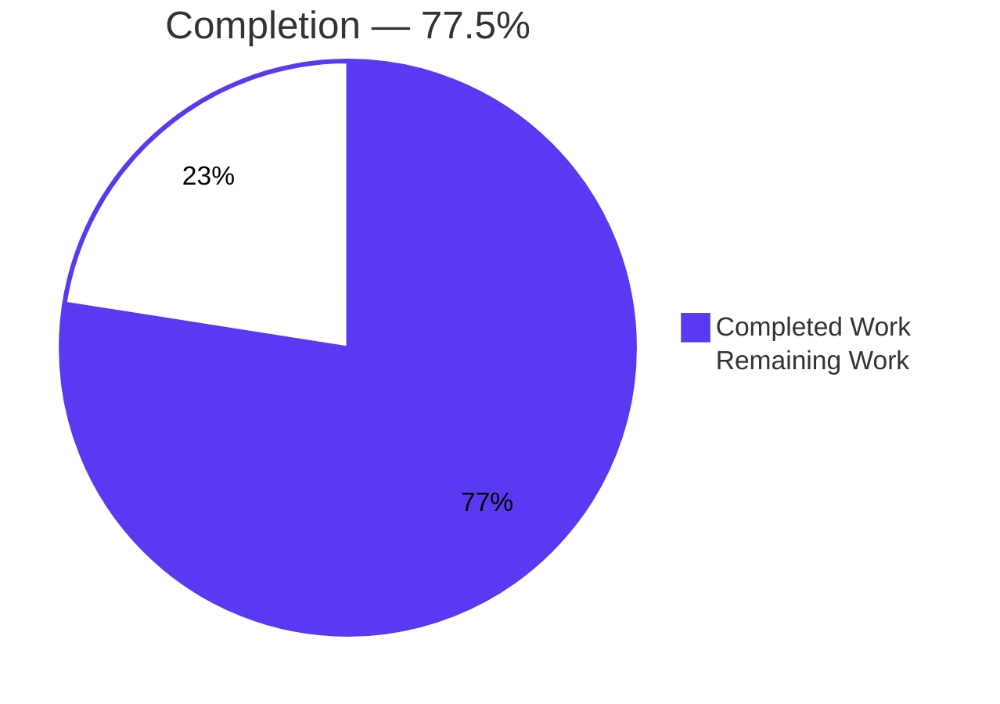
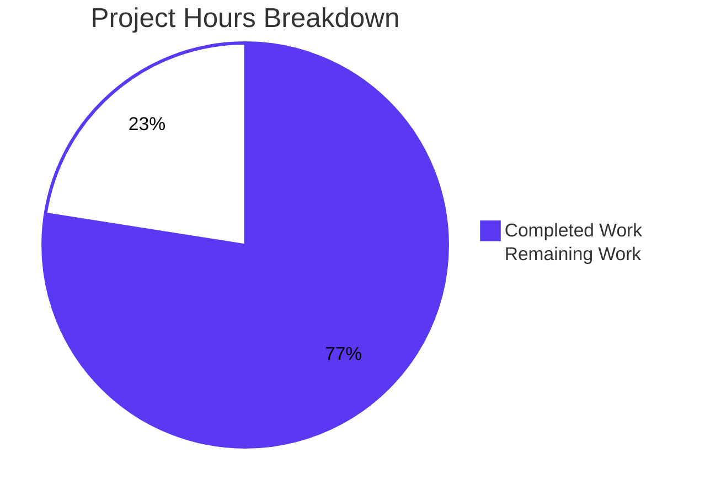
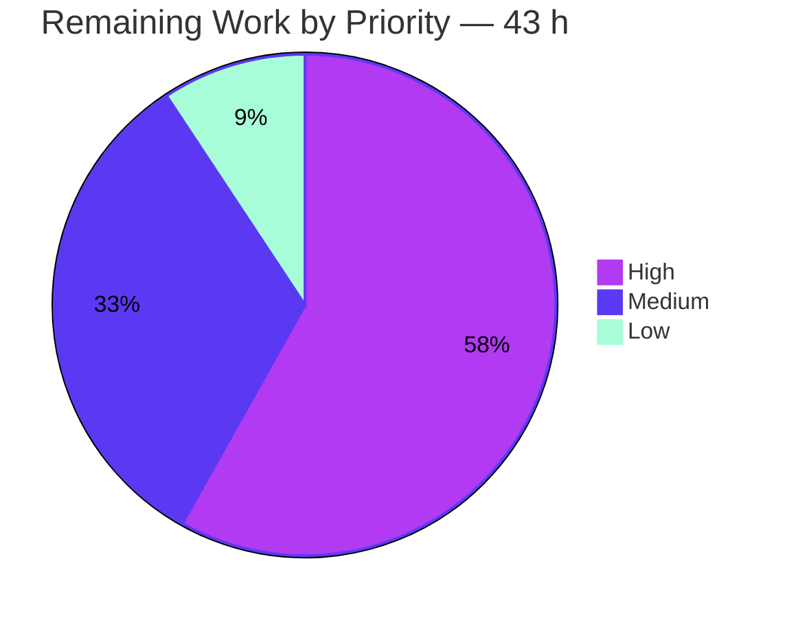

# 1. Executive Summary

## 1.1 Project Overview

Monero's first-party code (`src/`, `contrib/epee/`, `tests/`) moves from C++17 to C++23 without changing consensus, wire formats, on-disk formats or RPC output. The root build pins `CMAKE_CXX_STANDARD 23` (required, no extensions), lowers the CMake minimum to 3.20 and refuses compilers below GCC 13, Clang 16 and Apple Clang 15. GCC 14.2 is the primary compiler and Clang 19 the secondary, across system CI, the `contrib/depends` cross builds on Debian 13 and the Guix release toolchain. The audience is the maintainers and packagers who build and release `monerod`, the wallets and the RPC servers.

## 1.2 Completion Status


```mermaid
%%{init: {"theme": "base", "themeVariables": {"pie1": "#5B39F3", "pie2": "#FFFFFF", "pieStrokeColor": "#5B39F3", "pieOuterStrokeColor": "#5B39F3", "pieSectionTextColor": "#000000", "pieOpacity": "1"}}}%%
pie title Completion — 77.5%
    "Completed Work" : 148
    "Remaining Work" : 43
```

| Metric | Value |
|---|---|
| Total Hours | 191 |
| Completed Hours (AI + Manual) | 148 |
| Remaining Hours | 43 |
| Percent Complete | 77.5% |

148 hours completed out of 191 total hours = **77.5% complete** (148 / (148 + 43)).

## 1.3 Key Accomplishments

- ✅ All 272 first-party C++ translation units compile with `-std=c++23`; GCC 14.2 and Clang 19 Release builds finish 465/465 with 0 errors
- ✅ CMake 3.20 minimum; CMake 3.20.6 configures cleanly; the link test compiles at the root standard
- ✅ Compiler floors enforced: GCC 12.4 is refused, GCC 13.3 and Clang 16.0.6 are accepted
- ✅ Parity with the same commit built as C++17: CTest 22/22, 1310 unit-test IDs, 19 RPC scenarios and 165 consensus scenarios, with 0 regressions
- ✅ No new GCC warning key against the C++17 twin
- ✅ RPC output, wallet decisions, P2P, ZMQ and on-disk formats are identical across standards; `wallet2_api.h` is unchanged
- ✅ depends (ten hosts, `debian:13`) and the Guix `gcc-14.2` variant deliver GCC 14.2.0; Linux CI selects `gcc-14`
- ✅ README minimums and the in-repo `blitzy/documentation/Project Guide.md` migration record

## 1.4 Critical Unresolved Issues

**10 of 11 tracked follow-ups are open:**
- 7 of the plan's 8 human-finish items. The frozen-directory decision is closed, because no regression exists.
- 3 acceptance items.

4 of 5 success criteria are met. Criterion 3 is not met for the depends package builds.

| Issue | Impact | Owner | ETA |
|---|---|---|---|
| protobuf 21.12 adds 35 `-Wdeprecated-enum-enum-conversion` keys (105 instances) when its unchanged depends recipe compiles at C++23 (1 item) | Criterion 3 is not met for the depends, Guix and Docker package builds. Monero's own code adds no key | Repository owner | Owner decision |
| `open_wallet` on a corrupted cache returns "std::bad_alloc" at C++23 where C++17 returns "basic_string::_M_replace_aux" (1 item) | The no-observable-change directive is not met on this error path only | Repository owner | Owner decision |
| The depends verifier's "C recipes carry `-std=c11`" item cannot pass with the recipes unchanged (`openssl`, `hidapi`, ncurses helpers) (1 item) | The depends twins cannot be formally accepted | Repository owner | Owner decision |
| Formal acceptance logs on the final revision are incomplete (1 item). Missing: B/D/E compile-database confirmation, census recomputation, the depends twins rebuilt with distinct `BUILD_ID_SALT`, and 3 libc++ TUs | Those results stand as measured but are not formally accepted | Release engineer / repository owner | Before merge |
| No CI run exists on the candidate (1 item) | Native macOS, Windows, FreeBSD and Android paths and the hardened workflows are unconfirmed | Repository owner | 1 day after push |
| Confirmations and owner decisions (5 items): Guix build time, Windows `isFat32` log line, stale CMake 3.25 text in `docs/COMPILING_DEBUGGING_TESTING.md`, StageX GCC 15.2 / NDK Clang 18.0.3, Clang 19 with Boost 1.83 | Release-path and documentation confirmations | Maintainers | First CI cycle |

## 1.5 Access Issues

| System/Resource | Type of Access | Issue Description | Resolution Status | Owner |
|---|---|---|---|---|
| GitHub Actions | Workflow execution and results | No GitHub credential or API client is available, so workflow runs for the pushed branch cannot be triggered or read | Open | Repository owner |
| Windows / MSYS2 UCRT64 host | Build and test | Only an x86_64 Linux host is available. Windows is covered only by a Debian 13 MinGW-w64 cross build | Open | Platform maintainer |
| macOS / Xcode host | Build and test | No `xcodebuild` or Apple toolchain, so the Apple Clang 15 floor is undemonstrated | Open | macOS maintainer |
| Guix host | Release build | No `guix` binary or daemon, so the `gcc-14.2` release build is unrun | Open | Release engineer |

Building, testing and running need no credentials, secrets or network services.

## 1.6 Recommended Next Steps

1. **[High]** Push and confirm every job of `build.yml`, `depends.yml` and `guix.yml` on the candidate commit.
2. **[High]** Decide on the three blockers: protobuf 21.12, the depends C-recipe item, and the corrupted-cache error text (Section 5.2).
3. **[High]** Record the formal acceptance run on the final revision, with logs named by path.
4. **[Medium]** Have a maintainer review the 36-file change set, and watch the first Guix build time.
5. **[Medium]** Confirm the Windows MSYS2 build and the Apple Clang 15 and MinGW GCC 13 floors.

# 2. Project Hours Breakdown

## 2.1 Completed Work Detail

| Component | Hours | Description |
|---|---|---|
| Root build: C++23 dialect, CMake 3.20, compiler floors | 14 | `CMAKE_CXX_STANDARD 23`/`REQUIRED ON`/`EXTENSIONS OFF` (`CMakeLists.txt:136-138`). Minimum 3.20 at `:31` and `:279`. Floor guard `:150-171`. Link-test standard forwarding `:299-301`. `CMP0144` NEW `:970-972`. `LANGUAGE ASM` for CMP0119 (`src/crypto/CMakeLists.txt:103`). `CXX_STANDARD ?= c++23` (`contrib/depends/Makefile:12`), plus the Darwin value (`contrib/depends/toolchain.cmake.in:104`) |
| C++23 call-site compile fixes | 28 | Covers 26 source and test files. `u8` prefixes dropped (`contrib/epee/src/http_auth.cpp`, `src/rpc/daemon_handler.cpp`, `src/rpc/zmq_pub.cpp`, `tests/unit_tests/http.cpp`). Five `[=, this]` captures. `std::is_pod` replaced in five headers. `expect<T>` storage `alignas` (`src/common/expect.h:145`). `volatile` counter. `rct::identity()` qualification. `fingerprint_less` comparator (`contrib/epee/src/net_ssl.cpp:103`). `throw()`→`noexcept`. The `tx_extra` predicate. The Windows `isFat32` log line. `tests/unit_tests/epee_boosted_tcp_server.cpp` with `ssl_handshake_fingerprint_lookup` |
| CI workflows | 12 | `g++-14` plus `CC`/`CXX` in `build-linux` and `test-ubuntu` (`.github/workflows/build.yml:22`, `:175-176`, `:229-230`), on Debian 13 / Ubuntu 24.04 images. depends on `debian:13` for all ten hosts, with the `depends-cxx23-debian13-` cache bucket (`.github/workflows/depends.yml:34`, `:134`). Read-only token, SHA-pinned actions, digest-pinned images, hash-pinned pip, toolchain provenance step |
| Guix GCC 14.2.0 toolchain | 6 | `gcc-14.2` variant and `gcc-toolchain-14.2` (`contrib/guix/manifest.scm:85-93`), used at all 9 native-toolchain sites. HOST validation (`:311-346`) |
| Build documentation | 4 | README minimums and pairings (`README.md:142-180`). "Toolchain requirements" section in `docs/COMPILING_DEBUGGING_TESTING.md`. `contrib/brew/Brewfile`. `src/device_trezor/README.md` |
| Acceptance environment and build matrix | 20 | Pinned Ubuntu 24.04 toolchain image. Configurations A–E built with C++17 twins, plus F (CMake 3.20.6). Warning-census tool and per-pair census |
| depends and cross-build verification | 10 | Per-standard x86_64 depends twins. All ten `depends.yml` hosts reproduced in `debian:13`. Win64 MinGW-w64 cross build. libc++ 19 syntax pass over 296 TUs |
| Test parity and contract suites | 14 | CTest, `unit_tests`, `functional_tests_rpc` and reduced `core_tests` on GCC and Clang twins. Per-case comparison. Randomized-test flake characterisation |
| Behaviour-preservation runtime validation | 18 | C++23 vs C++17 twin comparison across six areas: daemon RPC output, wallet business logic, ZMQ RPC/pub, P2P mixed-standard sync, on-disk interchange, and digest/SSL/restricted-RPC access control |
| In-repo Project Guide | 22 | `blitzy/documentation/Project Guide.md`: migration record, Windows runbook, acceptance procedure and scripts, open blockers, human-finish items |
| **Total** | **148** | |

## 2.2 Remaining Work Detail

| Category | Hours | Priority |
|---|---|---|
| Push the change set and confirm every workflow: all `build.yml` jobs and the push-event full `core_tests`, the ten `depends.yml` hosts, and `guix.yml` (8 targets plus `bundle-logs`). Triage first-run failures | 10 | High |
| Record the formal acceptance run on the final revision. Includes B/D/E compile-database confirmation, census recomputation for B, C, D, E (Clang) and the depends packages, libc++ over all 299 C++ entries, and runtime and interchange checks | 8 | High |
| Decide on protobuf 21.12's C++23 warnings, then rebuild the depends twins with distinct `BUILD_ID_SALT` values | 4 | High |
| Decide on the corrupted-wallet-cache error text: accept it, or authorize a check before the unportable fallback (`src/wallet/wallet2.cpp:6702-6711`) | 2 | High |
| Decide on the depends verifier's C-recipe `-std=c11` item | 1 | High |
| Maintainer code review of the 36-file change set | 4 | Medium |
| Watch the Guix `gcc-14.2` build time; reproduce a timeout on a self-hosted Guix machine | 4 | Medium |
| Confirm the Windows MSYS2 UCRT64 build and the `isFat32` log line (`src/daemon/main.cpp:118`) | 3 | Medium |
| Demonstrate the Apple Clang 15 (Xcode 15) and MinGW-w64 GCC 13 floors with one build each | 3 | Medium |
| Refresh the stale CMake 3.25 and toolchain statements in `docs/COMPILING_DEBUGGING_TESTING.md` (`:40`, `:51`, `:54`, `:62`, `:78`, `:88`) | 1 | Low |
| Decide on StageX GCC 15.2.0 (`Dockerfile`) and Android NDK r27c, Clang 18.0.3 | 2 | Low |
| Decide on Clang 19 with system Boost 1.83 (Boost 1.84+ for a warning-clean build) | 1 | Low |
| **Total** | **43** | |

# 3. Test Results

All results were observed on HEAD `e6b3909c1` in a pinned Ubuntu 24.04 container (GCC 14.2.0, Clang 19.1.1, CMake 3.28.3, Boost 1.91.0, Rust 1.93.1). The "C++17 twin" is a `cp -a` copy of the same checkout with only `CMakeLists.txt:136` set to 17, built with identical options. The repository has no coverage tooling, so the Coverage column reads "Not measured". Configurations B, D, E and F and the remaining acceptance matrix are summarised in Section 5.1.

| Area / Category | Framework | Tests | Passed | Failed | Coverage | What This Proves |
|---|---|---|---|---|---|---|
| Builds: GCC 14.2 Release (A), Clang 19 Release (C), A's C++17 twin | Ninja `-k 0 all` | 3 builds × 465 targets | 3 (465/465 each) | 0 | Not measured | Every first-party C++ translation unit compiles as C++23 on both compilers with zero errors |
| Warning census, A vs its C++17 twin | GCC diagnostics keyed by location and flag | 15 candidate warnings (18 in twin) | 15 (each key also present in twin) | 0 new keys | Not measured | The C++23 switch introduces no new GCC diagnostic |
| Non-consensus tier, A | CTest `-E core_tests` | 22 entries | 22 | 0 | Not measured | Crypto, hash, difficulty, block-weight, unit and RPC suites pass at C++23 (1204 s) |
| Unit estate: A, A's C++17 twin, C | GoogleTest `unit_tests` | 1310 IDs in 160 suites × 3 runs | 1308 per run (2 `is_hdd.*` skipped in all) | 0 | Not measured | No case changes status between standards or compilers: identical ID sets, 0 per-case regressions |
| Contract suites, within the unit estate | GoogleTest | 316: consensus 164, wire 134, on-disk 18 | 316 | 0 | Not measured | RingCT, Bulletproofs, `tx_extra` ordering, serialization, levin, ZMQ, HTTP digest, TLS fingerprint pinning, LMDB and wallet storage hold at C++23 |
| Live RPC scenarios, within the CTest tier | `functional_tests_rpc` (Python) | 19 | 19 | 0 | Not measured | Real daemon and wallet RPC flows work at C++23: transfers, mining, multisig, cold signing, proofs, txpool, digest auth |
| Consensus regression: candidate and C++17 twin, GCC | `core_tests`, `MONERO_CRYPTO_SLOW_HASH_ITER=20` | 165 × 2 | 165 each (`REPORT:` run 165, failures 0) | 0 | Not measured | Block and transaction validation is identical at both standards |
| Configure and build-file checks | CMake, `grep`, compile database | 8 | 8 | 0 | Not measured | All four configure checks pass: CMake 3.20.6 configures (exit 0, no policy warning), GCC 12.4 is refused at `CMakeLists.txt:153`, and GCC 13.3 and Clang 16.0.6 are accepted. Both AAP 0.8.5 searches print nothing. All 272 first-party C++ entries carry `-std=c++23`. `wallet2_api.h` is unchanged |

**Not Covered**: delivered, but exercised by no test or check. A human should test these before release.

- **GitHub Actions.** No run of any edited workflow exists: `build.yml`, `depends.yml`, `guix.yml`, the SHA-pinned actions, the digest-pinned images, the hash-pinned pip installs and the `depends.yml:92` toolchain-provenance gate.
- **Guix release build.** The `gcc-14.2` variant (`contrib/guix/manifest.scm:85-93`) loads in Guile but has never been built.
- **Native platforms.** Windows, macOS, FreeBSD and Android builds, tests and runtime are unexercised, including the `_WIN32` `isFat32` log line at `src/daemon/main.cpp:118`.
- **Compiler-floor branches.** The Apple Clang 15, MinGW-w64 GCC 13 and `clang-cl` branches of `CMakeLists.txt:150-171` are untested.
- **Configure failure paths.** The failure branches of `check_submodule()` (`CMakeLists.txt:422-441`) and the `CMakeLists_IOS.txt` include (`:56`) are untested.
- **Corrupted wallet-cache error path** (`src/wallet/wallet2.cpp:6702-6711`). No test case observes it, and its text differs between standards (Section 5.2).
- **Other.** The StageX `Dockerfile` image and sustained network load: `net_load_tests` builds but was not run.

# 4. Runtime Validation & UI Verification

The project ships command-line daemons, wallets and RPC servers, so there is no UI to verify. Every run used testnet or regtest in offline mode, loopback binds and throwaway data directories. Nothing touched mainnet.

- ✅ **Daemon start-up and HTTP JSON-RPC.** `monerod --testnet --offline` with digest login answers 401 without credentials, 401 with a wrong password and 200 with digest. `get_info` reports height 1, testnet, offline, version `0.18.1.0-e6b3909c1`. `stop_daemon` exits cleanly.
- ✅ **Wallet RPC server.** `monero-wallet-rpc --testnet` refuses missing and wrong credentials (401) and reports `get_version` 65569. `create_wallet`, `get_address` and `get_height` (1) succeed, and `stop_wallet` shuts it down.
- ✅ **ZMQ JSON-RPC.** `get_height` returns `{"rpc_version":131072,"height":1}`, which is the unchanged protocol version.
- ✅ **Live RPC journeys.** The 19 `functional_tests_rpc` scenarios drive real daemon and wallet processes on a deterministic chain at C++23. They cover transfers, mining, multisig, cold signing, proofs, txpool and digest auth.
- ✅ **Cross-standard output parity.** The C++23 build was compared with the C++17 build of the same commit on six surfaces. Every output is identical apart from wall-clock and randomly generated fields.
  - Daemon RPC JSON and `.bin` output: 674 comparisons, on GCC and on Clang.
  - Wallet business decisions, including `tx_extra` order and cross-build transaction and block acceptance: 1,430 cases.
  - ZMQ RPC and pub: 134 cases, plus 336 frame validations.
  - Mixed-standard P2P sync and relay: 725 checks.
- ✅ **On-disk interchange.** LMDB chains, the txpool, export/import files, wallet keys and caches, and key images written by either build open identically in the other, in both directions.
- ✅ **Access control and input handling.** These behave identically between the two builds across about 9,000 twin comparisons on GCC and Clang, plus about 180,000 concurrent malformed requests. That covers digest auth on the daemon and the wallet, wallet `--daemon-login`, the SSL fingerprint allowlists, restricted RPC and malformed input. There were 0 process deaths, and no secret appeared in any log.
- ✅ **depends cross toolchains.** All ten `depends.yml` hosts, reproduced in the pinned `debian:13` container, build the 13 Monero executables with GCC 14.2.0. The Win64 executables are valid PE32+ images but were not run.
- ⚠ **Corrupted wallet cache.** `open_wallet` returns "Failed to open wallet : std::bad_alloc" at C++23 and "…basic_string::_M_replace_aux" at C++17. This happens when the cache's first eight bytes, read as a length, lie in [2^62, 2^63). Successful opens are identical (Section 5.2).
- ⚠ **Not exercised at runtime.** GitHub Actions jobs, the Guix release build, the StageX container image, and native Windows, macOS, FreeBSD and Android binaries.

# 5. Compliance & Quality Review

## 5.1 Compliance Matrix

| Deliverable | Benchmark | Status | Evidence |
|---|---|---|---|
| G1 Language standard (criterion 1) | `CMAKE_CXX_STANDARD 23`, `REQUIRED ON`, `EXTENSIONS OFF`; no old `-std` in in-scope build files | ✅ Pass | `CMakeLists.txt:136-138`. Link-test forwarding `:299-301`. Both AAP 0.8.5 searches print nothing. All 272 first-party C++ entries carry `-std=c++23` |
| G2 CMake minimum | 3.20 at both sites; CMake 3.20.6 configures cleanly | ✅ Pass | `CMakeLists.txt:31`, `:279`. CMake 3.20.6 exits 0 with no policy warning |
| Compiler floors | GCC 13, Clang 16, Apple Clang 15; `clang-cl` and unknown IDs refused | ✅ Pass for GCC and Clang. ⚠ Apple, MinGW and `clang-cl` branches undemonstrated | `CMakeLists.txt:150-171`. GCC 12.4 refused at `:153`; GCC 13.3 and Clang 16.0.6 accepted |
| G3 Clean builds (criterion 2) | A–E zero errors; F configures | ✅ Pass | A and C 465/465 (Section 3). B 474/474, D 474/474, E 541/541 with Trezor enabled, F exit 0 under four option sets. Measured at `d755c2f3b`; later commits change only `build.yml`, `README.md` and the Guide |
| G4 No new warnings (criterion 3) | Zero new keys vs the C++17 twin, every pair | ⚠ Partial | A: 0 new keys (18→15), verified at HEAD. depends-built Monero: 0 new keys. B, C (525→486), D and E (Clang): 0 new keys as measured, key-level recomputation pending. depends package builds: **not met** (protobuf, Section 5.2) |
| G5 Test parity (criterion 4) | Every case passing at C++17 passes at C++23 | ✅ Pass | `unit_tests` and `core_tests`: 0 per-case regressions (Section 3). CTest 22/22 and functional 19/19 on GCC and Clang |
| G6 depends and Guix compiler | GCC 14.2.0 native and target | ✅ Pass (definition); Guix build pending | `.github/workflows/depends.yml:34` `debian:13`; `contrib/guix/manifest.scm:85-93`. All ten depends hosts reproduced locally |
| G7 CI matrix | Every existing job builds C++23 with updated compilers | ⚠ Pending run | `.github/workflows/build.yml:22`, `:175-176`, `:229-230`. No Actions run yet |
| G8 README | Minimum GCC, Clang, CMake | ✅ Pass | `README.md:142-144`, `:168-180` |
| G9 In-repo Project Guide (criterion 5) | Every AAP 0.10.4 item | ✅ Pass | `blitzy/documentation/Project Guide.md` §3, §5.2, §5.4.1–§5.4.8, §8 |
| Behaviour and contract preservation | Consensus, wire, on-disk and RPC unchanged; `wallet2_api.h` unchanged | ⚠ Partial (one error path) | Sections 3 and 4. `git diff 454075bc6 -- src/wallet/api/wallet2_api.h` is empty. Corrupted-cache error text differs (Section 5.2) |
| Prohibitions | No `#pragma`, `-Wno-*`, `-fpermissive` or `__cplusplus` guard; no C++23 feature adoption; submodules and vendored code untouched; no test removed or loosened | ✅ Pass | The added-line search finds none. No diff under `external/`. Identical 1310-ID sets across twins |

## 5.2 AAP & Rule Divergences and Gaps

No user-specified rules exist (AAP 0.9), so each divergence is a departure from the AAP.

| What the AAP/Rule Required | What Was Delivered Instead | Why It Diverged | Impact | Remediation |
|---|---|---|---|---|
| 1. Carry every edit "already on the branch" unchanged; create no file (AAP 0.4, 0.5.1) | Edits re-landed (`1434574c4`), then restored byte-identical to `861efbceb` (`d755c2f3b`). The Guide and `tests/unit_tests/epee_boosted_tcp_server.cpp` are new relative to `origin/master` | The branch began at `f7c9079e7`, which reverts the earlier pass | End state matches the plan; acceptance evidence spans intermediate trees | None beyond the acceptance record (2.2) |
| 2. `(make-gcc-toolchain gcc-14.2)` verbatim; only listed manifest edits (AAP 0.3.1) | `((@@ (gnu packages commencement) make-gcc-toolchain) gcc-14.2)` at `contrib/guix/manifest.scm:92`. HOST validation at `:311-346` | The procedure is not exported at channel `0c2eff26`, so the verbatim form fails with "Unbound variable" | Manifest loads; relies on a private procedure | Confirm in `guix.yml`; revisit on a channel bump |
| 3. Only the listed workflow edits; CI pip unpinned (AAP 0.5.1, 0.8.2) | Read-only token, 25 SHA-pinned actions, digest-pinned images, hash-pinned pip (`deepdiff==8.6.2`), binutils provenance gate (`depends.yml:92-105`), Win64 override removed | Supply-chain hardening; the Win64 change follows the AAP 0.6.3 matrix | Stronger CI trust chain, not yet run on GitHub; the pins need upkeep | Confirm on first push |
| 4. Only the listed `CMakeLists.txt` and README edits; leave `src/crypto/CMakeLists.txt:99` to a human (AAP 0.5.1, 0.10.5) | `CMP0144` NEW, IOS include, `check_submodule()`, comment corrections, README corrections; the crypto comment rewritten for 3.20 | CMake ≥ 3.27 warns about `BOOST_ROOT` at a 3.20 minimum; the others correct statements that misdescribed the build | No C/C++ change; failure branches untested | Maintainer review |
| 5. Criterion 3: zero new warning keys, nothing waived (AAP 0.8.1) | Not met for the depends package builds: protobuf 21.12, 35 keys / 105 instances | Every remedy needs an authorization the request does not give (AAP 0.4) | Noisier package logs; a future `-Werror` would fail | Owner decision |
| 6. Every twin archive ID distinct; C recipes carry `-std=c11` (AAP 0.8.2) | `native_protobuf` shares an ID; `openssl`, `hidapi` and ncurses helpers show no `-std=c11` | The prescribed command sets only `HOST_ID_SALT`; the unchanged recipes do not pass host `CFLAGS` | depends twins not formally accepted | Rebuild with `BUILD_ID_SALT`; owner decision |
| 7. No observable change to daemon, wallet or RPC (AAP 0.10.1) | Corrupted-cache `open_wallet` text differs | libstdc++ 14 `std::string::max_size()` is larger at C++23; no source-edit trigger applies | One error path, reached only by corrupted or hostile lengths | Owner decision |
| 8. Every number from the final-candidate run, logs by path; libc++ over 299 entries (AAP 0.10.4, 0.8.2) | Full matrix recorded on `ad0dbd181`; test parity on `cfa0295c2`; libc++ 296 TUs; measured values supersede planning ones | Later commits followed the full run; only the test tier was repeated | Results stand as measured; formal acceptance pending | Acceptance record (2.2) |

**1. Branch baseline.** The AAP was written against `861efbceb`, which already carried an earlier C++23 pass. It required every edit already on the branch to be kept and no file to be created. The branch instead started at `f7c9079e7`, which reverts that pass to upstream `454075bc6`. Commit `1434574c4` re-applied the edits the C++23 compile needs. `d755c2f3b` restored the rest byte-identical, including the user's `isFat32` change `429a20174`, the `throw()`→`noexcept` conversions and the `tx_extra` predicate. `git diff 861efbceb HEAD` now lists only seven build and documentation files. Nothing further is required beyond recording the acceptance run.

**2. Guix toolchain call.** AAP 0.3.1 prescribes `(make-gcc-toolchain gcc-14.2)` verbatim. At the pinned channel `0c2eff26`, `make-gcc-toolchain` is a plain `define*` in `(gnu packages commencement)` and is not exported, so the verbatim manifest fails to load in Guile with "Unbound variable" and breaks every Guix target. Line `contrib/guix/manifest.scm:92` calls it through `@@`, with the reason in a comment at `:91`. The HOST check at `:311-346` makes the manifest's only compiler-selection point fail loudly on an unset or unknown HOST. A future channel bump may export or rename the procedure, so re-check this line then.

**3. CI hardening beyond the plan.** AAP 0.5.1 lists only the compiler and container edits. The workflows also carry:
- `permissions: contents: read`;
- 19 SHA-pinned actions in `build.yml` and 6 in `depends.yml`, with `persist-credentials: false`;
- digest-qualified `debian:13`, `ubuntu:24.04` and `ubuntu:22.04` images;
- hash-pinned pip installs, using `deepdiff==8.6.2` rather than the AAP's unpinned CI install, which avoids the CVE-2025-58367 and CVE-2026-33155 releases;
- a provenance step (`depends.yml:92-105`) that fails unless binutils is the archive's newest candidate.

None of this has run on GitHub. The owner should accept it, then refresh the digests and hashes on each image or package update.

**4. Build and README edits beyond the plan.** Raising the minimum to 3.20 makes CMake 3.27+ warn that CMP0144 is unset, because the depends toolchain sets `BOOST_ROOT`. `CMakeLists.txt:970-972` sets it NEW, and the compile commands are unchanged. Further edits correct pre-existing misbehaviour or misdescriptions:
- the `CMakeLists_IOS.txt` include path (`:56`);
- `check_submodule()`, which now checks exit status and uses `--verify` (`:422-441`);
- comments at `:132` and `:845`;
- README lines `:138`, `:142`, `:145`, `:154` and `:176-180`.

The `src/crypto/CMakeLists.txt:99-102` comment, which the AAP left for a human, was rewritten for 3.20 alongside the required `LANGUAGE ASM` change. No C or C++ source changed. Review these in the maintainer pass.

**5. protobuf 21.12 warnings.** Criterion 3 allows no new warning key. Compiled by its unchanged recipe at `-std=c++23`, protobuf 21.12 adds 35 `-Wdeprecated-enum-enum-conversion` keys (105 instances) in `google/protobuf/generated_message_tctable_impl.h:186-227`. The cause is its field-layout constants, which OR values of two different enumerations. Monero's own build through the same toolchain adds none. The four options are:
1. a recipe-local `-std=c++17`;
2. a patch under `contrib/depends/patches/protobuf/`;
3. a newer protobuf;
4. accepting the delta.

Each needs an authorization the request withholds, so none was applied. The owner must choose, after which the depends twins are rebuilt.

**6. depends verifier procedure.** AAP 0.8.2 requires every cached archive name to differ between the C++17 and C++23 depends twins, and every C recipe to compile with `-std=c11`. The ten target archives differ, but `native_protobuf` keeps one ID in both. The prescribed command sets only `HOST_ID_SALT`, which native IDs never read (`contrib/depends/Makefile:101-106`). With the recipes unchanged, three compile lines carry no `-std`:
- `openssl` (`packages/openssl.mk:9`);
- `hidapi` (`hidapi.mk:31`);
- ncurses' `make_hash`/`make_keys` helpers (`ncurses.mk:13`).

No twin varies `C_STANDARD`, so those lines compile identically. Rebuild the twins with distinct `BUILD_ID_SALT` values, and decide whether the C-recipe item stands.

**7. Corrupted wallet-cache error text.** AAP 0.10.1 forbids any observable change to the daemon, wallet or RPC. When the unportable fallback in `wallet2::load_wallet_cache` (`src/wallet/wallet2.cpp:6702-6711`) reads Boost's archive signature, it resizes a `std::string` to the cache's first eight bytes. In libstdc++ 14, `max_size()` is 2^62−1 at C++17 and 2^63−1 at C++23. For a length in [2^62, 2^63), C++17 therefore throws `length_error` and C++23 throws `bad_alloc`, and `open_wallet` reports different texts. About one corrupted encrypted cache in four falls in that band. No compile error, diagnostic or test triggers a source edit, so the owner must accept the difference or authorize a length check.

**8. Acceptance provenance and planning values.** AAP 0.10.4 requires every number to come from the run on the final candidate, with logs named by path. The in-repo Guide records configurations A–F, the census, the depends twins, the Win64 build, interchange and the libc++ pass on `ad0dbd181`. The libc++ pass covered 296 of 299 C++ entries; easylogging++, qrcodegen and `version.cpp` were skipped. Test parity was repeated on `cfa0295c2`. HEAD's build inputs equal those of `d755c2f3b`, where A–F, the A and C twin census and the test tiers were re-measured. Measured values supersede planning ones:
- NDK Clang 18.0.3, not 18.0.1;
- clang-19 1:19.1.7-3+b1;
- 22 CTest entries, not 20;
- 407 compile entries, not 404.

Record the formal run.

# 6. Risk Assessment

| Risk | Category | Severity | Probability | Mitigation | Status |
|---|---|---|---|---|---|
| CI has never run on the candidate. The `__APPLE__`, FreeBSD and Android paths and native Windows are compiled only by CI, as are MSYS2 GCC 16.2, Apple Clang 21, Arch GCC 16.2.1 and the Guix toolchains. The hardened workflows (SHA pins, image digests, provenance gate, hash-pinned pip) are also unexercised | Technical / Integration | High | Medium | Push and confirm every job. Fix platform failures at the call site under the AAP 0.4 source-edit rule | Open |
| protobuf 21.12 adds 35 deprecation keys (105 instances) to every depends, Guix and Docker package build at C++23 | Integration | Medium | Certain | Owner chooses among the four options in Section 5.2. No suppression meanwhile | Open blocker |
| The release toolchain carries two sets of upstream advisories. GCC 14.2 libstdc++ (`contrib/guix/manifest.scm:86-90`) has CVE-2026-95619, an aligned-new size overflow, and CVE-2026-102010, a PBDS `binary_heap` use-after-free. Debian 13 binutils 2.44-3 has CVE-2025-5244 and CVE-2025-8225. Reachability from Monero has not been established | Security | Medium | Low | Owner-authorized backport of the upstream GCC 14 fixes, or a fixed release. `depends.yml:92-105` fails a job unless binutils is the archive's newest candidate | Accepted: the toolchain is mandated by AAP 0.3.1 |
| The Apple Clang 15 and MinGW-w64 GCC 13 floors are enforced and published without a build behind them | Technical | Medium | Medium | One Xcode 15 build and one MSYS2 GCC 13 build. Keep the guard at `CMakeLists.txt:150-171` unchanged | Open |
| The Guix `gcc-14.2` variant has no substitutes. Each `build-guix` job compiles GCC 14.2.0 from source and may exceed the runner time limit | Operational | Medium | Medium | Watch the first run. Reproduce a timeout with `contrib/guix/guix-build` on a self-hosted machine | Open |
| The Windows `isFat32` log line (`src/daemon/main.cpp:118`) prints the path through `utf16_to_utf8`, which throws `std::runtime_error` on a failed conversion (`contrib/epee/src/string_tools.cpp:216-231`) | Technical | Low | Low | Only reached when `GetVolumeInformationW` fails. Confirm on MSYS2, including the error branch | Open |
| A corrupted wallet cache whose length prefix lies in [2^62, 2^63) yields a different `open_wallet` text at C++23. Any `std::string` growth into that band behaves the same way | Technical | Low | Low | Owner accepts the difference, or authorizes a length check at `src/wallet/wallet2.cpp:6702-6711` | Open decision |
| Test-environment sensitivity | Operational | Low | Medium | Re-run in both twins before calling a failure a regression | Accepted |

The last row covers four known sensitivities:
- `select_outputs.exact_unlock_block` is randomized and fails in about 3–4% of runs at either standard.
- `address_book` resolves over public DNSSEC.
- `is_hdd.*` skips without loop devices.
- `cmake/CheckTrezor.cmake:27` makes a Trezor failure fatal only through the environment variable.

# 7. Visual Project Status

Colour key: Completed = Dark Blue `#5B39F3`; Remaining = White `#FFFFFF`.


```mermaid
%%{init: {"theme": "base", "themeVariables": {"pie1": "#5B39F3", "pie2": "#FFFFFF", "pieStrokeColor": "#5B39F3", "pieOuterStrokeColor": "#5B39F3", "pieSectionTextColor": "#000000", "pieOpacity": "1"}}}%%
pie title Project Hours Breakdown
    "Completed Work" : 148
    "Remaining Work" : 43
```

Remaining hours by priority (Section 2.2):


```mermaid
%%{init: {"theme": "base", "themeVariables": {"pie1": "#B23AF2", "pie2": "#5B39F3", "pie3": "#A8FDD9", "pieStrokeColor": "#5B39F3", "pieSectionTextColor": "#000000", "pieOpacity": "1"}}}%%
pie title Remaining Work by Priority — 43 h
    "High" : 25
    "Medium" : 14
    "Low" : 4
```

| Remaining category (Section 2.2) | Hours |
|---|---|
| CI confirmation on the pushed commit | 10 |
| Formal acceptance record on the final revision | 8 |
| protobuf decision and depends twin rebuild | 4 |
| Maintainer code review | 4 |
| Guix build-time watch | 4 |
| Windows MSYS2 confirmation | 3 |
| Apple Clang 15 / MinGW GCC 13 floor builds | 3 |
| Wallet-cache error-text decision | 2 |
| StageX / NDK toolchain decision | 2 |
| depends C-recipe decision | 1 |
| Toolchain docs refresh | 1 |
| Clang + Boost 1.83 decision | 1 |
| **Total** | **43** |

# 8. Summary & Recommendations

The C++23 migration is complete in the tree, and it was demonstrated on Linux with both reference compilers. Against `origin/master` the branch changes 36 files (+3,771/−334), of which the in-repo Project Guide accounts for 2,476 added lines. Every first-party translation unit compiles as `-std=c++23` with zero errors on GCC 14.2 and Clang 19, the CMake 3.20 minimum configures cleanly under CMake 3.20.6, and configure refuses compilers below the published floors. The project stands at **77.5% complete**: 148 of 191 hours, with 43 hours remaining. All of the remaining work is CI confirmation, owner decisions, the formal acceptance record and platform checks; no AAP implementation item is unbuilt.

For a consensus-bearing codebase, the strongest evidence is that nothing moved. The same commit built as C++17 and as C++23 gives identical status for all 1,310 unit-test identifiers, all 165 consensus scenarios, all 22 CTest entries and all 19 live RPC scenarios. Daemon RPC output, wallet decisions, ZMQ frames, P2P exchanges and on-disk formats compare equal across the standards, apart from wall-clock and randomly generated fields. `wallet2_api.h`, the LMDB code and every submodule are unchanged, and no warning suppression or dual-standard guard was introduced. Two observable differences remain. The Windows-only `isFat32` log line is sanctioned by the plan. The `open_wallet` error text for a corrupted cache follows from libstdc++ and needs the owner's decision.

The critical path to production has four steps. First, push the branch and confirm every `build.yml`, `depends.yml` and `guix.yml` job; these are the only runs that exercise macOS, Windows, FreeBSD, Android and the Guix release toolchain. Second, take three owner decisions: protobuf 21.12's warnings in the depends package builds, the depends verifier's C-recipe item, and the corrupted-cache error text. Third, record the formal acceptance run on the final revision with logs named by path, including the B/D/E census recomputation and the depends twins rebuilt with distinct `BUILD_ID_SALT` values. Fourth, have a maintainer review the change set, with attention to the TLS `fingerprint_less` comparator and the `tx_extra` predicate in a frozen directory.

The branch is ready to merge when four conditions hold: every workflow job is green on the candidate commit; criterion 3 is either met or explicitly waived by the owner for the depends package builds; the acceptance record shows zero new warning keys and zero per-case regressions on the final revision; and the first Guix build completes within the runner limit. **Production readiness: not yet.** The code is ready, with high confidence on Linux, and release depends on CI confirmation and the three owner decisions.

# 9. Development Guide

The configure, build, test and run commands below were exercised on Ubuntu 24.04 (x86_64) at HEAD `e6b3909c1`. Run every command from the repository root unless a step says otherwise. Building, testing and running need no credentials, secrets or environment variables. Everything generated lives under the gitignored `build/` directory.

## 9.1 System Prerequisites

**Operating system.** Ubuntu 24.04 LTS or Debian 13, x86_64. Windows (MSYS2 UCRT64) has its own runbook in `blitzy/documentation/Project Guide.md` §5.3. macOS is built by the `build-macos` CI job.

**Compiler.** One of:
- GCC 13 or newer. GCC 14.2 (`g++-14`) is the reference.
- Clang 16 or newer. Clang 19 is the reference. With libstdc++ 14 use Clang 18 or 19; Clang 16 pairs with libstdc++ 13.
- Apple Clang 15 (Xcode 15) or newer.

Configure refuses anything older.

**Other tools.**
- CMake 3.20 or newer.
- Ninja, recommended.
- Rust stable via `rustup`. It is required for `src/fcmp_pp/fcmp_pp_rust`; CI tests 1.93.
- Python 3 with `requests`, `pyzmq` and `deepdiff`, needed only for the functional tests.

**Libraries.** Boost 1.69 or newer (1.84 or newer for a warning-clean Clang build), OpenSSL 1.1.1 or newer, libzmq, libunbound, libsodium.

**Hardware.** About 2 GB of RAM per parallel compile job and about 10 GB of disk. A cold full build takes 30–90 minutes. Cap `-j` at the smaller of the CPU count and RAM in GB ÷ 2.

## 9.2 Environment Setup

```bash
git clone --recursive https://github.com/monero-project/monero
cd monero
git submodule update --init --recursive   # mandatory: external/ randomx, rapidjson, supercop, gtest
git submodule status                      # every line must start with a space, not '-'
```

```bash
sudo apt update && sudo apt install -y build-essential g++-14 cmake ninja-build pkg-config \
  libssl-dev libzmq3-dev libunbound-dev libsodium-dev libunwind-dev libreadline-dev \
  libhidapi-dev libusb-1.0-0-dev libprotobuf-dev protobuf-compiler libboost-all-dev \
  python3 python3-venv ccache doxygen graphviz git curl
curl --proto '=https' --tlsv1.2 -sSf https://sh.rustup.rs | sh -s -- -y --profile minimal
. "$HOME/.cargo/env"
python3 -m venv build/venv && build/venv/bin/pip install requests pyzmq deepdiff psutil monotonic
```

## 9.3 Configure and Build

```bash
CC=gcc-14 CXX=g++-14 cmake -S . -B build/release -G Ninja \
  -D CMAKE_BUILD_TYPE=Release \
  -D CMAKE_EXPORT_COMPILE_COMMANDS=ON \
  -D BUILD_TESTS=ON \
  -D USE_DEVICE_TREZOR=OFF \
  -D Python3_EXECUTABLE="$PWD/build/venv/bin/python3"
ninja -C build/release -j4 daemon wallet_rpc_server   # single targets: fast iteration
ninja -C build/release -j4 all                        # every default target (465 steps)
```

Expected output:
- The configure step prints `The CXX compiler identification is GNU 14.2.0` and `Found Boost Version: 1.83.0`, the system Boost.
- `ninja` finishes with `[465/465]`.
- `build/release/bin/monerod --version` prints `Monero 'Fluorine Fermi' (v0.18.1.0-<commit>)`.

For Clang, use `CC=clang-19 CXX=clang++-19` and a separate build directory such as `build/clang`. The Makefile wrapper (`make release`, `make release-test`, `make depends target=<host>`) remains available.

## 9.4 Running Tests

```bash
# Non-consensus tier (22 entries, about 20 min; functional_tests_rpc takes about 15 min of that)
cd build/release && DNS_PUBLIC=tcp ctest -E core_tests --output-on-failure; cd ../..

# One unit-test suite at a time (always point --data-dir at the build tree)
build/release/tests/unit_tests/unit_tests --data-dir build/release/tests/data \
  --gtest_filter='test_epee_connection.*:sort_tx_extra.*:Serialization.*'

# Consensus scenarios with reduced hashing iterations, in their own build directory
CFLAGS=-DMONERO_CRYPTO_SLOW_HASH_ITER=20 CC=gcc-14 CXX=g++-14 cmake -S . -B build/core -G Ninja \
  -D CMAKE_BUILD_TYPE=Release -D BUILD_TESTS=ON -D USE_DEVICE_TREZOR=OFF
ninja -C build/core -j4 core_tests
mkdir -p build/core/home
HOME="$PWD/build/core/home" ctest --test-dir build/core -R core_tests -V | grep -E 'Test run:|Failures:'
```

Expected results:
- CTest prints `100% tests passed, 0 tests failed out of 22`, and its log contains `Done, 19/19 tests passed`.
- The filter run prints `[  PASSED  ] 27 tests.`
- `core_tests` prints `Test run: 165` and `Failures: 0`.

## 9.5 Running the Software (testnet, offline, never mainnet)

```bash
build/release/bin/monerod --testnet --offline --no-igd --non-interactive \
  --data-dir "$PWD/build/testnet-data" --detach
curl -s http://127.0.0.1:28081/json_rpc -H 'Content-Type: application/json' \
  -d '{"jsonrpc":"2.0","id":"0","method":"get_info"}'          # "height": 1, "nettype": "testnet", "offline": true

mkdir -p build/testnet-wallets
build/release/bin/monero-wallet-rpc --testnet --disable-rpc-login --wallet-dir "$PWD/build/testnet-wallets" \
  --rpc-bind-port 28084 --daemon-address 127.0.0.1:28081 --log-file "$PWD/build/testnet-wallets/wallet-rpc.log" &
curl -s http://127.0.0.1:28084/json_rpc -H 'Content-Type: application/json' \
  -d '{"jsonrpc":"2.0","id":"0","method":"create_wallet","params":{"filename":"demo","password":"","language":"English"}}'
curl -s http://127.0.0.1:28084/json_rpc -H 'Content-Type: application/json' \
  -d '{"jsonrpc":"2.0","id":"0","method":"get_height"}'        # "height": 1

curl -s http://127.0.0.1:28084/json_rpc -H 'Content-Type: application/json' -d '{"jsonrpc":"2.0","id":"0","method":"stop_wallet"}'
curl -s http://127.0.0.1:28081/stop_daemon                      # {"status": "OK"}
```

## 9.6 Verifying the C++23 Migration

```bash
grep -n 'set(CMAKE_CXX_STANDARD 23)' CMakeLists.txt          # 136:set(CMAKE_CXX_STANDARD 23)
grep -rnE --include=CMakeLists.txt --include='*.cmake' --include='*.cmake.in' \
  -e '-std=(c|gnu)\+\+(17|14|11|1z|1y|0x)' -e 'CXX_STANDARD[ "]+(17|14|11)([^0-9]|$)' \
  CMakeLists.txt CMakeLists_IOS.txt cmake src contrib/epee tests     # prints nothing
grep -rnE -e '-std=(c|gnu)\+\+(17|14|11|1z|1y|0x)' -e 'CXX_STANDARD[ "?:=]+(c\+\+)?(17|14|11)([^0-9]|$)' \
  contrib/depends/Makefile contrib/depends/hosts contrib/depends/builders contrib/depends/packages \
  contrib/depends/toolchain.cmake.in contrib/guix .github/workflows   # prints nothing
git diff 454075bc6 -- src/wallet/api/wallet2_api.h                  # prints nothing
```

## 9.7 Troubleshooting

| Symptom | Cause | Resolution |
|---|---|---|
| `GCC 12.x is too old; GCC 13 or newer is required for C++23` at `CMakeLists.txt:153` | Compiler below the floor | Install `g++-14` and configure with `CC=gcc-14 CXX=g++-14` in a fresh build directory |
| Errors inside libstdc++'s `stl_pair.h` with Clang 16 | Clang 16 cannot compile libstdc++ 14 headers | Use Clang 18 or 19, or pair Clang 16 with libstdc++ 13 |
| `No suitable build variant ... Boost_USE_STATIC_LIBS=ON` | Static Boost requested against a shared-only system Boost | Drop the static option, or pass `-D Boost_DIR=<prefix>/lib/cmake/Boost-<ver>` for a static prefix |
| `functional_tests_rpc and check_missing_rpc_methods skipped` warning | Python lacks `requests`, `zmq` or `deepdiff` | Create the venv in 9.2 and pass `-D Python3_EXECUTABLE=$PWD/build/venv/bin/python3` |
| Confusing mid-build failures under `external/` | Submodules missing | `git submodule update --init --recursive`, then `git submodule status` |
| Compiler killed partway through the build | Out of memory from too many jobs | Lower `-j` to RAM in GB ÷ 2, or build single targets |
| `select_outputs.exact_unlock_block` fails occasionally | Randomized test; fails in about 3–4% of runs at either standard | Re-run it before treating it as a regression |
| `is_hdd.rotational_drive` / `is_hdd.ssd` skipped | No loop devices | Expected; they skip identically at both standards |
| Stray files appear under `tests/data` | `--data-dir tests/data` pointed at the source tree | Always pass `--data-dir <build>/tests/data` |

# 10. Appendices

## A. Command Reference

| Purpose | Command |
|---|---|
| Configure (GCC 14.2, Release, tests) | `CC=gcc-14 CXX=g++-14 cmake -S . -B build/release -G Ninja -D CMAKE_BUILD_TYPE=Release -D BUILD_TESTS=ON -D USE_DEVICE_TREZOR=OFF` |
| Build everything / one target | `ninja -C build/release -j4 all` / `ninja -C build/release -j4 unit_tests` |
| Non-consensus test tier | `cd build/release && DNS_PUBLIC=tcp ctest -E core_tests --output-on-failure` |
| One unit-test suite | `build/release/tests/unit_tests/unit_tests --data-dir build/release/tests/data --gtest_filter='<Suite>.*'` |
| Reduced consensus scenarios | `CFLAGS=-DMONERO_CRYPTO_SLOW_HASH_ITER=20` configure in `build/core`, then `ninja -C build/core core_tests` and `ctest --test-dir build/core -R core_tests` |
| C++17 twin for comparison | `cp -a . ../monero-cxx17 && sed -i '136s/23)/17)/' ../monero-cxx17/CMakeLists.txt`, then build it with the same options |
| depends cross build | `make depends target=x86_64-linux-gnu` (any `depends.yml` host triple) |
| Guix release build | `HOSTS="x86_64-linux-gnu" ./contrib/guix/guix-build` (needs a Guix host) |
| API documentation | `HAVE_DOT=YES doxygen Doxyfile` |

## B. Port Reference

| Port(s) | Use |
|---|---|
| 18080 / 18081 / 18082 | Mainnet P2P / RPC / ZMQ RPC (never used for testing) |
| 28080 / 28081 / 28082 | Testnet P2P / RPC / ZMQ RPC |
| 38080 / 38081 / 38082 | Stagenet P2P / RPC / ZMQ RPC |
| 28084 | `monero-wallet-rpc` in the Section 9.5 example |
| 8080; 19080-19082; 5262, 5263, 5626 | Fixed ports used by `unit_tests` (`http_server`, `node_server`, `boosted_tcp_server` / `test_epee_connection`) |
| 18090-18484 | `functional_tests_rpc` daemons and wallets |
| 36230 / 36231 | `net_load_tests` |

Suites that use fixed ports must not run concurrently on one network namespace.

## C. Key File Locations

| Path | Role |
|---|---|
| `CMakeLists.txt` | Standard pins `:136-138`, minimum `:31`/`:279`, compiler floors `:150-171`, link-test forwarding `:299-301`, `CMP0144` `:970-972` |
| `src/crypto/CMakeLists.txt:103` | `CryptonightR_template.S` declared `LANGUAGE ASM` (CMP0119) |
| `contrib/depends/Makefile:12`, `contrib/depends/toolchain.cmake.in:104` | depends C++ dialect (`c++23`) |
| `.github/workflows/build.yml`, `.github/workflows/depends.yml` | System CI (GCC 14.2) and depends CI (`debian:13`) |
| `contrib/guix/manifest.scm:85-93` | Guix `gcc-14.2` variant and toolchain |
| `README.md:142-180` | Enforced minimums and verified pairings |
| `docs/COMPILING_DEBUGGING_TESTING.md` | "Toolchain requirements" section (stale 3.25 text pending refresh) |
| `blitzy/documentation/Project Guide.md` | Migration record, Windows runbook, acceptance procedure, open blockers |
| `tests/unit_tests/epee_boosted_tcp_server.cpp:857` | `ssl_handshake_fingerprint_lookup`, the TLS pin-lookup test |
| `src/wallet/wallet2.cpp:6702-6711` | Unportable wallet-cache fallback (open blocker) |

## D. Technology Versions

| Component | Version |
|---|---|
| Language standard | C++23 (first-party), C11 |
| GCC (primary) | 14.2.0 (`14.2.0-4ubuntu2~24.04.1`; Debian 13 GCC 14.2.0) |
| Clang (secondary) | 19.1.1 (Ubuntu 24.04); 19.1.7 on Debian 13 for Cross-Mac/FreeBSD |
| Floors | GCC 13, Clang 16, Apple Clang 15, MinGW-w64 GCC 13, CMake 3.20 |
| CMake | 3.28.3 (reference), 3.20.6 (minimum check) |
| Boost | 1.91.0-1 (depends pin, kept); system 1.83 works with GCC |
| Rust | 1.93.1 |
| Android NDK | r27c (Clang 18.0.3, r522817c) |
| Guix channel | `0c2eff26`, `gcc-14.2` variant, `clang-toolchain-22` |
| Python (tests) | 3.12 with `requests`, `pyzmq`, `deepdiff` (CI pins 8.6.2) |

## E. Environment Variable Reference

| Variable | Effect |
|---|---|
| `CC`, `CXX` | Compiler selection at configure time (`gcc-14`/`g++-14`, `clang-19`/`clang++-19`) |
| `CFLAGS=-DMONERO_CRYPTO_SLOW_HASH_ITER=20` | Reduced-iteration `core_tests` build |
| `DNS_PUBLIC=tcp` | DNS resolver mode for DNS-dependent unit tests |
| `HOME` | Keeps `core_tests` per-run state out of the user's home directory (`build/core/home`) |
| `USE_SINGLE_BUILDDIR=1`, `USE_DEVICE_TREZOR=OFF` | Makefile-wrapper overrides |
| `USE_DEVICE_TREZOR_MANDATORY` | Makes a Trezor configure failure fatal (`cmake/CheckTrezor.cmake:27`) |
| `CXX_STANDARD`, `HOST_ID_SALT`, `BUILD_ID_SALT` | depends dialect (default `c++23`) and archive-ID salts for twin builds |
| `HOST`, `HOSTS` | Guix target triple(s); the manifest errors on an unset or unknown `HOST` |

## F. Developer Tools Guide

- **`build/release/compile_commands.json`** resolves macro-generated code (epee `KV_SERIALIZE`) and `.inl` includes. Each first-party entry carries `-std=c++23`.
- **Twin comparison**: build the same commit with `CMakeLists.txt:136` set to 17, then compare. Compare `unit_tests --gtest_output=xml:<file>` per case, and compare warnings by file, line and flag. The in-repo Guide §3.4 and §5.3.8 hold the parity and census scripts.
- **`ccache`**: keep it enabled for iterative rebuilds.
- **Doxygen with Graphviz**: traces call graphs through `p2p/` and `cryptonote_protocol/`.

## G. Glossary

| Term | Meaning |
|---|---|
| Configuration A–F | A GCC 14.2 Release; B GCC Debug; C Clang 19 Release; D Clang Debug; E CI option set (GUI deps, fuzz, Trezor mandatory); F CMake 3.20.6 configure only |
| C++17 twin | Copy of the same commit with only `CMakeLists.txt:136` set to 17, used as the behavioural and warning baseline |
| Census key | One distinct diagnostic (location, flag, message) counted per build; "new key" means present at C++23 but not in the twin |
| Criterion 1–5 | AAP success criteria: standard set, clean builds, no new warnings, test parity, Project Guide contents |
| depends | `contrib/depends`, the pinned cross-compilation dependency system used by CI, Guix and Docker |
| Frozen directories | `src/cryptonote_core`, `cryptonote_basic`, `crypto`, `ringct`, `blockchain_db`: compile-level edits only |
